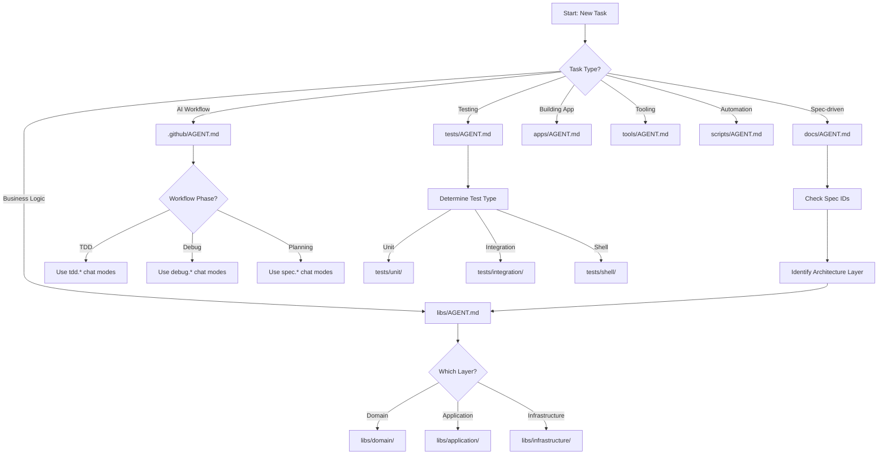

# 🗺️ Agent Context Navigation Map

> **Purpose**: Distributed semantic routing system for AI-assisted development across the VibesPro project.

## Overview

This map shows the distributed AGENT.md system that replicates the semantic routing functionality of `copilot-instructions.md` at a local level. Each AGENT.md file provides context-specific guidance, conventions, and routing logic for its directory.

## Context Hierarchy

### 🏠 Root Level

-   [AGENTS.md](/AGENTS.md) - Nx-specific guidelines (auto-generated)
-   [.github/copilot-instructions.md](/.github/copilot-instructions.md) - Master instructions (supreme authority)

### 🎯 Core Infrastructure (Phase 1)

-   [.github/AGENT.md](/.github/AGENT.md) - AI Development System (prompts, instructions, chat modes)
-   [docs/AGENT.md](/docs/AGENT.md) - Documentation & Specifications (ADR, PRD, SDS, traceability)
-   [tools/AGENT.md](/tools/AGENT.md) - Development Tools (utilities, generators, metrics)
-   [scripts/AGENT.md](/scripts/AGENT.md) - Orchestration Scripts (shell automation, justfile integration)

### 🏗️ Application Architecture (Phase 2)

-   [apps/AGENT.md](/apps/AGENT.md) - Application Interfaces (web, mobile, CLI, API)
-   [libs/AGENT.md](/libs/AGENT.md) - Business Logic Libraries (hexagonal architecture)
-   [generators/AGENT.md](/generators/AGENT.md) - Code Generators (Nx generators, scaffolding)
-   [templates/AGENT.md](/templates/AGENT.md) - Jinja2 Templates (Copier project generation)

### 🧪 Quality & Testing (Phase 2)

-   [tests/AGENT.md](/tests/AGENT.md) - Testing Infrastructure (unit, integration, shell tests)

### 🔬 Specialized Contexts (Phase 3)

-   [temporal_db/AGENT.md](/temporal_db/AGENT.md) - AI Learning Database (Rust, sled)
-   [architecture/AGENT.md](/architecture/AGENT.md) - Architecture Documentation (CALM)
-   [ops/AGENT.md](/ops/AGENT.md) - Operations & Deployment
-   [hooks/AGENT.md](/hooks/AGENT.md) - Pre/Post-generation hooks (Copier templates)

## Quick Navigation

### 📋 By Task Type

| Task                       | Primary Context                             | Supporting Contexts                                                |
| -------------------------- | ------------------------------------------- | ------------------------------------------------------------------ |
| **Implementing from spec** | [docs/AGENT.md](/docs/AGENT.md)             | [libs/AGENT.md](/libs/AGENT.md), [tests/AGENT.md](/tests/AGENT.md) |
| **Writing tests**          | [tests/AGENT.md](/tests/AGENT.md)           | [.github/AGENT.md](/.github/AGENT.md) (TDD chat modes)             |
| **Creating generators**    | [generators/AGENT.md](/generators/AGENT.md) | [templates/AGENT.md](/templates/AGENT.md)                          |
| **Building tools**         | [tools/AGENT.md](/tools/AGENT.md)           | [scripts/AGENT.md](/scripts/AGENT.md)                              |
| **AI workflows**           | [.github/AGENT.md](/.github/AGENT.md)       | [docs/AGENT.md](/docs/AGENT.md) (specs)                            |
| **Security audit**         | [.github/AGENT.md](/.github/AGENT.md)       | All contexts (security applies everywhere)                         |
| **Performance analysis**   | [tools/AGENT.md](/tools/AGENT.md)           | [tests/AGENT.md](/tests/AGENT.md) (benchmarks)                     |
| **Template generation**    | [templates/AGENT.md](/templates/AGENT.md)   | [generators/AGENT.md](/generators/AGENT.md)                        |
| **Documentation**          | [docs/AGENT.md](/docs/AGENT.md)             | Context-specific AGENT.md files                                    |

### 🏛️ By Architecture Layer

| Layer              | Context                                              | Description                                  |
| ------------------ | ---------------------------------------------------- | -------------------------------------------- |
| **Interface**      | [apps/AGENT.md](/apps/AGENT.md)                      | User-facing applications (web, mobile, CLI)  |
| **Application**    | [libs/AGENT.md](/libs/AGENT.md#application-layer)    | Use cases, application services, ports       |
| **Domain**         | [libs/AGENT.md](/libs/AGENT.md#domain-layer)         | Pure business logic, entities, value objects |
| **Infrastructure** | [libs/AGENT.md](/libs/AGENT.md#infrastructure-layer) | Repository implementations, adapters         |

### 🔧 By Technology

| Technology                | Primary Context                                                    | Notes                                   |
| ------------------------- | ------------------------------------------------------------------ | --------------------------------------- |
| **TypeScript/JavaScript** | [libs/AGENT.md](/libs/AGENT.md), [apps/AGENT.md](/apps/AGENT.md)   | Strict mode, no `any` types             |
| **Python**                | [tools/AGENT.md](/tools/AGENT.md), [libs/AGENT.md](/libs/AGENT.md) | mypy strict mode, type hints everywhere |
| **Rust**                  | [temporal_db/AGENT.md](/temporal_db/AGENT.md)                      | Sled database, temporal learning        |
| **Shell/Bash**            | [scripts/AGENT.md](/scripts/AGENT.md)                              | ShellSpec tests, ShellCheck validation  |
| **Jinja2**                | [templates/AGENT.md](/templates/AGENT.md)                          | Copier templates, variable conventions  |

## Routing Strategy

### Context Selection Flow



### Instruction Precedence Order

**MECE Principle** (Mutually Exclusive, Collectively Exhaustive):

```
1. security.instructions.md      (precedence: 10) ⚠️ HIGHEST - ALWAYS APPLIES
2. generators-first.instructions.md (precedence: 15)
3. ai-workflows.instructions.md  (precedence: 20)
4. testing.instructions.md       (precedence: 35)
5. general.instructions.md       (precedence: 50)
6. performance.instructions.md   (precedence: 34)
7. style.*.instructions.md       (precedence: varies)
```

**Critical Rule**: Security guidelines override ALL other guidelines.

### Cross-Reference Navigation Pattern

1. **Start**: Root `copilot-instructions.md` for project overview
2. **Navigate**: Use AGENT-MAP.md to find relevant context
3. **Deep Dive**: Open domain-specific AGENT.md
4. **Cross-Reference**: Follow links to related contexts
5. **Apply**: Use modular instructions via precedence order
6. **Validate**: Check security, testing, and quality gates

## Integration with Existing System

### How AGENT.md Files Complement copilot-instructions.md

| Aspect           | copilot-instructions.md          | AGENT.md Files                  |
| ---------------- | -------------------------------- | ------------------------------- |
| **Scope**        | Repository-wide master guidance  | Directory-specific context      |
| **Authority**    | Supreme - sets standards         | Local - applies standards       |
| **Detail Level** | High-level principles & patterns | Concrete examples & conventions |
| **Routing**      | Workflow & persona routing       | File & directory routing        |
| **Maintenance**  | Central authority updates        | Distributed team updates        |

### Modular Instruction Stacking

AGENT.md files **reference and extend** modular instructions:

```
copilot-instructions.md (master)
    ↓ references
.github/instructions/*.instructions.md (modular rules)
    ↓ applied by
AGENT.md (local context)
    ↓ guides
AI Development (implementation)
```

## Usage Patterns

### For AI Assistants

**When encountering a task:**

1. ✅ Check current directory for AGENT.md
2. ✅ Read local context and routing rules
3. ✅ Follow parent context links for broader guidance
4. ✅ Apply referenced modular instructions
5. ✅ Use examples as patterns
6. ✅ Validate with checklist

**When uncertain about context:**

1. 🔍 Consult AGENT-MAP.md (this file)
2. 🔍 Use "By Task Type" table for guidance
3. 🔍 Follow architecture layer if implementing domain logic
4. 🔍 Check multiple contexts if task spans boundaries

### For Developers

**When adding new features:**

1. 📖 Start with relevant AGENT.md for context
2. 📖 Check parent context for architectural constraints
3. 📖 Follow local conventions and patterns
4. 📖 Reference linked specifications
5. 📖 Use examples as starting point

**When updating AGENT.md:**

1. ✏️ Keep consistent with copilot-instructions.md
2. ✏️ Update cross-references if structure changes
3. ✏️ Add examples from real implementations
4. ✏️ Update routing rules based on experience
5. ✏️ Maintain conciseness while being comprehensive

## Maintenance Guidelines

### When to Create New AGENT.md

✅ **Create when:**

-   Directory has distinct purpose/domain
-   Local conventions differ meaningfully
-   Routing logic would benefit from clarity
-   Multiple team members work in this area
-   Onboarding would be significantly easier

❌ **Don't create when:**

-   Directory is purely organizational (no code)
-   No distinct conventions exist
-   Would duplicate parent context without adding value
-   Directory is temporary or experimental

### Updating AGENT.MAP.md

**Update this map when:**

-   New AGENT.md file is created
-   Directory structure changes significantly
-   New task types or routing patterns emerge
-   Cross-reference network evolves

### Version Control

-   AGENT.md files are versioned with the code
-   Changes reviewed as part of PRs
-   Breaking changes to routing require team discussion
-   Keep changelog in relevant AGENT.md files

## Quick Command Reference

### Context Generation

```bash
# Generate AI context bundle (includes CALM, specs, techstack)
just ai-context-bundle

# Validate all AI guidance files
just ai-validate

# Lint prompt files
just prompt-lint

# Validate spec matrix
just spec-guard
```

### Navigation Commands

```bash
# Find AGENT.md files
find . -name "AGENT.md" -type f

# Search AGENT.md content
grep -r "search term" */AGENT.md

# List all contexts
ls -la **/*AGENT.md
```

## Troubleshooting

### "Can't find appropriate context"

→ Check this map's "By Task Type" or "By Technology" tables
→ Multiple contexts may apply - use cross-references
→ When in doubt, start with `copilot-instructions.md`

### "Conflicting guidance between AGENT.md files"

→ Follow precedence order (Security > Testing > General > etc.)
→ Parent context takes precedence over child
→ copilot-instructions.md is supreme authority
→ Document conflicts in "Spec Gaps" and propose options

### "AGENT.md seems outdated"

→ Check last updated date in footer
→ Cross-reference with copilot-instructions.md
→ Submit PR to update if needed
→ Use git history to see evolution

## Future Enhancements

### Planned Additions (As Needed)

-   [ ] Domain-specific AGENT.md in `libs/{domain}/` subdirectories
-   [ ] Language-specific guides (e.g., `libs/python/AGENT.md`)
-   [ ] CI/CD-specific context in `.github/workflows/`
-   [ ] MCP server documentation context
-   [ ] Generated project templates context

### Automation Opportunities

-   [ ] Auto-generate AGENT-MAP.md from directory scan
-   [ ] Validate cross-references in CI
-   [ ] Detect missing AGENT.md for high-activity directories
-   [ ] Link checking for AGENT.md cross-references

---

## Summary

This distributed AGENT.md system creates a **semantic routing network** that:

-   ✨ Provides local context without overwhelming AI with full repo details
-   🔗 Links related contexts for easy navigation
-   📚 References modular instructions for consistent guidance
-   🎯 Routes tasks to appropriate contexts efficiently
-   🛡️ Maintains security and quality standards everywhere
-   🔄 Evolves with the project organically

**Start Here**: Find your context in the tables above, then navigate to the relevant AGENT.md file.

---

_Last updated: 2025-10-13 | Maintained by: VibesPro Project Team_
_For master guidance, see: [.github/copilot-instructions.md](/.github/copilot-instructions.md)_
