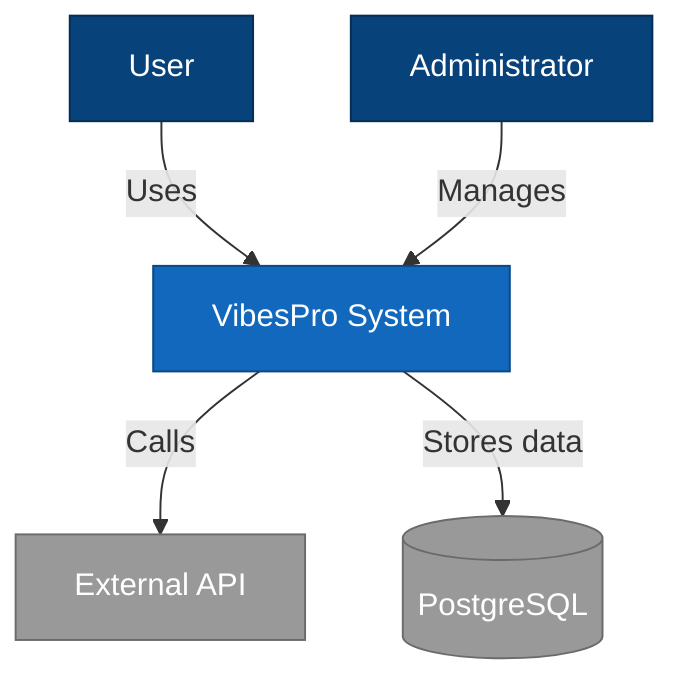
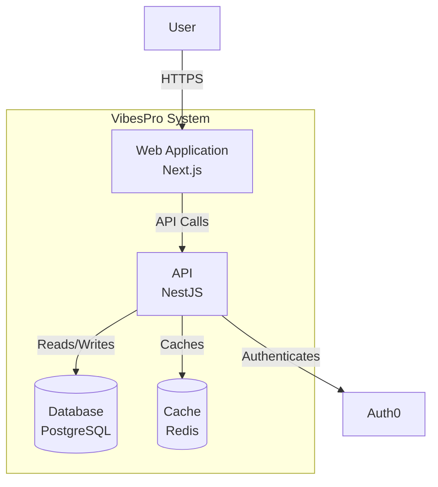
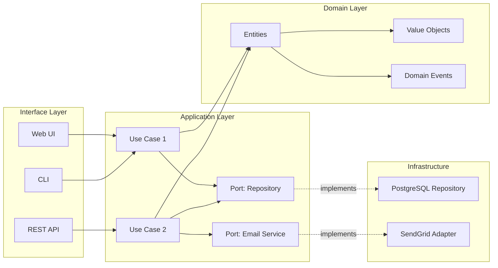
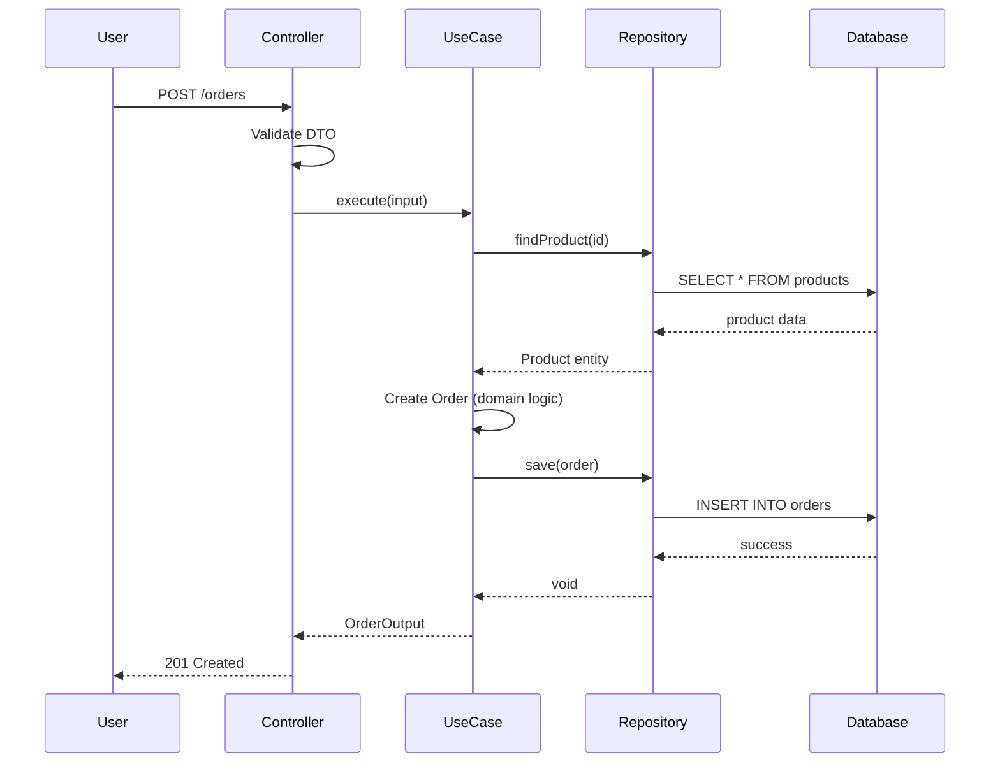
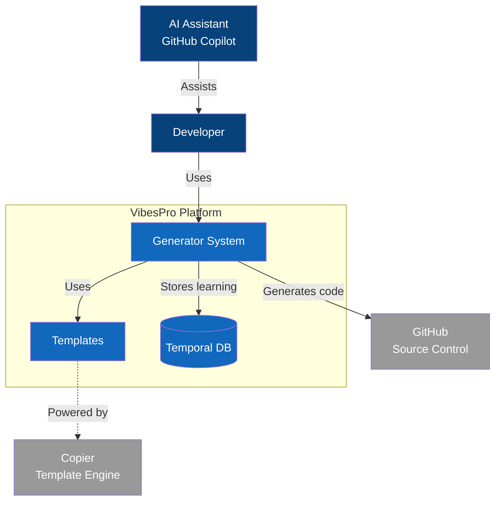

# architecture/ Agent Instructions

## 📍 Context

> **Purpose**: Architectural documentation using CALM (Continuous Architecture with Living Models) and system design diagrams.
> **When to use**: When documenting architecture, creating diagrams, or understanding system design patterns.

## 🔗 Parent Context

See [root copilot-instructions.md](/.github/copilot-instructions.md) for comprehensive project guidance and [AGENT-MAP.md](/AGENT-MAP.md) for navigation across contexts.

## 🎯 Local Scope

**This directory handles:**

-   CALM (Continuous Architecture with Living Models) documentation
-   System architecture diagrams (C4 model, sequence, component)
-   Architectural Decision Records (ADRs) - high-level strategic
-   Architecture patterns and principles
-   Integration architecture diagrams
-   Domain maps and bounded contexts

**Related Methodology**: [CALM](https://www.infoq.com/articles/continuous-architecture-principles/) - Architecture as living documentation

## 📁 Key Files & Patterns

### Directory Structure

```
architecture/
├── calm/                       # CALM documentation
│   ├── context/                # System context diagrams (C4 Level 1)
│   │   ├── system-context.md   # Overall system context
│   │   └── external-systems.md # External integrations
│   ├── containers/             # Container diagrams (C4 Level 2)
│   │   ├── web-app.md
│   │   ├── api.md
│   │   └── mobile-app.md
│   ├── components/             # Component diagrams (C4 Level 3)
│   │   ├── domain/             # Domain components
│   │   ├── application/        # Application components
│   │   └── infrastructure/     # Infrastructure components
│   └── code/                   # Code diagrams (C4 Level 4)
│       └── hexagonal-layers.md
├── diagrams/                   # Diagram source files
│   ├── mermaid/                # Mermaid diagrams
│   │   ├── system-overview.mmd
│   │   ├── data-flow.mmd
│   │   └── deployment.mmd
│   ├── plantuml/               # PlantUML diagrams (if used)
│   └── generated/              # Generated diagram images
├── patterns/                   # Architecture patterns
│   ├── hexagonal.md            # Hexagonal architecture
│   ├── event-driven.md         # Event-driven patterns
│   ├── cqrs.md                 # CQRS pattern
│   └── microservices.md        # Microservices patterns
├── adrs/                       # Architectural Decision Records
│   ├── 001-hexagonal-architecture.md
│   ├── 002-domain-driven-design.md
│   ├── 003-event-sourcing.md
│   └── template.md
├── domain-model/               # Domain modeling
│   ├── bounded-contexts.md     # Bounded context map
│   ├── ubiquitous-language.md  # Domain language
│   └── context-mapping.md      # Context relationships
└── README.md                   # Architecture overview
```

### CALM Principles

**CALM** = Continuous Architecture with Living Models

1. **Architecture is continuous** - Not a phase, but ongoing
2. **Models are living** - Diagrams stay in sync with code
3. **Documentation is code-adjacent** - Near the code it describes
4. **Automation over manual** - Generate what you can
5. **Visual over textual** - Diagrams communicate better

### C4 Model Hierarchy

```
Level 1: System Context
  ↓ (What systems exist, who uses them)
Level 2: Containers
  ↓ (Web apps, APIs, databases, mobile apps)
Level 3: Components
  ↓ (Domain, application, infrastructure components)
Level 4: Code
  ↓ (Classes, interfaces, relationships)
```

## 🧭 Routing Rules

### Use This Context When:

-   [ ] Creating system architecture diagrams
-   [ ] Documenting architectural decisions (ADRs)
-   [ ] Understanding system design patterns
-   [ ] Mapping bounded contexts (DDD)
-   [ ] Creating CALM documentation
-   [ ] Generating diagrams with Mermaid/PlantUML

### Refer to Other Contexts When:

| Context                                       | When to Use                                          |
| --------------------------------------------- | ---------------------------------------------------- |
| [docs/AGENT.md](/docs/AGENT.md)               | Detailed specs (PRD, SDS, TS) - implementation level |
| [libs/AGENT.md](/libs/AGENT.md)               | Implementing hexagonal architecture in code          |
| [temporal_db/AGENT.md](/temporal_db/AGENT.md) | Storing ADRs in temporal database                    |
| [.github/AGENT.md](/.github/AGENT.md)         | Architecture-related prompts and chat modes          |

## 🔧 Local Conventions

### ADR Format (Architecture Decision Records)

**Template structure:**

```markdown
# ADR-XXX: [Title]

**Status**: [Proposed | Accepted | Rejected | Deprecated | Superseded]
**Date**: YYYY-MM-DD
**Deciders**: [Names/Roles]
**Context**: [Spec IDs if applicable]

## Context

[What is the issue we're seeing that is motivating this decision or change?]

## Decision

[What is the change that we're proposing and/or doing?]

## Consequences

### Positive

-   [Benefit 1]
-   [Benefit 2]

### Negative

-   [Trade-off 1]
-   [Trade-off 2]

### Risks

-   [Risk 1] - **Mitigation**: [How we address it]
-   [Risk 2] - **Mitigation**: [How we address it]

## Alternatives Considered

### Alternative 1: [Name]

-   **Pros**: [...]
-   **Cons**: [...]
-   **Reason rejected**: [...]

### Alternative 2: [Name]

-   **Pros**: [...]
-   **Cons**: [...]
-   **Reason rejected**: [...]

## Implementation Notes

-   [Key point 1]
-   [Key point 2]

## References

-   [Link to related docs]
-   [Link to similar ADRs]
-   [External resources]
```

### Mermaid Diagram Conventions

**System Context (C4 Level 1):**



**Container Diagram (C4 Level 2):**



**Hexagonal Architecture:**



**Sequence Diagram:**



### Bounded Context Mapping (DDD)

```markdown
# Bounded Context Map

## Core Domains

### Orders Context

-   **Responsibility**: Order management and fulfillment
-   **Language**: Order, OrderItem, OrderStatus, Customer
-   **Relationships**:
    -   **Upstream**: Products Context (Conformist)
    -   **Downstream**: Shipping Context (Customer-Supplier)

### Products Context

-   **Responsibility**: Product catalog and inventory
-   **Language**: Product, SKU, Category, Inventory
-   **Relationships**:
    -   **Downstream**: Orders Context (Published Language)

### Users Context

-   **Responsibility**: User authentication and authorization
-   **Language**: User, Role, Permission, Session
-   **Relationships**:
    -   **Shared Kernel**: with all contexts (Identity)

## Context Relationships

-   **Partnership**: Users ↔ Orders (bidirectional cooperation)
-   **Customer-Supplier**: Orders → Shipping (downstream dependency)
-   **Conformist**: Orders → Products (accept upstream model)
-   **Anticorruption Layer**: Orders → External Payment API
```

## 📚 Related Instructions

**Modular instructions that apply here:**

-   [.github/instructions/docs.instructions.md](/.github/instructions/docs.instructions.md) - Documentation standards
-   [.github/instructions/general.instructions.md](/.github/instructions/general.instructions.md) - General guidelines

**Relevant prompts:**

-   [.github/prompts/spec.plan.adr.prompt.md](/.github/prompts/spec.plan.adr.prompt.md) - Generate ADRs
-   [.github/prompts/docs.generate.prompt.md](/.github/prompts/docs.generate.prompt.md) - Generate architecture docs

**Related chat modes:**

-   `persona.system-architect` - Architectural guidance
-   `spec.wide` - Comprehensive spec generation

## 💡 Examples

### Example 1: ADR for Hexagonal Architecture

```markdown
# ADR-001: Adopt Hexagonal Architecture

**Status**: Accepted
**Date**: 2025-01-15
**Deciders**: Architecture Team
**Context**: DEV-ADR-001, DEV-SDS-001

## Context

We need a clean architecture that:

-   Separates business logic from infrastructure concerns
-   Enables independent testing of domain logic
-   Allows switching infrastructure implementations
-   Supports Domain-Driven Design (DDD)

Current monolithic structure couples business rules with database access,
making testing difficult and technology migration risky.

## Decision

Adopt **Hexagonal Architecture** (Ports & Adapters pattern) with three layers:

1. **Domain Layer**: Pure business logic, no dependencies
2. **Application Layer**: Use cases, defines ports (interfaces)
3. **Infrastructure Layer**: Implements adapters for ports

Dependency rule: Domain ← Application ← Infrastructure (inward only).

## Consequences

### Positive

-   **Testability**: Domain logic testable without infrastructure
-   **Flexibility**: Easy to swap database, framework, or external services
-   **Clarity**: Clear boundaries between business and technical concerns
-   **DDD Support**: Natural fit for domain-driven design

### Negative

-   **Initial Complexity**: More files and layers than simple architecture
-   **Learning Curve**: Team needs to understand pattern
-   **Boilerplate**: More interfaces and abstractions

### Risks

-   **Over-engineering simple features** - **Mitigation**: Use generators for consistent scaffolding
-   **Circular dependencies** - **Mitigation**: Enforce with Nx boundary rules

## Alternatives Considered

### Alternative 1: Layered Architecture

-   **Pros**: Simpler, well-known pattern
-   **Cons**: Business logic can leak into presentation/data layers
-   **Reason rejected**: Insufficient separation of concerns

### Alternative 2: Clean Architecture

-   **Pros**: Similar benefits, more layers (entities, use cases, controllers, frameworks)
-   **Cons**: More complex, overlaps with hexagonal
-   **Reason rejected**: Hexagonal is sufficient for our needs

## Implementation Notes

-   Use Nx generators to scaffold hexagonal layers
-   Store domain logic in `libs/{context}/domain`
-   Define ports in `libs/{context}/application/ports`
-   Implement adapters in `libs/{context}/infrastructure`
-   Wire dependencies in `apps/{app}/src/main.ts`

## References

-   [Hexagonal Architecture](https://alistair.cockburn.us/hexagonal-architecture/)
-   [Ports and Adapters Pattern](https://jmgarridopaz.github.io/content/hexagonalarchitecture.html)
-   DEV-SDS-001: Software Design Specification
```

### Example 2: System Context Diagram

````markdown
# System Context (C4 Level 1)

## Overview

VibesPro is a generator-first platform that creates production-ready applications.

## Diagram


````

## Actors

-   **Developer**: Uses the platform to generate projects
-   **AI Assistant**: Provides guidance and automation

## Systems

-   **Generator System**: Core generation engine using Nx and Copier
-   **Templates**: Jinja2 templates for code generation
-   **Temporal DB**: Learning database (Rust/sled)

## External Dependencies

-   **GitHub**: Source control and CI/CD
-   **Copier**: Template engine (Python)

````

### Example 3: Component Diagram for Orders Domain

```markdown
# Orders Domain Components (C4 Level 3)

## Diagram

```mermaid
graph TB
    subgraph Domain Layer
        Order[Order Entity]
        OrderItem[OrderItem VO]
        OrderStatus[OrderStatus Enum]
        OrderEvent[OrderCreated Event]
    end

    subgraph Application Layer
        CreateOrder[CreateOrder UseCase]
        ConfirmOrder[ConfirmOrder UseCase]
        OrderRepo[OrderRepository Port]
        EventBus[EventBus Port]
    end

    subgraph Infrastructure Layer
        PgRepo[PostgresOrderRepository]
        InMemRepo[InMemoryOrderRepository<br/>For Testing]
        EventAdapter[EventBusAdapter]
    end

    CreateOrder --> Order
    CreateOrder --> OrderRepo
    CreateOrder --> EventBus

    ConfirmOrder --> Order
    ConfirmOrder --> OrderRepo

    OrderRepo -.implements.-> PgRepo
    OrderRepo -.implements.-> InMemRepo
    EventBus -.implements.-> EventAdapter

    Order --> OrderItem
    Order --> OrderStatus
    Order -.emits.-> OrderEvent
````

## Components

### Domain Layer

-   **Order Entity**: Aggregate root for order management
-   **OrderItem VO**: Value object for line items
-   **OrderStatus**: Enum for order lifecycle
-   **OrderCreated Event**: Domain event published on creation

### Application Layer

-   **CreateOrder UseCase**: Creates new orders
-   **ConfirmOrder UseCase**: Confirms pending orders
-   **OrderRepository Port**: Interface for persistence
-   **EventBus Port**: Interface for event publishing

### Infrastructure Layer

-   **PostgresOrderRepository**: Production persistence
-   **InMemoryOrderRepository**: Testing persistence
-   **EventBusAdapter**: Event publishing implementation

````

### Example 4: Deployment Architecture

```markdown
# Deployment Architecture

```mermaid
graph TB
    subgraph Developer Machine
        Dev[Developer]
        VSCode[VS Code + Copilot]
        LocalDB[(Local PostgreSQL)]
    end

    subgraph CI/CD - GitHub Actions
        Build[Build & Test]
        Deploy[Deploy]
    end

    subgraph Production - Vercel
        NextApp[Next.js App<br/>Edge Functions]
        API[NestJS API<br/>Serverless]
    end

    subgraph Production - Database
        ProdDB[(PostgreSQL<br/>Supabase)]
        Cache[(Redis<br/>Upstash)]
    end

    Dev -->|Commits| GitHub[GitHub Repository]
    GitHub -.triggers.-> Build
    Build -->|On success| Deploy
    Deploy -->|Deploys to| NextApp
    Deploy -->|Deploys to| API

    NextApp -->|Reads/Writes| API
    API -->|Queries| ProdDB
    API -->|Caches| Cache

    Dev -->|Develops with| VSCode
    VSCode -->|Uses| LocalDB
````

````

## ✅ Checklist

### Before Creating Architecture Docs:

- [ ] Review existing ADRs
- [ ] Understand current system structure
- [ ] Identify stakeholders and concerns
- [ ] Choose appropriate diagram type (C4 level)
- [ ] Validate with architecture team

### While Creating Diagrams:

- [ ] Use consistent notation (C4, Mermaid)
- [ ] Include legend if needed
- [ ] Keep diagrams simple (max 9 boxes per diagram)
- [ ] Use meaningful names
- [ ] Add context in accompanying text

### After Creating Architecture Docs:

- [ ] Validate diagrams render correctly
- [ ] Link from docs/dev_adr.md
- [ ] Update traceability matrix
- [ ] Store in temporal_db if ADR
- [ ] Review with architecture team

## 🔍 Quick Reference

### Common Commands

```bash
# Render Mermaid diagrams
npx @mermaid-js/mermaid-cli -i diagram.mmd -o diagram.svg

# Generate diagram from code (if using tools)
node tools/docs/generate-architecture-diagram.js

# Validate architecture decisions
node tools/docs/validate-adrs.js

# Update AI context bundle (includes architecture docs)
just ai-context-bundle
````

### C4 Model Quick Reference

| Level         | Focus             | Examples                            |
| ------------- | ----------------- | ----------------------------------- |
| 1: Context    | System boundaries | Users, external systems             |
| 2: Containers | Deployable units  | Web app, API, database              |
| 3: Components | Modules/packages  | Domain, application, infrastructure |
| 4: Code       | Classes/functions | Entities, repositories, use cases   |

### Mermaid Diagram Types

| Type              | Use Case                 | Syntax                  |
| ----------------- | ------------------------ | ----------------------- |
| `graph`           | Structure, relationships | `graph TB` (top-bottom) |
| `sequenceDiagram` | Interactions over time   | `sequenceDiagram`       |
| `classDiagram`    | Class relationships      | `classDiagram`          |
| `stateDiagram`    | State machines           | `stateDiagram-v2`       |
| `erDiagram`       | Database schema          | `erDiagram`             |

## 🛡️ Security Considerations

**Security in architecture:**

-   ⚠️ **Document security boundaries**: Show trust boundaries in diagrams
-   ⚠️ **Review architecture decisions**: Security implications in ADRs
-   ⚠️ **Access control**: Document authentication/authorization flows
-   ⚠️ **Data flow**: Show where sensitive data travels
-   ⚠️ **Threat modeling**: Include STRIDE analysis in ADRs

**Example security boundary in diagram:**

```mermaid
graph LR
    subgraph Public Internet
        User[User]
    end

    subgraph DMZ
        CDN[CDN / WAF]
    end

    subgraph Private Network
        API[API Server]
        DB[(Database)]
    end

    User -->|HTTPS| CDN
    CDN -->|Filter & Forward| API
    API -->|Encrypted| DB

    style DMZ fill:#ffeecc,stroke:#ff9900
    style Private Network fill:#ccffcc,stroke:#00cc00
```

## 🎯 Integration with AI Workflows

### Generate ADRs with AI

**Using chat mode:**

```
@workspace /new-chat persona.system-architect

Create ADR for adopting event sourcing for order history.

Context:
- Current: CRUD updates lose history
- Need: Audit trail and temporal queries
- Constraints: Must integrate with existing orders domain
```

### Store ADRs in Temporal DB

```typescript
// tools/architecture/store-adr.ts
import { TemporalDb } from "../temporal_db";

async function storeADR(adrFile: string) {
    const content = await readFile(adrFile, "utf-8");
    const adr = parseADR(content);

    await TemporalDb.storeDecision({
        id: adr.id,
        title: adr.title,
        status: adr.status,
        context: adr.context,
        decision: adr.decision,
        consequences: adr.consequences,
        created_at: adr.date,
    });
}
```

## 🔄 Maintenance

### Regular Tasks

-   **Weekly**: Review new ADRs for consistency
-   **Monthly**: Update diagrams if architecture changes
-   **Quarterly**: Audit ADRs, deprecate outdated ones
-   **Per feature**: Create ADR for significant architectural decisions

### When to Update This AGENT.md

-   C4 model conventions change
-   New diagram types introduced
-   ADR template evolves
-   CALM principles update
-   Architecture patterns change

### Keeping Diagrams Current

**Automation strategies:**

-   Generate diagrams from code (where possible)
-   Use tests to validate diagram accuracy
-   Include diagram review in PR checklist
-   Automate with `just ai-context-bundle`

---

_Last updated: 2025-10-13 | Maintained by: VibesPro Project Team_
_Parent context: [copilot-instructions.md](/.github/copilot-instructions.md) | Navigation: [AGENT-MAP.md](/AGENT-MAP.md)_
