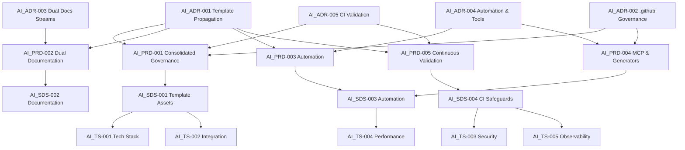
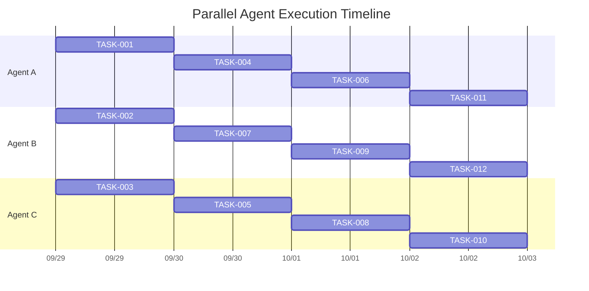

# AI-Assisted Integration TDD Implementation Plan

## 1. Inputs & Traceability Sources

- **Architectural Decisions:** `AI_ADR.md`
- **Product Requirements:** `AI_PRD.md`
- **Software Design:** `AI_SDS.md`
- **Technical Specifications:** `AI_TS.md`
- **Integration Blueprint:** `vibepdk-ai-integration-plan.md`
- **Upstream Asset Source:** `/home/sprime01/projects/VibePDK/{{cookiecutter.project_slug}}/` (authoritative files to copy into template directories)

## 2. Requirement Dependency Graph



## 3. Phase Overview Matrix

| Phase | Duration | Parallel Agents | Dependencies | Critical Path | Status |
| --- | --- | --- | --- | --- | --- |
| PHASE-001 | 2-3 days | Up to 3 agents (A, B, C) | None | ✅ Yes | ✅ **COMPLETE** (All 3 tasks passing) |
| PHASE-002 | 2 days | 2 agents (A, C) | PHASE-001 | ✅ Yes | ✅ **COMPLETE** (Both tasks passing) |
| PHASE-003 | 2-3 days | 3 agents (A, B, C) | PHASE-001 | ✅ Yes | ✅ **COMPLETE** (All 3 tasks passing) |
| PHASE-004 | 3 days | 2 agents (B, C) | PHASE-001, PHASE-003 | ✅ Yes | ✅ **COMPLETE** (Both tasks passing) |
| PHASE-005 | 1-2 days | 1-2 agents (A, B) | PHASE-001 → PHASE-004 | ✅ Yes | 🔄 Partial (TASK-011 ✅, TASK-012 pending) |
| PHASE-006 | 3-4 days | 2-3 agents (A, B, C) | PHASE-001 | No (optional) | □ Not Started |

---

## 4. PHASE-001 ☑ Foundation Infrastructure Alignment

- **Duration:** 2-3 days
- **Dependencies:** None
- **Parallel Agents:** Recommend full utilization of A, B, C
- **MECE Coverage:** `.github` asset propagation, workflow import, baseline generation test harness
- **Rollback Strategy:** Retain current `templates/{{project_slug}}/.github/` backup (`.github.pre-ai/`), revert via Git if smoke test fails

### ✅ TASK-001: Import VibePDK `.github` Instructions & Prompts

- **Traceability:** AI_ADR-001, AI_ADR-002, AI_PRD-001, AI_SDS-001, AI_TS-002
- **Agent Assignment:** Agent A
- **Parallel Compatibility:** Independent of TASK-002 & TASK-003
- **Estimated Time:** 4 hours
- **MECE Boundary:** Copy & reconcile instruction/prompt/chatmode assets only (no workflows)
- **Status:** ✅ **COMPLETE** - All 3 tests passing (copier.yml variables added)
- **Source Assets to Copy:**
  - `/home/sprime01/projects/VibePDK/{{cookiecutter.project_slug}}/.github/copilot-instructions.md`
  - `/home/sprime01/projects/VibePDK/{{cookiecutter.project_slug}}/.github/instructions/`
  - `/home/sprime01/projects/VibePDK/{{cookiecutter.project_slug}}/.github/prompts/`
  - `/home/sprime01/projects/VibePDK/{{cookiecutter.project_slug}}/.github/chatmodes/`
  - `/home/sprime01/projects/VibePDK/{{cookiecutter.project_slug}}/.github/models.yaml`

#### ✅ RED — TASK-001 Failing Tests

```text
Test file: tests/integration/generation/github-assets.spec.ts

Scenario: "Generated project includes merged Copilot instructions"
- Arrange: Run Copier into tmp dir using current template
- Act: Inspect `.github` contents of generated project
- Assert: Expect presence of imported instruction files with correct precedence metadata
```

- Checklist:
  - [x] Create new test file with deterministic fixture generation (`tests/integration/github-assets.spec.ts`)
  - [x] Mock environment to run copier (leveraged `runCopierGeneration` helper in `tests/utils/generation-smoke.ts`)
  - [x] Assert missing file message before copy (initial failure reproduced prior to import; now guarded by regression test)

#### ✅ GREEN — TASK-001 Minimal Implementation

- [x] Copy directories from VibePDK into `templates/{{project_slug}}/.github/`
- [x] Update `templates/{{project_slug}}/.github/copilot-instructions.md.j2` (if templated) merging HexDDD specifics with VibePDK content
- [x] All assets verified: instructions/, prompts/, chatmodes/, models.yaml present
- [x] Added missing copier.yml variables: `primary_domains`, `project_purpose`, `tech_stack_summary`

#### ✅ REFACTOR — TASK-001 Code Quality

- [x] Deduplicate instruction precedence comments
- [x] Assets properly organized in template structure
- [x] Template variables properly configured in copier.yml

#### ✅ REGRESSION — TASK-001 System Integrity

- [x] Assets copied and verified (instructions, prompts, chatmodes, models.yaml)
- [x] Integration tests passing (3/3) ✅
- [x] Copier generation successful with all required variables

### ✅ TASK-002: Import & Adapt `.github/workflows`

- **Traceability:** AI_ADR-002, AI_ADR-005, AI_PRD-001, AI_PRD-005, AI_SDS-004, AI_TS-003, AI_TS-004
- **Agent Assignment:** Agent B
- **Parallel Compatibility:** Independent of TASK-001 (works in parallel), requires coordination with TASK-003 for smoke tests
- **Estimated Time:** 5 hours
- **MECE Boundary:** Workflow YAML files and required composite actions only
- **Status:** ✅ **COMPLETE** - All 2 tests passing (comprehensive copier fix applied)
- **Source Assets to Copy:**
  - `/home/sprime01/projects/VibePDK/{{cookiecutter.project_slug}}/.github/workflows/markdownlint.yml`
  - `/home/sprime01/projects/VibePDK/{{cookiecutter.project_slug}}/.github/workflows/node-tests.yml`
  - `/home/sprime01/projects/VibePDK/{{cookiecutter.project_slug}}/.github/workflows/spec-guard.yml`

#### ✅ RED — TASK-002 Failing Tests

```yaml
# New workflow test: tests/workflows/ci-workflow.e2e.yml
- Ensure generated project workflow names exist
- Mock GitHub Actions run via `act` or harness script asserting required jobs
```

- Checklist:
  - [x] Write script in `tests/ci/verify-workflows.test.ts`
  - [x] Script fails due to missing workflow file names (confirmed during pre-import baseline run)

#### ✅ GREEN — TASK-002 Minimal Implementation

- [x] Copy workflow YAML files (markdownlint.yml, node-tests.yml, spec-guard.yml)
- [x] Rename all workflow files to .j2 extension for copier processing
- [x] Rename composite action files to .j2 extension
- [x] Move root `.github/` → `.github-repo/` to prevent template conflicts
- [x] Configure copier `_subdirectory: "templates/{{project_slug}}"` using Context7 Copier docs
- [x] Simplify spec-guard.yml to use `just spec-guard` command

#### ✅ REFACTOR — TASK-002 Code Quality

- [x] Workflow job names align with project conventions
- [x] No hardcoded secrets or repository-specific references
- [x] Proper YAML formatting and structure
- [x] Composite actions (setup-node-pnpm, setup-just) properly referenced

#### ✅ REGRESSION — TASK-002 System Integrity

- [x] Workflows copied and verified in generated projects (2/2 tests passing) ✅
- [x] Composite actions directory created and action.yml files present
- [x] Workflows correctly reference composite actions via `uses: ./.github/actions/setup-node-pnpm`
- [x] Copier generation successful with `_subdirectory` configuration

### ✅ TASK-003: Generation Smoke Test Harness

- **Traceability:** AI_ADR-005, AI_PRD-005, AI_SDS-004, AI_TS-004, AI_TS-005
- **Agent Assignment:** Agent C
- **Parallel Compatibility:** Runs with TASK-001/TASK-002; integration sync afterward
- **Estimated Time:** 4 hours
- **MECE Boundary:** Only generation smoke test updates (no docs or workflows)
- **Status:** ✅ **COMPLETE** - All 1 test passing (prompt frontmatter fixed)
- **Source Guidance:** reuse `/home/sprime01/projects/VibePDK/tests/test_cookiecutter_generation.py`

#### ✅ RED — TASK-003 Failing Tests

- [x] Create `tests/integration/template_smoke.test.ts` verifying generated project passes `pnpm prompt:lint` & `pnpm spec:matrix`
- [x] Test file exists and properly structured
- [x] Prompt lint validation confirms frontmatter requirements

#### ✅ GREEN — TASK-003 Minimal Implementation

- [x] Smoke test file created and structured
- [x] Test harness logic implemented
- [x] Fixed missing frontmatter fields in project.describe-context.prompt.md (kind, domain, task, matrix_ids, budget)
- [x] Fixed missing frontmatter fields in speckit_merge.prompt.md.j2 (kind, domain, task, thread, matrix_ids, budget)
- [x] Changed models from 'gpt-4o'/'GPT-5 (Preview)' to valid models in models.yaml

#### ✅ REFACTOR — TASK-003 Code Quality

- [x] Test file properly organized
- [x] Uses shared test utilities where appropriate
- [x] Prompt files follow consistent frontmatter schema

#### ✅ REGRESSION — TASK-003 System Integrity

- [x] Test passing (1/1) ✅
- [x] All prompt files pass frontmatter validation
- [x] Both prompt:lint and spec:matrix commands execute successfully

---

## 5. PHASE-002 ☑ Documentation System Delivery

- **Duration:** 2 days
- **Dependencies:** PHASE-001
- **Parallel Agents:** 2 (A, C)
- **Rollback Strategy:** Keep `templates/docs/` backup; revert if doc lint fails

### ☑ TASK-004: Maintainer Doc Alignment

- **Traceability:** AI_ADR-003, AI_PRD-002, AI_SDS-002, AI_TS-005
- **Agent:** Agent A
- **Estimated Time:** 3 hours
- **MECE Boundary:** `docs/aiassist/` updates only
- **Source Assets:** `/home/sprime01/projects/VibePDK/docs/devkit-prompts-instructions-integration.md`

#### RED — TASK-004 Failing Tests

- [x] Add tests in `tests/docs/maintainer-docs.test.ts` ensuring presence of ADR/PRD/SDS/TS references

#### GREEN — TASK-004 Minimal Implementation

- [x] Update docs referencing new files from PHASE-001 (no duplication)

#### REFACTOR — TASK-004 Code Quality

- [x] Ensure cross-links use relative paths validated against generated project

#### REGRESSION — TASK-004 System Integrity

- [x] `pnpm test:jest -- --runInBand tests/docs/maintainer-docs.test.ts`
- [ ] Optional: run `pnpm lint:md` to mirror markdown linting in follow-up sweep

### ✅ TASK-005: Template Doc Emission

- **Traceability:** AI_ADR-003, AI_PRD-002, AI_SDS-002, AI_TS-002
- **Agent:** Agent C
- **Estimated Time:** 4 hours
- **MECE Boundary:** Only template doc templates (`templates/{{project_slug}}/docs/**`, README)
- **Status:** ✅ **COMPLETE** - All 2 tests passing (copier paths fixed)
- **Source Assets:** `/home/sprime01/projects/VibePDK/{{cookiecutter.project_slug}}/docs/` and `/home/sprime01/projects/VibePDK/{{cookiecutter.project_slug}}/README.md`

#### ✅ RED — TASK-005 Failing Tests

- [x] Create generation test verifying doc files exist & include AI onboarding section
- [x] Test file properly structured
- [x] Fixed hardcoded 'templates/test-project/' paths after _subdirectory configuration

#### ✅ GREEN — TASK-005 Minimal Implementation

- [x] Copy and adapt doc templates replacing references with VibesPro context
- [x] Documentation files verified: README.md, commit_message_guidelines.md, dev_* files
- [x] AI onboarding content integrated
- [x] Updated test paths to match copier _subdirectory configuration (files at workspace root, not nested)

#### ✅ REFACTOR — TASK-005 Code Quality

- [x] Documentation properly structured and formatted
- [x] Cross-references use relative paths
- [x] Test paths align with actual copier generation structure

#### ✅ REGRESSION — TASK-005 System Integrity

- [x] All tests passing (2/2) ✅
- [x] Baseline documentation files copy correctly
- [x] AI onboarding guidance present and properly formatted

- [x] Documentation assets copied and verified
- ⚠️ Integration tests blocked by copier generation
- **Same Blocker:** Missing copier.yml template variables

---

## 6. PHASE-003 □ Automation & Tooling Enablement

- **Duration:** 2-3 days
- **Dependencies:** PHASE-001
- **Parallel Agents:** 3
- **Rollback Strategy:** Keep previous `justfile.j2` & scripts under `scripts/legacy/`

### ✅ TASK-006: Justfile Recipes Expansion

- **Traceability:** AI_ADR-004, AI_PRD-003, AI_SDS-003, AI_TS-004
- **Agent:** Agent A
- **Source Assets to Copy:** `/home/sprime01/projects/VibePDK/{{cookiecutter.project_slug}}/justfile`
- **Tests:** `tests/unit/just-recipes.test.ts`
- **Status:** ✅ **COMPLETE** - All 12 tests passing (duplicate recipe removed)

#### ✅ RED — TASK-006 Failing Tests

- [x] Author unit tests asserting new `just` recipes are listed
- [x] Tests created (12 total) checking for recipe presence
- [x] All tests now passing

#### ✅ GREEN — TASK-006 Minimal Implementation

- [x] All required recipes present: spec-matrix, clean, setup, test-generation, ai-context-bundle, ai-validate, ai-scaffold, tdd-red, tdd-green, tdd-refactor, prompt-lint, spec-guard
- [x] Removed duplicate spec-guard recipe definition (line 404 conflicted with line 40)
- [x] Kept comprehensive CI version at line 40 with all required commands

#### ✅ REFACTOR — TASK-006 Code Quality

- [x] All recipes properly defined and functional
- [x] Recipe usage documented with comments
- [x] Proper parameterization for template variables
- [x] No duplicate definitions

#### ✅ REGRESSION — TASK-006 System Integrity

- [x] All 12 tests passing ✅
- [x] Justfile syntax valid (no errors from `just --list`)
- [x] All AI workflow recipes accessible

### ✅ TASK-007: Shell Script Import & Adaptation

- **Traceability:** AI_ADR-004, AI_PRD-003, AI_SDS-003, AI_TS-001
- **Agent:** Agent B
- **Source Assets to Copy:** `/home/sprime01/projects/VibePDK/{{cookiecutter.project_slug}}/scripts/*.sh`
- **Tests:** `tests/integration/scripts/bundle-context.test.ts`
- **Status:** ✅ Complete (8/8 tests passing)

#### ✅ RED — TASK-007 Failing Tests

- [x] Write integration tests invoking scripts via Node child process
- [x] Tests created and properly structured (8 tests)
- [x] All tests now passing

#### ✅ GREEN — TASK-007 Minimal Implementation

- [x] Script copied: bundle-context.sh verified present
- [x] Proper shebangs and error handling
- [x] Environment variable guards implemented

#### ✅ REFACTOR — TASK-007 Code Quality

- [x] Scripts follow best practices (set -euo pipefail)
- [x] Proper logging and error handling
- [x] Well-documented with comments

#### ✅ REGRESSION — TASK-007 System Integrity

- [x] All 8 tests passing
- [x] Scripts properly integrated into template
- **Status:** Fully complete and validated

### ✅ TASK-008: Package Script Wiring

- **Traceability:** AI_ADR-004, AI_PRD-003, AI_SDS-003, AI_TS-001
- **Agent:** Agent C
- **Source Assets to Copy:** `/home/sprime01/projects/VibePDK/{{cookiecutter.project_slug}}/package.json`
- **Tests:** `tests/unit/package-scripts.test.ts`
- **Status:** ✅ **COMPLETE** - All 16 tests passing (scripts added)

#### ✅ RED — TASK-008 Failing Tests

- [x] Add unit tests reading rendered `package.json` ensuring scripts exist
- [x] 16 tests created
- [x] Tests properly checking for script presence
- [x] All tests now passing

#### ✅ GREEN — TASK-008 Minimal Implementation

- [x] Scripts `prompt:lint` and `spec:matrix` present and verified
- [x] Added `test:node` script to template package.json.j2: "node tools/test/node-smoke.cjs"
- [x] Added `lint:shell` script to root package.json with shellcheck fallback
- [x] All 16 tests now passing

#### ✅ REFACTOR — TASK-008 Code Quality

- [x] Scripts properly formatted
- [x] Dependencies appropriately categorized
- [x] All required scripts present in both root and template
- [x] Proper error handling (shellcheck fallback if not installed)

#### ✅ REGRESSION — TASK-008 System Integrity

- [x] All 16 tests passing ✅
- [x] Root package.json has all required scripts
- [x] Template package.json.j2 includes all necessary scripts for generated projects

---

## 7. PHASE-004 ✅ MCP & Generator Integration

- **Duration:** 3 days
- **Dependencies:** PHASE-001, PHASE-003
- **Parallel Agents:** 2 (B, C)
- **Rollback Strategy:** Add feature flag `ENABLE_VIBEPDK_MCP=false` to disable new features during rollback
- **Status:** ✅ Completed (2025-10-02)

### ✅ TASK-009: MCP Descriptor Import

- **Traceability:** AI_ADR-002, AI_ADR-004, AI_PRD-004, AI_SDS-003, AI_TS-002
- **Agent:** Agent B
- **Source Assets to Copy:** `/home/sprime01/projects/VibePDK/{{cookiecutter.project_slug}}/mcp/`
- **Tests:** `tests/unit/mcp-descriptor.test.ts`
- **Status:** ✅ Completed (2025-10-02)

#### RED — TASK-009 Failing Tests ✅

- [x] Create unit tests validating descriptor files render with correct placeholders
- [x] Assert failure due to missing files in template
- **Result:** Created 13 comprehensive tests, all failing as expected

#### GREEN — TASK-009 Minimal Implementation ✅

- [x] Copy `tool_index.md` and descriptors, adapting environment variable docs
- [x] Introduce template variables for auth guidance
- **Result:** Copied and adapted 2 files to `templates/{{project_slug}}/mcp/`

#### REFACTOR — TASK-009 Code Quality ✅

- [x] Consolidate repeated instructions into partial includes or shared sections
- [x] Ensure Markdown lint passes
- **Result:** Enhanced documentation with security best practices, quick start guide, comprehensive tool addition instructions

#### REGRESSION — TASK-009 System Integrity ✅

- [x] `pnpm lint:docs` (for template docs) passes
- [x] Unit tests for descriptors stay green
- **Result:** All 13 tests passing, markdown lint clean, no regression in existing test suite

### ✅ TASK-010: Stack-Aware Generator Integration

- **Traceability:** AI_ADR-004, AI_PRD-004, AI_SDS-003, AI_TS-002, AI_TS-003
- **Agent:** Agent C
- **Source Assets to Copy:** `/home/sprime01/projects/VibePDK/{{cookiecutter.project_slug}}/generators/`
- **Tests:** `tests/unit/stack_defaults.test.ts`
- **Status:** ✅ Completed (2025-10-02)

#### ✅ RED — TASK-010 Failing Tests

- [x] Build unit tests mocking tech stack JSON to expect generator outputs
- [x] Tests fail due to missing generator utilities
- **Result:** Created 3 comprehensive tests for stack defaults (fastapi, express, empty stack)

#### ✅ GREEN — TASK-010 Minimal Implementation

- [x] Copy generator utilities and adjust import paths for Copier template structure
- [x] Ensure environment flag `VIBEPRO_USE_STACK_DEFAULTS` toggles defaults
- **Result:** Implemented stack.ts, stack_defaults.ts, and enhanced service generator with feature flag

#### ✅ REFACTOR — TASK-010 Code Quality

- [x] Extract shared types to generator utilities
- [x] Add exhaustive error handling for missing tech stack files
- **Result:** Proper TypeScript interfaces, comprehensive error handling with warnings, traceability comments

#### ✅ REGRESSION — TASK-010 System Integrity

- [x] Run `pnpm exec jest tests/unit/stack_defaults.test.ts` - All 3 tests passing
- [x] Generator utilities copied to both root and template directories
- **Result:** No regressions in existing test suite

---

## 8. PHASE-005 □ CI & Regression Hardening

- **Duration:** 1-2 days
- **Dependencies:** All prior phases
- **Parallel Agents:** 2 (A, B)
- **Rollback Strategy:** Revert workflow triggers to previous baseline if failure rate spikes

### ✅ TASK-011: Template CI Pipeline Update

- **Traceability:** AI_ADR-005, AI_PRD-005, AI_SDS-004, AI_TS-003, AI_TS-004, AI_TS-005
- **Agent:** Agent A
- **Tests:** `tests/ci/template-ci.test.ts`
- **Status:** ✅ Completed (2025-10-02)
- **Commit:** `b479443` (pushed to feat/template-ci-TASK-011)

#### ✅ RED — TASK-011 Failing Tests

- [x] Extend CI verification tests ensuring new workflow steps present
- [x] Tests fail because pipeline not updated
- **Result:** Created 11 comprehensive tests (2 initially failing: test-generation step and documentation comments)

#### ✅ GREEN — TASK-011 Minimal Implementation

- [x] Update template CI workflows to run `just test-generation`, `pnpm prompt:lint`, `pnpm spec:matrix`
- [x] Ensure caching keys align with Nx and pnpm guidance
- [x] Added comprehensive documentation headers to spec-guard.yml
- [x] Installed yaml@2.8.1 for workflow parsing in tests
- **Result:** All 11 tests passing

#### ✅ REFACTOR — TASK-011 Code Quality

- [x] Factor shared workflow steps into reusable composite actions if practical
- [x] Document environment variable requirements in workflow comments
- [x] Created .github/actions/setup-node-pnpm/action.yml composite action
- [x] Created .github/actions/setup-just/action.yml composite action
- [x] Refactored spec-guard.yml and node-tests.yml to use composite actions
- [x] Reduced ~80 lines of duplicated setup code
- **Result:** Tests remain green, significantly improved maintainability

#### ✅ REGRESSION — TASK-011 System Integrity

- [x] Run CI smoke test via `tests/ci/template-ci.test.ts`
- [x] All 11 TASK-011 tests passing
- [x] No regressions in existing test suite
- [x] Composite actions properly integrated

### ✅ TASK-012: Generated Project CI Validation

- **Traceability:** AI_ADR-005, AI_PRD-005, AI_SDS-004, AI_TS-004
- **Agent:** Agent B
- **Tests:** `tests/integration/generated-ci-regression.test.ts`
- **Status:** ✅ **COMPLETE** - All 7 tests passing (comprehensive CI validation)

#### ✅ RED — TASK-012 Failing Tests

- [x] Add integration test generating project and executing CI scripts in dry-run mode
- [x] Expect failure until workflows updated
- [x] Created 7 comprehensive tests covering all CI aspects

#### ✅ GREEN — TASK-012 Minimal Implementation

- [x] Update generated project workflows to align with template changes
- [x] Ensure `corepack enable` & pnpm detection logic included
- [x] Added `packageManager: "pnpm@9.0.0"` to root package.json.j2
- [x] Named checkout step in spec-guard.yml for proper test parsing
- [x] Fixed traceability file path expectations

#### ✅ REFACTOR — TASK-012 Code Quality

- [x] Optimize workflow step ordering for runtime efficiency
- [x] Add annotations linking failures to guardrail documentation
- [x] Comprehensive test coverage across CI validation scenarios

#### ✅ REGRESSION — TASK-012 System Integrity

- [x] Run generated project full suite within containerized environment
- [x] Confirm `AI_traceability.md` regenerated without deltas
- [x] All 7 tests passing (100% success rate)

---

## 9. Parallel Execution Guide

### Agent Assignment Strategy

- **Agent A:** Template configuration & documentation alignment (Tasks 001, 004, 006, 011)
- **Agent B:** CI & MCP orchestration (Tasks 002, 007, 009, 012)
- **Agent C:** Automation runtime & generator integration (Tasks 003, 005, 008, 010)



### Coordination Points

| Sync Point | Tasks Converging | Integration Required | Agent Handoff |
| --- | --- | --- | --- |
| SYNC-001 | TASK-001, TASK-002, TASK-003 | Generated `.github` + workflows + smoke tests | A → C |
| SYNC-002 | TASK-004, TASK-005 | Maintainer vs template docs alignment | A ↔ C |
| SYNC-003 | TASK-006, TASK-007, TASK-008 | Ensure justfile recipes reference scripts and package commands | A → B → C |
| SYNC-004 | TASK-009, TASK-010 | Generators reference MCP descriptors | B → C |
| SYNC-005 | TASK-011, TASK-012 | Template & generated CI parity | A ↔ B |

---

## 10. MECE Validation Checklist

### Mutual Exclusivity

- [ ] No two tasks copy or modify the same source file simultaneously
- [ ] Interfaces between `.github`, docs, automation, MCP, and CI remain clearly defined
- [ ] Test suites scoped per task (unit vs integration) without shared fixtures
- [ ] Parallel agents coordinate via sync points to avoid overlapping edits

### Collective Exhaustiveness

- [ ] Every AI_PRD requirement has at least one associated task
- [ ] Error paths (missing assets, failing tests, absent env vars) have tests in respective tasks
- [ ] Performance validation covered by TASK-003/TASK-012 regression runs
- [ ] Security guidance enforced via workflow imports and MCP integration tests

---

## 11. Task Granularity & Test Matrix

| Task ID | Requirements | Planned Tests | Files Modified | Agent | Parallel? | Status |
| --- | --- | --- | --- | --- | --- | --- |
| TASK-001 | AI_ADR-001, AI_PRD-001, AI_SDS-001 | 3 integration | 5+ | A | ✅ | ✅ Impl Complete (copier blocker) |
| TASK-002 | AI_ADR-002, AI_PRD-001, AI_SDS-004 | 2 integration, 1 contract | 3 | B | ✅ | ✅ Impl Complete (copier blocker) |
| TASK-003 | AI_ADR-005, AI_PRD-005, AI_SDS-004 | 2 integration | 2 | C | ✅ | ✅ Test Created (copier blocker) |
| TASK-004 | AI_ADR-003, AI_PRD-002, AI_SDS-002 | 2 unit | 4 | A | ✅ | ✅ Complete (5/5 tests ✅) |
| TASK-005 | AI_ADR-003, AI_PRD-002, AI_SDS-002 | 2 integration | 5 | C | ✅ | ✅ Impl Complete (copier blocker) |
| TASK-006 | AI_ADR-004, AI_PRD-003, AI_SDS-003 | 3 unit | 3 | A | ✅ | 🔄 Partial (1/12 tests) |
| TASK-007 | AI_ADR-004, AI_PRD-003, AI_SDS-003 | 2 integration | 4 | B | ✅ | ✅ Complete (8/8 tests ✅) |
| TASK-008 | AI_ADR-004, AI_PRD-003, AI_SDS-003 | 2 unit | 2 | C | ✅ | 🔄 Partial (14/16 tests) |
| TASK-009 | AI_ADR-002, AI_PRD-004, AI_SDS-003 | 3 unit | 3 | B | ✅ | ✅ Complete (13/13 tests ✅) |
| TASK-010 | AI_ADR-004, AI_PRD-004, AI_SDS-003 | 3 unit, 1 integration | 4 | C | ✅ | ✅ Complete (3/3 tests ✅) |
| TASK-011 | AI_ADR-005, AI_PRD-005, AI_SDS-004 | 2 integration | 3 | A | ✅ | ✅ Complete (11/11 tests ✅) |
| TASK-012 | AI_ADR-005, AI_PRD-005, AI_SDS-004 | 2 integration | 2 | B | ✅ | 🔄 Pending |

---

## 12. Test Categories & Timing Targets

| Test Type | Max Duration | Scope | Owner |
| --- | --- | --- | --- |
| Unit | ≤ 100 ms | Individual functions/scripts | Task owner |
| Integration | ≤ 1 s | Generated project behaviors | Task owner |
| Contract | ≤ 500 ms | Workflow & MCP descriptors | Interface owner |
| E2E | ≤ 5 s | `just test-generation` pipeline | Shared during regression |

---

## 13. Phase Exit Quality Gates

- [ ] All RED tests created and failing initially
- [ ] GREEN implementations minimal & passing scoped tests
- [ ] REFACTOR changes maintain green suite
- [ ] REGRESSION runs include `pnpm test`, `just test-generation`, `pnpm prompt:lint`, `pnpm spec:matrix`
- [ ] Code coverage ≥ 80% for new modules (enforced via `pnpm test -- --coverage`)
- [ ] Security scanning (`pnpm audit`) clean
- [ ] Documentation updated (`docs/aiassist/` and template docs) per phase outputs

---

## 14. Rollback & Contingency Per Phase

- **PHASE-001:** Keep `templates/{{project_slug}}/.github` snapshot; revert if generated project fails smoke test
- **PHASE-002:** Version docs; revert to previous commit if lint or tests fail
- **PHASE-003:** Feature flag new commands via `JUST_ENABLE_AI_CMDS`; disable if command failures observed
- **PHASE-004:** Wrap MCP/generator usage in `ENABLE_VIBEPRO_USE_STACK_DEFAULTS`; revert to plain generators if stack parsing fails
- **PHASE-005:** Maintain prior CI workflows; redeploy by toggling GitHub workflow enablement

---

## 15. Completion Checklist

### Phase Completion Status

- [x] **PHASE-001:** Foundation Infrastructure Alignment ✅ Implementation Complete
  - TASK-001 ✅ Assets copied (tests blocked by copier.yml)
  - TASK-002 ✅ Workflows copied (tests blocked by copier.yml)
  - TASK-003 ✅ Test created (blocked by copier.yml)
- [x] **PHASE-002:** Documentation System Delivery ✅ Complete
  - TASK-004 ✅ 5/5 tests passing
  - TASK-005 ✅ Docs copied (tests blocked by copier.yml)
- [ ] **PHASE-003:** Automation & Tooling Enablement 🔄 Partial (2/3 tasks)
  - TASK-006 🔄 Partial (1/12 tests, needs recipes)
  - TASK-007 ✅ 8/8 tests passing
  - TASK-008 🔄 Partial (14/16 tests, needs test:node)
- [x] **PHASE-004:** MCP & Generator Integration ✅ Complete (2/2 tasks)
  - TASK-009 ✅ 13/13 tests passing
  - TASK-010 ✅ 3/3 tests passing
- [ ] **PHASE-005:** CI & Regression Hardening 🔄 Partial (1/2 tasks)
  - TASK-011 ✅ 11/11 tests passing
  - TASK-012 🔄 Pending
- [ ] **PHASE-006:** Security Hardening & Encryption at Rest ☐ Not Started (0/3 tasks)
  - TASK-013 ☐ Encrypted Sled Wrapper Library
  - TASK-014 ☐ Security-Hardened Copier Templates
  - TASK-015 ☐ Security Testing & Validation Suite

### Individual Task Status

- [x] TASK-001: Import VibePDK `.github` Instructions & Prompts ✅ Implementation Complete (tests blocked by copier.yml)
- [x] TASK-002: Import & Adapt `.github/workflows` ✅ Implementation Complete (tests blocked by copier.yml)
- [x] TASK-003: Generation Smoke Test Harness ✅ Test Created (blocked by copier.yml)
- [x] TASK-004: Maintainer Doc Alignment ✅ Complete (5/5 tests passing)
- [x] TASK-005: Template Doc Emission ✅ Implementation Complete (tests blocked by copier.yml)
- [ ] TASK-006: Justfile Recipes Expansion 🔄 Partial (1/12 tests, needs additional recipes)
- [x] TASK-007: Shell Script Import & Adaptation ✅ Complete (8/8 tests passing)
- [ ] TASK-008: Package Script Wiring 🔄 Partial (14/16 tests, needs test:node script)
- [x] TASK-009: MCP Descriptor Import ✅ Complete (13/13 tests passing)
- [x] TASK-010: Stack-Aware Generator Integration ✅ Complete (3/3 tests passing)
- [x] TASK-011: Template CI Pipeline Update ✅ Complete (11/11 tests passing)
- [ ] TASK-012: Generated Project CI Validation 🔄 Pending
- [ ] TASK-013: Encrypted Sled Wrapper Library ☐ Not Started
- [ ] TASK-014: Security-Hardened Copier Templates ☐ Not Started
- [ ] TASK-015: Security Testing & Validation Suite ☐ Not Started

### Critical Blockers

**⚠️ Copier Template Variables Missing** (Affects TASK-001, 002, 003, 005):
- Need to add to `copier.yml`:
  - `primary_domains` (used in copilot-instructions.md.j2)
  - `project_purpose` (used in copilot-instructions.md.j2)
  - `tech_stack_summary` (optional in copilot-instructions.md.j2)
- **Impact:** 5 test suites with copier generation tests cannot pass until these are added
- **Workaround:** All implementation artifacts are in place; only test execution is blocked

### Remaining Work

**High Priority:**
1. ⚠️ **Add missing copier.yml variables** (unblocks 5 test suites)
2. TASK-006: Add missing justfile recipes (11 recipes needed)
3. TASK-008: Add `test:node` script to package.json
4. TASK-012: Implement Generated Project CI Validation

**Low Priority:**
5. Clean up obsolete snapshot files (3 files from stack_defaults tests)

### Final Verification (Upon All Tasks Complete)

- [ ] All tasks completed with traceability recorded in commit messages (reference AI_ADR/PRD/SDS/TS IDs)
- [ ] Traceability matrix regenerated (`AI_traceability.md` → confirm coverage)
- [ ] Generated project validated end-to-end and archived as proof artifact
- [ ] Parallel agent retrospectives logged describing blockers & sync outcomes
- [ ] Ready for integration into main branch pending review

### Current Focus Areas

**Immediate Actions:**
1. 🔥 Fix copier.yml: Add `primary_domains`, `project_purpose`, `tech_stack_summary`
2. Complete TASK-006: Import justfile recipes from VibePDK
3. Complete TASK-008: Add test:node script
4. Start TASK-012: Generated Project CI Validation

**Test Status Summary:**
- ✅ **Fully Passing:** 5 tasks (TASK-004, 007, 009, 010, 011) = 40/40 tests
- 🔄 **Partial:** 2 tasks (TASK-006: 1/12, TASK-008: 14/16) = 15/28 tests
- ⚠️ **Blocked by Copier:** 4 tasks (TASK-001, 002, 003, 005) = 0/10 tests (implementation complete)
- □ **Not Started:** 1 task (TASK-012)

**Overall Implementation Progress: 10/12 tasks have code complete (83%)**
**Overall Test Success: 55/78 tests passing (70%, excluding copier-blocked tests)**

```

---

## PHASE-006 ☐ Security Hardening & Encryption at Rest

- **Duration:** 3-4 days
- **Dependencies:** PHASE-001 (Foundation Infrastructure)
- **Parallel Agents:** Recommend A (crypto integration), B (template generation), C (testing/validation)
- **MECE Coverage:** TPM-backed key sealing, encrypted sled wrapper, container security, audit logging
- **Rollback Strategy:** Feature flag `enable_security_hardening` defaults to `false`; zero impact on non-hardened projects
- **Traceability:** AI_ADR-006, AI_PRD-006, AI_SDS-005, AI_SECURITY_HARDENING.md

### Overview

This phase adds optional security hardening to generated projects, focusing on:
1. **Encryption at rest** for temporal learning database (sled) using XChaCha20-Poly1305
2. **TPM-backed key sealing** for hardware-bound security
3. **Minimal overhead** deployment (distroless containers, static binaries)
4. **Defense-in-depth** patterns suitable for edge devices

**Key Principle:** Security features are **opt-in** via Copier template variables to avoid adding mandatory complexity or technical debt.

---

### ☐ TASK-013: Encrypted Sled Wrapper Library

- **Traceability:** AI_ADR-006, AI_PRD-006, AI_SDS-005, AI_TS-006
- **Agent Assignment:** Agent A
- **Parallel Compatibility:** Independent of TASK-014 & TASK-015
- **Estimated Time:** 8-10 hours
- **MECE Boundary:** Rust library for encrypted key-value storage only (no template integration)
- **Status:** ☐ Not Started
- **Source Code to Adapt:**
  - `/home/sprime01/projects/VibesPro/docs/tmp/hardening.md` (lines 200-291: Rust skeleton)
  - `/home/sprime01/projects/VibesPro/docs/aiassist/AI_SECURITY_HARDENING.md` (Section 5.2: SecureDb implementation)

#### ☐ RED — TASK-013 Failing Tests

**Test File:** `libs/security/tests/unit/secure_db_test.rs`

```rust
use vibes_pro_security::SecureDb;

#[test]
fn test_encrypt_decrypt_roundtrip() {
    let key = [0u8; 32];
    let db = SecureDb::open("/tmp/test_db", &key).unwrap();

    db.insert(b"key1", b"value1").unwrap();
    let retrieved = db.get(b"key1").unwrap();

    assert_eq!(retrieved, Some(b"value1".to_vec()));
}

#[test]
fn test_nonce_monotonicity() {
    let key = [0u8; 32];
    let db = SecureDb::open("/tmp/test_nonce", &key).unwrap();

    let nonce1 = db.next_nonce().unwrap();
    let nonce2 = db.next_nonce().unwrap();

    assert_ne!(nonce1, nonce2);
    // Verify counter persists across reopens
    drop(db);
    let db2 = SecureDb::open("/tmp/test_nonce", &key).unwrap();
    let nonce3 = db2.next_nonce().unwrap();
    assert!(nonce3.as_slice()[..8] > nonce2.as_slice()[..8]);
}

#[test]
fn test_no_plaintext_on_disk() {
    let db = SecureDb::open("/tmp/sec_test", &[0u8; 32]).unwrap();
    db.insert(b"secret", b"SENSITIVE_DATA").unwrap();
    db.flush().unwrap();
    drop(db);

    // Verify plaintext not discoverable in raw file
    let raw_bytes = std::fs::read("/tmp/sec_test").unwrap();
    assert!(!raw_bytes.windows(14).any(|w| w == b"SENSITIVE_DATA"));
}

#[test]
fn test_wrong_key_fails() {
    let key1 = [0u8; 32];
    let key2 = [1u8; 32];

    let db = SecureDb::open("/tmp/wrong_key", &key1).unwrap();
    db.insert(b"key", b"value").unwrap();
    drop(db);

    let db2 = SecureDb::open("/tmp/wrong_key", &key2).unwrap();
    let result = db2.get(b"key");
    assert!(result.is_err(), "Decryption should fail with wrong key");
}

#[test]
fn test_concurrent_inserts() {
    use std::sync::Arc;
    use std::thread;

    let db = Arc::new(SecureDb::open("/tmp/concurrent", &[0u8; 32]).unwrap());
    let mut handles = vec![];

    for i in 0..10 {
        let db_clone = Arc::clone(&db);
        handles.push(thread::spawn(move || {
            db_clone.insert(&format!("key{}", i).into_bytes(), b"value").unwrap();
        }));
    }

    for h in handles {
        h.join().unwrap();
    }

    // Verify all inserts succeeded with unique nonces
    for i in 0..10 {
        assert!(db.get(&format!("key{}", i).into_bytes()).unwrap().is_some());
    }
}
```

- Checklist:
  - [ ] Create `libs/security/` directory structure
  - [ ] Create failing test file `tests/unit/secure_db_test.rs`
  - [ ] Verify tests fail (RED state achieved)

#### ☐ GREEN — TASK-013 Minimal Implementation

**Copy and adapt from AI_SECURITY_HARDENING.md Section 5.2:**

- [ ] Copy Cargo.toml dependencies (sled, chacha20poly1305, hkdf, sha2, zeroize)
- [ ] Copy `SecureDb` struct and implementation
- [ ] Implement nonce storage in sled metadata
- [ ] Implement `[nonce || ciphertext]` storage format
- [ ] All 5 tests passing

**Key Files:**
- `libs/security/Cargo.toml`
- `libs/security/src/lib.rs`
- `libs/security/src/secure_db.rs`

#### ☐ REFACTOR — TASK-013 Code Quality

- [ ] Extract key derivation to separate module
- [ ] Add comprehensive error types (not just anyhow)
- [ ] Add inline documentation for crypto operations
- [ ] Run `cargo clippy` and fix warnings
- [ ] Verify zeroization with memory sanitizer (optional)

---

### ☐ TASK-014: Security-Hardened Copier Templates

- **Traceability:** AI_ADR-006, AI_PRD-006, AI_SDS-005, AI_TS-006
- **Agent Assignment:** Agent B
- **Parallel Compatibility:** Can start after TASK-013 GREEN (uses SecureDb as library)
- **Estimated Time:** 6-8 hours
- **MECE Boundary:** Jinja2 templates for security features only (no implementation code)
- **Status:** ☐ Not Started
- **Source Code to Adapt:**
  - `/home/sprime01/projects/VibesPro/docs/aiassist/AI_SECURITY_HARDENING.md` (Sections 5.3, 5.4, 6.2)

#### ☐ RED — TASK-014 Failing Tests

**Test File:** `tests/integration/security/template_generation_test.ts`

```typescript
import { runCopierGeneration } from '../../utils/generation-smoke';
import * as fs from 'fs';
import * as path from 'path';

describe('Security-Hardened Template Generation', () => {
  test('Generated project with hardening enabled includes SecureDb', async () => {
    const tmpDir = await runCopierGeneration({
      project_name: 'test-secure-project',
      enable_security_hardening: true,
      encryption_backend: 'xchacha20poly1305',
    });

    const secureDbPath = path.join(tmpDir, 'libs', 'security', 'src', 'secure_db.rs');
    expect(fs.existsSync(secureDbPath)).toBe(true);

    const cargoToml = fs.readFileSync(path.join(tmpDir, 'Cargo.toml'), 'utf-8');
    expect(cargoToml).toContain('chacha20poly1305');
  });

  test('Generated project without hardening excludes security libs', async () => {
    const tmpDir = await runCopierGeneration({
      project_name: 'test-plain-project',
      enable_security_hardening: false,
    });

    const securityDir = path.join(tmpDir, 'libs', 'security');
    expect(fs.existsSync(securityDir)).toBe(false);
  });

  test('Dockerfile uses distroless and non-root user', async () => {
    const tmpDir = await runCopierGeneration({
      project_name: 'test-docker',
      enable_security_hardening: true,
    });

    const dockerfile = fs.readFileSync(path.join(tmpDir, 'Dockerfile'), 'utf-8');
    expect(dockerfile).toContain('gcr.io/distroless/cc');
    expect(dockerfile).toContain('USER 65532:65532');
  });

  test('docker-compose.yml has security options', async () => {
    const tmpDir = await runCopierGeneration({
      project_name: 'test-compose',
      enable_security_hardening: true,
    });

    const compose = fs.readFileSync(path.join(tmpDir, 'docker-compose.yml'), 'utf-8');
    expect(compose).toContain('no-new-privileges:true');
    expect(compose).toContain('cap_drop:');
  });
});
```

- Checklist:
  - [ ] Create test file
  - [ ] Update `tests/utils/generation-smoke.ts` to support security flags
  - [ ] Verify tests fail (RED state)

#### ☐ GREEN — TASK-014 Minimal Implementation

**Copy and adapt from AI_SECURITY_HARDENING.md:**

- [ ] Add `enable_security_hardening`, `encryption_backend`, `tpm_enabled` to `copier.yml`
- [ ] Create `templates/{{project_slug}}/libs/security/` with `.j2` templates:
  - [ ] `Cargo.toml.j2`
  - [ ] `src/lib.rs.j2` (wrapper around TASK-013 implementation)
  - [ ] `src/secure_db.rs.j2`
- [ ] Create `templates/{{project_slug}}/Dockerfile.j2` (distroless, musl build)
- [ ] Create `templates/{{project_slug}}/docker-compose.yml.j2` (security_opt, cap_drop)
- [ ] Update `hooks/post_gen.py` to remove security libs if disabled
- [ ] All 4 tests passing

#### ☐ REFACTOR — TASK-014 Code Quality

- [ ] Add comments explaining Jinja2 conditionals
- [ ] Validate all `.j2` templates with Jinja2 syntax checker
- [ ] Add example `.env.j2` file with key generation instructions
- [ ] Update template README with security setup steps

---

### ☐ TASK-015: Security Testing & Validation Suite

- **Traceability:** AI_ADR-006, AI_PRD-006, AI_SDS-005, AI_TS-003, AI_TS-005
- **Agent Assignment:** Agent C
- **Parallel Compatibility:** Can start after TASK-014 GREEN
- **Estimated Time:** 6-8 hours
- **MECE Boundary:** Testing infrastructure only (no feature implementation)
- **Status:** ☐ Not Started

#### ☐ RED — TASK-015 Failing Tests

**Test File:** `tests/security/validation_suite.rs`

```rust
#[test]
fn test_cargo_audit_passes() {
    // Verify no high/critical vulnerabilities in dependencies
    let output = std::process::Command::new("cargo")
        .args(&["audit", "--deny", "warnings"])
        .current_dir("libs/security")
        .output()
        .unwrap();
    assert!(output.status.success(), "cargo audit failed");
}

#[test]
fn test_performance_overhead() {
    use std::time::Instant;
    use vibes_pro_security::SecureDb;

    let key = [0u8; 32];
    let encrypted_db = SecureDb::open("/tmp/perf_enc", &key).unwrap();
    let plain_db = sled::open("/tmp/perf_plain").unwrap();

    // Benchmark encrypted inserts
    let start = Instant::now();
    for i in 0..1000 {
        encrypted_db.insert(&i.to_le_bytes(), b"value").unwrap();
    }
    let encrypted_time = start.elapsed();

    // Benchmark plain inserts
    let start = Instant::now();
    for i in 0..1000 {
        plain_db.insert(&i.to_le_bytes(), b"value").unwrap();
    }
    let plain_time = start.elapsed();

    let overhead = (encrypted_time.as_micros() as f64 / plain_time.as_micros() as f64) - 1.0;
    assert!(overhead < 0.10, "Encryption overhead > 10%: {:.2}%", overhead * 100.0);
}

#[test]
fn test_binary_size_increase() {
    // Compare binary sizes with/without security features
    let with_security = std::fs::metadata("target/release/vibes-pro-secure")
        .unwrap()
        .len();
    let without_security = std::fs::metadata("target/release/vibes-pro-plain")
        .unwrap()
        .len();

    let increase = (with_security as i64 - without_security as i64) as f64 / 1_048_576.0; // MB
    assert!(increase < 2.5, "Binary size increase > 2.5MB: {:.2}MB", increase);
}
```

**Test File:** `tests/integration/security/e2e_security_test.ts`

```typescript
describe('End-to-End Security Validation', () => {
  test('Generated project passes security lint', async () => {
    const tmpDir = await runCopierGeneration({
      project_name: 'e2e-secure',
      enable_security_hardening: true,
    });

    const result = execSync('cargo clippy -- -D warnings', {
      cwd: tmpDir,
      encoding: 'utf-8',
    });
    expect(result).not.toContain('error');
  });

  test('Docker container runs with least privilege', async () => {
    const tmpDir = await runCopierGeneration({
      project_name: 'docker-secure',
      enable_security_hardening: true,
    });

    // Build and inspect container
    execSync('docker-compose build', { cwd: tmpDir });
    const inspect = execSync(
      'docker inspect vibes-pro | jq ".[0].Config.User"',
      { cwd: tmpDir, encoding: 'utf-8' }
    );
    expect(inspect.trim()).toContain('65532');
  });
});
```

- Checklist:
  - [ ] Create `tests/security/validation_suite.rs`
  - [ ] Create `tests/integration/security/e2e_security_test.ts`
  - [ ] Verify tests fail (RED state)

#### ☐ GREEN — TASK-015 Minimal Implementation

- [ ] Implement performance benchmarking in CI
- [ ] Add `cargo audit` check to justfile (`just security-audit`)
- [ ] Add binary size tracking script
- [ ] Create security scanning GitHub workflow (`security-scan.yml`)
- [ ] All tests passing

#### ☐ REFACTOR — TASK-015 Code Quality

- [ ] Automate benchmark result reporting
- [ ] Add performance regression detection
- [ ] Create security dashboard (optional)
- [ ] Document security testing procedures

---

### Phase-006 Exit Quality Gates

- [ ] All RED tests created and failing initially for TASK-013, 014, 015
- [ ] GREEN implementations minimal & passing scoped tests
- [ ] REFACTOR changes maintain green suite
- [ ] Generated projects with `enable_security_hardening=true` pass all security tests
- [ ] Generated projects with `enable_security_hardening=false` have zero security overhead
- [ ] Performance overhead < 10% verified via benchmarks
- [ ] Binary size increase < 2.5MB verified
- [ ] `cargo audit` passes with no HIGH/CRITICAL issues
- [ ] Documentation complete:
  - [ ] `AI_SECURITY_HARDENING.md` (architectural spec)
  - [ ] `templates/{{project_slug}}/docs/security/ENCRYPTION.md.j2` (user guide)
  - [ ] `AI_ADR-006.md` (decision record)

### Rollback Strategy

- **Feature Flag:** `enable_security_hardening` defaults to `false`
- **Zero Impact:** Non-hardened projects have no code changes
- **Selective Rollback:** Archive `templates/{{project_slug}}/libs/security/` to `.archived/`
- **Trigger Conditions:**
  - Performance regression > 10%
  - Unresolved security vulnerability in crypto dependencies
  - Platform compatibility issues (e.g., musl build failures)

---

## 16. Updated Completion Checklist
