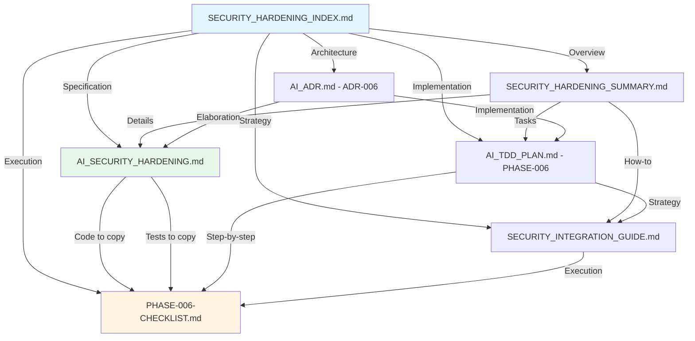

# Security Hardening Documentation Index

**Phase:** PHASE-006 - Security Hardening & Encryption at Rest
**Status:** ✅ Documentation Complete | ⏳ Implementation Pending
**Last Updated:** 2025-10-03

---

## Quick Start (Choose Your Path)

### 🎯 **I Want to Understand the Feature**

→ Start with: [`SECURITY_HARDENING_SUMMARY.md`](./SECURITY_HARDENING_SUMMARY.md)
⏱️ 5-10 minutes reading time

### 📋 **I Want to Implement This**

→ Start with: [`PHASE-006-CHECKLIST.md`](./PHASE-006-CHECKLIST.md)
⏱️ Follow step-by-step (20-26 hours total)

### 🏗️ **I Need Architectural Context**

→ Start with: [`AI_ADR.md`](./AI_ADR.md#ai_adr-006--optional-security-hardening-with-tpm-backed-encryption-at-rest)
⏱️ 5 minutes reading time

### 🔬 **I Need Technical Specifications**

→ Start with: [`AI_SECURITY_HARDENING.md`](./AI_SECURITY_HARDENING.md)
⏱️ 30-45 minutes reading time

### 🛠️ **I Need Integration Guidance**

→ Start with: [`SECURITY_INTEGRATION_GUIDE.md`](./SECURITY_INTEGRATION_GUIDE.md)
⏱️ 15-20 minutes reading time

---

## Document Map

```
Security Hardening Documentation
│
├── SECURITY_HARDENING_INDEX.md (← YOU ARE HERE)
│   └─→ Navigation and quick links
│
├── SECURITY_HARDENING_SUMMARY.md
│   ├─→ Executive summary
│   ├─→ What was done
│   ├─→ What's next
│   ├─→ Risk assessment
│   └─→ Timeline estimates
│
├── AI_SECURITY_HARDENING.md (SPECIFICATION)
│   ├─→ 1. Executive Summary
│   ├─→ 2. Threat Model
│   ├─→ 3. Hardening Priorities (15 items)
│   ├─→ 4. Implementation Constraints
│   ├─→ 5. Reference Implementation
│   │   ├─→ 5.1 Cargo Dependencies
│   │   ├─→ 5.2 SecureDb Wrapper (Rust) ← COPY THIS
│   │   ├─→ 5.3 Container Deployment ← COPY THIS
│   │   └─→ 5.4 Example Usage
│   ├─→ 6. Generator Integration Strategy
│   ├─→ 7. Testing Strategy (TDD)
│   │   ├─→ 7.1 Unit Tests ← COPY THIS
│   │   ├─→ 7.2 Integration Tests ← COPY THIS
│   │   └─→ 7.3 Security Tests ← COPY THIS
│   ├─→ 8. Documentation Requirements
│   ├─→ 9. Rollback & Contingency
│   ├─→ 10. Success Metrics
│   ├─→ 11. References
│   └─→ 12. Appendices
│
├── AI_ADR.md (ARCHITECTURE DECISIONS)
│   └─→ AI_ADR-006: TPM-backed encryption decision
│       ├─→ Status: Accepted
│       ├─→ Decision rationale
│       ├─→ Alternatives considered
│       ├─→ Consequences (positive/negative)
│       └─→ Success metrics
│
├── AI_TDD_PLAN.md (IMPLEMENTATION PLAN)
│   └─→ PHASE-006: Security Hardening & Encryption at Rest
│       ├─→ Overview & dependencies
│       ├─→ TASK-013: Encrypted Sled Wrapper
│       │   ├─→ RED phase (failing tests)
│       │   ├─→ GREEN phase (implementation)
│       │   └─→ REFACTOR phase (quality)
│       ├─→ TASK-014: Security-Hardened Templates
│       │   ├─→ RED phase
│       │   ├─→ GREEN phase
│       │   └─→ REFACTOR phase
│       ├─→ TASK-015: Validation Suite
│       │   ├─→ RED phase
│       │   ├─→ GREEN phase
│       │   └─→ REFACTOR phase
│       └─→ Exit quality gates
│
├── SECURITY_INTEGRATION_GUIDE.md (STRATEGY)
│   ├─→ 1. Core Specification Documents
│   ├─→ 2. Integration Approach
│   │   ├─→ Phase 1: Documentation (COMPLETE)
│   │   └─→ Phase 2: Implementation (NEXT)
│   ├─→ 3. Code Reuse Summary
│   │   └─→ 330 lines to copy (22 hours saved!)
│   ├─→ 4. Feature Flag Strategy
│   ├─→ 5. Testing Strategy
│   ├─→ 6. Rollback Plan
│   ├─→ 7. Success Metrics
│   └─→ 8. Next Steps
│
└── PHASE-006-CHECKLIST.md (EXECUTION GUIDE)
    ├─→ Pre-implementation setup (30 min)
    ├─→ TASK-013 checklist (8-10 hours)
    │   ├─→ RED phase steps
    │   ├─→ GREEN phase steps
    │   └─→ REFACTOR phase steps
    ├─→ TASK-014 checklist (6-8 hours)
    │   ├─→ RED phase steps
    │   ├─→ GREEN phase steps
    │   └─→ REFACTOR phase steps
    ├─→ TASK-015 checklist (6-8 hours)
    │   ├─→ RED phase steps
    │   ├─→ GREEN phase steps
    │   └─→ REFACTOR phase steps
    ├─→ Exit quality gates
    ├─→ Rollback procedure
    └─→ Time tracking table
```

---

## Document Relationships



---

## Reading Paths by Role

### 👨‍💼 **Project Manager / Decision Maker**

**Goal:** Understand risk, timeline, and resource needs

1. [`SECURITY_HARDENING_SUMMARY.md`](./SECURITY_HARDENING_SUMMARY.md) - 10 min
    - What was done
    - Risk assessment
    - Timeline estimate
2. [`AI_ADR.md#ADR-006`](./AI_ADR.md#ai_adr-006--optional-security-hardening-with-tpm-backed-encryption-at-rest) - 5 min
    - Decision rationale
    - Alternatives considered
3. **Decision Point:** Approve implementation? (Low risk, 2-week timeline)

---

### 🏗️ **System Architect**

**Goal:** Validate architectural approach and crypto decisions

1. [`AI_ADR.md#ADR-006`](./AI_ADR.md#ai_adr-006--optional-security-hardening-with-tpm-backed-encryption-at-rest) - 5 min
    - High-level design
2. [`AI_SECURITY_HARDENING.md`](./AI_SECURITY_HARDENING.md) - 45 min
    - Section 2: Threat Model
    - Section 3: Hardening Priorities
    - Section 4: Crypto Decisions
    - Appendix B: Threat Mitigation Matrix
    - Appendix C: Comparison with Alternatives
3. **Validation:** Crypto primitives sound? Threat model complete?

---

### 👨‍💻 **Implementing Developer (Agent A, B, or C)**

**Goal:** Complete assigned task with TDD discipline

1. [`PHASE-006-CHECKLIST.md`](./PHASE-006-CHECKLIST.md) - **PRIMARY REFERENCE**
    - Find your task (TASK-013, 014, or 015)
    - Follow RED → GREEN → REFACTOR checklist
2. [`AI_SECURITY_HARDENING.md`](./AI_SECURITY_HARDENING.md) - **CODE SOURCE**
    - Section 5.2: Copy SecureDb implementation
    - Section 5.3: Copy Dockerfile/compose
    - Section 7: Copy test cases
3. [`AI_TDD_PLAN.md#PHASE-006`](./AI_TDD_PLAN.md#phase-006--security-hardening--encryption-at-rest)
    - Understand task dependencies
    - Check exit quality gates
4. **Execute:** Follow checklist, copy code, run tests, refactor

---

### 🔬 **Security Reviewer**

**Goal:** Validate security properties and threat mitigation

1. [`AI_SECURITY_HARDENING.md`](./AI_SECURITY_HARDENING.md)
    - Section 2: Threat Model - Complete?
    - Section 4: Crypto Decisions - Sound?
    - Section 7.3: Security Tests - Comprehensive?
    - Appendix B: Threat Mitigation Matrix - All threats covered?
2. Review implementation (post-TASK-013):
    - `libs/security/src/secure_db.rs` - Matches specification?
    - Tests pass? Nonce handling correct?
    - Zeroization verified?
3. **Sign-off:** Security approach approved for production?

---

### 🧪 **QA / Tester**

**Goal:** Validate functionality and performance

1. [`AI_SECURITY_HARDENING.md`](./AI_SECURITY_HARDENING.md)
    - Section 7: Testing Strategy - Understand test categories
    - Section 10: Success Metrics - Know acceptance criteria
2. [`PHASE-006-CHECKLIST.md`](./PHASE-006-CHECKLIST.md)
    - Exit Quality Gates section - Test checklist
3. **Execution:**
    - Run unit tests (TASK-013)
    - Run integration tests (TASK-014)
    - Run validation suite (TASK-015)
    - Verify performance < 5% overhead
    - Verify binary size < 2MB increase

---

## Key Concepts Quick Reference

### Cryptographic Stack

-   **AEAD Cipher:** XChaCha20-Poly1305 (192-bit nonce, nonce-misuse resistant)
-   **KDF:** HKDF-SHA256 (domain separation: `db-key`, `audit-key`, `transport-key`)
-   **Master Key:** 256-bit, TPM-sealed or file-based
-   **Nonce Scheme:** 64-bit counter + 128-bit DB UUID = 192-bit unique nonce
-   **Storage:** `[24-byte nonce || ciphertext || 16-byte auth tag]` per record

### Feature Flags

```yaml
enable_security_hardening: false # Default = OFF (zero impact)
encryption_backend: "xchacha20poly1305" # or "aes256gcm"
tpm_enabled: false # TPM sealing optional
```

### Performance Targets

-   **Encryption overhead:** < 5%
-   **Binary size increase:** < 2MB
-   **Memory overhead:** < 10MB
-   **Startup time:** < 100ms (TPM unseal + DB open)

### TDD Workflow

1. **RED:** Write failing tests (1 hour per task)
2. **GREEN:** Implement minimal code to pass (3-6 hours per task)
3. **REFACTOR:** Improve quality, maintain green (2-3 hours per task)

---

## Code Reuse Map

| What You Need               | Where to Find It                | Action                                       |
| --------------------------- | ------------------------------- | -------------------------------------------- |
| **SecureDb implementation** | `AI_SECURITY_HARDENING.md` §5.2 | Copy → `libs/security/src/secure_db.rs`      |
| **Cargo dependencies**      | `AI_SECURITY_HARDENING.md` §5.1 | Copy → `libs/security/Cargo.toml`            |
| **Dockerfile**              | `AI_SECURITY_HARDENING.md` §5.3 | Copy → `templates/.../Dockerfile.j2`         |
| **docker-compose.yml**      | `AI_SECURITY_HARDENING.md` §5.3 | Copy → `templates/.../docker-compose.yml.j2` |
| **Unit tests**              | `AI_SECURITY_HARDENING.md` §7.1 | Copy → `libs/security/tests/unit/`           |
| **Integration tests**       | `AI_SECURITY_HARDENING.md` §7.2 | Copy → `tests/integration/security/`         |
| **Security tests**          | `AI_SECURITY_HARDENING.md` §7.3 | Copy → `tests/security/`                     |

**Total lines to copy:** ~330
**Hours saved:** ~22 hours (vs. writing from scratch)

---

## Common Questions

### Q: Where do I start?

**A:** Read [`SECURITY_HARDENING_SUMMARY.md`](./SECURITY_HARDENING_SUMMARY.md) (10 min), then jump to your role-specific path above.

### Q: Which document has the code I need to copy?

**A:** [`AI_SECURITY_HARDENING.md`](./AI_SECURITY_HARDENING.md) has all reference implementations in Section 5 and all test cases in Section 7.

### Q: How do I implement TASK-013?

**A:** Follow [`PHASE-006-CHECKLIST.md`](./PHASE-006-CHECKLIST.md) step-by-step. It has checkboxes for every action.

### Q: What are the success criteria?

**A:** See [`AI_TDD_PLAN.md#PHASE-006`](./AI_TDD_PLAN.md#phase-006--security-hardening--encryption-at-rest) "Exit Quality Gates" section.

### Q: How do I roll back if something goes wrong?

**A:** See [`PHASE-006-CHECKLIST.md`](./PHASE-006-CHECKLIST.md) "Rollback Triggers & Procedure" section (5-minute rollback).

### Q: Is this production-ready?

**A:** The specification is production-grade. Implementation will be validated through TDD, security audits, and benchmarks before production use.

---

## Status Dashboard

| Deliverable                      | Status      | Completion Date |
| -------------------------------- | ----------- | --------------- |
| **Documentation**                |             |                 |
| AI_SECURITY_HARDENING.md         | ✅ Complete | 2025-10-03      |
| AI_ADR-006                       | ✅ Complete | 2025-10-03      |
| AI_TDD_PLAN PHASE-006            | ✅ Complete | 2025-10-03      |
| SECURITY_INTEGRATION_GUIDE.md    | ✅ Complete | 2025-10-03      |
| PHASE-006-CHECKLIST.md           | ✅ Complete | 2025-10-03      |
| SECURITY_HARDENING_SUMMARY.md    | ✅ Complete | 2025-10-03      |
| SECURITY_HARDENING_INDEX.md      | ✅ Complete | 2025-10-03      |
| **Implementation**               |             |                 |
| TASK-013: Encrypted Sled Wrapper | ⏳ Pending  | -               |
| TASK-014: Security Templates     | ⏳ Pending  | -               |
| TASK-015: Validation Suite       | ⏳ Pending  | -               |
| **Integration**                  |             |                 |
| Generated Project Validation     | ⏳ Pending  | -               |
| Performance Benchmarks           | ⏳ Pending  | -               |
| Security Audit                   | ⏳ Pending  | -               |

---

## Next Actions

### For Project Stakeholders

1. ✅ Review [`SECURITY_HARDENING_SUMMARY.md`](./SECURITY_HARDENING_SUMMARY.md)
2. ✅ Approve architecture via [`AI_ADR.md#ADR-006`](./AI_ADR.md#ai_adr-006--optional-security-hardening-with-tpm-backed-encryption-at-rest)
3. ⏳ Assign agents to tasks (A → TASK-013, B → TASK-014, C → TASK-015)

### For Implementing Agents

1. ⏳ Read [`PHASE-006-CHECKLIST.md`](./PHASE-006-CHECKLIST.md)
2. ⏳ Update `copier.yml` (add 3 feature flags)
3. ⏳ Start TASK-013 RED phase (create failing tests)

---

## Document Maintenance

**Owner:** AI Agent Coordination System
**Review Cycle:** After each task completion
**Update Trigger:** Specification changes, new requirements, rollback events
**Archive Location:** `docs/aiassist/completed/` (after PHASE-006 complete)

---

**Last Updated:** 2025-10-03
**Next Review:** After TASK-013 completion
**Version:** 1.0.0
