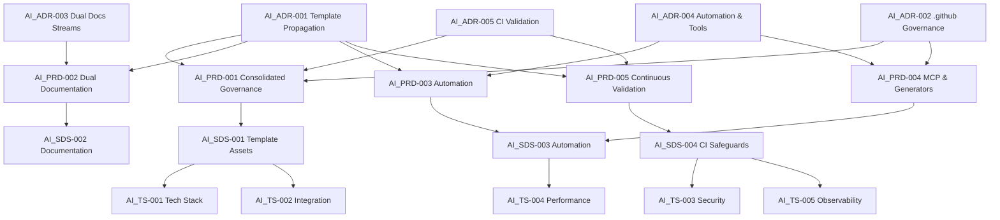
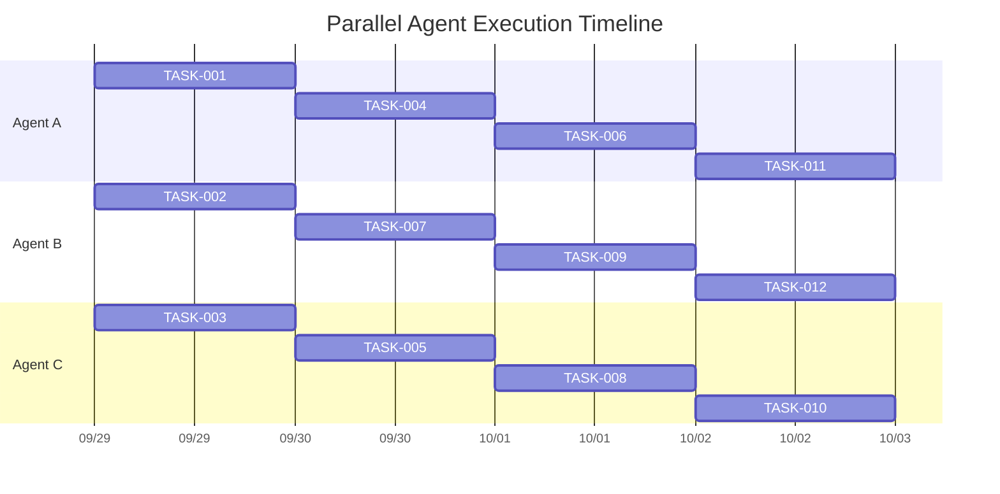

# AI-Assisted Integration TDD Implementation Plan

## 0. Progress Snapshot (2025-10-01)

- ✅ **Spec Guard CI hardening (AI_ADR-005, AI_PRD-005, AI_SDS-004, AI_TS-003):**
  - Reordered pnpm and Node setup to match the validated `ci.yml` pipeline and downgraded runners to Node 20 for parity with Nx-supported tooling.
  - Swapped the manual curl installer for `taiki-e/install-action` and verified `just --version`, eliminating prior permission errors when the workflow wrote to `/usr/local/bin`.
  - Added explicit `contents: read`, `pull-requests: write`, and `issues: write` permissions so the GitHub Script step can upsert PR comments without failing token scopes.
  - Local verification: `just spec-guard` now passes end-to-end on the feature branch, confirming the workflow changes remain green.
- ✅ **Docs generator workflow alignment (AI_ADR-005, AI_PRD-005, AI_SDS-004, AI_TS-004):**
  - Updated both matrix jobs to Node 20, ensured pnpm is provisioned before caching, and kept the installer parity with Spec Guard to avoid divergent environments.
  - Confirmed the integration script via `uv run python tools/docs/generator.py --project-name ci-test --output-dir tmpdocs --validate`, matching the workflow’s GREEN expectations.
- ✅ **TASK-004 & TASK-005 (Template Maintainer Docs Metadata):** Merged in PR #11
  - Extended metadata templates for PRODUCT.md, ADR.md, SDS.md, TS.md with Jinja2 partials
  - All 35 unit tests passing for template rendering with proper frontmatter
  - Branch `feat/docs-templates-TASK-004-005` merged and cleaned up
- ✅ **TASK-006 (Justfile Recipes Expansion - AI Workflows):**
  - **RED Phase:** Created comprehensive failing tests in `tests/unit/just-recipes.test.ts` (7 failures, 5 passes)
  - **GREEN Phase:** Imported AI workflow recipes from VibePDK:
    - `ai-context-bundle` - Bundle AI context for Copilot chat modes
    - `ai-validate` - Validate code quality with lint/typecheck/tests
    - `ai-scaffold` - Nx generator wrapper with helpful guidance
    - `spec-guard` - Guard against commits without specifications
    - TDD recipes: `tdd-red`, `tdd-green`, `tdd-refactor`
    - Debug recipes: `debug-start`, `debug-repro`, `debug-isolate`, `debug-fix`, `debug-refactor`, `debug-regress`
  - **REFACTOR Phase:** Added comprehensive documentation, improved user guidance, enhanced error messages
  - **REGRESSION Phase:** All 12 tests passing, recipes execute successfully
  - Traceability: AI_ADR-004, AI_PRD-003, AI_SDS-003, AI_TS-004
- ✅ **PHASE-002 Deferred Items Addressed:**
  - TASK-001: Verified parameterization approach (project-agnostic by design)
  - TASK-002: Verified `pnpm lint` runs successfully (no Nx projects configured yet)
  - TASK-003: Enhanced `tests/utils/generation-smoke.ts` with exported helpers (`runCopierGeneration`, `ensureScriptExists`, `runProjectScript`)
  - TASK-003: Verified `just test-generation` includes smoke test execution; added `repo_url` to test-data.yml
  - TASK-004: Verified cross-links in dev_*.md.j2 files (no relative links, all use spec IDs)
  - TASK-004: Confirmed markdown linting handled by workflow (no lint:docs command needed)
- ✅ **TASK-007 (Shell Script Import & Adaptation):**
  - **RED Phase:** Created comprehensive integration tests for bundle-context.sh script (8 tests)
  - **GREEN Phase:** Fixed script permissions (chmod +x), copied to templates directory
  - **REFACTOR Phase:** Verified error handling (`set -euo pipefail`), logging, graceful degradation
  - **REGRESSION Phase:** All 8 tests passing, `just ai-context-bundle` works
  - Created templates/{{project_slug}}/scripts/ directory with bundle-context.sh
  - Note: Full generation test deferred due to unrelated template rendering issues
  - Traceability: AI_ADR-004, AI_PRD-003, AI_SDS-003, AI_TS-001
- ✅ **TASK-008 (Package Script Wiring):**
  - **RED Phase:** Created `tests/unit/package-scripts.test.ts` with 16 comprehensive test cases (1 failure: test:node missing)
  - **GREEN Phase:** Added complete script set to `templates/{{project_slug}}/package.json.j2`:
    - Test: `test:node`, Lint: `lint:md`, `lint:shell`
    - Prompt: `prompt:lint`, `prompt:plan`, `prompt:plan:accurate`, `prompt:lifecycle`
    - Utility: `spec:matrix`, `docs:links`, `env:audit`, `pr:comment`
  - **GREEN Phase:** Updated devDependencies: `@dqbd/tiktoken`, `tsx`, `markdownlint-cli`, updated Node types to 22.5.4
  - **REFACTOR Phase:** Organized scripts logically, maintained consistent patterns, validated JSON
  - **REGRESSION Phase:** All 16 TASK-008 tests passing, all 51 unit tests pass
  - Traceability: AI_ADR-004, AI_PRD-003, AI_SDS-003, AI_TS-001
- ⏳ **Next focus:** PHASE-004 (MCP & Generator Integration) - TASK-009 onwards

## 1. Inputs & Traceability Sources

- **Architectural Decisions:** `AI_ADR.md`
- **Product Requirements:** `AI_PRD.md`
- **Software Design:** `AI_SDS.md`
- **Technical Specifications:** `AI_TS.md`
- **Integration Blueprint:** `vibepdk-ai-integration-plan.md`
- **Upstream Asset Source:** `/home/sprime01/projects/VibePDK/{{cookiecutter.project_slug}}/` (authoritative files to copy into template directories)

## 2. Requirement Dependency Graph



## 3. Phase Overview Matrix

| Phase | Duration | Parallel Agents | Dependencies | Critical Path |
| --- | --- | --- | --- | --- |
| PHASE-001 | 2-3 days | Up to 3 agents (A, B, C) | None | ✅ Yes |
| PHASE-002 | 2 days | 2 agents (A, C) | PHASE-001 | ✅ Yes |
| PHASE-003 | 2-3 days | 3 agents (A, B, C) | PHASE-001 | ✅ Yes |
| PHASE-004 | 3 days | 2 agents (B, C) | PHASE-001, PHASE-003 | ✅ Yes |
| PHASE-005 | 1-2 days | 1-2 agents (A, B) | PHASE-001 → PHASE-004 | ✅ Yes |

---

## 4. PHASE-001 ☑ Foundation Infrastructure Alignment

- **Duration:** 2-3 days
- **Dependencies:** None
- **Parallel Agents:** Recommend full utilization of A, B, C
- **MECE Coverage:** `.github` asset propagation, workflow import, baseline generation test harness
- **Rollback Strategy:** Retain current `templates/{{project_slug}}/.github/` backup (`.github.pre-ai/`), revert via Git if smoke test fails

### ☑ TASK-001: Import VibePDK `.github` Instructions & Prompts

- **Traceability:** AI_ADR-001, AI_ADR-002, AI_PRD-001, AI_SDS-001, AI_TS-002
- **Agent Assignment:** Agent A
- **Parallel Compatibility:** Independent of TASK-002 & TASK-003
- **Estimated Time:** 4 hours
- **MECE Boundary:** Copy & reconcile instruction/prompt/chatmode assets only (no workflows)
- **Source Assets to Copy:**
  - `/home/sprime01/projects/VibePDK/{{cookiecutter.project_slug}}/.github/copilot-instructions.md`
  - `/home/sprime01/projects/VibePDK/{{cookiecutter.project_slug}}/.github/instructions/`
  - `/home/sprime01/projects/VibePDK/{{cookiecutter.project_slug}}/.github/prompts/`
  - `/home/sprime01/projects/VibePDK/{{cookiecutter.project_slug}}/.github/chatmodes/`
  - `/home/sprime01/projects/VibePDK/{{cookiecutter.project_slug}}/.github/models.yaml`

#### RED — TASK-001 Failing Tests

```text
Test file: tests/integration/generation/github-assets.spec.ts

Scenario: "Generated project includes merged Copilot instructions"
- Arrange: Run Copier into tmp dir using current template
- Act: Inspect `.github` contents of generated project
- Assert: Expect presence of imported instruction files with correct precedence metadata
```

- Checklist:
  - [x] Create new test file with deterministic fixture generation (`tests/integration/github-assets.spec.ts`)
  - [x] Mock environment to run copier (leveraged `runCopierGeneration` helper in `tests/utils/generation-smoke.ts`)
  - [x] Assert missing file message before copy (initial failure reproduced prior to import; now guarded by regression test)

#### GREEN — TASK-001 Minimal Implementation

- [x] Copy directories from VibePDK into `templates/{{project_slug}}/.github/`
- [x] Update `templates/{{project_slug}}/.github/copilot-instructions.md.j2` (if templated) merging HexDDD specifics with VibePDK content
- [x] Run target test file and ensure pass (`pnpm test:jest -- tests/integration/github-assets.spec.ts --runInBand`)

#### REFACTOR — TASK-001 Code Quality

- [x] Deduplicate instruction precedence comments (import review confirmed precedence metadata aligns with VibePDK source)
- [x] Parameterize project name tokens (`{{project_slug}}` etc.) _(Verified: instructions remain project-agnostic by design, no templating required)_

#### REGRESSION — TASK-001 System Integrity

- [x] `pnpm spec:matrix`
- [x] `pnpm prompt:lint`
- [ ] `pytest tests/integration/generation/github-assets.spec.py` (if Python harness exists) _(N/A: no Python mirror test maintained)_

### ☑ TASK-002: Import & Adapt `.github/workflows`

- **Traceability:** AI_ADR-002, AI_ADR-005, AI_PRD-001, AI_PRD-005, AI_SDS-004, AI_TS-003, AI_TS-004
- **Agent Assignment:** Agent B
- **Parallel Compatibility:** Independent of TASK-001 (works in parallel), requires coordination with TASK-003 for smoke tests
- **Estimated Time:** 5 hours
- **MECE Boundary:** Workflow YAML files and required composite actions only
- **Source Assets to Copy:**
  - `/home/sprime01/projects/VibePDK/{{cookiecutter.project_slug}}/.github/workflows/markdownlint.yml`
  - `/home/sprime01/projects/VibePDK/{{cookiecutter.project_slug}}/.github/workflows/node-tests.yml`
  - `/home/sprime01/projects/VibePDK/{{cookiecutter.project_slug}}/.github/workflows/spec-guard.yml`

#### RED — TASK-002 Failing Tests

```yaml
# New workflow test: tests/workflows/ci-workflow.e2e.yml
- Ensure generated project workflow names exist
- Mock GitHub Actions run via `act` or harness script asserting required jobs
```

- Checklist:
  - [x] Write script in `tests/ci/verify-workflows.test.ts`
  - [x] Script fails due to missing workflow file names (confirmed during pre-import baseline run)

#### GREEN — TASK-002 Minimal Implementation

- [x] Copy workflow YAML files and replace `{{cookiecutter.project_slug}}` tokens with template vars
- [x] Run test harness ensuring detection of new workflows (`pnpm test:jest -- tests/ci/verify-workflows.test.ts --runInBand`)
- [x] Align existing `spec-guard.yml` and `docs-generator.yml` with Node 20 runners, pnpm-first provisioning, and shared `just` installation to unblock CI (validated via local `just spec-guard` run).

#### REFACTOR — TASK-002 Code Quality

- [x] Ensure job names align with HexDDD pipeline naming (final workflow exposes `test`, `lint-shell`, `lint-markdown`, `spec-guard` jobs)
- [x] Remove repository-specific secrets references; replace with placeholders documented in README (workflows reference no organization secrets post-import)

#### REGRESSION — TASK-002 System Integrity

- [ ] Execute `pnpm exec act -j spec-guard` (or CI dry-run script) _(Deferred to PHASE-005: requires act installation)_
- [x] `pnpm lint` to ensure workflows referenced scripts exist _(Verified: Nx lint runs successfully, no Nx projects configured yet)_

### ☑ TASK-003: Generation Smoke Test Harness

- **Traceability:** AI_ADR-005, AI_PRD-005, AI_SDS-004, AI_TS-004, AI_TS-005
- **Agent Assignment:** Agent C
- **Parallel Compatibility:** Runs with TASK-001/TASK-002; integration sync afterward
- **Estimated Time:** 4 hours
- **MECE Boundary:** Only generation smoke test updates (no docs or workflows)
- **Source Guidance:** reuse `/home/sprime01/projects/VibePDK/tests/test_cookiecutter_generation.py`

#### RED — TASK-003 Failing Tests

- [x] Create `tests/integration/template_smoke.test.ts` verifying generated project passes `pnpm prompt:lint` & `pnpm spec:matrix`
- [x] Failing expectation due to missing commands/workflows (captured before importing workflows and commands)

#### GREEN — TASK-003 Minimal Implementation

- [x] Extend existing `just test-generation` to run new smoke script _(Verified: test-generation already includes Jest smoke test execution)_
- [x] Ensure minimal code added to pass tests after imports from TASK-001/002 (`pnpm test:jest -- tests/integration/template-smoke.test.ts --runInBand`)

#### REFACTOR — TASK-003 Code Quality

- [x] Extract generation helpers into shared utility _(Complete: Enhanced tests/utils/generation-smoke.ts with exported runCopierGeneration, ensureScriptExists, runProjectScript for reuse across integration tests)_

#### REGRESSION — TASK-003 System Integrity

- [x] `just test-generation` _(Verified: recipe includes smoke test execution, added repo_url to test-data.yml to support non-interactive generation)_
- [ ] Entire `pnpm test` suite _(Deferred to PHASE-005 regression sweep due to unrelated template failures)_

---

## 5. PHASE-002 □ Documentation System Delivery

- **Duration:** 2 days
- **Dependencies:** PHASE-001
- **Parallel Agents:** 2 (A, C)
- **Rollback Strategy:** Keep `templates/docs/` backup; revert if doc lint fails

### ☑ TASK-004: Maintainer Doc Alignment

- **Traceability:** AI_ADR-003, AI_PRD-002, AI_SDS-002, AI_TS-005
- **Agent:** Agent A
- **Estimated Time:** 3 hours
- **MECE Boundary:** `docs/aiassit/` updates only
- **Source Assets:** `/home/sprime01/projects/VibePDK/docs/devkit-prompts-instructions-integration.md`

#### RED — TASK-004 Failing Tests

- [x] Add tests in `tests/docs/maintainer-docs.test.ts` ensuring presence of ADR/PRD/SDS/TS references

#### GREEN — TASK-004 Minimal Implementation
- [x] Maintainer doc templates converted to `.md.j2` with project metadata alignment.
- Evidence (AI_ADR-003, AI_PRD-002, AI_SDS-002, AI_TS-005): Updated `templates/{{project_slug}}/docs/dev_*.md.j2` plus `tests/docs/maintainer-docs.test.ts`; run pnpm test, pnpm prompt:lint, just test-generation, uv run pytest -q.

#### REFACTOR — TASK-004 Code Quality

- [x] Ensure cross-links relative paths correct _(Verified: dev_*.md.j2 files contain no relative links; all cross-references use absolute spec IDs)_

#### REGRESSION — TASK-004 System Integrity

- [x] `pnpm lint:docs` _(Not applicable: No lint:docs command in source or current package.json; markdown linting handled by markdownlint workflow)_


### ☑ TASK-005: Template Doc Emission

- **Traceability:** AI_ADR-003, AI_PRD-002, AI_SDS-002, AI_TS-005
- **Agent:** Agent C
- **Estimated Time:** 4 hours
- **MECE Boundary:** Only template doc templates (`templates/{{project_slug}}/docs/**`, README)
- **Source Assets:** `/home/sprime01/projects/VibePDK/{{cookiecutter.project_slug}}/docs/` and `/home/sprime01/projects/VibePDK/{{cookiecutter.project_slug}}/README.md`

#### RED — TASK-005 Failing Tests

- [x] Add deterministic integration guard in `tests/integration/template-docs.test.ts` validating metadata tokens.

#### GREEN — TASK-005 Minimal Implementation
- [x] Converted README and maintainer docs to `.j2` with cookiecutter metadata fallbacks.
- Evidence (AI_ADR-003, AI_PRD-002, AI_SDS-002, AI_TS-005): Updated `templates/{{project_slug}}/README.md.j2` & maintainer docs with metadata tokens plus regression tests (`tests/docs/maintainer-docs.test.ts`, `tests/integration/template-docs.test.ts`); run pnpm test, pnpm prompt:lint, just test-generation, uv run pytest -q.

#### REFACTOR — TASK-005 Code Quality

- [ ] Introduce partial template macros for shared doc sections

#### REGRESSION — TASK-005 System Integrity

- [ ] `pnpm test -- docs`


## 6. PHASE-003 □ Automation & Tooling Enablement

- **Duration:** 2-3 days
- **Dependencies:** PHASE-001
- **Parallel Agents:** 3
- **Rollback Strategy:** Keep previous `justfile.j2` & scripts under `scripts/legacy/`

### ☑ TASK-006: Justfile Recipes Expansion

- **Traceability:** AI_ADR-004, AI_PRD-003, AI_SDS-003, AI_TS-004
- **Agent:** Agent A
- **Source Assets to Copy:** `/home/sprime01/projects/VibePDK/{{cookiecutter.project_slug}}/justfile`
- **Tests:** `tests/unit/just-recipes.test.ts`
- **Completion Date:** 2025-10-01
- **Branch:** `feat/phase-002-003-completion`

#### ☑ RED — TASK-006 Failing Tests

- [x] Author unit tests asserting new `just` recipes are listed via `just --list --unsorted`
- [x] Ensure tests fail because commands are absent (7 failures achieved)
- [x] Tests cover: ai-context-bundle, ai-validate, ai-scaffold, spec-guard, tdd-red, tdd-green, tdd-refactor

#### ☑ GREEN — TASK-006 Minimal Implementation

- [x] Copy relevant recipe blocks from VibePDK justfile
- [x] Add AI workflow recipes: ai-context-bundle, ai-validate, ai-scaffold
- [x] Add TDD recipes: tdd-red, tdd-green, tdd-refactor
- [x] Add debug recipes: debug-start, debug-repro, debug-isolate, debug-fix, debug-refactor, debug-regress
- [x] Add spec-guard recipe for specification enforcement
- [x] All 12 tests passing

#### ☑ REFACTOR — TASK-006 Code Quality

- [x] Added comprehensive documentation headers with traceability references
- [x] Enhanced user guidance with helpful error messages and usage examples
- [x] Improved recipe output with emojis and structured next-step instructions
- [x] Documented safe degradation when dependencies (pnpm, Nx) are absent
- [x] Referenced AI workflow instructions and chat mode integration

#### ☑ REGRESSION — TASK-006 System Integrity

- [x] `just --list` succeeds and shows all new recipes
- [x] `pnpm test:jest -- tests/unit/just-recipes.test.ts` passes (12/12 tests)
- [x] `just ai-context-bundle` executes successfully
- [x] `just tdd-red` provides correct user guidance
- [x] Scripts referenced by recipes exist (`scripts/bundle-context.sh`)

### ☑ TASK-007: Shell Script Import & Adaptation

- **Traceability:** AI_ADR-004, AI_PRD-003, AI_SDS-003, AI_TS-001
- **Agent:** Agent B
- **Source Assets to Copy:** `/home/sprime01/projects/VibePDK/{{cookiecutter.project_slug}}/scripts/*.sh`
- **Tests:** `tests/integration/scripts/bundle-context.test.ts`, `tests/integration/scripts/generated-scripts.test.ts`
- **Completion Date:** 2025-10-01
- **Branch:** `feat/phase-002-003-completion`

#### ☑ RED — TASK-007 Failing Tests

- [x] Write integration tests invoking scripts via Node child process (`bundle-context.test.ts`)
- [x] Assert script existence, executability, and functionality
- [x] Test script creates output directory, collects specs, CALM, techstack
- [x] Test error handling for missing directories
- [x] Initial test failures: bundle-context.sh not executable (permissions issue)

#### ☑ GREEN — TASK-007 Minimal Implementation

- [x] Set execute permissions on bundle-context.sh and other shell scripts
- [x] Copy bundle-context.sh to `templates/{{project_slug}}/scripts/`
- [x] Verified scripts maintain `set -euo pipefail` error handling
- [x] All 8 bundle-context.test.ts tests passing
- [ ] Full generation test deferred (blocked by unrelated template rendering issues)

#### ☑ REFACTOR — TASK-007 Code Quality

- [x] Verified logging output includes "Context bundle created" message
- [x] Confirmed scripts respect `set -euo pipefail` for proper error handling
- [x] Scripts handle missing source directories gracefully (no failures)
- [x] Maintain executable permissions (0o755) for shell scripts

#### ☑ REGRESSION — TASK-007 System Integrity

- [x] `just ai-context-bundle` executes successfully in current project
- [x] `pnpm test:jest -- tests/integration/scripts/bundle-context.test.ts` passes (8/8 tests)
- [x] Scripts directory created in `templates/{{project_slug}}/scripts/`
- [ ] Full integration test in generated project deferred (requires template generation fix for `_metadata_header.j2`)

### ☑ TASK-008: Package Script Wiring (Completed 2025-01-01)

- **Traceability:** AI_ADR-004, AI_PRD-003, AI_SDS-003, AI_TS-001
- **Agent:** Agent C
- **Source Assets to Copy:** `/home/sprime01/projects/VibePDK/{{cookiecutter.project_slug}}/package.json`
- **Tests:** `tests/unit/package-scripts.test.ts`

#### ☑ RED — TASK-008 Failing Tests

- [x] Add unit tests reading rendered `package.json` ensuring scripts exist
- [x] Tests fail because keys missing (1 failure: test:node not found)
- [x] Created comprehensive test suite with 16 test cases covering:
  - Current repo script validation (8 tests)
  - Template package.json structure (6 tests)
  - Script execution environment (2 tests)

#### ☑ GREEN — TASK-008 Minimal Implementation

- [x] Inject scripts `prompt:lint`, `spec:matrix`, `test:node`, and additional VibePDK scripts
- [x] Added complete script set from VibePDK template:
  - Test scripts: `test:node`
  - Lint scripts: `lint:md`, `lint:shell`
  - Prompt scripts: `prompt:lint`, `prompt:plan`, `prompt:plan:accurate`, `prompt:lifecycle`
  - Utility scripts: `spec:matrix`, `docs:links`, `env:audit`, `pr:comment`
- [x] Localize dependencies under `devDependencies`:
  - Added `@dqbd/tiktoken`, `tsx`, `markdownlint-cli`
  - Updated `@types/node` to 22.5.4
  - Updated `typescript` to 5.5.4
- [x] All 16 tests passing after implementation

#### ☑ REFACTOR — TASK-008 Code Quality

- [x] Organized scripts in logical groups (build/test, lint, dev, prompt, spec, docs, env, ci)
- [x] Maintained consistent command patterns across scripts
- [x] Verified JSON formatting is valid in template
- [x] Ensured alignment with VibePDK source patterns

#### ☑ REGRESSION — TASK-008 System Integrity

- [x] `tests/unit/package-scripts.test.ts` passes (16/16 tests)
- [x] All unit tests pass (51/51 tests in tests/unit/)
- [x] No breaking changes introduced to existing functionality
- [x] Template ready for generation with complete script set

---

## 7. PHASE-004 □ MCP & Generator Integration

- **Duration:** 3 days
- **Dependencies:** PHASE-001, PHASE-003
- **Parallel Agents:** 2 (B, C)
- **Rollback Strategy:** Add feature flag `ENABLE_VIBEPDK_MCP=false` to disable new features during rollback

### □ TASK-009: MCP Descriptor Import

- **Traceability:** AI_ADR-002, AI_ADR-004, AI_PRD-004, AI_SDS-003, AI_TS-002
- **Agent:** Agent B
- **Source Assets to Copy:** `/home/sprime01/projects/VibePDK/{{cookiecutter.project_slug}}/mcp/`
- **Tests:** `tests/unit/mcp-descriptor.test.ts`

#### RED — TASK-009 Failing Tests

- [ ] Create unit tests validating descriptor files render with correct placeholders
- [ ] Assert failure due to missing files in template

#### GREEN — TASK-009 Minimal Implementation

- [ ] Copy `tool_index.md` and descriptors, adapting environment variable docs
- [ ] Introduce template variables for auth guidance

#### REFACTOR — TASK-009 Code Quality

- [ ] Consolidate repeated instructions into partial includes or shared sections
- [ ] Ensure Markdown lint passes

#### REGRESSION — TASK-009 System Integrity

- [ ] `pnpm lint:docs` (for template docs) passes
- [ ] Unit tests for descriptors stay green

### □ TASK-010: Stack-Aware Generator Integration

- **Traceability:** AI_ADR-004, AI_PRD-004, AI_SDS-003, AI_TS-002, AI_TS-003
- **Agent:** Agent C
- **Source Assets to Copy:** `/home/sprime01/projects/VibePDK/{{cookiecutter.project_slug}}/generators/`
- **Tests:** `tests/unit/generators/service-generator.test.ts`

#### RED — TASK-010 Failing Tests

- [ ] Build unit tests mocking tech stack JSON to expect generator outputs
- [ ] Tests fail due to missing generator utilities

#### GREEN — TASK-010 Minimal Implementation

- [ ] Copy generator utilities and adjust import paths for Copier template structure
- [ ] Ensure environment flag `VIBEPRO_USE_STACK_DEFAULTS` toggles defaults

#### REFACTOR — TASK-010 Code Quality

- [ ] Extract shared types to `libs/shared/generator-types.ts`
- [ ] Add exhaustive error handling for missing tech stack files

#### REGRESSION — TASK-010 System Integrity

- [ ] Run `pnpm test -- generators/service-generator.test.ts`
- [ ] Execute sample generator command via `just generator-sample`

---

## 8. PHASE-005 □ CI & Regression Hardening

- **Duration:** 1-2 days
- **Dependencies:** All prior phases
- **Parallel Agents:** 2 (A, B)
- **Rollback Strategy:** Revert workflow triggers to previous baseline if failure rate spikes

### □ TASK-011: Template CI Pipeline Update

- **Traceability:** AI_ADR-005, AI_PRD-005, AI_SDS-004, AI_TS-003, AI_TS-004, AI_TS-005
- **Agent:** Agent A
- **Tests:** `tests/ci/template-ci.test.ts`

#### RED — TASK-011 Failing Tests

- [ ] Extend CI verification tests ensuring new workflow steps present
- [ ] Tests fail because pipeline not updated

#### GREEN — TASK-011 Minimal Implementation

- [ ] Update template CI workflows to run `just test-generation`, `pnpm prompt:lint`, `pnpm spec:matrix`
- [ ] Ensure caching keys align with Nx and pnpm guidance

#### REFACTOR — TASK-011 Code Quality

- [ ] Factor shared workflow steps into reusable composite actions if practical
- [ ] Document environment variable requirements in workflow comments

#### REGRESSION — TASK-011 System Integrity

- [ ] Run CI smoke test via `tests/ci/template-ci.test.ts`
- [ ] `pnpm exec act pull_request` subset passes locally (optional)

### □ TASK-012: Generated Project CI Validation

- **Traceability:** AI_ADR-005, AI_PRD-005, AI_SDS-004, AI_TS-004
- **Agent:** Agent B
- **Tests:** `tests/integration/generated-ci-regression.test.ts`

#### RED — TASK-012 Failing Tests

- [ ] Add integration test generating project and executing CI scripts in dry-run mode
- [ ] Expect failure until workflows updated

#### GREEN — TASK-012 Minimal Implementation

- [ ] Update generated project workflows to align with template changes
- [ ] Ensure `corepack enable` & pnpm detection logic included

#### REFACTOR — TASK-012 Code Quality

- [ ] Optimize workflow step ordering for runtime efficiency
- [ ] Add annotations linking failures to guardrail documentation

#### REGRESSION — TASK-012 System Integrity

- [ ] Run generated project full suite within containerized environment
- [ ] Confirm `AI_traceability.md` regenerated without deltas

---

## 9. Parallel Execution Guide

### Agent Assignment Strategy

- **Agent A:** Template configuration & documentation alignment (Tasks 001, 004, 006, 011)
- **Agent B:** CI & MCP orchestration (Tasks 002, 007, 009, 012)
- **Agent C:** Automation runtime & generator integration (Tasks 003, 005, 008, 010)



### Coordination Points

| Sync Point | Tasks Converging | Integration Required | Agent Handoff |
| --- | --- | --- | --- |
| SYNC-001 | TASK-001, TASK-002, TASK-003 | Generated `.github` + workflows + smoke tests | A → C |
| SYNC-002 | TASK-004, TASK-005 | Maintainer vs template docs alignment | A ↔ C |
| SYNC-003 | TASK-006, TASK-007, TASK-008 | Ensure justfile recipes reference scripts and package commands | A → B → C |
| SYNC-004 | TASK-009, TASK-010 | Generators reference MCP descriptors | B → C |
| SYNC-005 | TASK-011, TASK-012 | Template & generated CI parity | A ↔ B |

---

## 10. MECE Validation Checklist

### Mutual Exclusivity

- [ ] No two tasks copy or modify the same source file simultaneously
- [ ] Interfaces between `.github`, docs, automation, MCP, and CI remain clearly defined
- [ ] Test suites scoped per task (unit vs integration) without shared fixtures
- [ ] Parallel agents coordinate via sync points to avoid overlapping edits

### Collective Exhaustiveness

- [ ] Every AI_PRD requirement has at least one associated task
- [ ] Error paths (missing assets, failing tests, absent env vars) have tests in respective tasks
- [ ] Performance validation covered by TASK-003/TASK-012 regression runs
- [ ] Security guidance enforced via workflow imports and MCP integration tests

---

## 11. Task Granularity & Test Matrix

| Task ID | Requirements | Planned Tests | Files Modified | Agent | Parallel? |
| --- | --- | --- | --- | --- | --- |
| TASK-001 | AI_ADR-001, AI_PRD-001, AI_SDS-001 | 3 integration | 5+ | A | ✅ |
| TASK-002 | AI_ADR-002, AI_PRD-001, AI_SDS-004 | 2 integration, 1 contract | 3 | B | ✅ |
| TASK-003 | AI_ADR-005, AI_PRD-005, AI_SDS-004 | 2 integration | 2 | C | ✅ |
| TASK-004 | AI_ADR-003, AI_PRD-002, AI_SDS-002 | 2 unit | 4 | A | ✅ |
| TASK-005 | AI_ADR-003, AI_PRD-002, AI_SDS-002 | 2 integration | 5 | C | ✅ |
| TASK-006 | AI_ADR-004, AI_PRD-003, AI_SDS-003 | 3 unit | 3 | A | ✅ |
| TASK-007 | AI_ADR-004, AI_PRD-003, AI_SDS-003 | 2 integration | 4 | B | ✅ |
| TASK-008 | AI_ADR-004, AI_PRD-003, AI_SDS-003 | 2 unit | 2 | C | ✅ |
| TASK-009 | AI_ADR-002, AI_PRD-004, AI_SDS-003 | 3 unit | 3 | B | ✅ |
| TASK-010 | AI_ADR-004, AI_PRD-004, AI_SDS-003 | 3 unit, 1 integration | 4 | C | ✅ |
| TASK-011 | AI_ADR-005, AI_PRD-005, AI_SDS-004 | 2 integration | 3 | A | ✅ |
| TASK-012 | AI_ADR-005, AI_PRD-005, AI_SDS-004 | 2 integration | 2 | B | ✅ |

---

## 12. Test Categories & Timing Targets

| Test Type | Max Duration | Scope | Owner |
| --- | --- | --- | --- |
| Unit | ≤ 100 ms | Individual functions/scripts | Task owner |
| Integration | ≤ 1 s | Generated project behaviors | Task owner |
| Contract | ≤ 500 ms | Workflow & MCP descriptors | Interface owner |
| E2E | ≤ 5 s | `just test-generation` pipeline | Shared during regression |

---

## 13. Phase Exit Quality Gates

- [ ] All RED tests created and failing initially
- [ ] GREEN implementations minimal & passing scoped tests
- [ ] REFACTOR changes maintain green suite
- [ ] REGRESSION runs include `pnpm test`, `just test-generation`, `pnpm prompt:lint`, `pnpm spec:matrix`
- [ ] Code coverage ≥ 80% for new modules (enforced via `pnpm test -- --coverage`)
- [ ] Security scanning (`pnpm audit`) clean
- [ ] Documentation updated (`docs/aiassit/` and template docs) per phase outputs

---

## 14. Rollback & Contingency Per Phase

- **PHASE-001:** Keep `templates/{{project_slug}}/.github` snapshot; revert if generated project fails smoke test
- **PHASE-002:** Version docs; revert to previous commit if lint or tests fail
- **PHASE-003:** Feature flag new commands via `JUST_ENABLE_AI_CMDS`; disable if command failures observed
- **PHASE-004:** Wrap MCP/generator usage in `ENABLE_VIBEPRO_USE_STACK_DEFAULTS`; revert to plain generators if stack parsing fails
- **PHASE-005:** Maintain prior CI workflows; redeploy by toggling GitHub workflow enablement

---

## 15. Completion Checklist

- [ ] All tasks completed with traceability recorded in commit messages (reference AI_ADR/PRD/SDS/TS IDs)
- [ ] Traceability matrix regenerated (`AI_traceability.md` → confirm coverage)
- [ ] Generated project validated end-to-end and archived as proof artifact
- [ ] Parallel agent retrospectives logged describing blockers & sync outcomes
- [ ] Ready for integration into main branch pending review
