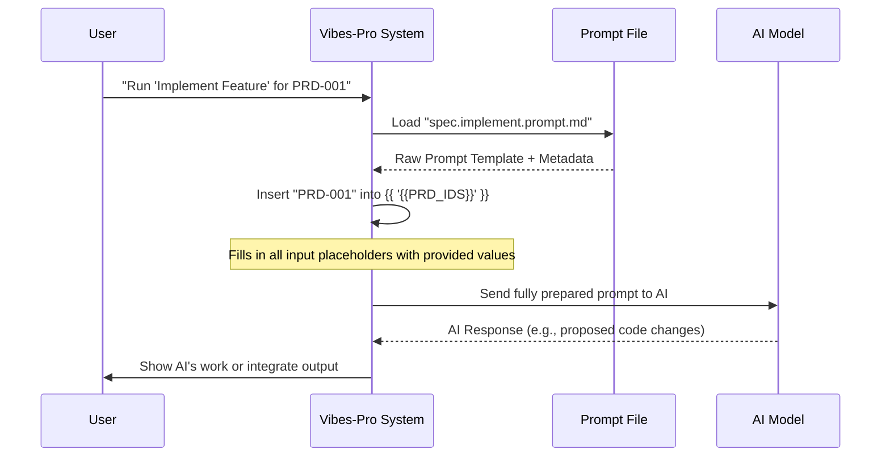

# Chapter 1: Prompts

#### 1.1 What's the Big Idea with Prompts?

Imagine you're a chef, and you have a new assistant. Every time you want them to make a specific dish, you could explain *all* the steps from scratch: "Take two eggs, add milk, whisk them, heat the pan..." This takes a lot of time, and sometimes you might forget a crucial step, leading to inconsistent results.

Wouldn't it be much easier if you had a **recipe card**? You could just hand your assistant the "Fluffy Omelette Recipe" card, and they'd know exactly what to do, what ingredients to expect, and how the final dish should look.

In `Vibes-Pro`, **Prompts** are exactly like these recipe cards, but for Artificial Intelligence (AI). Instead of typing long, detailed instructions to the AI every single time you want it to do a complex task, you use a pre-written Prompt file. These files contain all the instructions, context, and even what kind of output you expect.

#### 1.2 Why Prompts Make Life Easier

Prompts solve a few common headaches when working with AI:

*   **Consistency**: The AI always gets the same high-quality instructions, every time. No more forgotten steps!
*   **Efficiency**: You save a lot of time because you don't have to type out complex requests repeatedly. Just point to the right prompt.
*   **Reliability**: Since the instructions are clear and consistent, the AI's output becomes more predictable and reliable.

Let's look at a concrete example: You often need the AI to perform a "Security Review" on your code. This is a very important and detailed task.

**Without a Prompt**: You might type something like:
"Hey AI, please act as a security expert. Review the following code for common vulnerabilities like SQL injection, XSS, or command injection. Check for unsanitized inputs and insecure dependencies. Also, make sure no API keys are hardcoded. Provide a summary with severity ratings and clear fixes. Here's the code: `<code>`"

This is a lot to remember and type each time!

**With a Prompt in Vibes-Pro**: You would simply tell the system:
"AI, run the 'Security Review' prompt on this code: `<code>`"

The `Vibes-Pro` system then automatically loads all the detailed instructions from a prompt file (like `sec.review.prompt.md`) and gives them to the AI. Much simpler!

#### 1.3 Inside a Prompt File: The Recipe Card Details

A Prompt file in `Vibes-Pro` is a special Markdown file (`.md`) that has two main parts, just like a good recipe card:

1.  **YAML Frontmatter (The Recipe's Metadata)**: This is at the very top of the file, enclosed by `---`. It contains important details *about* the prompt, like its purpose, who it's for, and what AI model it should use.
2.  **Markdown Body (The Actual Instructions)**: This is the detailed "how-to" guide for the AI, written in regular Markdown. It explains the task step-by-step and can even include placeholders for information you'll provide later.

Let's peek inside a real prompt file from `Vibes-Pro`, the `.github/prompts/sec.review.prompt.md`:

```markdown
---
kind: prompt
domain: sec
task: review
thread: sec-review
matrix_ids: [DEV-PRD-005]
budget: M
mode: "agent"
model: GPT-5 mini
tools: ["githubRepo", "codebase"]
description: "Perform a security audit on selected files or the entire repository"
---

# Security Review Prompt

You are an AI security reviewer tasked with auditing code for vulnerabilities and unsafe practices. Follow these guidelines when performing a review:

- Reference our [security instructions](../instructions/security.instructions.md) and [general guidelines](../instructions/general.instructions.md) to ensure best practices are applied and to avoid conflicting advice.
- Ask the user to select a file, folder, or commit to review. Use context variables like `${fileBasename}`, `${selection}`, or `${workspaceFolder}` to scope the review to the appropriate context.
- Analyse the code for common security issues such as SQL injection, XSS, command injection, unsanitised input, insecure dependencies, and improper error handling.
- Provide clear remediation steps and code snippets for each issue.
- Summarise your findings at the end with severity ratings (e.g. high, medium, low).

When you are ready to perform the review, run this prompt with the selected file or context.
```

Let's break down these two parts:

##### The YAML Frontmatter (Metadata)

```yaml
---
kind: prompt
domain: sec
task: review
thread: sec-review
matrix_ids: [DEV-PRD-005]
budget: M
mode: "agent"
model: GPT-5 mini
tools: ["githubRepo", "codebase"]
description: "Perform a security audit on selected files or the entire repository"
---
```
*   `kind: prompt`: This simply tells `Vibes-Pro` that this file is a prompt.
*   `domain: sec`: This categorizes the prompt as related to "security".
*   `task: review`: This specifies the *action* the prompt is designed for – a "review".
*   `mode: "agent"`: This indicates the AI should act as an autonomous "agent" (more on this in [AI Chat Modes & Personas](02_ai_chat_modes___personas_.md)).
*   `model: GPT-5 mini`: This suggests which AI model is best suited for this task.
*   `description`: A short explanation of what the prompt does.

These metadata fields help `Vibes-Pro` organize, find, and correctly execute the prompts.

##### The Markdown Body (Instructions)

This is the main part where you give detailed instructions to the AI. For the `sec.review.prompt.md` example, it clearly tells the AI *how* to conduct a security review, what to look for, and how to format its findings.

Notice the line `- Reference our [security instructions](../instructions/security.instructions.md)`. This shows that prompts can even link to other documentation within your project, providing even richer context for the AI!

#### 1.4 How Vibes-Pro Uses Prompts

So, how does `Vibes-Pro` actually "run" these recipe cards?

Imagine you're developing a new feature, and you want the AI to implement a specific part of it. `Vibes-Pro` can be configured to use a prompt like `spec.implement.prompt.md` for this.

Let's say you have a feature defined by a "Product Feature ID" (like `PRD-001`).

**Step-by-step usage (simplified):**

1.  You (the developer) initiate a task in `Vibes-Pro` to "implement a feature".
2.  You provide specific details, like the `PRD_ID` for the feature you want to build.
3.  `Vibes-Pro` locates the `.github/prompts/spec.implement.prompt.md` file.
4.  It takes your `PRD_ID` and inserts it into the prompt's placeholder `{{ '{{PRD_IDS}}' }}`.
5.  It sends the *fully completed* prompt (with all the instructions and your specific details) to the AI.
6.  The AI receives these clear instructions and begins to perform the implementation task.

Here's a simple example of how the `.github/prompts/spec.implement.prompt.md` looks, focusing on its input placeholders:

```markdown
---
kind: prompt
domain: spec
task: implement
# ... other metadata like model, tools, description ...
---

# Implement Feature (Spec- & DX-Driven)

## Inputs

- Product Feature IDs: {{ '{{PRD_IDS}}' }}
- Related architectural decisions: {{ '{{ADR_IDS}}' }}
- SDS/TS components: {{ '{{SDS_IDS}}' }} {{ '{{TS_IDS}}' }}
# ... rest of instructions for the AI ...
```

When you provide a `PRD_ID` (e.g., `FEAT-001`), `Vibes-Pro` replaces `{{ '{{PRD_IDS}}' }}` with `FEAT-001` before sending the prompt to the AI. This way, the prompt is generic, but becomes specific when executed, much like a recipe that asks for "your favorite seasoning."

`Vibes-Pro` often uses these prompts in automated workflows or with specific developer tools. For example, a script or a `Justfile` (which we'll cover in [Justfile & Task Automation](08_justfile___task_automation_.md)) might trigger a prompt.

#### 1.5 Peeking Under the Hood: How Prompts are Processed

When `Vibes-Pro` uses a prompt, a sequence of events happens to ensure the AI gets exactly what it needs.

Here's a simplified view of the process:



1.  **You initiate a task**: You tell `Vibes-Pro` which prompt to use and any specific inputs (like `PRD-001`).
2.  **`Vibes-Pro` loads the prompt**: It finds the correct `.md` prompt file (e.g., `spec.implement.prompt.md`).
3.  **Variable substitution**: `Vibes-Pro` then intelligently replaces all placeholders like `{{ '{{PRD_IDS}}' }}` with the actual values you provided. This creates a complete, ready-to-use instruction set.
4.  **Send to AI**: The fully constructed prompt is then sent to the specified AI model (e.g., `GPT-5 mini`).
5.  **AI responds**: The AI processes the request and sends back its output, which `Vibes-Pro` can then present to you or integrate into your workflow.

`Vibes-Pro` also includes advanced tools to manage and optimize these prompts. For instance, there's a script (`scripts/measure_tokens_enhanced.py`) that can analyze prompts to tell you how many "tokens" (AI's way of counting words/parts of words) they contain, and even suggest improvements to make them more effective or cost-efficient.

Let's look at a tiny snippet from `scripts/measure_tokens_enhanced.py` to see how it might interact with a prompt file's content:

```python
# Part of scripts/measure_tokens_enhanced.py
class PromptOptimizerCLI:
    def __init__(self) -> None:
        # This component knows how to count AI "tokens"
        self.token_counter = TiktokenAdapter()

    async def analyze_prompt_file(self, file_path: str, model: str = "gpt-4") -> dict[str, Any]:
        # Reads the entire text content of the prompt file
        with open(file_path, encoding='utf-8') as f:
            content = f.read()

        # ... (logic to prepare analysis command) ...

        # Command contains the prompt's text and the target AI model
        command = AnalyzePromptCommand(content=content, model=model_type, store_result=True)
        # Executes the analysis, returning details like token count
        prompt = await self.analyze_use_case.execute(command)

        return {
            "file": file_path,
            "analysis": {
                "token_count": {
                    "total": prompt.token_count.total_tokens, # The total tokens in the prompt
                    "model": prompt.token_count.model.value,
                    # ... more token details like estimated cost ...
                },
                # ... other analysis results like clarity scores ...
            }
        }
```
This small code snippet shows that `Vibes-Pro` treats prompt files as important pieces of text that can be read, analyzed, and processed. The `TiktokenAdapter` is a tool specifically designed to understand how AI models "see" and count the content of a prompt. This kind of analysis helps developers create better and more efficient prompts.

#### 1.6 Conclusion

In this chapter, we learned that **Prompts** in `Vibes-Pro` are like detailed recipe cards for AI. They help us give consistent, efficient, and reliable instructions to AI models for complex tasks. We saw how these prompt files combine YAML metadata with Markdown instructions and how `Vibes-Pro` uses them by filling in placeholders before sending them to the AI. This powerful concept is fundamental to automating and standardizing AI interactions within `Vibes-Pro`.

Next up, we'll dive into how you can make the AI act like a specific expert or handle conversations in different ways with [AI Chat Modes & Personas](02_ai_chat_modes___personas_.md).

---

<sub><sup>Generated by [AI Codebase Knowledge Builder](https://github.com/The-Pocket/Tutorial-Codebase-Knowledge).</sup></sub> <sub><sup>**References**: [[1]](https://github.com/SPRIME01/Vibes-Pro/blob/61b36a3f5ed748ceae18c92b1d0a340657d8e477/.github/prompts/debug.workflow.prompt.md), [[2]](https://github.com/SPRIME01/Vibes-Pro/blob/61b36a3f5ed748ceae18c92b1d0a340657d8e477/.github/prompts/sec.review.prompt.md), [[3]](https://github.com/SPRIME01/Vibes-Pro/blob/61b36a3f5ed748ceae18c92b1d0a340657d8e477/.github/prompts/spec.implement.prompt.md), [[4]](https://github.com/SPRIME01/Vibes-Pro/blob/61b36a3f5ed748ceae18c92b1d0a340657d8e477/docs/vibecoding/reference/prompts.md), [[5]](https://github.com/SPRIME01/Vibes-Pro/blob/61b36a3f5ed748ceae18c92b1d0a340657d8e477/scripts/measure_tokens_enhanced.py)</sup></sub>
