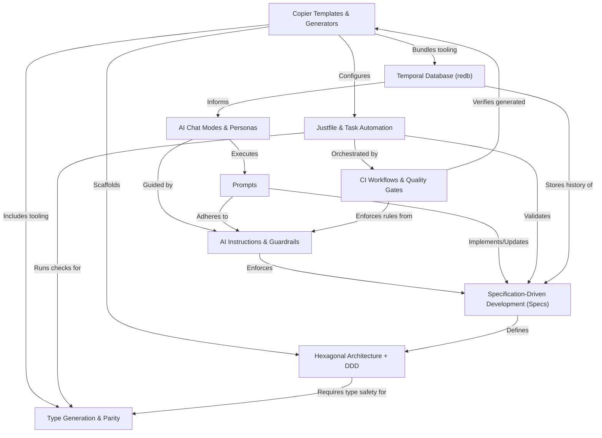

# Tutorial: Vibes-Pro

Vibes-Pro is an **AI-enhanced platform** that *accelerates* software development by generating
**production-ready applications**. It seamlessly integrates **robust architectural patterns** like
Hexagonal Architecture and Domain-Driven Design with **intelligent AI assistance** that learns
from past decisions and enforces quality through automated checks.

## Visual Overview

## Chapters

1. [Prompts
](01_prompts_.md)
2. [AI Chat Modes & Personas
](02_ai_chat_modes___personas_.md)
3. [AI Instructions & Guardrails
](03_ai_instructions___guardrails_.md)
4. [Specification-Driven Development (Specs)
](04_specification_driven_development__specs__.md)
5. [Copier Templates & Generators
](05_copier_templates___generators_.md)
6. [Hexagonal Architecture + DDD
](06_hexagonal_architecture___ddd_.md)
7. [Type Generation & Parity
](07_type_generation___parity_.md)
8. [Justfile & Task Automation
](08_justfile___task_automation_.md)
9. [Temporal Database (redb)
](09_temporal_database__redb__.md)
10. [CI Workflows & Quality Gates
](10_ci_workflows___quality_gates_.md)

---

Generated by [AI Codebase Knowledge Builder](https://github.com/The-Pocket/Tutorial-Codebase-Knowledge).
