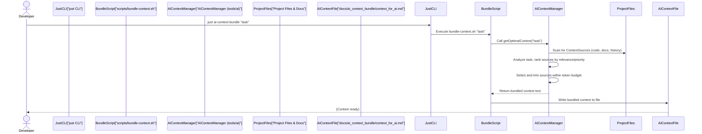

# Chapter 4: AI Context Management

Welcome back! In [Chapter 1: Copier Template System](01_copier_template_system_.md), your Vibes-Pro project was magically created. Then, in [Chapter 2: Hexagonal Architecture & DDD](02_hexagonal_architecture___ddd_.md), you learned about its smart, organized structure. And in [Chapter 3: Justfile Automation](03_justfile_automation_.md), we covered how easy it is to manage your project with simple `just` commands.

Now, let's talk about integrating **Artificial Intelligence (AI)** into your development workflow. AI assistants like GitHub Copilot are amazing, but they're only as good as the information they're given. Imagine asking a chef to cook a specific dish, but you hand them every single ingredient in the pantry. They'll spend ages figuring out what's relevant!

## The Problem: Information Overload for AI

AI models, especially large language models (LLMs), have a limited "brain capacity" for any single task, often measured in **tokens**. Tokens are like words or parts of words. If you give an AI too much information, it might:
*   **Get confused**: It can struggle to find the truly relevant bits.
*   **Give bad suggestions**: Irrelevant information leads to off-topic or incorrect code.
*   **Waste "token" budget**: Sending too much data costs more and is slower. This is like paying for the entire pantry when you only need a few ingredients.

## Our Solution: AI Context Management

Vibes-Pro solves this with a clever system called **AI Context Management**. Think of this system as your AI's personal, super-smart librarian. When you ask your AI assistant for help (e.g., "how do I create a new user entity?"), this librarian quickly scans your entire project – your code, documentation, previous decisions, and even tests – and hands the AI *only* the most relevant "books" (code snippets, docs, etc.).

This ensures the AI receives precisely what it needs to provide accurate, context-aware suggestions, without wasting valuable tokens. It helps the AI focus on your specific problem within *your* project's unique structure and style.

## Key Concepts of AI Context Management

Let's break down how this smart librarian works:

1.  **Token Budget**: This is the total "brain capacity" (number of tokens) the AI has for a given interaction. Our system ensures we stay within this limit.
2.  **Context Sources**: These are all the places the librarian can find information. This includes your actual code files, markdown documentation, configuration files, and even historical records.
3.  **Task Analysis**: When you ask for help, the system first analyzes your request to understand its keywords, intent, and what parts of your project it might relate to (e.g., "user domain," "validation pattern").
4.  **Relevance Scoring & Prioritization**: Each potential piece of information (a `ContextSource`) is given a score based on how relevant it is to your task. Some sources (like core domain code) might also have a higher pre-defined priority.
5.  **Smart Selection**: Based on relevance, priority, and the token budget, the system intelligently selects the most important snippets. If a snippet is too long, it can even trim it down to fit.
6.  **Bundling**: All the selected, relevant information is then neatly packaged into a single text bundle, ready to be sent to your AI assistant.

## Use Case: Getting AI Context for an Implementation Task

Let's say you're working on a new feature and you want to ask your AI assistant for help creating a "user entity with validation and domain events."

### Step 1: Trigger the Context Bundling

You'll use a `just` command (from [Chapter 3: Justfile Automation](03_justfile_automation_.md)) to tell Vibes-Pro to prepare this context:

```bash
just ai-context-bundle "Create user entity with validation and domain events"
```

*   **What happens**: The `just` command runs an internal script that activates the AI Context Manager. It takes your task description (the quoted text) and uses it to find the best project context.

The output will be something like this, indicating where the bundled context is stored:

```
📦 Bundling AI context...
✅ Context bundle ready at docs/ai_context_bundle/context_for_ai.md
```

### Step 2: AI Consumes the Context

Now, your AI assistant (e.g., GitHub Copilot, or another AI tool integrated with Vibes-Pro) can read the contents of `docs/ai_context_bundle/context_for_ai.md`. Instead of seeing *all* your project files, it sees a carefully curated document, perhaps looking like this (highly simplified):

```markdown
### Source: libs/user/domain/user.ts
// Key parts of your User entity definition
export class UserEntity {
  id: string;
  name: string;
  // ... other properties

  validate(): boolean {
    // Business rule: name must not be empty
    return this.name.length > 0;
  }
}

### Source: docs/ADRs/007-user-validation.md
// Architectural Decision Record for user validation
Decision: User names must be unique and alphanumeric.

### Source: libs/user/application/create-user.usecase.ts
// Interface for user repository
export interface UserRepository {
  save(user: UserEntity): Promise<void>;
}
// ...
```

This focused context allows the AI to give much better suggestions related to user entities, validation rules, and where they fit into your Hexagonal Architecture (from [Chapter 2: Hexagonal Architecture & DDD](02_hexagonal_architecture___ddd_.md)).

## Under the Hood: How the Context Manager Works

Let's trace what happens when you run `just ai-context-bundle "Your task description"`:



1.  **You run `just`**: The `just ai-context-bundle` command is executed.
2.  **`just` calls a script**: As seen in [Chapter 3: Justfile Automation](03_justfile_automation_.md), `just` often wraps shell scripts. In this case, it calls `scripts/bundle-context.sh`.
3.  **Script activates `AIContextManager`**: The shell script then invokes the core logic of the `AIContextManager` (which is a TypeScript class in `tools/ai/src/context-manager.ts`). It passes your task description to the `getOptimalContext` method.
4.  **`AIContextManager` scans & analyzes**:
    *   It looks through the project's files and other defined sources (`ProjectFiles`) to identify potential `ContextSource` candidates.
    *   It analyzes your task description to extract keywords (e.g., "user," "validation," "entity").
    *   It then scores each `ContextSource` based on its relevance to these keywords, its last update time, and its pre-configured priority.
5.  **Selects & Trims**: The manager picks the highest-scoring sources. If the combined content exceeds the **token budget**, it intelligently trims less relevant parts or entire low-scoring sources until it fits.
6.  **Bundles & Writes**: The selected and trimmed content is then combined into a single markdown string and returned to the `bundle-context.sh` script, which then writes it into a file (e.g., `docs/ai_context_bundle/context_for_ai.md`).

## Deeper Dive into the `AIContextManager`

The core logic for AI Context Management lives in `tools/ai/src/context-manager.ts` and its configuration is in `tools/ai/config.yml`.

### 1. The `AIContextManager` Class (The Librarian)

This is the main class that orchestrates the entire process.

```typescript
// tools/ai/src/context-manager.ts (Simplified)
export interface AIContextManagerConfig {
  maxTokens: number;
  reservedTokens?: number;
  cacheSize?: number;
}

export class AIContextManager {
  private readonly maxTokens: number;
  private readonly reservedTokens: number;
  private readonly tokenizer = new SimpleTokenizer();
  private readonly sources = new Map<string, ContextSource>();
  // ... other properties for caching, metrics, etc.

  constructor(config: AIContextManagerConfig) {
    this.maxTokens = config.maxTokens;
    this.reservedTokens = config.reservedTokens ?? 0;
    // ... setup cache, etc.
  }

  registerSource(source: ContextSource): void {
    this.sources.set(source.id, source);
    this.clearCache();
  }

  async getOptimalContext(task: string): Promise<ContextSelectionResult> {
    // 1. Check if we already computed this context (caching)
    // 2. Analyze the task (keywords, domains, patterns)
    const analysis = this.analyzeTask(task);
    // 3. Rank all available sources based on analysis, priority, recency, etc.
    const rankedSources = await this.rankSources(analysis);
    // 4. Select the best sources within the token budget, trimming if needed
    const selectedSources = this.selectWithinBudget(rankedSources);
    // 5. Compose the final context string
    const content = this.composeContext(selectedSources);

    // ... calculate final metrics and store in cache ...
    return { content /* ... */ };
  }

  // ... private methods like analyzeTask, rankSources, selectWithinBudget, composeContext ...
}
```

*   **`constructor(config)`**: Sets up the manager with crucial budget information like `maxTokens` (the total tokens an AI can handle) and `reservedTokens` (tokens kept free for the prompt itself, not for context).
*   **`registerSource(source)`**: This is how the librarian "learns" about new sources of information (like a new documentation file or a library's code).
*   **`getOptimalContext(task)`**: This is the core method you call. It orchestrates the entire process of finding and bundling the most relevant information for your given `task`.

### 2. `ContextSource` (The Books)

This is an interface that defines what kind of information an `AIContextManager` expects from a "source" of context.

```typescript
// tools/ai/src/context-manager.ts (Simplified)
export interface ContextSource {
  readonly id: string; // Unique identifier (e.g., "domain-user-guide")
  readonly priority: number; // How important is this source generally (0-1)
  readonly tags: readonly string[]; // Keywords to describe the source (e.g., "user", "entity", "validation")
  readonly lastUpdated?: Date; // When was this source last changed? (for recency score)
  readonly successRate?: number; // How often was this source useful in the past?
  getContent(): Promise<string>; // A function to get the actual text content of the source
}
```

*   **`id`**: A unique name for the source.
*   **`priority`**: A number (0-1) indicating its general importance. Core architectural documents might have higher priority.
*   **`tags`**: Keywords that describe what the source is about. This helps in matching it to a task.
*   **`lastUpdated`**: The system might prioritize newer information.
*   **`successRate`**: Over time, if a source consistently helps the AI, its `successRate` might increase, giving it a better score.
*   **`getContent()`**: This function actually reads the file or fetches the data for the source.

### 3. `tools/ai/config.yml` (The Librarian's Rules)

This configuration file (generated by Copier if you enabled AI workflows) defines *what* `ContextSource`s exist in your project and their general rules.

```yaml
# tools/ai/config.yml (Simplified)
# AI Configuration for My Awesome VibesPro App

# Token budget management
token_budget:
  max_tokens: 8000
  reserved_tokens: 2000 # Tokens to leave free for the AI's response and prompt instructions
  context_window: 6000 # Max tokens for context (max_tokens - reserved_tokens)

# Context sources and priorities
context_sources:
  - id: "domain_models"
    path: "libs/*/domain/**/*.ts" # Files matching this pattern
    priority: 10 # Higher priority means generally more important
    weight: 0.3 # How much this source contributes to the final score

  - id: "use_cases"
    path: "libs/*/application/**/*.ts"
    priority: 8
    weight: 0.25

  - id: "documentation"
    path: "**/*.md"
    priority: 2
    weight: 0.1
```

*   **`token_budget`**: Specifies the overall `max_tokens` for the AI, and how many `reserved_tokens` should be held back for the AI's actual prompt and response, leaving `context_window` tokens for the context itself.
*   **`context_sources`**: This is a list of all your "books."
    *   **`id`**: A unique name for the source (e.g., "domain_models").
    *   **`path`**: A "glob" pattern (like `**/*.ts` or `libs/*/domain/**/*.ts`) that tells the system *where* to find these files in your project. This is how it knows which actual files correspond to "domain models."
    *   **`priority`**: A numerical value (higher is more important) that gives a base importance to this type of source. Your core business domain models will likely have a higher priority than general documentation.

The `AIContextManager` then reads this `config.yml` to know *which* files to consider as `ContextSource`s and their general priorities. When `getOptimalContext` is called, it performs the detailed relevance scoring based on your specific task.

### 4. `SimpleTokenizer` (The Token Counter)

A small helper class mentioned in `context-manager.ts` is `SimpleTokenizer`.

```typescript
// tools/ai/src/context-manager.ts (Simplified)
class SimpleTokenizer {
  tokenize(text: string): string[] { /* ... */ } // Splits text into tokens
  count(text: string): number { /* ... */ } // Returns token count
  trim(text: string, maxTokens: number): { content: string; tokens: number } { /* ... */ } // Cuts text to fit token limit
}
```

*   This class is responsible for converting raw text into "tokens" and counting them. More importantly, it can `trim` content to ensure it fits within the allocated token budget, preventing the AI from receiving too much information.

## Benefits of AI Context Management

This intelligent system brings significant advantages to your AI-assisted development:

| Benefit            | Description                                                                                             | Analogy                                                                                |
| :----------------- | :------------------------------------------------------------------------------------------------------ | :------------------------------------------------------------------------------------- |
| **Accuracy**       | AI receives only relevant information, leading to more precise and useful suggestions tailored to your project. | A chef gets exactly the ingredients for the requested dish, not a random assortment.    |
| **Efficiency**     | Avoids wasting token budget by sending minimal, highly relevant data, making AI interactions faster and cheaper. | You only pay for the ingredients you need, not the entire pantry.                        |
| **Focus**          | AI assistants stay on topic and understand your project's specific conventions and architecture.          | The chef understands your dietary restrictions and prepares the meal accordingly.        |
| **Consistency**    | AI suggestions align with your project's chosen architecture (like Hexagonal Architecture) and best practices. | The chef follows a specific recipe and culinary style.                                |
| **Reduced Hallucinations** | By providing specific, grounded context, the AI is less likely to "make up" information.          | The chef has a clear recipe, reducing the chance of inventing new steps.               |

## Conclusion

The AI Context Management system is a powerful feature in Vibes-Pro, acting as a crucial intermediary between your project's vast codebase and your AI assistant. By intelligently selecting, prioritizing, and bundling the most relevant information, it ensures your AI tools are focused, efficient, and highly effective, helping you build better software faster.

Now that you understand how Vibes-Pro provides the right context to the AI, let's explore how you can craft your requests to guide the AI even further.

[Next Chapter: Prompt Engineering (AI Guidance)](05_prompt_engineering__ai_guidance__.md)

---

<sub><sup>Generated by [AI Codebase Knowledge Builder](https://github.com/The-Pocket/Tutorial-Codebase-Knowledge).</sup></sub> <sub><sup>**References**: [[1]](https://github.com/SPRIME01/Vibes-Pro/blob/61b36a3f5ed748ceae18c92b1d0a340657d8e477/docs/aiassist/AI_ADR.md), [[2]](https://github.com/SPRIME01/Vibes-Pro/blob/61b36a3f5ed748ceae18c92b1d0a340657d8e477/tests/integration/ai-workflows.test.ts), [[3]](https://github.com/SPRIME01/Vibes-Pro/blob/61b36a3f5ed748ceae18c92b1d0a340657d8e477/tools/ai/README.md), [[4]](https://github.com/SPRIME01/Vibes-Pro/blob/61b36a3f5ed748ceae18c92b1d0a340657d8e477/tools/ai/config.yml.j2), [[5]](https://github.com/SPRIME01/Vibes-Pro/blob/61b36a3f5ed748ceae18c92b1d0a340657d8e477/tools/ai/context-manager.ts.j2), [[6]](https://github.com/SPRIME01/Vibes-Pro/blob/61b36a3f5ed748ceae18c92b1d0a340657d8e477/tools/ai/src/__tests__/context-manager.test.ts), [[7]](https://github.com/SPRIME01/Vibes-Pro/blob/61b36a3f5ed748ceae18c92b1d0a340657d8e477/tools/ai/src/context-manager.ts)</sup></sub>
