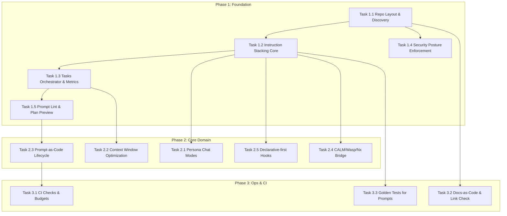

## TDD Implementation Plan

Below, “File” paths and test names are tailored to this repo’s stack (TypeScript/JS + bash). Tests use plain Node (node:assert) to avoid extra deps per DEV-SPEC-001. Fixtures live under `tests/fixtures/`. Scripts under scripts are exercised via integration tests. Optional time estimates are provided for planning.

Legend for references:

-   ADR: DEV-ADR-xxx
-   PRD: DEV-PRD-xxx
-   SDS: DEV-SDS-xxx
-   SPEC: DEV-SPEC-xxx

Mermaid dependency map:

### Phase 1: Foundation & Infrastructure

#### Task 1.1: Repository Layout & Discovery Validator

References: ADR-001, ADR-006, SDS-001, SPEC-001, SPEC-002, SPEC-010; PRD-001, PRD-007
Dependencies: none
Estimated Time: 2.5 hours

Red Phase (Tests)

-   [ ] Write test: validates required directories and contracts exist
    -   File: `tests/unit/repo_layout.test.js`
    -   Test: `test_should_detect_required_structure`
    -   Assert: prompts, instructions, chatmodes, scripts present; files match suffix contracts (.prompt.md, .instructions.md, .chatmode.md)
-   [ ] Write test: flags misplaced files
    -   File: `tests/unit/repo_layout.test.js`
    -   Test: `test_should_flag_wrong_suffix_or_location`
    -   Assert: Returns list of violations with actionable messages
-   [ ] Write test: settings posture presence (no auto-approve)
    -   File: `tests/unit/security_settings_posture.test.js`
    -   Test: `test_settings_should_not_enable_auto_approve`
    -   Assert: settings.json either absent or explicitly not enabling `chat.tools.autoApprove`

Green Phase (Implementation)

-   [ ] Implement validator script
    -   File: `tools/validate/repo_layout_check.js`
    -   API: `runRepoLayoutCheck({ rootDir }) -> { ok, violations[] }`
    -   Core logic: Traverse repo, verify directory contracts and suffix rules; human-friendly messages

Refactor Phase

-   [ ] Extract filesystem helpers to `tools/validate/fs_utils.js`
-   [ ] Add pretty printer for errors with clickable relative paths
-   [ ] Tighten messages with remediation tips

Regression Testing

-   [ ] Run full unit suite
-   [ ] Dry-run on repo root; ensure zero violations
-   [ ] No slowdown > 100ms per run on typical repos

#### Task 1.2: Instruction Stacking Core (Concatenate + Prune + Precedence)

References: ADR-002, ADR-006, ADR-009; PRD-002, PRD-006, PRD-009; SDS-002; SPEC-003, SPEC-004
Dependencies: Task 1.1
Estimated Time: 4 hours

Red Phase (Tests)

-   [ ] Test: ordered stacking respects precedence (repo-wide → mode → prompt)
    -   File: `tests/unit/stacking.test.js`
    -   Test: `test_stack_order_and_override_rules`
    -   Assert: Later files override earlier only in documented sections
-   [ ] Test: duplicate headings pruned
    -   Test: `test_prune_duplicate_sections`
    -   Assert: No repeated headers; content merged or deduped
-   [ ] Test: token estimate within budget
    -   Test: `test_token_estimate_under_budget`
    -   Assert: Token count < configured cap; emits warning near threshold

Green Phase (Implementation)

-   [ ] Implement stacker module
    -   File: `tools/stacking/stacker.js`
    -   Methods:
        -   `loadFilesInOrder(cfg) -> string[]`
        -   `concatenateWithRules(chunks) -> { content, report }`
        -   `estimateTokens(content) -> number`
    -   Core: Respect order, prune duplicates, report token stats

Refactor Phase

-   [ ] Extract pruner to `tools/stacking/prune.js`
-   [ ] Memoize token estimates for repeated runs
-   [ ] Add structured report object usable by UI/loggers

Regression Testing

-   [ ] Run unit tests; add fixture cases under `tests/fixtures/stacking/*`
-   [ ] Integration with Task 1.3 to verify end-to-end

#### Task 1.3: Tasks Orchestrator & Metrics Logging

References: ADR-004, ADR-010; PRD-004, PRD-010; SDS-004, SDS-009; SPEC-004, SPEC-005
Dependencies: Task 1.2
Estimated Time: 3.5 hours

Red Phase (Tests)

-   [ ] Integration test: run run_prompt.sh with sample prompt
    -   File: `tests/integration/run_prompt_it.test.js`
    -   Test: `test_run_prompt_logs_metrics`
    -   Assert: Latency and token metrics appended to transcript.md
-   [ ] Integration test: measure tokens
    -   File: `tests/integration/measure_tokens_it.test.js`
    -   Test: `test_measure_tokens_outputs_estimate`
    -   Assert: Output contains numeric token count and file label
-   [ ] Test: A/B variant flag propagates (if configured)
    -   Test: `test_variant_flag_is_logged`
    -   Assert: Output includes `variant=` tag

Green Phase (Implementation)

-   [ ] Implement metrics logger
    -   File: `tools/metrics/logger.js`
    -   Method: `appendTranscript({ label, tokens, latencyMs, variant })`
-   [ ] Apply stacker in run_prompt.sh via environment handoff (non-invasive)
    -   Note: Keep bash compatible; sanitize inputs

Refactor Phase

-   [ ] Normalize transcript lines with pipe-separated fields
-   [ ] Add clock abstraction for deterministic tests
-   [ ] Harden shell script argument parsing

Regression Testing

-   [ ] Run both integration tests locally
-   [ ] Verify transcript.md has no malformed lines

#### Task 1.4: Security Posture Enforcement

References: ADR-005; PRD-005; SDS-005; SPEC-006, SPEC-007
Dependencies: Task 1.1 (structure), Task 1.3 (logging hooks for audits)
Estimated Time: 2 hours

Red Phase (Tests)

-   [ ] Test: detect unsafe settings
    -   File: `tests/unit/security_settings_posture.test.js`
    -   Test: `test_warn_if_auto_approve_enabled`
    -   Assert: Fails check and prints remediation
-   [ ] Test: scripts contain no secrets or unsafe evals
    -   File: `tests/unit/script_safety.test.js`
    -   Test: `test_scripts_should_not_use_unsafe_patterns`
    -   Assert: Grep scan forbids dangerous patterns

Green Phase (Implementation)

-   [ ] Implement security checker
    -   File: `tools/security/posture_check.js`
    -   Method: `runSecurityChecks(rootDir) -> { ok, findings[] }`

Refactor Phase

-   [ ] Extract pattern list to `tools/security/patterns.json`
-   [ ] Add allowlist for benign matches

Regression Testing

-   [ ] Unit test suite; ensure zero false positives on current repo

#### Task 1.5: Prompt Lint & Plan Preview

References: ADR-007; PRD-007; SDS-006; SPEC-003
Dependencies: Tasks 1.2, 1.3
Estimated Time: 3 hours

Red Phase (Tests)

-   [ ] Test: frontmatter schema validation
    -   File: `tests/unit/prompt_lint.test.js`
    -   Test: `test_prompt_must_have_title_and_metadata`
    -   Assert: Missing fields reported with path
-   [ ] Test: “plan” preview renders effective stack
    -   File: `tests/integration/plan_preview_it.test.js`
    -   Test: `test_plan_preview_renders_and_counts_tokens`
    -   Assert: Outputs concatenated content + token count

Green Phase (Implementation)

-   [ ] Implement linter and planner
    -   Files: `tools/prompt/lint.js`, `tools/prompt/plan_preview.js`
    -   Core: Parse YAML frontmatter; run stacker; emit plan diff

Refactor Phase

-   [ ] Add gentle autofixes where safe (e.g., missing newline)
-   [ ] Improve diff to highlight overridden sections

Regression Testing

-   [ ] Run unit + integration; record sample outputs

### Phase 2: Core Domain Implementation

#### Task 2.1: Persona Chat Modes Validation

References: ADR-003; PRD-003; SDS-003
Dependencies: Task 1.2
Estimated Time: 2 hours

Red Phase (Tests)

-   [ ] Test: each `.chatmode.md` has frontmatter and synergy links
    -   File: `tests/unit/chatmode_validation.test.js`
    -   Test: `test_chatmode_frontmatter_and_synergy_links`
    -   Assert: name, description, linked instructions exist
-   [ ] Test: selection loads proper instruction overlays (stacker)
    -   Test: `test_chatmode_composes_expected_stack`

Green Phase (Implementation)

-   [ ] Implement chatmode validator
    -   File: `tools/chatmode/validate.js`
    -   Method: `validateChatModes(dir) -> findings[]`

Refactor Phase

-   [ ] Normalize link checks to relative paths
-   [ ] Add suggestion hints for missing synergy section

Regression Testing

-   [ ] Run unit tests; verify current chatmodes pass

#### Task 2.2: Context Window Optimization Policies

References: ADR-006; PRD-006; SDS-002; SPEC-005
Dependencies: Tasks 1.2, 1.3
Estimated Time: 2 hours

Red Phase (Tests)

-   [ ] Test: warnings at 80% budget, hard fail at 100%
    -   File: `tests/unit/token_budget.test.js`
    -   Test: `test_warn_and_fail_on_budgets`

Green Phase (Implementation)

-   [ ] Implement budgets
    -   File: `tools/stacking/budgets.js`
    -   Exports: `modeBudgets`, `evaluateAgainstBudget(tokens, mode)`

Refactor Phase

-   [ ] Add per-mode overrides via small JSON config
-   [ ] Cache estimates by content hash

Regression Testing

-   [ ] Unit tests pass; integration through run task emits warnings

#### Task 2.3: Prompt-as-Code Lifecycle Automation

References: ADR-007; PRD-007; SDS-006; SPEC-003, SPEC-008
Dependencies: Task 1.5
Estimated Time: 3 hours

Red Phase (Tests)

-   [ ] Test: lint → plan → run flow outputs artifacts
    -   File: `tests/integration/prompt_lifecycle_it.test.js`
    -   Test: `test_prompt_lifecycle_outputs_lint_plan_metrics`

Green Phase (Implementation)

-   [ ] Implement simple lifecycle CLI wrapper (Node, no deps)
    -   File: `tools/cli/prompt_lifecycle.js`
    -   Core: Compose lint, plan preview, run prompt, collect metrics

Refactor Phase

-   [ ] Add exit codes for CI
-   [ ] Structured JSON summary for dashboards

Regression Testing

-   [ ] Integration tests pass; artifacts present

#### Task 2.4: CALM/Wasp/Nx Bridging Validations

References: ADR-008; PRD-008; SDS-007
Dependencies: Task 1.2 (stacker for design docs), repo generators
Estimated Time: 3.5 hours

Red Phase (Tests)

-   [ ] Test: CALM controls run pre-generation (stubbed)
    -   File: `tests/unit/calm_controls.test.js`
    -   Test: `test_calm_controls_block_on_violation`
-   [ ] Test: generator determinism snapshot
    -   File: `tests/integration/generator_determinism_it.test.js`
    -   Test: `test_generator_outputs_are_deterministic`
    -   Assert: Same inputs → same outputs (snapshot compare)

Green Phase (Implementation)

-   [ ] Implement minimal control runner stub
    -   File: `tools/calm/controls_runner.js`
-   [ ] Snapshot harness
    -   File: `tools/test/snapshot.js` (writes to `tests/snapshots/`)

Refactor Phase

-   [ ] Pluggable control set (JSON)
-   [ ] More robust snapshot diff

Regression Testing

-   [ ] Re-run integration; ensure stability

#### Task 2.5: Declarative-first Hooks & Escape Hatches

References: ADR-009; PRD-009; SDS-008
Dependencies: Tasks 1.2, 1.3
Estimated Time: 2 hours

Red Phase (Tests)

-   [ ] Test: tasks can pass optional hook flags to scripts safely
    -   File: `tests/integration/hooks_it.test.js`
    -   Test: `test_hooks_are_sanitized_and_optional`
    -   Assert: Inputs sanitized; no injection risk

Green Phase (Implementation)

-   [ ] Implement hook param plumbing with sanitation
    -   Files: run_prompt.sh (non-invasive update), `tools/hooks/sanitize.js`

Refactor Phase

-   [ ] Centralize sanitization rules
-   [ ] Document supported hooks

Regression Testing

-   [ ] Run integration; verify inputs handled correctly

### Phase 3: Operations, CI, and Golden Tests

#### Task 3.1: CI Checks & Budgets Enforcement

References: ADR-010; PRD-010; SDS-009; SPEC-005, SPEC-006
Dependencies: Task 2.3
Estimated Time: 2 hours

Red Phase (Tests)

-   [ ] Test: lifecycle exits non-zero on budget exceed or lint error
    -   File: `tests/unit/ci_policy.test.js`
    -   Test: `test_ci_policies_enforced_in_exit_codes`

Green Phase (Implementation)

-   [ ] CI policy wrapper
    -   File: `tools/ci/policy.js`
    -   Core: Map findings to exit codes; aggregate results

Refactor Phase

-   [ ] Add minimal summary table to stdout
-   [ ] Add toggle to treat warnings as errors

Regression Testing

-   [ ] Validate with failing fixture; observe non-zero exit

#### Task 3.2: Docs-as-Code & Link Check

References: SDS-Docs; SPEC-003; PRD-007
Dependencies: Task 1.1
Estimated Time: 1.5 hours

Red Phase (Tests)

-   [ ] Test: cross-references resolve (IDs and relative links)
    -   File: `tests/unit/link_check.test.js`
    -   Test: `test_markdown_links_and_ids_resolve`

Green Phase (Implementation)

-   [ ] Simple link checker (no net access)
    -   File: `tools/docs/link_check.js`

Refactor Phase

-   [ ] Extract MD parser utility
-   [ ] Ignore anchors on non-markdown files

Regression Testing

-   [ ] Run unit tests across `docs/*.md`

#### Task 3.3: Golden Tests for Prompts

References: SPEC-008; ADR-007; PRD-007
Dependencies: Task 1.2
Estimated Time: 2 hours

Red Phase (Tests)

-   [ ] Test: snapshot of stacked prompt stays stable
    -   File: `tests/integration/prompt_snapshot_it.test.js`
    -   Test: `test_stacked_prompt_matches_snapshot`
    -   Assert: Diff printed on change

Green Phase (Implementation)

-   [ ] Use snapshot helper from Task 2.4
    -   Ensure deterministic sort of includes

Refactor Phase

-   [ ] Ignore whitespace-only changes
-   [ ] Add opt-in snapshot update flag

Regression Testing

-   [ ] Run suite; store snapshots under `tests/snapshots/prompts/*`

---

## Collapsible Detailed Test Cases

Task 1.2 Stacking: duplicate heading pruning cases

-   Fixture: `tests/fixtures/stacking/repo-wide.instructions.md` (Header “Security Guidelines”)
-   Fixture: `tests/fixtures/stacking/mode.chatmode.md` (Same header with minor variant)
-   Expected: Single “Security Guidelines” section with later subsection overrides only where marked
-   Assertion message format: `[Stacker] Section 'Security Guidelines' should appear once; duplicates pruned`
      

Task 1.3 Orchestrator: transcript logging

-   Input: create-react-component.prompt.md
-   Expected: transcript.md appended with `timestamp|label=create-react-component|tokens=NNN|latencyMs=NNN|variant=default`
-   Assertion message: `[Metrics] Expected transcript entry for label create-react-component`
      

Task 2.4 Generator determinism

-   Inputs: schema.json + seeded config
-   Action: Invoke generator twice in temp dirs
-   Expected: Directory diff equals empty
-   Assertion message: `[Generator] Determinism failed: differences found at <path>`
      

---

## Traceability Matrix (Tasks → Requirements)

-   Task 1.1 → ADR-001, ADR-006; PRD-001, PRD-007; SDS-001; SPEC-001, SPEC-002, SPEC-010
-   Task 1.2 → ADR-002, ADR-006, ADR-009; PRD-002, PRD-006, PRD-009; SDS-002; SPEC-003, SPEC-004
-   Task 1.3 → ADR-004, ADR-010; PRD-004, PRD-010; SDS-004, SDS-009; SPEC-004, SPEC-005
-   Task 1.4 → ADR-005; PRD-005; SDS-005; SPEC-006, SPEC-007
-   Task 1.5 → ADR-007; PRD-007; SDS-006; SPEC-003
-   Task 2.1 → ADR-003; PRD-003; SDS-003
-   Task 2.2 → ADR-006; PRD-006; SDS-002; SPEC-005
-   Task 2.3 → ADR-007; PRD-007; SDS-006; SPEC-008
-   Task 2.4 → ADR-008; PRD-008; SDS-007
-   Task 2.5 → ADR-009; PRD-009; SDS-008
-   Task 3.1 → ADR-010; PRD-010; SDS-009; SPEC-005, SPEC-006
-   Task 3.2 → SDS-Docs; PRD-007; SPEC-003
-   Task 3.3 → ADR-007; PRD-007; SPEC-008

Unaddressed/Deferred Requirements

-   SPEC-011 (future enhancements) noted as non-blocking; plan does not implement Windows `.ps1` wrappers or a full CLI yet—documented for later.

---

## Dependencies and Parallelization

Blocking dependencies

-   1.1 → 1.2 → 1.3/1.5 → 2.3 → 3.1
-   1.2 → 2.1, 2.2, 2.5, 2.4, 3.3
-   1.1 → 1.4, 3.2

Parallelizable tasks

-   1.4 can run after 1.1 alongside 1.3
-   2.1, 2.2, 2.5 can run in parallel after 1.2
-   3.2 can run after 1.1; 3.3 after 1.2

External dependencies

-   None that require network calls; all tests run locally (SPEC-001). Nx generator tests operate on local files.

---

## Test Categories

-   Unit: `tests/unit/*.test.js` (e.g., stacker logic, security checks)
-   Integration: `tests/integration/*_it.test.js` (run scripts, lifecycle flows, generator determinism)
-   Contract: Stacker I/O contract, lifecycle CLI JSON outputs, transcript line formats
-   Acceptance: PRD conformance checks (existence of tasks, budgets applied, persona modes discoverable)

---

## Documentation Requirements

-   Test documentation standards
    -   Test name format: `test_<should>_<specific_behavior>`
    -   Assertion messages: `[Component] <behavior> — expected <x>, got <y>`
-   Fixtures
    -   Store under `tests/fixtures/<area>/...`
    -   Keep minimal, explicit variations for dedup/pruning/token cases
-   Output artifacts
    -   Snapshots under `tests/snapshots/...`
    -   Transcript lines appended to transcript.md with pipe separators

---

## Quality Metrics to Track

-   Coverage target (by count of functions under test): ≥ 80% for `tools/*` modules
-   Cyclomatic complexity: functions ≤ 10; flag > 10 in lint reports (manual check or planned)
-   Performance
    -   Unit tests ≤ 100ms each; Integration ≤ 1s (as per guidelines)
    -   Stacker token estimate computation ≤ 30ms on typical prompt stacks
-   Security
    -   0 insecure defaults; auto-approve not enabled
    -   0 unsafe script patterns detected per run
-   Token budgets
    -   Token overflows < 2% of runs; warnings at 80%

---

## Phase-level Checklists

Phase 1 Completion Criteria

-   [ ] Repo layout validator green
-   [ ] Stacker passes unit suite; token estimates reported
-   [ ] Orchestrator logs metrics to transcript reliably
-   [ ] Security posture checks pass
-   [ ] Prompt lint + plan preview produce actionable outputs

Phase 2 Completion Criteria

-   [ ] Chat modes validated and composable
-   [ ] Budget warnings and hard caps enforced
-   [ ] Lifecycle CLI orchestrates lint → plan → run with metrics
-   [ ] CALM controls stub + generator determinism green
-   [ ] Hooks sanitized and optional

Phase 3 Completion Criteria

-   [ ] CI policy exits correct codes on failure
-   [ ] Docs link-check and ID references validated
-   [ ] Golden prompt snapshots stable and easy to diff

---

## File/Path Index (planned)

-   Tools
    -   `tools/validate/repo_layout_check.js`
    -   `tools/validate/fs_utils.js`
    -   `tools/stacking/stacker.js`, `tools/stacking/prune.js`, `tools/stacking/budgets.js`
    -   `tools/metrics/logger.js`
    -   `tools/security/posture_check.js`, `tools/security/patterns.json`
    -   `tools/prompt/lint.js`, `tools/prompt/plan_preview.js`
    -   `tools/chatmode/validate.js`
    -   `tools/cli/prompt_lifecycle.js`
    -   `tools/calm/controls_runner.js`
    -   `tools/test/snapshot.js`
    -   `tools/hooks/sanitize.js`
    -   `tools/ci/policy.js`
    -   `tools/docs/link_check.js`
-   Tests
    -   `tests/unit/*.test.js`, `tests/integration/*_it.test.js`, `tests/snapshots/**`, `tests/fixtures/**`

---

## Example Task Breakdown

Task 2.1: Persona Chat Modes
References: ADR-003, PRD-003, SDS-003
Dependencies: Task 1.2
Estimated Time: 2 hours

Red Phase (45 min)

-   [ ] Write test for valid chatmode frontmatter and synergy links
    -   Test: `test_chatmode_frontmatter_and_synergy_links`
    -   Assert: name/description/tools present; synergy links resolve
-   [ ] Write test for correct stacking with mode overlays
    -   Test: `test_chatmode_composes_expected_stack`
    -   Assert: Sections appear in correct precedence

Green Phase (60 min)

-   [ ] Implement `tools/chatmode/validate.js`
-   [ ] Integrate with stacker load pipeline

Refactor Phase (15 min)

-   [ ] Extract link-resolver utility; improve messages

Regression (15 min)

-   [ ] Run unit and integration; verify mode selection flows

---

Notes

-   Assumptions: Node-based tests use built-in `assert` and `fs`; no external packages (SPEC-001). Paths chosen fit existing repo conventions.
-   Security: All script inputs sanitized; no secrets; no network calls.

Completion summary

-   The TDD plan covers all ADR/PRD/SDS/SPEC items except future enhancements (SPEC-011), which are explicitly deferred.
-   Tasks are sequenced with dependencies, include detailed TDD steps, test locations/names, and quality targets suitable for CI adoption.
