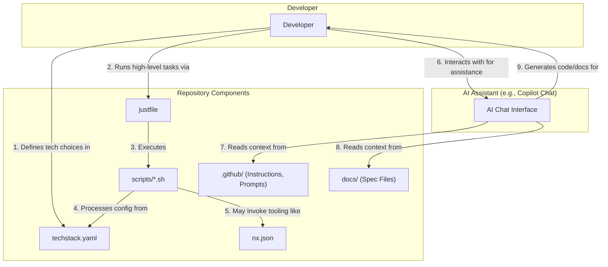

# System Architecture: AI-Assisted Development Ecosystem

This document provides an explanation of the architecture of the AI-assisted development ecosystem within this project template. The system is designed to provide a highly structured, "opinionated" environment that leverages AI assistants (like GitHub Copilot) to accelerate development while maintaining high standards of quality and consistency.

The core philosophy is "convention over configuration," guided by a spec-driven workflow and automated by a set of integrated tools.

## Key Components and Interactions

The ecosystem is composed of several interconnected components that work together to guide the developer.





### Component Breakdown

1.  **Developer:** The central actor who initiates all workflows, whether it's writing code, defining the tech stack, running tasks, or interacting with the AI assistant.

2.  **`techstack.yaml`:** This is the single source of truth for the project's technology stack. It's a manifest of all libraries, frameworks, and services. The developer defines the desired stack here.

3.  **`justfile` & `scripts/*.sh` (Automation Layer):**

    - The `justfile` provides a simple, memorable set of commands (recipes) for common project tasks.
    - These commands delegate their logic to shell scripts in the `scripts/` directory.
    - Scripts like `sync_techstack.sh` read the `techstack.yaml` and perform actions, such as updating configuration files or generating documentation. This automates the setup process based on the declared tech stack.

4.  **`.github/` (AI Guidance):** This directory is the "brain" of the AI assistant. It contains:

    - **`instructions/`**: Detailed rules and guidelines for the AI on topics like coding style, testing, security, and commit messages.
    - **`prompts/`**: Pre-written prompts for common, complex tasks (e.g., creating a new component, implementing a feature).
    - **`chatmodes/`**: Personas for the AI to adopt (e.g., "Senior Backend Engineer," "Security Analyst") to provide specialized advice.
      These files provide deep, repository-specific context to the AI, making its suggestions far more relevant and helpful than generic advice.

5.  **`docs/` (Spec-Driven Workflow):** The project emphasizes a "specification-first" approach. This directory contains templates for Architecture Decision Records (ADRs), System Design Specifications (SDSs), and other planning documents. The AI assistant is instructed to read these documents to understand the project's goals and constraints before generating code.

6.  **`nx.json` (Monorepo Task Runner):** This file configures the project as an Nx monorepo. Nx is used to efficiently run tasks like building, testing, and linting, especially for the Node.js/TypeScript-based tooling. It provides caching and dependency analysis to speed up these common operations.

7.  **AI Assistant (Copilot Chat):** This is the developer's interactive partner. By being trained on the contents of `.github/` and `docs/`, it can provide context-aware code generation, answer questions about the architecture, and help ensure that all contributions adhere to the project's established standards. The `run_prompt.sh` script is an example of how these interactions can even be automated.
