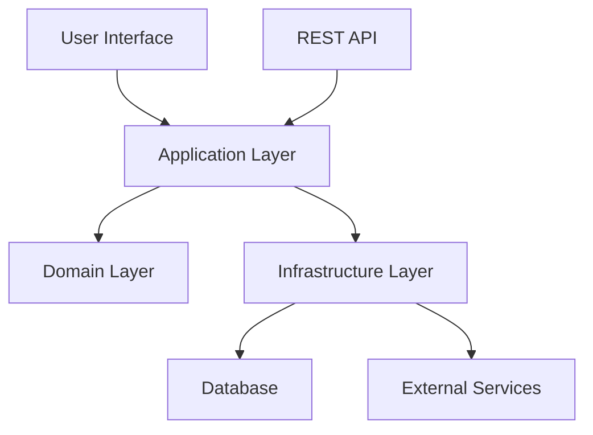

# Architecture Guide

This document describes the architectural patterns for vibes-pro. For a deeper dive into how these patterns are implemented by the AI-driven tooling, see the [AI Agent Playbook](./ai-agent-playbook.md).

## Hexagonal Architecture

This project follows **Hexagonal Architecture** (Ports and Adapters pattern). This approach is central to the project's design and is a core part of the [MergeKit Integration Blueprint](./mergekit/integration-blueprint.md).

- **Separation of Concerns**: Clear boundaries between business logic and external concerns.
- **Testability**: Easy to unit test business logic in isolation.
- **Flexibility**: Easy to swap out external dependencies.
- **Maintainability**: Changes to external systems don't affect business rules.

### Architecture Diagram

## Domain-Driven Design

The project is organized into several bounded contexts, each representing a distinct part of the business domain. The core specifications for these are defined in the [MergeKit PRD](./mergekit/PRD.md) and [SDS](./mergekit/SDS.md).

### Bounded Contexts

#### Core Domain
- **Entities**: Core business objects with identity
- **Value Objects**: Immutable data structures
- **Domain Services**: Complex business operations
- **Repository Interfaces**: Data access abstractions

#### User Domain
- **Entities**: Core business objects with identity
- **Value Objects**: Immutable data structures
- **Domain Services**: Complex business operations
- **Repository Interfaces**: Data access abstractions

#### Billing Domain
- **Entities**: Core business objects with identity
- **Value Objects**: Immutable data structures
- **Domain Services**: Complex business operations
- **Repository Interfaces**: Data access abstractions

## Layer Structure

The layer structure is enforced by the project generator. You can create new components within this structure by following the [Scaffold with Nx](../how-to/scaffold-with-nx.md) guide.

1. **Domain Layer** (`libs/{domain}/domain/`): Pure business logic
2. **Application Layer** (`libs/{domain}/application/`): Use cases and ports
3. **Infrastructure Layer** (`libs/{domain}/infrastructure/`): External adapters
4. **Interface Layer** (`apps/{app-name}/`): User/system interfaces

## Testing Strategy

The testing strategy is designed to ensure quality at every layer of the architecture.

- **Unit Tests**: Test domain logic in isolation. Our primary workflow for this is outlined in the [Getting Started with TDD](../tutorials/getting-started-tdd.md) tutorial.
- **Integration Tests**: Test with real databases and external services.
- **Architecture Tests**: Verify layer dependencies are correct.
- **Security Tests**: A comprehensive suite of security tests is also required. See [How to Run Security Tests](../how-to/security/run-security-tests.md) for details.
