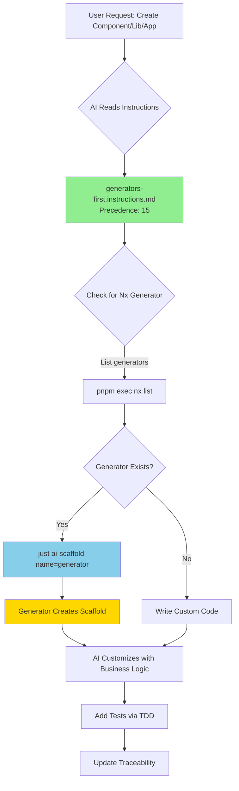
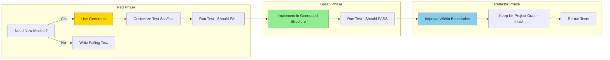
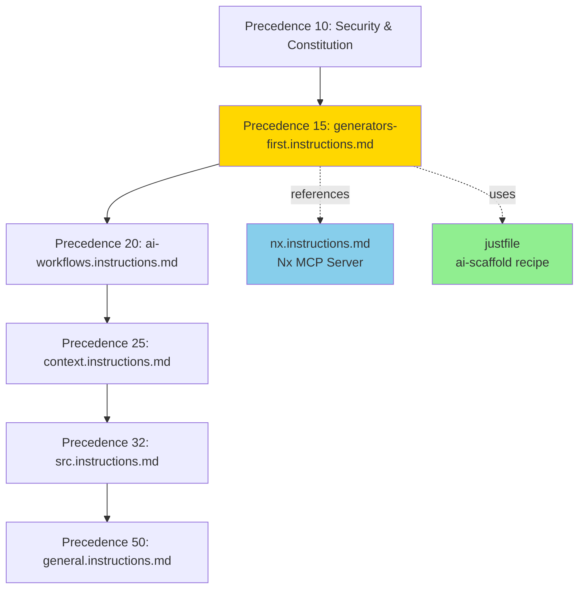
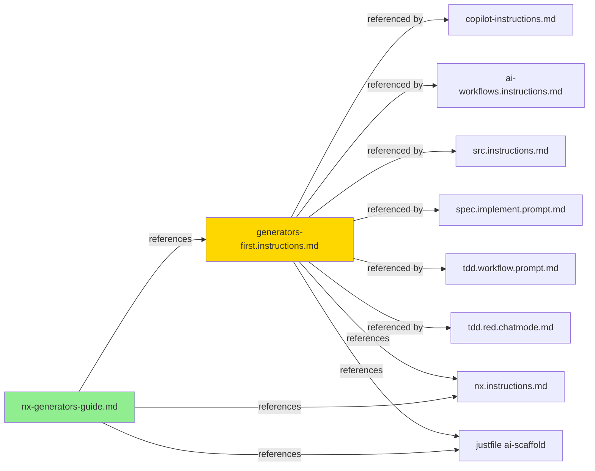
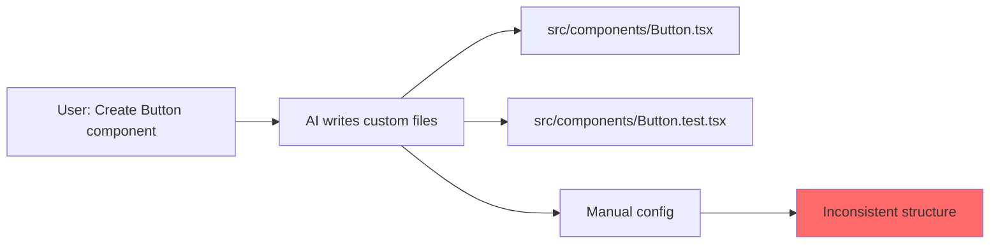
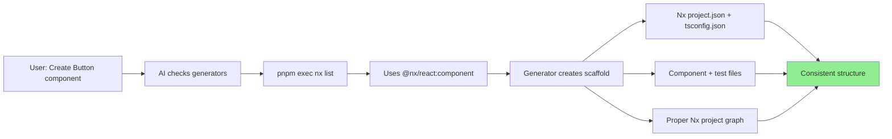

# Generator-First Workflow Diagram

## AI Workflow Integration



## TDD Workflow with Generators



## Spec Implementation Flow

```mermaid
graph TD
    S1[Read Spec: PRD/SDS/TS] --> S2[Identify Scope]
    S2 --> S3{What Type?}
    S3 -->|Library| L1[@nx/js:library]
    S3 -->|Component| L2[@nx/react:component]
    S3 -->|App| L3[@nx/node:application]
    S3 -->|Hook| L4[@nx/react:hook]

    L1 --> S4[just ai-scaffold]
    L2 --> S4
    L3 --> S4
    L4 --> S4

    S4 --> S5[Generator Creates Structure]
    S5 --> S6[Implement Business Logic]
    S6 --> S7[Add Tests]
    S7 --> S8[Update Traceability Matrix]

    style S4 fill:#FFD700
    style S5 fill:#90EE90
```

## Instruction Precedence Hierarchy



## File Cross-Reference Map



## Generator Selection Decision Tree

```mermaid
graph TD
    A[Need to Create Something] --> B{What are you creating?}

    B -->|Shared utilities, domain logic| C[@nx/js:library]
    B -->|React component| D[@nx/react:component]
    B -->|React library| E[@nx/react:library]
    B -->|Custom hook| F[@nx/react:hook]
    B -->|REST API| G[@nx/node:application]
    B -->|Next.js app| H[@nx/next:application<br/>Install: pnpm add -D @nx/next]
    B -->|Mobile app| I[@nx/expo:application<br/>Install: pnpm add -D @nx/expo]
    B -->|Python API| J[@nxlv/python:application<br/>Install: pnpm add -D @nxlv/python]

    C --> K[just ai-scaffold name=@nx/js:library]
    D --> L[pnpm exec nx g @nx/react:component MyComponent]
    E --> K
    F --> M[pnpm exec nx g @nx/react:hook useMyHook]
    G --> N[pnpm exec nx g @nx/node:application api]
    H --> O[pnpm exec nx g @nx/next:application web]
    I --> P[pnpm exec nx g @nx/expo:application mobile]
    J --> Q[pnpm exec nx g @nxlv/python:application api --type=fastapi]

    K --> R[Customize with Business Logic]
    L --> R
    M --> R
    N --> R
    O --> R
    P --> R
    Q --> R

    style K fill:#90EE90
    style R fill:#FFD700
```

## Before vs After Integration

### Before (AI writes custom code directly)



### After (Generator-first approach)



---

## Quick Commands Reference

```bash
# List all available generators
pnpm exec nx list

# List generators for specific plugin
pnpm exec nx list @nx/react

# Use generator via just recipe (recommended)
just ai-scaffold name=@nx/js:library

# Use generator directly
pnpm exec nx g @nx/react:component MyComponent

# Preview without creating (dry run)
pnpm exec nx g @nx/react:component MyComponent --dry-run

# Interactive mode (prompts for options)
pnpm exec nx g @nx/react:component
```

---

## Legend

-   🟡 **Yellow/Gold**: Generator-related (generators-first, ai-scaffold)
-   🟢 **Green**: Generated artifacts, successful outcomes
-   🔵 **Blue**: Nx infrastructure (MCP server, nx.instructions.md)
-   🔴 **Red**: Anti-patterns, problems to avoid
