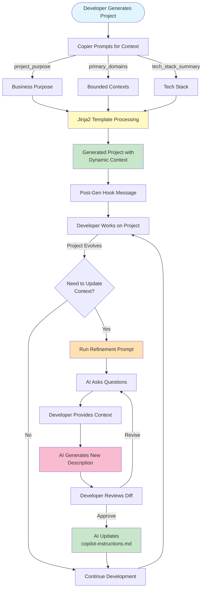

# Hybrid Context Workflow

## Initial Generation (Baseline Context)

```yaml
# User provides at generation time:
project_purpose: "A customer support platform with AI routing"
primary_domains: "ticketing,users,ai-suggestions"
tech_stack_summary: "Redis, OpenAI, SendGrid"
```

↓ **Jinja2 Template Processing**

```markdown
## Codebase Context

**You are assisting with** A customer support platform with AI routing.
This application follows hexagonal architecture with domain-driven design,
organized around bounded contexts: ticketing, users, ai-suggestions. The
technology stack includes next (frontend), fastapi (backend), postgresql
(database), and Redis, OpenAI, SendGrid.
```

## Post-Generation Evolution (Conversational Refinement)

```
┌─────────────────────────────────────────────────┐
│ 6 Months Later... Project Has Evolved          │
│                                                 │
│ • Added new domains (analytics, reporting)      │
│ • Integrated Temporal for workflows             │
│ • Implemented event-driven architecture         │
│ • Added real-time features with WebSockets      │
└─────────────────────────────────────────────────┘
                      ↓
┌─────────────────────────────────────────────────┐
│ Developer in VS Code:                           │
│ @workspace .github/prompts/                     │
│   project.describe-context.prompt.md            │
└─────────────────────────────────────────────────┘
                      ↓
┌─────────────────────────────────────────────────┐
│ AI Asks Questions:                              │
│                                                 │
│ 1. What's the primary purpose?                  │
│ 2. What are the main domains?                   │
│ 3. Has the tech stack evolved?                  │
│ 4. Any architectural highlights?                │
└─────────────────────────────────────────────────┘
                      ↓
┌─────────────────────────────────────────────────┐
│ Developer Answers:                              │
│                                                 │
│ • AI-powered customer support with analytics    │
│ • Domains: ticketing, users, ai, analytics,     │
│   reporting, workflows                          │
│ • Added: Temporal, real-time WebSocket layer    │
│ • Event-driven patterns, CQRS for analytics     │
└─────────────────────────────────────────────────┘
                      ↓
┌─────────────────────────────────────────────────┐
│ AI Generates New Description:                   │
│                                                 │
│ **You are assisting with** an AI-powered        │
│ customer support platform with integrated       │
│ analytics and workflow automation. This         │
│ application follows hexagonal architecture with │
│ domain-driven design and event-driven patterns, │
│ organized around bounded contexts: ticketing,   │
│ users, ai-suggestions, analytics, reporting,    │
│ and workflows. The technology stack includes    │
│ Next.js, FastAPI, PostgreSQL, Redis, Temporal,  │
│ OpenAI, SendGrid, and WebSocket for real-time   │
│ features. The system implements CQRS for        │
│ analytics and event sourcing for audit trails.  │
└─────────────────────────────────────────────────┘
                      ↓
┌─────────────────────────────────────────────────┐
│ Developer Reviews & Approves                    │
└─────────────────────────────────────────────────┘
                      ↓
┌─────────────────────────────────────────────────┐
│ AI Updates .github/copilot-instructions.md      │
└─────────────────────────────────────────────────┘
```

## Benefits Comparison

### Before (Static Context)

```
❌ Same text for all generated projects
❌ Quickly becomes outdated
❌ Manual editing required
❌ Easy to forget to update
❌ Inconsistent across projects
```

### After (Hybrid Approach)

```
✅ Dynamic context at generation
✅ Easy conversational updates
✅ Guided workflow ensures completeness
✅ No manual editing needed
✅ Project-specific and always relevant
```

## Key Features

### 1. **Sensible Defaults**

Projects work immediately with good baseline context

### 2. **Optional Refinement**

Developers can update when needed, not forced to

### 3. **Guided Conversation**

Structured questions ensure complete information

### 4. **No Template Dependency**

Projects can update context independently

### 5. **Traceability**

Context evolution can be tracked in ADRs

## Integration Points

```
copier.yml
    ↓ (defines variables)
{{project_slug}}/.github/copilot-instructions.md.j2
    ↓ (uses variables)
hooks/post_gen.py
    ↓ (suggests refinement)
{{project_slug}}/.github/prompts/project.describe-context.prompt.md
    ↓ (enables evolution)
{{project_slug}}/docs/how-to/refine-project-context.md
    ↓ (documents process)
```

---

**Architecture**: Hybrid (Static + Dynamic)
**Maintenance**: Low (No coupling between template and generated projects)
**User Experience**: High (Automatic + Optional refinement)
**Flexibility**: High (Can evolve independently)
