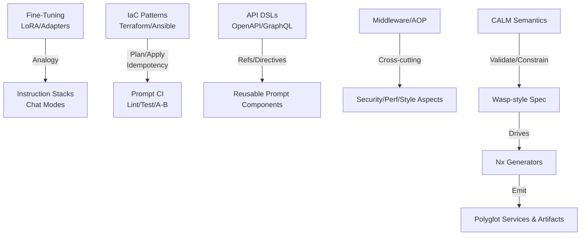
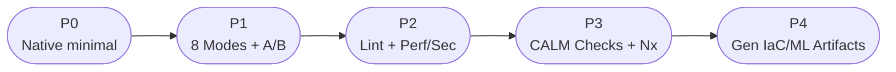
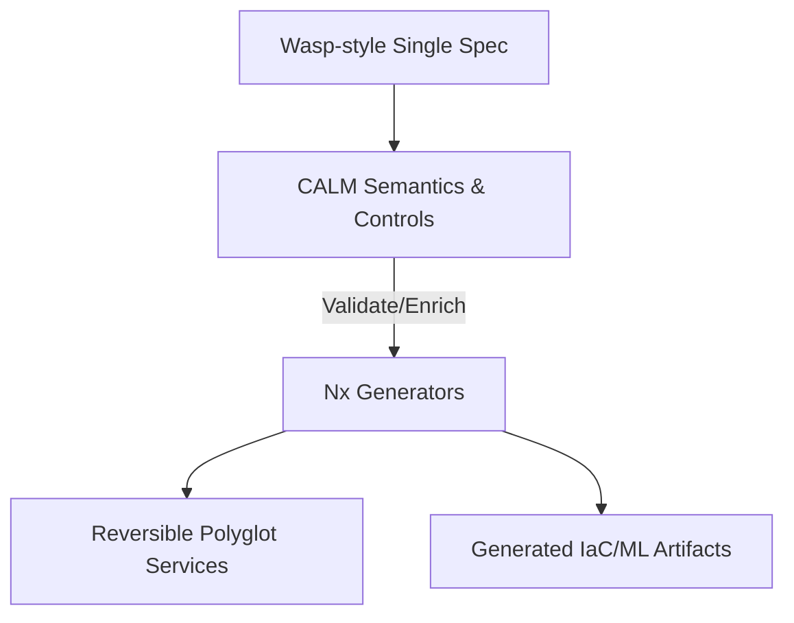

# Ideation Insights and Synthesis Report

Date: 2025-08-24
Source: `transcript.md`

## Golden thread summary

A composable, security‑first, and testable prompt‑programming ecosystem emerges by fusing modular software architecture patterns (composition over inheritance, plugins, middleware, AOP) with parameter‑efficient fine‑tuning analogies (LoRA/adapters) and successful DSL design lessons (Terraform HCL, Ansible, OpenAPI, GraphQL). The through‑line: treat prompts and instructions as code artifacts—versioned, validated, composable, and observable—implemented natively via GitHub Copilot and VS Code settings, prompts, and chat modes (no external DSL). Higher‑order architecture semantics (CALM) complement single‑spec generation (Wasp‑style) inside an Nx polyglot, reversible monorepo, enabling “LoRA‑style” stacking of instruction files and mode personas, safe defaults, and environment‑scoped configurations.

Notable quotes that anchor the thread:
- “Simple tasks should be simple; complex tasks should be possible.”
- “NO custom YAML files or external DSL.”
- “Implement ‘LoRA‑style’ stacking through multiple instruction file combinations.”
- “Use VS Code’s chat.promptFilesLocations … for dynamic prompt discovery.”

## 1) Concept synthesis document

### Core ideas and crisp definitions
- Composition over inheritance: Prefer assembling capabilities from small modules (instructions, prompts, modes) rather than deep hierarchies; mirrors plugin and middleware chains.
- Dependency Injection (DI): Decouple prompt behavior from specific context sources by injecting resources (files, MCP servers, settings) at the edges.
- Plugin/Middleware/AOP: Cross‑cutting concerns (security, performance, style) applied declaratively as instruction stacks, akin to Express middleware or GraphQL directives.
- Configuration‑as‑Code: Prompts/instructions live as versioned artifacts with review, lint, test, and rollback.
- Parameter‑efficient tuning (LoRA/adapters): $W = W_0 + \sum_i \Delta W_i$ as an analogy for additive instruction stacks and mode combinations without modifying the “base model.”
- Successful DSL traits (HCL/OpenAPI/GraphQL/Ansible): Clear schemas, component reuse ($ref, modules, roles), predictable override precedence, idempotence, and strong ecosystems.
- Prompt‑engineering patterns: Roles (system/user), few‑shot examples, chain‑of‑thought, prompt chaining, context injection (RAG), output controls (temperature, stop, max tokens), evaluation hooks.
- Cognitive ergonomics: Progressive disclosure, convention over configuration, predictable mental models, schema validation, and excellent error messaging.

### Underlying principles and mental models
- Layered composition: Base repository instructions → mode‑specific instructions → prompt templates → runtime parameters; mirrors Terraform modules and OpenAPI components.
- Declarative core with imperative escape hatches: Settings/prompt files remain declarative; tasks/scripts provide conditional orchestration.
- Idempotency and reversibility: Reapplying the same configuration yields stable behavior; changes are diffable and roll back cleanly (IaC mindset).
- Security by default: Disable unsafe auto‑approve flows; respect workspace trust; treat safety instructions as global aspects.

### Key insights and “aha” moments
- LoRA/adapters map cleanly to “instruction stacking”: small, targeted instruction files compose like adapter weights without rewriting the base.
- OpenAPI/GraphQL patterns suggest a schema‑validated prompt spec with reusable components and cross‑cutting directives (security/perf/style).
- Treating prompts as code enables a CI loop: lint, token budgets, A/B tests, regression baselines.
- Native Copilot/VS Code features are a sufficient “DSL substrate,” avoiding bespoke YAML while enabling hot reload and conditional scoping.

### Conceptual frameworks that emerged
- Architecture‑as‑Prompts: A pipeline from repository‑wide copilot‑instructions → modular instruction files → chat modes → prompt templates → VS Code tasks for composition/A‑B.
- Policy as aspects: Security/performance/style instructions operate as AOP‑like concerns woven across modes and prompts.
- State/Plan metaphor: “Preview” prompt effects (plan) before “apply” to production use; analogous to Terraform plan/apply.

### Metaphors and analogies
- “LoRA‑style stacking” of instructions ≈ additive deltas on a frozen base.
- Middleware pipeline ≈ ordered instruction sets.
- GraphQL directives ≈ instruction flags for cross‑cutting rules.
- Resource graphs (Terraform) ≈ dependency‑aware prompt/task chains.

> “Chain multiple configuration files for cascading effects.”
> “Hot‑reloading of instructions without VS Code restart.”

## 2) Outcomes & impact map (JTBD)

### Major ideas and their jobs‑to‑be‑done
- Modular native prompt system (Copilot/VS Code)
  - Job: Compose behavior safely without a custom DSL; enable reproducible, reviewable prompt ops.
  - Desired outcomes: Faster iteration; fewer prompt regressions; consistent safety posture.
  - Success metrics: Time‑to‑change (<10 min), lint/validation pass rate (>99%), rollback MTTR (<5 min), token budget adherence (>95%).
  - Stakeholders: Devs (speed), Security (guardrails), PM/Design (consistency), Ops (observability).
  - Transformation: From ad‑hoc prompting to governed prompt‑as‑code.

- Custom chat modes (8 roles + synergistic integration)
  - Job: Create purpose‑built personas aligned to delivery phases (PM → UX → Arch → FE/BE → QA → DevOps → Security).
  - Outcomes: Clear handoffs, fewer context switches, traceable decisions.
  - Metrics: Planning lead time −30%, rework defects −20%, mode usage coverage >80% of tasks.

- Security & performance guardrails
  - Job: Prevent unsafe tool execution; embed compliance and perf baselines.
  - Outcomes: Fewer incidents, consistent non‑functional posture.
  - Metrics: 0 auto‑approve usage, passing security checklist, perf regressions caught pre‑merge.

- CALM + Wasp + Nx reversible monorepo
  - Job: Marry architecture semantics (CALM) with single‑spec generation (Wasp‑style) and reproducible generators (Nx) for polyglot services.
  - Outcomes: Design‑time guarantees; reversible scaffolds; downstream IaC generated, not authoritative.
  - Metrics: CALM control violations → 0 in main; generator rebuilds deterministic; infra swap with no domain spec drift.

## 3) Cross‑domain connections matrix

- Fine‑tuning ↔ Prompt composition: LoRA/adapters ≈ instruction stacks and chat‑mode personas.
- IaC (Terraform/Ansible) ↔ Prompt CI: plan/apply, idempotency, roles/modules → prompts/modes.
- API schema DSLs (OpenAPI/GraphQL) ↔ Prompt components: $ref/allOf/directives → prompt includes/overrides/aspects.
- AOP/Middleware ↔ Safety/Perf/Style: Cross‑cutting instructions woven globally.
- CALM ↔ Wasp/Nx: Semantics/policy meta‑layer over single‑spec generation within reversible generators.

System‑level interactions: CALM governs boundaries and contracts; Wasp‑style spec declares feature intent; Nx regenerates consistently; IaC/ML pipeline YAML are downstream artifacts to avoid drift.

## 4) Implementation pathways (Design Thinking)

### Prototype possibilities
- P0: Native stack only—repo instructions + instruction files + prompt templates + 1–2 chat modes; token logging via tasks.
- P1: Full 8 mode personas with synergistic guidance; A/B tasks for prompt variants.
- P2: Lint/validate pipeline (naming, token limits, required sections); perf baselines and security checklists.
- P3: CALM as semantics checker over Wasp‑style contract; fail builds on control violations; Nx generator integration.
- P4: Generated downstream IaC (Pulumi YAML/CDK) and pipelines (ZenML YAML) from the upstream model; still reversible.

### Minimum viable experiments (MVEs)
- MVE‑1: Compare “LoRA‑style” instruction stacking vs single file—measure token usage, accuracy, and drift.
- MVE‑2: A/B test two chat modes for the same task—collect latency/tokens/quality.
- MVE‑3: Add one CALM control (e.g., “Public API requires versioned contract + structured logging”) and gate generator.
- MVE‑4: Hot‑reload edits (no restart) versus cold‑reload—measure DX delta.

### Resource requirements and constraints
- People: 1–2 engineers (tooling), 1 security, 1 PM/UX for modes; optional infra engineer.
- Tools: VS Code tasks, Copilot chat modes/prompts, JSON Schema for linting, Nx generators; optional SAST/SCA.
- Constraints: No external DSL; must respect workspace trust; keep zero‑touch onboarding.

### Risks and mitigations
- Overlapping semantics (modes vs instructions): Define precedence and keep MECE.
- Cognitive load: Progressive disclosure; templates/snippets; docs.
- Security misconfig: Disallow auto‑approve, enforce safe defaults, preflight checks.
- Vendor‑specific drift (IaC backends): Keep IaC generated and disposable.

### Phased approach

## 5) Knowledge landscape

### Open questions
- How stable are undocumented VS Code discovery features across versions?
- What is the right granularity of instruction files before context bloat outweighs reuse?
- Where should precedence live when mode guidance conflicts with repository‑wide instructions?
- How strong are CALM controls and pattern libraries for real‑world microservice topologies today?

### Assumptions to validate
- Instruction stacking improves accuracy without excessive tokens.
- Mode‑persona separation reduces cognitive switching costs for teams.
- CALM can be introduced first as a checker without impacting delivery speed.

### Research directions
- Define a JSON Schema for instruction file structure and prompt templates to enable IDE validation.
- Explore directive‑like annotations in instruction files to mimic GraphQL directives for cross‑cutting concerns.
- Investigate monotonic workflows (CALM‑theorem lens) for reversible pipelines and roll‑forward ops.

### Expert domains to consult
- AppSec reviewers for prompt‑injection guardrails and workspace trust posture.
- HCI/UX for cognitive ergonomics and mode scaffolding.
- DSL/tooling engineers for schema design and editor integration.
- Distributed systems architects for CALM controls and semantics.

### Learning opportunities identified
- Build a “plan” view that previews effective prompt after stacking and scoping (like Terraform plan).
- Develop token budgets per mode and fail fast when budgets are exceeded.
- Create an evaluation harness: golden questions with acceptance thresholds per mode.

## Breakthroughs and paradigm shifts
- From free‑form prompting to prompt‑as‑code with policy aspects and CI.
- From single monolithic instructions to layered, LoRA‑style additive guidance.
- From bespoke DSLs to native Copilot/VS Code configuration as an effective substrate.
- From infra‑first to contract‑first: CALM/Nx/Wasp separation preserves reversibility and intent.

## Creative tensions and productive contradictions
- Declarative simplicity vs. need for conditional flows → resolved via tasks/automation, not in‑DSL branching.
- Security strictness vs. performance freedom → mode‑specific budgets and controls with explicit overrides.
- Reuse vs. context window limits → strategic ordering, pruning, and evaluation‑guided refactors.

## Direct quotes (high‑signal)
- “Use VS Code’s chat.promptFilesLocations setting for dynamic prompt discovery.”
- “Leverage workspace trust boundaries for security isolation.”
- “Implement prompt injection defenses … [disable] chat.tools.autoApprove.”
- “Implement ‘LoRA‑style’ stacking through multiple instruction file combinations.”
- “Hot‑reloading of instructions without VS Code restart.”

## Appendix: CALM + Wasp + Nx synergy (from transcript follow‑ups)
- CALM as meta‑layer semantics/policy over a Wasp‑style single spec; Nx generators create reversible polyglot services; IaC/ML YAML become downstream artifacts.
- Decision heuristic: Wasp expresses product/domain intent; CALM asserts architectural constraints/policies; Nx realizes code; IaC/CDK selectable and ephemeral.

— End of report —
