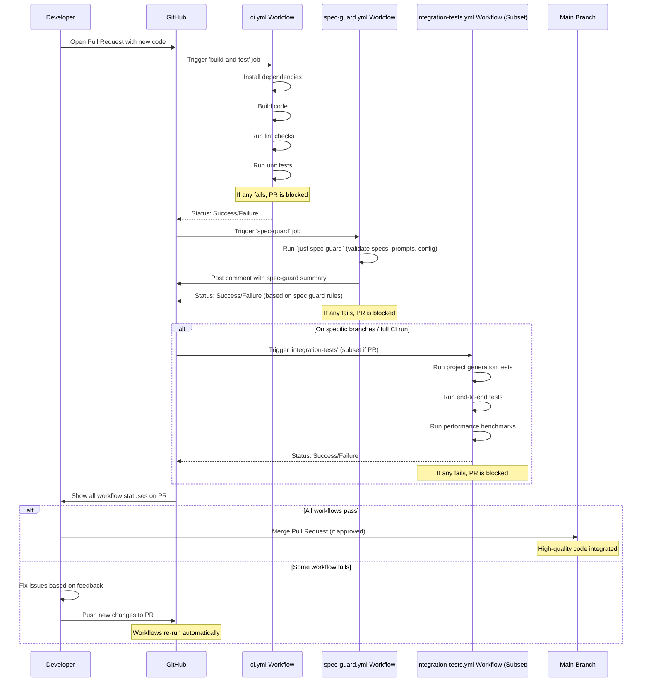

# Chapter 10: CI Workflows & Quality Gates

In our last chapter, [Temporal Database (redb)](09_temporal_database___redb__.md), we learned how `Vibes-Pro` uses a special database as the project's memory, helping the AI learn from past events. But even with smart AI and a robust memory, how do we make absolutely sure that _every single new piece of code_ added to the project is high quality, doesn't break anything, and follows all our established rules _before_ it becomes part of that history?

This is where **CI Workflows & Quality Gates** come in.

### 10.1 The Code Bouncer: What Problem Do CI & Quality Gates Solve?

Imagine you're managing a very exclusive club (your `Vibes-Pro` project). You want to ensure only the best people (high-quality code changes) get in. If anyone could just walk in, the club would quickly become chaotic, messy, and lose its good reputation.

Manually checking every single person at the door would be slow, tiring, and inconsistent. Sometimes you'd miss something, and someone who doesn't fit the standards would get in.

In software development, this "bouncer" problem is crucial. Every time a developer (or the AI) writes new code, it could:

-   Introduce new bugs.
-   Break existing features (a "regression").
-   Not follow the project's coding style or security rules.
-   Make the project harder to maintain.

Our central use case for this chapter is: **How does `Vibes-Pro` automatically ensure that all new code, especially code generated by AI or written by a human, meets a high standard of quality and doesn't introduce problems _before_ it's allowed into the main project?**

The answer lies in **CI Workflows** acting as **Quality Gates**. They are automated, consistent "checkpoints" that enforce standards for every single code change.

### 10.2 Continuous Integration (CI): The Automated Assembly Line

**Continuous Integration (CI)** is like an automated assembly line for your code. Every time a small change is made (like adding a new part to a car), it's immediately integrated into the main product, and a series of automated checks are run.

In `Vibes-Pro`, the "assembly line" is handled by **GitHub Actions workflows**. These are special files (`.yml`) that live in the `.github/workflows/` folder. They tell GitHub exactly what steps to take, in what order, whenever something important happens in your code repository (like someone trying to add new code).

The key idea of CI is to:

-   **Integrate frequently**: Merge small code changes often.
-   **Automate checks**: Run tests, linting, and other quality checks automatically.
-   **Find issues early**: Catch problems as soon as they are introduced, making them easier to fix.

### 10.3 Quality Gates: The Required Checkpoints

If CI is the assembly line, **Quality Gates** are the mandatory checkpoints along that line. You cannot move forward to the next stage (like merging code into the main project) until you've successfully passed all the checks at the current gate.

For `Vibes-Pro`, these quality gates ensure that:

-   All code follows defined [AI Instructions & Guardrails](03_ai_instructions___guardrails_.md) and general coding standards.
-   No new bugs are introduced (caught by tests).
-   The project's architectural principles (like [Hexagonal Architecture + DDD](06_hexagonal_architecture___ddd_.md)) are upheld.
-   AI-generated content is also validated.

### 10.4 How `Vibes-Pro` Uses CI Workflows & Quality Gates

Let's see how `Vibes-Pro` addresses our use case: ensuring new code meets quality standards. The main trigger for these gates is usually when a developer creates a **Pull Request (PR)**, asking to merge their new code into the `main` branch.

`Vibes-Pro` uses several GitHub Actions workflows, each acting as a distinct quality gate.

#### 10.4.1 The Core Build & Test Gate (`ci.yml`)

This is the most fundamental gate. It checks if the code can be built and if all basic tests pass.

```yaml
# .github/workflows/ci.yml (simplified)
name: CI

on:
    push:
        branches: [main]
    pull_request: # This makes it a quality gate for PRs
        branches: [main]

jobs:
    build-and-test:
        runs-on: ubuntu-latest
        steps:
            - name: Checkout repository
              uses: actions/checkout@v4 # Gets your code

            - name: Install dependencies # Sets up Node.js and Python
              run: |
                  pnpm install --frozen-lockfile
                  uv sync --group dev --all-extras --frozen

            - name: Build projects
              run: pnpm build # Checks if code compiles

            - name: Lint # Checks code style and potential errors
              run: |
                  pnpm lint
                  uv run ruff check .

            - name: Run tests # Runs all unit tests
              run: |
                  pnpm test:jest --runInBand --passWithNoTests || { echo "::error::Jest failed"; exit 1; }
                  uv run pytest || { echo "::error::Pytest failed"; exit 1; }
                  echo "All tests passed successfully!"
```

**Explanation:**

-   `on: pull_request`: This ensures the workflow runs automatically whenever a new PR is opened or updated, making it a gate.
-   `Install dependencies` and `Build projects`: These steps make sure the project can be set up and compiled correctly.
-   `Lint`: This step runs tools like `pnpm lint` (for TypeScript/Node.js) and `uv run ruff check` (for Python) to check for style violations and potential bugs.
-   `Run tests`: This is crucial! It executes all unit tests (Jest for Node.js, Pytest for Python). The `|| { echo "::error::...; exit 1; }` part is vital: if any test fails, it logs an error and stops the workflow, preventing the PR from being merged.

#### 10.4.2 The Spec & AI Guard Gate (`spec-guard.yml`)

This gate ensures adherence to [Specification-Driven Development (Specs)](04_specification_driven_development__specs__.md) and validates AI-specific files and instructions.

```yaml
# .github/workflows/spec-guard.yml (simplified)
name: Spec Guard CI

on:
    pull_request:
    push:
        branches: [main]

jobs:
    ci:
        runs-on: ubuntu-latest
        steps:
            - uses: actions/checkout@v4
            - name: Setup Node.js and pnpm
              uses: ./.github/actions/setup-node-pnpm # Custom action for setup
            - name: Setup Just
              uses: ./.github/actions/setup-just # Custom action for setup
            - name: Run Spec Guard bundle
              run: just spec-guard # Executes a command from Justfile

            - name: Upsert PR comment # Provides feedback directly on the Pull Request
              if: github.event_name == 'pull_request'
              uses: actions/github-script@v7
              with:
                  script: |
                      // Reads a temporary file created by 'just spec-guard'
                      const fs = require('fs');
                      const body = fs.readFileSync('.tmp/pr_comment.md', 'utf8');
                      // ... logic to find and update a comment on the PR ...
```

**Explanation:**

-   `Run Spec Guard bundle`: This step calls a [Justfile & Task Automation](08_justfile___task_automation_.md) recipe named `spec-guard`. This `just` command might perform checks like:
    -   Validating the [Traceability Matrix](04_specification_driven_development__specs__.md).
    -   Linting [Prompt](01_prompts_.md) files for correct structure and token budget (using tools from [Type Generation & Parity](07_type_generation___parity__.md) to count tokens).
    -   Ensuring [AI Instructions & Guardrails](03_ai_instructions___guardrails__.md) are properly defined.
-   `Upsert PR comment`: If this is a Pull Request, the workflow will generate a summary of its findings and post it directly as a comment on the PR. This gives developers immediate, detailed feedback, which is a powerful part of a quality gate.

This workflow directly enforces rules from `.github/instructions/ai-workflows.constitution.instructions.md`, which states:

```markdown
# AI Workflows Constitution & Governance (simplified)

## Core Principles

### 1. Spec-Driven Development

-   All changes MUST originate from a formal specification
-   Every commit MUST reference spec IDs in the commit message body

### 4. Quality Gates

-   All code must pass existing tests before committing
-   Run `just prompt-lint` and `just spec-matrix` before PRs
-   No manual bypassing of validation checks
-   Address all findings before merging
```

This excerpt shows that the `ai-workflows.constitution.instructions.md` file _defines_ what the quality gates should check, and the `spec-guard.yml` workflow _implements_ those checks.

#### 10.4.3 The Deeper Integration & Performance Gates (`integration-tests.yml`)

For more complex quality assurance, `Vibes-Pro` also has dedicated integration and performance tests.

```yaml
# .github/workflows/integration-tests.yml (simplified)
name: Integration Tests

on:
    push:
        branches: [main, develop, "feature/phase-5"]
# Note: This runs on 'push' to specific branches, not usually for every PR
# to save resources, but PRs could trigger a subset if needed.

jobs:
    project-generation: # Tests if new projects can be generated correctly
        name: Project Generation Tests
        runs-on: ubuntu-latest
        strategy:
            matrix: # Runs multiple variations
                architecture: [hexagonal, layered]
                ai_enabled: [true, false]
                framework: [next, remix]
        steps:
            # ... setup steps ...
            - name: Run project generation tests
              run: pnpm test:integration tests/integration/project-generation.test.ts
              env:
                  TEST_ARCHITECTURE: ${{ matrix.architecture }} # Uses matrix values
                  TEST_AI_ENABLED: ${{ matrix.ai_enabled }}
                  TEST_FRAMEWORK: ${{ matrix.framework }}

    end-to-end: # Tests the entire application flow
        name: End-to-End Integration
        runs-on: ubuntu-latest
        needs: project-generation # Only runs if project-generation passes
        steps:
            # ... setup steps ...
            - name: Run end-to-end tests
              run: pnpm test:integration tests/integration/end-to-end.test.ts
              timeout-minutes: 15 # Allows long running tests

    performance-benchmarks: # Checks for performance regressions
        name: Performance Benchmarks
        runs-on: ubuntu-latest
        steps:
            # ... setup steps ...
            - name: Run performance tests
              run: pnpm test:integration tests/integration/performance.test.ts
              timeout-minutes: 10
```

**Explanation:**

-   `project-generation`: This job uses a `matrix` to test if [Copier Templates & Generators](05_copier_templates___generators__.md) correctly create projects with different configurations (e.g., `hexagonal` architecture, AI `enabled` or `disabled`, `next.js` or `remix` framework). If a generated project is broken, this gate fails.
-   `end-to-end`: These tests simulate real user interactions, ensuring that major parts of the system work together as expected.
-   `performance-benchmarks`: This job runs tests to measure how fast the application performs critical tasks. If performance drops below a certain threshold, this gate can also fail.

These deeper checks are crucial for the overall health of the `Vibes-Pro` project, especially for validating the core `Vibes-Pro` template itself.

### 10.5 Under the Hood: The Automated Review Process

When you open a Pull Request in `Vibes-Pro`, here's a simplified sequence of how CI Workflows and Quality Gates ensure your code meets standards:



#### Deeper Dive into Quality Gate Enforcement

Let's look at how the `exit 1` command in shell scripts or CI job steps is absolutely critical for quality gates.

From `.github/workflows/ci.yml`:

```bash
# Inside a 'Run tests' step in ci.yml
pnpm test:jest --runInBand --passWithNoTests || { echo "::error::Jest tests failed"; exit 1; }
echo "Running Node smoke tests..."
pnpm test:node || { echo "::error::Node smoke tests failed"; exit 1; }
echo "Running pytest..."
uv run pytest || { echo "::error::Pytest failed"; exit 1; }
echo "All tests passed successfully!"
```

**Explanation:**

-   Each `command || { ...; exit 1; }` block is a mini-quality gate.
-   The `||` (OR operator) means: "If the command before me (`pnpm test:jest`) fails (returns a non-zero exit code), then execute the commands inside the `{}` block."
-   `echo "::error::..."`: This prints a special message that GitHub Actions recognizes as an error, highlighting it in the workflow logs.
-   `exit 1`: This is the crucial part. It tells the GitHub Actions job that this step has **failed**. If any step in a job fails, the entire job (and thus the workflow) will be marked as failed, preventing the Pull Request from being merged. This is how the "gate" works – if you don't pass, you don't proceed.

This robust system ensures that every code change undergoes a rigorous, automated inspection before being accepted into the `Vibes-Pro` project, maintaining a high level of quality and consistency.

### 10.6 Benefits of CI Workflows & Quality Gates

Implementing CI Workflows with strong Quality Gates provides massive benefits to `Vibes-Pro` development:

| Feature            | Development WITHOUT CI / Quality Gates                                        | Development WITH CI / Quality Gates (in `Vibes-Pro`)                    |
| :----------------- | :---------------------------------------------------------------------------- | :---------------------------------------------------------------------- |
| **Code Quality**   | Inconsistent, prone to regressions, bugs discovered late.                     | Consistently high quality, fewer bugs, prevents regressions.            |
| **Confidence**     | Fear of breaking existing features, slow and risky merges.                    | High confidence in code changes, quick and reliable merges.             |
| **Consistency**    | Style guides and best practices easily ignored or forgotten.                  | All code adheres to project standards, AI and human code is consistent. |
| **Feedback Loop**  | Manual reviews are slow, feedback comes late in the process.                  | Immediate, automated feedback on every code change, directly on PRs.    |
| **Developer Time** | Developers spend time manually testing, debugging, or reviewing basic errors. | Developers focus on new features, AI handles routine quality checks.    |
| **Onboarding**     | New developers might struggle to understand all quality requirements.         | Quality gates automatically educate and enforce standards for everyone. |

### 10.7 Conclusion

In this chapter, we explored **CI Workflows & Quality Gates** in `Vibes-Pro`. We learned that GitHub Actions workflows act as an automated assembly line, running essential checks every time code changes. These workflows contain critical "quality gates"—such as linting, testing, spec validation, and security scans—that _must pass_ before any new code can be merged into the project. This robust, automated system ensures that all `Vibes-Pro` code, whether written by humans or generated by AI, maintains a consistently high standard of quality, prevents regressions, and always adheres to the project's foundational principles. It's the ultimate safeguard for a reliable and efficient development process.

---

<sub><sup>Generated by [AI Codebase Knowledge Builder](https://github.com/The-Pocket/Tutorial-Codebase-Knowledge).</sup></sub> <sub><sup>**References**: [[1]](https://github.com/SPRIME01/Vibes-Pro/blob/61b36a3f5ed748ceae18c92b1d0a340657d8e477/.github/workflows/ci.yml), [[2]](https://github.com/SPRIME01/Vibes-Pro/blob/61b36a3f5ed748ceae18c92b1d0a340657d8e477/.github/workflows/integration-tests.yml), [[3]](https://github.com/SPRIME01/Vibes-Pro/blob/61b36a3f5ed748ceae18c92b1d0a340657d8e477/.github/workflows/spec-guard.yml), [[4]](https://github.com/SPRIME01/Vibes-Pro/blob/61b36a3f5ed748ceae18c92b1d0a340657d8e477/templates/{{project_slug}}/.github/instructions/ai-workflows.constitution.instructions.md), [[5]](https://github.com/SPRIME01/Vibes-Pro/blob/61b36a3f5ed748ceae18c92b1d0a340657d8e477/templates/{{project_slug}}/.github/workflows/spec-guard.yml.j2)</sup></sub>
