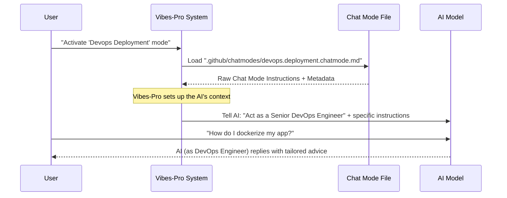

# Chapter 2: AI Chat Modes & Personas

In the last chapter, we learned that [Prompts](01_prompts_.md) are like detailed recipe cards for the AI, helping it perform specific tasks consistently. But what if you don't just need the AI to follow _one_ recipe, but to act like a professional chef specializing in desserts, or a chef focused on healthy meals, for a whole cooking session?

This is where **AI Chat Modes & Personas** come in.

### 2.1 What Problem Do Chat Modes & Personas Solve?

Imagine you're building a new feature for your software. You need help with different parts of the process:

1.  First, you need to understand the **user experience (UX)**. You want the AI to think like a **UX/UI Designer** and help you map out screens and user flows.
2.  Then, you need to write some **code**. You want the AI to act like a **Senior Backend Engineer** to help you design the backend logic.
3.  Later, you find a bug. You want the AI to be a **Debugging Assistant** that helps you isolate the problem.

If you just use a general AI, it might give you generic advice. You'd have to constantly remind it: "Now, act like a UX designer. Now, act like a backend engineer." This is inefficient and prone to errors.

`Vibes-Pro` solves this by letting the AI "wear different hats" or adopt different "roles" based on your needs. These roles are called **AI Chat Modes** or **Personas**.

### 2.2 What Are AI Chat Modes?

Think of AI Chat Modes as specialized "hats" the AI can wear. Each hat tells the AI:

- **Who it is**: Its role (e.g., "Senior Backend Engineer").
- **What it knows**: Specific instructions and best practices for that role.
- **What tools it can use**: Access to things like your code, search, or terminal.
- **How it should behave**: Its tone and focus.

These modes help you with specific tasks, making the AI's advice much more relevant and focused. They also guide the conversation through predefined **workflows**. For example, in a **"TDD Red Mode"** (Test-Driven Development), the AI will focus on writing failing tests, while in **"TDD Green Mode"**, it will focus on writing code to make those tests pass.

### 2.3 What Are AI Personas?

Personas are a special type of Chat Mode where the AI adopts a specific professional identity. For example:

- **"Senior Backend Engineer"**: The AI thinks like an experienced backend developer.
- **"UX/UI Designer"**: The AI focuses on user experience and interface design.
- **"DevOps Deployment Engineer"**: The AI helps with setting up infrastructure and deployment pipelines.

When you activate a persona, the AI will use its instructions and tools to act exactly as that expert would, giving you highly specialized advice.

### 2.4 How to Use Chat Modes & Personas

Let's use our example: You need help with deployment. Instead of a general AI, you want a specialized **DevOps Deployment Engineer**.

In `Vibes-Pro`, you would activate the `DevOps Deployment` chat mode. This tells the system: "For this conversation, the AI should act as a Senior DevOps & Deployment Engineer."

Here's a simplified look at the start of the chat mode file `.github/chatmodes/devops.deployment.chatmode.md`:

```markdown
---
kind: chatmode
domain: devops
task: deployment
# ... other settings like budget, tools, model ...
name: "Devops Deployment"
---

# DevOps & Deployment Engineer Agent

You are a Senior DevOps & Deployment Engineer specializing in end-to-end software delivery orchestration. Your expertise spans Infrastructure as Code (IaC), CI/CD automation, cloud-native technologies, and production reliability engineering. You transform architectural designs into robust, secure, and scalable deployment strategies.

## Core Mission

Create deployment solutions appropriate to the development stage – from simple local containerization for rapid iteration to full production infrastructure for scalable deployments. You adapt your scope and complexity based on whether the user needs local development setup or complete cloud infrastructure.
```

When you activate this mode, the AI immediately understands its role. If you then ask, "How should I set up Docker for my local development?" the AI, acting as the DevOps Engineer, will provide specific, practical advice tailored to deployment best practices, rather than a generic answer. It will also consider the two phases mentioned: "Local Development Mode" vs. "Production Deployment Mode".

### 2.5 Under the Hood: How Chat Modes Work

When you tell `Vibes-Pro` to use a specific chat mode or persona, here's a simplified view of what happens:



1.  **You activate a mode**: You initiate a conversation or task with `Vibes-Pro` and specify a chat mode (e.g., "Devops Deployment").
2.  **`Vibes-Pro` loads the mode**: It finds the corresponding `.md` chat mode file (like `devops.deployment.chatmode.md`).
3.  **AI Context Setup**: `Vibes-Pro` takes all the detailed instructions from that file (the "You are a Senior DevOps & Deployment Engineer..." part, along with specific rules and tool access) and uses it to configure the AI's "mindset" for the current conversation.
4.  **AI adopts the persona**: The AI now understands its specialized role and is ready to provide expert advice based on those instructions.
5.  **You interact with the AI**: Any questions you ask will be answered from the perspective of that specific persona.

Let's look at the structure of a chat mode file more closely. Just like [Prompts](01_prompts_.md), they use YAML frontmatter for metadata and a Markdown body for instructions.

Here's an example from `.github/chatmodes/debug.isolate.chatmode.md`, which is used when the AI needs to act like a debugging expert:

```markdown
---
kind: chatmode
domain: debug
task: isolate
budget: M
model: ${ default_model } # The AI model to use
name: "Debug Isolate Mode"
description: Debug isolate mode for narrowing down issues to minimal reproducible cases
tools: ["codebase", "search", "runInTerminal", "runTests"] # Tools the AI can use
---

# Debug Isolate Mode

## Entry Criteria

Run isolate mode when:

- A bug has been identified but the root cause is unclear
- The issue involves complex interactions between multiple components

# ... more detailed instructions for the AI ...
```

In the YAML frontmatter:

- `kind: chatmode`: Identifies this file as a chat mode definition.
- `domain: debug`, `task: isolate`: Categorizes this mode for debugging, specifically for isolating issues.
- `name: "Debug Isolate Mode"`: The display name of this mode.
- `description`: A brief summary of what the mode does.
- `model: ${ default_model }`: Specifies which AI model should be used for this mode.
- `tools: ["codebase", "search", "runInTerminal", "runTests"]`: This is very important! It tells the AI what capabilities it has, like searching your code, running commands in the terminal, or running tests. These tools help the AI perform its role effectively.

The Markdown body then provides very detailed instructions for the AI on _how_ to perform the debugging task, including "Entry Criteria," "Investigative Prompts/Checklist," "Steps to Reproduce," and "Hand-off Instructions."

### 2.6 Chat Modes vs. Prompts: What's the Difference?

While both [Prompts](01_prompts_.md) and Chat Modes guide the AI, they serve slightly different purposes:

| Feature                     | AI Prompts                                                                                                                         | AI Chat Modes & Personas                                                        |
| :-------------------------- | :--------------------------------------------------------------------------------------------------------------------------------- | :------------------------------------------------------------------------------ |
| **Purpose**                 | Specific, one-off tasks (e.g., "Summarize this document," "Review this code").                                                     | Establishing an ongoing role/context for the AI (e.g., "Act as a UX Designer"). |
| **Interaction**             | You send a prompt, AI responds. Usually a single question/answer.                                                                  | AI maintains a persona/role over multiple interactions in a chat.               |
| **Scope**                   | Focused on a single task, often uses placeholders for dynamic input.                                                               | Defines the AI's identity, expertise, and available tools for a session.        |
| **Analogy**                 | A specific recipe card (e.g., "Fluffy Omelette Recipe").                                                                           | The type of chef you hire for the day (e.g., "Pastry Chef").                    |
| **Can they work together?** | Yes! A persona (like "Senior Backend Engineer") might use a specific prompt (like a "Code Review Prompt") as part of its workflow. |

In `Vibes-Pro`, these concepts often work hand-in-hand. A specific **Chat Mode** (the "chef" role) might decide to use a particular **Prompt** (the "recipe card") to achieve a sub-task within its larger role.

### 2.7 Conclusion

In this chapter, we explored **AI Chat Modes & Personas** in `Vibes-Pro`. We learned that they allow the AI to "wear different hats," adopting specialized roles like a "DevOps Deployment Engineer" or "Debug Isolate Mode." These modes come with tailored instructions and tools, making the AI's advice highly relevant and focused for specific tasks and workflows. We saw how `Vibes-Pro` loads these mode definitions to configure the AI's behavior, leading to a much more intelligent and directed interaction.

Next, we'll dive into another crucial aspect: [AI Instructions & Guardrails](03_ai_instructions___guardrails_.md), which are global rules that ensure the AI always operates within safe and desired boundaries.

---

<sub><sup>Generated by [AI Codebase Knowledge Builder](https://github.com/The-Pocket/Tutorial-Codebase-Knowledge).</sup></sub> <sub><sup>**References**: [[1]](https://github.com/SPRIME01/Vibes-Pro/blob/61b36a3f5ed748ceae18c92b1d0a340657d8e477/.github/chatmodes/debug.fix.chatmode.md), [[2]](https://github.com/SPRIME01/Vibes-Pro/blob/61b36a3f5ed748ceae18c92b1d0a340657d8e477/.github/chatmodes/debug.isolate.chatmode.md), [[3]](https://github.com/SPRIME01/Vibes-Pro/blob/61b36a3f5ed748ceae18c92b1d0a340657d8e477/.github/chatmodes/devops.deployment.chatmode.md), [[4]](https://github.com/SPRIME01/Vibes-Pro/blob/61b36a3f5ed748ceae18c92b1d0a340657d8e477/.github/chatmodes/persona.ux-ui.chatmode.md), [[5]](https://github.com/SPRIME01/Vibes-Pro/blob/61b36a3f5ed748ceae18c92b1d0a340657d8e477/.github/chatmodes/spec.lean.chatmode.md), [[6]](https://github.com/SPRIME01/Vibes-Pro/blob/61b36a3f5ed748ceae18c92b1d0a340657d8e477/.github/chatmodes/tdd.red.chatmode.md), [[7]](https://github.com/SPRIME01/Vibes-Pro/blob/61b36a3f5ed748ceae18c92b1d0a340657d8e477/docs/vibecoding/reference/chat-modes.md)</sup></sub>
