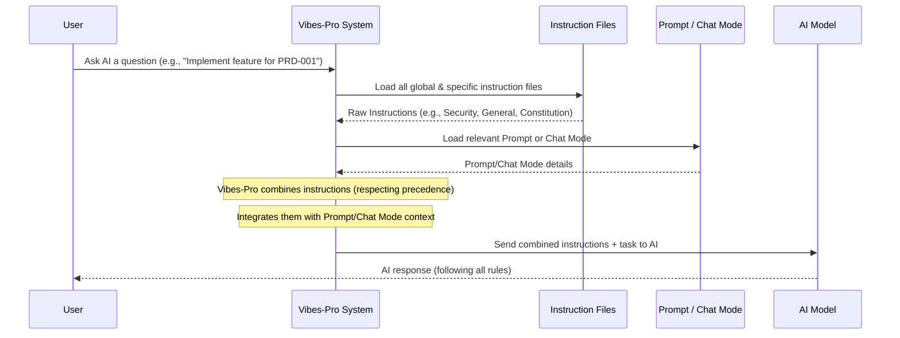

# Chapter 3: AI Instructions & Guardrails

In the previous chapters, we learned about [Prompts](01_prompts_.md) as recipe cards for specific AI tasks and [AI Chat Modes & Personas](02_ai_chat_modes___personas_.md) as ways to make the AI wear different expert hats for ongoing conversations. But what if you want to make sure the AI _always_ follows certain fundamental rules, no matter what recipe card it's using or what hat it's wearing?

This is where **AI Instructions & Guardrails** come in.

### 3.1 The AI's Rulebook: Why Do We Need It?

Imagine you've hired a team of brilliant chefs (your AI). You give them a recipe (a Prompt), and sometimes you ask them to specialize as a pastry chef or a grill master (a Chat Mode/Persona). But what if you have some non-negotiable kitchen rules?

-   "Always wash your hands before touching food."
-   "Never use peanuts if someone has an allergy."
-   "All dishes must be served hot."

These are **universal rules** that apply to _all_ chefs, _all_ recipes, and _all_ specializations. You wouldn't want to write these rules on every single recipe card or remind every chef every time.

In `Vibes-Pro`, **AI Instructions & Guardrails** are exactly like these universal kitchen rules. They are the AI's "constitution" or "rulebook." They set the fundamental boundaries and expectations for how the AI should behave, focusing on critical aspects like:

-   **Security**: "Never expose sensitive data."
-   **Coding Style**: "Always use consistent variable naming."
-   **Performance**: "Write efficient code."
-   **Project Specifics**: "Follow our project's development workflow."

These instructions act as constant guidelines, ensuring that any AI output, regardless of the prompt or chat mode, aligns with your project's core principles.

### 3.2 What Are AI Instructions?

AI Instructions are special Markdown files (`.md`) that contain these universal rules for the AI. They live in the `.github/instructions/` folder of your `Vibes-Pro` project.

Think of them as modular sections of a complete legal document. You might have one file for "Security Guidelines," another for "General Coding Practices," and even a "Constitution" that outlines the highest-level principles.

Here’s why they are so powerful:

-   **Consistency**: The AI always knows and follows the same rules.
-   **Safety**: Critical rules (like security ones) are _always_ enforced.
-   **Modularity**: Rules can be grouped by topic (security, style, performance), making them easy to manage.
-   **Stackable**: You can combine different sets of rules for different contexts if needed, though they are primarily global.

### 3.3 What Are AI Guardrails?

While "Instructions" are the rulebook itself, "Guardrails" are the _mechanisms_ that ensure these rules are followed. In `Vibes-Pro`, the guardrails are built into the system that processes AI requests. They actively channel the AI's behavior within defined safe and desired boundaries.

For example, a guardrail might ensure:

-   The AI _never_ writes code that could lead to a security vulnerability.
-   The AI _always_ includes a unit test with new code.
-   The AI _must_ reference a specification ID in its commit messages.

These guardrails are often expressed directly within the instruction files themselves (e.g., "Always sanitize inputs"), and the `Vibes-Pro` system is designed to emphasize and enforce them when communicating with the AI.

### 3.4 How Instructions & Guardrails Work

Let's look at some real-world instruction files in `Vibes-Pro` to see how they guide the AI.

#### Example 1: Global Copilot Instructions (`.github/copilot-instructions.md`)

This file contains very broad, repository-wide rules that apply to _any_ interaction with an AI assistant like GitHub Copilot.

```markdown
# Repository‑Wide Copilot Instructions

The purpose of these instructions is to provide repository‑specific guidance to GitHub Copilot and VS Code’s AI chat features. These instructions apply to every file in the repository.

-   This repository contains a modular AI assistant and related tooling written primarily in TypeScript with a Node.js runtime. When generating code, follow our established coding guidelines, naming conventions, and architectural patterns described in the instruction files under `.github/instructions`.
-   Always prioritize security: never write or modify `.vscode/settings.json` or `.vscode/tasks.json` without explicit user confirmation. Avoid setting `chat.tools.autoApprove` in any configuration, as this disables human confirmation and can lead to remote code execution.

# ... more general instructions ...
```

This file sets the stage. It tells the AI: "This is a TypeScript project, follow our style. **Most importantly, security comes first! Don't mess with VS Code settings without explicit permission.**" This is a crucial guardrail against potentially dangerous AI behavior.

#### Example 2: Specific Security Instructions (`.github/instructions/security.instructions.md`)

This file focuses entirely on security-related guardrails and has higher importance.

```markdown
---
description: "Security-focused instructions for Copilot and chat responses"
applyTo: "**"
kind: instructions
domain: security
precedence: 10
---

# Security Guidelines (Canonical)

-   Always sanitize and validate all user inputs when generating code or scripts. Never interpolate untrusted data into shell commands or SQL queries.
-   Never modify `.vscode/settings.json` or `.vscode/tasks.json` from within a prompt or generated code. Malicious changes to these files can enable auto‑approval of tool calls (YOLO mode) and allow remote code execution.

# ... more security rules ...
```

Notice the YAML frontmatter at the top:

-   `kind: instructions`: Identifies this file as an instruction set.
-   `domain: security`: Groups it under the "security" topic.
-   `precedence: 10`: This is important! It defines how important these rules are. A _lower_ number means _higher_ precedence (like a lower number on a sports jersey means a more senior player). `10` is a very high precedence, meaning these security rules are almost always prioritized over others.
-   `applyTo: "**"`: This means these instructions apply to _all_ files and contexts (`**` is a wildcard for everything).

The Markdown body then lists specific, critical security rules. These are guardrails that the AI must _always_ follow when generating code or interacting with your project. For instance, the instruction "Always sanitize and validate all user inputs" is a direct command to prevent common vulnerabilities.

#### Example 3: General Guidelines (`.github/instructions/general.instructions.md`)

This file contains more general behavioral guidelines for the AI.

```markdown
---
description: "General guidelines for Copilot and AI chat"
applyTo: "**"
kind: instructions
domain: general
precedence: 50
---

# General Guidelines

-   Be clear, concise, and polite when generating responses or code. Provide step‑by‑step explanations where appropriate to assist the developer.
-   Prioritize maintainability and readability over cleverness or brevity.
-   When you need additional information, ask clarifying questions rather than assuming requirements.
-   Avoid conflicting instructions; if conflicts arise, default to security guidelines over performance or style guidelines.
```

Here, `precedence: 50` means these are important but less critical than the `security` instructions (which had `precedence: 10`). Notice the line: "Avoid conflicting instructions; if conflicts arise, default to security guidelines over performance or style guidelines." This explicitly tells the AI about the rule hierarchy, reinforcing the guardrails.

### 3.5 Under the Hood: How Vibes-Pro Applies Instructions

When you interact with the AI in `Vibes-Pro`, the system doesn't just send your prompt or activate a chat mode in isolation. It first collects and combines all relevant instructions and guardrails.

Here’s a simplified look at the process:



1.  **You initiate a request**: You ask the AI to do something, perhaps through a specific [Prompt](01_prompts_.md) or within a [Chat Mode](02_ai_chat_modes___personas_.md).
2.  **`Vibes-Pro` gathers instructions**: The system automatically scans the `.github/instructions/` directory (and other locations, like the global `copilot-instructions.md`). It loads all instruction files that `applyTo` the current context.
3.  **Prioritization by `precedence`**: `Vibes-Pro` sorts these instructions based on their `precedence` value. Rules with lower `precedence` numbers (like `10` for security) are considered more important and are given higher priority when constructing the AI's full instruction set. If there's a conflict, the higher-precedence rule wins.
4.  **Context Building**: These prioritized instructions are then combined with the specific instructions from your chosen [Prompt](01_prompts_.md) or [Chat Mode](02_ai_chat_modes___personas_.md).
5.  **Send to AI**: `Vibes-Pro` sends this comprehensive package of rules and task details to the AI model.
6.  **AI follows rules**: The AI, having received its full "rulebook" for the current task, generates a response that adheres to all the instructions and guardrails.

This intelligent merging of instructions ensures that even when the AI is focused on a specific task or persona, it never forgets its fundamental duties regarding security, coding standards, and project guidelines.

### 3.6 Instructions vs. Prompts vs. Chat Modes: A Quick Recap

It's helpful to see how these three core concepts work together:

| Feature                     | AI Instructions & Guardrails                                                             | AI Prompts                                                                     | AI Chat Modes & Personas                                                        |
| :-------------------------- | :--------------------------------------------------------------------------------------- | :----------------------------------------------------------------------------- | :------------------------------------------------------------------------------ |
| **Purpose**                 | Universal, always-on rules and boundaries for _all_ AI interactions. The "constitution". | Specific, one-off tasks (e.g., "Summarize this document," "Review this code"). | Establishing an ongoing role/context for the AI (e.g., "Act as a UX Designer"). |
| **Interaction**             | Passive, always applied in the background.                                               | You send a prompt, AI responds. Usually a single question/answer.              | AI maintains a persona/role over multiple interactions in a chat.               |
| **Scope**                   | Global (or broadly applied using `applyTo`), foundational guidelines.                    | Focused on a single task, often uses placeholders for dynamic input.           | Defines the AI's identity, expertise, and available tools for a session.        |
| **Analogy**                 | Company-wide HR policy, kitchen health & safety rules.                                   | A specific recipe card (e.g., "Fluffy Omelette Recipe").                       | The type of chef you hire for the day (e.g., "Pastry Chef").                    |
| **Can they work together?** | **Yes, always!** Instructions are always applied, on top of prompts and chat modes.      | Yes, a chat mode can _use_ a prompt.                                           |

In short: Instructions are the bedrock of safe and consistent AI behavior in `Vibes-Pro`. Prompts are specific tasks, and Chat Modes define roles, but both operate _within_ the boundaries set by the Instructions and Guardrails.

### 3.7 Conclusion

In this chapter, we unpacked **AI Instructions & Guardrails** in `Vibes-Pro`. We learned that these are the AI's "rulebook" or "constitution," ensuring consistent behavior, prioritizing security, and adhering to project standards across all AI interactions. We saw how specific instruction files (like security or general guidelines) work, and how `Vibes-Pro` uses `precedence` to prioritize these rules, combining them with [Prompts](01_prompts_.md) and [Chat Modes](02_ai_chat_modes___personas_.md) to guide the AI effectively. This powerful system makes AI-assisted development reliable and safe.

Next, we'll dive into [Specification-Driven Development (Specs)](04_specification_driven_development__specs__.md), a core `Vibes-Pro` concept that helps you define what needs to be built with clarity and detail, acting as a crucial input for your AI assistant.

---

<sub><sup>Generated by [AI Codebase Knowledge Builder](https://github.com/The-Pocket/Tutorial-Codebase-Knowledge).</sup></sub> <sub><sup>**References**: [[1]](https://github.com/SPRIME01/Vibes-Pro/blob/61b36a3f5ed748ceae18c92b1d0a340657d8e477/.github/instructions/ai-workflows.constitution.instructions.md), [[2]](https://github.com/SPRIME01/Vibes-Pro/blob/61b36a3f5ed748ceae18c92b1d0a340657d8e477/.github/instructions/general.instructions.md), [[3]](https://github.com/SPRIME01/Vibes-Pro/blob/61b36a3f5ed748ceae18c92b1d0a340657d8e477/.github/instructions/security.instructions.md), [[4]](https://github.com/SPRIME01/Vibes-Pro/blob/61b36a3f5ed748ceae18c92b1d0a340657d8e477/docs/aiassist/maintainer-guide.md), [[5]](https://github.com/SPRIME01/Vibes-Pro/blob/61b36a3f5ed748ceae18c92b1d0a340657d8e477/templates/{{project_slug}}/.github/copilot-instructions.md)</sup></sub>
