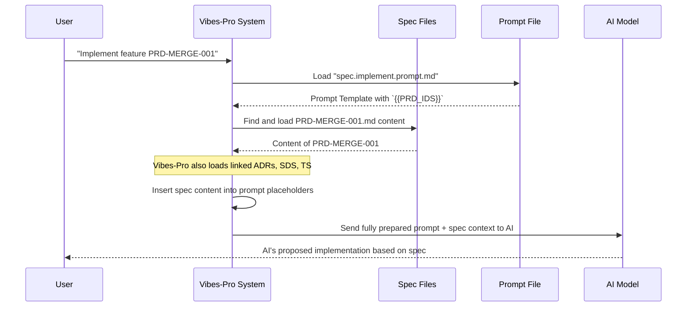

# Chapter 4: Specification-Driven Development (Specs)

In the last chapter, we learned about [AI Instructions & Guardrails](03_ai_instructions___guardrails_.md), which are the universal rules that keep our AI assistants aligned and safe. Now, imagine you're planning a trip. You have your general travel rules (the guardrails), and you know how to pack for specific activities (prompts) or how to act like a savvy traveler (chat modes). But before you do any of that, you need a _plan_ for the trip itself: where are you going, why, and what steps will you take?

This is where **Specification-Driven Development (Specs)** comes in for `Vibes-Pro`.

### 4.1 The Blueprint for Success: What Problem Do Specs Solve?

Imagine you want to build a magnificent treehouse. You gather your friends and start building. One friend adds a slide, another wants a secret trapdoor, and someone else builds a bridge to a nearby tree. Without a clear plan or "blueprint," everyone builds what they _think_ is right, leading to:

-   **Confusion**: "Wait, where does the ladder go?"
-   **Wasted effort**: Building something that doesn't fit the overall vision.
-   **Inconsistencies**: The slide is too short for the tree's height, the trapdoor opens onto thin air.
-   **Lack of traceability**: No one knows why certain decisions were made.

In software development, this chaos can be even worse. You might build a feature, only to realize it doesn't meet the user's actual needs, or it clashes with another part of the system.

`Vibes-Pro` solves this by strictly following a **Specification-Driven Development** approach. Think of "Specs" (short for Specifications) as the **blueprints and detailed plans** for every part of your software project. They are formal documents that act as a single source of truth, making sure everyone (human or AI) understands _what_ needs to be built and _why_.

Our central use case for this chapter is: **How do we ensure a new feature is designed, built, and understood correctly from the initial idea all the way to the code?** Specs are the answer.

### 4.2 What Are "Specs"? (The Planning Documents)

In `Vibes-Pro`, specs are carefully structured documents, usually written in Markdown. They live in your project's `docs/` or `specs/` folders. Each type of spec serves a different purpose, much like different sections of a construction blueprint:

-   **Product Requirements Document (PRD)**: This is like the "Wish List" from the treehouse owner. It defines **WHAT** the user wants to achieve. It focuses on user needs, features, and desired outcomes. Each requirement gets a unique ID (e.g., `PRD-001`).

    -   _Example Snippet (from `docs/mergekit/PRD.md`):_

        ```markdown
        # Product Requirements Document: HexDDD-VibePDK Generator-First Integration

        # ...

        ## PRD-MERGE-001: Copier-Based Project Generation

        **Description**: As a developer, I want to generate new projects using Copier templates so that I can create consistent, AI-enhanced development platforms.

        # ...
        ```

        This snippet shows a clear, user-focused description of a desired feature.

-   **Architectural Decision Record (ADR)**: This is the "How We'll Build It" meeting summary. It explains **WHY** certain technical decisions were made, exploring alternatives and their consequences. Each decision gets an ID (e.g., `ADR-001`).

    -   _Example Snippet (from `docs/mergekit/ADR.md`):_

        ```markdown
        # Architectural Decision Record: HexDDD-VibePDK Generator-First Integration

        # ...

        ## ADR-MERGE-001: Copier-First Template Architecture

        **Decision**: Migrate from Cookiecutter to Copier as the primary project generation system...
        **Rationale**: Copier provides superior update mechanisms...

        # ...
        ```

        This explains a key technical choice and the reasoning behind it.

-   **System Design Specification (SDS)**: This is the "High-Level Blueprint." It details **HOW** the system will be structured, showing components, data flows, and interactions. Each component or design aspect gets an ID (e.g., `SDS-001`).

    -   _Example Snippet (from `docs/mergekit/SDS.md`):_

        ```markdown
        # System Design Specification: HexDDD-VibePDK Generator-First Integration

        # ...

        ## SDS-MERGE-001: Copier Template Architecture

        **Design**: Multi-template Copier system with conditional generation and update capabilities.

        # ...
        ```

        This describes the actual system components and their design.

-   **Technical Specification (TS)**: This is the "Detailed Construction Plan." It describes **HOW** specific parts of the system will be implemented, focusing on code details, algorithms, and APIs. Each technical detail gets an ID (e.g., `TS-001`).

    -   _Example Snippet (from `docs/mergekit/TS.md`):_

        ```markdown
        # Technical Specification: HexDDD-VibePDK Generator-First Integration

        # ...

        ## TS-MERGE-001: Copier Template Engine Implementation

        **Technology Stack**:

        -   **Template Engine**: Copier 9.0+

        # ...
        ```

        This dives into the specific tools and implementation details.

These documents are formal because they use specific IDs and often link to each other, forming a chain from the initial idea to the detailed implementation.

### 4.3 Why Specs Make Life Easier (Benefits)

Specs provide immense value, especially in an AI-assisted development environment like `Vibes-Pro`:

| Feature           | Development WITHOUT Specs                                                   | Development WITH Specs (in `Vibes-Pro`)                                           |
| :---------------- | :-------------------------------------------------------------------------- | :-------------------------------------------------------------------------------- |
| **Clarity**       | Misunderstandings, guesswork, "build first, ask questions later."           | Clear understanding of requirements, design, and implementation _before_ coding.  |
| **Consistency**   | Different developers (or AI) build features differently.                    | Everyone follows the same approved plan and standards.                            |
| **Traceability**  | Hard to know _why_ a piece of code exists or which requirement it fulfills. | Every piece of code can be linked back to a PRD, ADR, SDS, and TS.                |
| **AI Guidance**   | AI gets generic instructions, might "hallucinate" or miss context.          | AI is given precise, detailed context and constraints from formal specs.          |
| **Changes**       | Painful, ripple effects, unintended consequences.                           | Changes are managed through spec updates, ensuring all impacts are considered.    |
| **Documentation** | Often an afterthought, inconsistent, quickly outdated.                      | Specs _are_ the living documentation, updated as part of the development process. |

### 4.4 How `Vibes-Pro` Uses Specs

`Vibes-Pro` leverages these specification documents as a fundamental input for both human developers and its AI assistants.

1.  **Guiding AI Development**:
    When you ask the AI to "implement feature `PRD-MERGE-001`," `Vibes-Pro` doesn't just pass `PRD-MERGE-001` to the AI. It actively looks up the actual content of the `PRD-MERGE-001` document (and potentially linked ADRs, SDS, TS) and provides all that detailed context to the AI. This turns a vague request into a highly informed directive.

2.  **Maintaining Traceability**:
    A critical aspect of specification-driven development is **traceability**. This means you can track a requirement from its origin (PRD) through its design (ADR, SDS), implementation (TS, code), and testing. `Vibes-Pro` includes a `docs/traceability_matrix.md` (and `docs/aiassist/AI_traceability.md`) to help manage these links.

    This matrix often looks like a table:

    ```markdown
    # AI-Assisted Integration Traceability Matrix

    | PRD ID     | Supported ADR IDs      | Implementing SDS IDs   | Detailing TS IDs                |
    | :--------- | :--------------------- | :--------------------- | :------------------------------ |
    | AI_PRD-001 | AI_ADR-001, AI_ADR-002 | AI_SDS-001, AI_SDS-004 | AI_TS-001, AI_TS-002, AI_TS-003 |
    | AI_PRD-002 | AI_ADR-001, AI_ADR-003 | AI_SDS-002             | AI_TS-002, AI_TS-005            |
    ```

    (A simplified version of `docs/aiassist/AI_traceability.md`)

    This table clearly shows which ADRs, SDS components, and TS documents are related to a particular PRD.

3.  **AI-Assisted Spec Management**:
    Maintaining these documents and the traceability matrix can be a lot of work. `Vibes-Pro` includes specialized AI [Prompts](01_prompts_.md) to assist with this "housekeeping."

    For example, the `spec-housekeeping.prompt.md` helps keep indexes and the traceability matrix up-to-date after you make changes to your spec documents:

    ```markdown
    ---
    kind: prompt
    domain: spec
    task: housekeeping
    # ... other metadata ...
    description: "Update spec indexes and traceability matrix with minimal context load."
    ---

    # Spec Housekeeping — Index & Traceability Updater (Lean)

    ## Goal

    Keep indexes and the traceability matrix current after spec extraction/changes,
    without loading entire specs unless gaps are detected.

    ## Inputs

    # ... list of spec and index files ...

    ## Task

    1. Collect IDs + Anchors (Selective)
    2. Update Product Index (`docs/spec_index.md`)
    3. Update Developer Index (`docs/dev_spec_index.md`)
    4. Update Traceability Matrix (`docs/traceability_matrix.md`)
    5. Report Gaps

    # ... more instructions for AI ...
    ```

    This prompt instructs the AI to automatically scan your spec files, find new or changed IDs, and update the index and traceability matrix accordingly, saving you a lot of manual work!

    Another prompt, `spec.traceability.update.prompt.md`, specifically focuses on updating the traceability matrix:

    ```markdown
    ---
    kind: prompt
    domain: spec
    task: traceability
    # ... other metadata ...
    description: "Build or update the traceability matrix, find gaps, propose tests."
    ---

    # Build/Update Traceability Matrix

    ## Inputs

    -   PRD items, ADR decisions, SDS components.
    -   Current code structure (`src/**`) and tests.

    ## Task

    Create or update a matrix in `docs/traceability_matrix.md`:

    # ... columns definition and rules for AI ...
    ```

    This prompt enables the AI to actively manage the connections between your high-level plans and your actual code, even suggesting tests for specs that lack coverage!

### 4.5 Under the Hood: How `Vibes-Pro` Processes Specs

When you want the AI to implement a feature defined by a spec, `Vibes-Pro` orchestrates the process to provide the AI with all necessary context.

Here's a simplified sequence:



1.  **You initiate a task**: You tell `Vibes-Pro` to implement a specific feature, providing its `PRD_ID` (e.g., `PRD-MERGE-001`). This often happens via a command in your terminal using a `Justfile` (which we'll explore in [Justfile & Task Automation](08_justfile___task_automation_.md)).
2.  **`Vibes-Pro` loads the relevant prompt**: It finds the prompt designed for implementation tasks, such as `spec.implement.prompt.md` (as seen in [Chapter 1: Prompts](01_prompts_.md)). This prompt has placeholders like `{{PRD_IDS}}`.
3.  **Specs are the Context**: This is the crucial step. Instead of just putting `PRD-MERGE-001` into the placeholder, `Vibes-Pro` actively _reads the entire content_ of `docs/mergekit/PRD.md` (and any other specs like ADRs, SDS, TS that are linked or deemed relevant by the traceability matrix) and uses _their text_ as primary context for the AI.
4.  **Prompt is Populated**: The system then constructs the final prompt by including your request, all the [AI Instructions & Guardrails](03_ai_instructions___guardrails_.md), and the comprehensive text from the spec documents.
5.  **Send to AI**: This rich, detailed prompt is then sent to the AI model.
6.  **AI Delivers**: The AI, fully informed by the formal specifications, generates code, designs, or documentation that directly adheres to the requirements and decisions outlined in those specs.

This process ensures that the AI is not just a generic helper, but an informed collaborator that understands the "why" and "how" behind every development task, directly from your project's formal blueprints.

You can even see how `Vibes-Pro` tasks are defined in the `justfile` to work with specs. For instance, to create a new feature spec thread:

```bash
# Part of your justfile
spec-feature THREAD:
    @mkdir -p "specs/{{THREAD}}"
    @echo "---" > "specs/{{THREAD}}/spec.md"
    @echo "thread: {{THREAD}}" >> "specs/{{THREAD}}/spec.md"
    @echo "matrix_ids: []" >> "specs/{{THREAD}}/spec.md"
    @echo "" >> "specs/{{THREAD}}/spec.md"
    @echo "# Feature Specification" >> "specs/{{THREAD}}/spec.md"
    @echo "Created initial spec file for {{THREAD}} at specs/{{THREAD}}/spec.md"
```

This simple `just` command quickly sets up a new spec file, ready for you to fill in the details of your `PRD`, `ADR`, etc. The AI can then read this file.

### 4.6 Conclusion

In this chapter, we explored **Specification-Driven Development (Specs)** in `Vibes-Pro`. We learned that specs are formal documents (like PRD, ADR, SDS, TS) that act as the single source of truth for all development. They clarify _what_ to build, _why_, and _how_, ensuring consistency and traceability. We saw how `Vibes-Pro` deeply integrates these specs by feeding their content directly to AI models, turning vague requests into highly informed tasks, and how AI itself helps manage and update these crucial planning documents. Specs are the blueprints that guide both human and AI collaborators to build robust and aligned software.

Next, we'll look at [Copier Templates & Generators](05_copier_templates___generators_.md), which are powerful tools `Vibes-Pro` uses to automate the creation of new projects and components, often based on these very specifications.

---

<sub><sup>Generated by [AI Codebase Knowledge Builder](https://github.com/The-Pocket/Tutorial-Codebase-Knowledge).</sup></sub> <sub><sup>**References**: [[1]](https://github.com/SPRIME01/Vibes-Pro/blob/61b36a3f5ed748ceae18c92b1d0a340657d8e477/.github/prompts/spec-housekeeping.prompt.md), [[2]](https://github.com/SPRIME01/Vibes-Pro/blob/61b36a3f5ed748ceae18c92b1d0a340657d8e477/.github/prompts/spec.traceability.update.prompt.md), [[3]](https://github.com/SPRIME01/Vibes-Pro/blob/61b36a3f5ed748ceae18c92b1d0a340657d8e477/docs/aiassist/AI_traceability.md), [[4]](https://github.com/SPRIME01/Vibes-Pro/blob/61b36a3f5ed748ceae18c92b1d0a340657d8e477/docs/mergekit/ADR.md), [[5]](https://github.com/SPRIME01/Vibes-Pro/blob/61b36a3f5ed748ceae18c92b1d0a340657d8e477/docs/mergekit/PRD.md), [[6]](https://github.com/SPRIME01/Vibes-Pro/blob/61b36a3f5ed748ceae18c92b1d0a340657d8e477/docs/mergekit/SDS.md), [[7]](https://github.com/SPRIME01/Vibes-Pro/blob/61b36a3f5ed748ceae18c92b1d0a340657d8e477/docs/mergekit/TS.md)</sup></sub>
