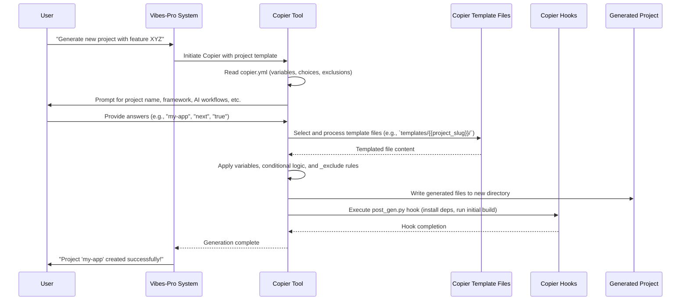

# Chapter 5: Copier Templates & Generators

In our last chapter, [Specification-Driven Development (Specs)](04_specification_driven_development__specs__.md), we learned that specs are the detailed blueprints for _what_ to build and _why_. They ensure clarity and consistency for our software projects. But once you have those blueprints, how do you actually start building the project or a new feature without manually setting up every file, folder, and configuration?

This is where **Copier Templates & Generators** come in.

### 5.1 The Software Factory: What Problem Do Templates & Generators Solve?

Imagine you're running a bakery. You've got amazing recipes for cookies (your specs). Now you need to make hundreds of them. Would you painstakingly cut out each cookie by hand, one by one, ensuring every single one is the exact same shape and size? No! You'd use a **cookie cutter**.

In software development, building new applications or features from scratch can be like cutting cookies by hand. It's slow, error-prone, and inconsistent. You might forget a configuration file, misname a folder, or set up a dependency incorrectly.

`Vibes-Pro` solves this with a **"generator-first" philosophy**. This means that instead of starting with an empty folder, you _generate_ your new project, application, or feature from a pre-built **template** using specialized tools. These templates are like smart cookie cutters for your software. They ensure everything is set up correctly, consistently, and according to your project's architectural standards (like [Hexagonal Architecture + DDD](06_hexagonal_architecture___ddd_.md)).

Our central use case for this chapter is: **How can we quickly create a brand-new application (or add a new feature) in `Vibes-Pro` that automatically follows the project's architecture, configurations, and best practices?**

### 5.2 The "Generator-First" Approach

The "generator-first" approach is foundational to `Vibes-Pro`. It means that creation and scaffolding are prioritized through automation. When you want to:

- Start a new project.
- Add a new application to your monorepo.
- Generate a new domain library or a new service.

You use a **generator** instead of manual setup. This guarantees that:

- **Consistency**: Every generated item adheres to the same standards.
- **Speed**: You get a fully functional starting point in minutes, not hours or days.
- **Best Practices**: Architectural patterns (like Hexagonal Architecture) and coding conventions are baked in.
- **AI Readiness**: Generated code often includes hooks for [AI Instructions & Guardrails](03_ai_instructions___guardrails_.md) and [AI Chat Modes & Personas](02_ai_chat_modes___personas_.md).

`Vibes-Pro` uses two main types of generators:

1.  **`Copier` Templates**: For creating entire projects or large applications.
2.  **`Nx` Generators**: For adding smaller, more specific features or components _within_ an existing `Nx` monorepo.

Let's explore each.

### 5.3 `Copier` Templates – The Grand Blueprint Maker

`Copier` is a powerful tool for generating projects from templates. Think of it as the ultimate "software cookie cutter machine." It takes a set of template files and allows you to customize the output by asking you questions.

Here's how it works in `Vibes-Pro`:

#### 5.3.1 The `copier.yml` – Your Template's Control Panel

Every `Copier` template has a `copier.yml` file at its root. This file is like the control panel for your cookie cutter machine. It defines:

- What questions to ask the user (e.g., project name, author).
- What options are available (e.g., "choose your frontend framework: Next.js, Remix, or Expo").
- How to validate user inputs.
- Which files or folders to include or exclude based on user choices.
- Actions to perform before or after generating the project.

Let's look at a simplified snippet from `Vibes-Pro`'s `copier.yml`:

```yaml
# copier.yml
# ... other settings like _subdirectory, _templates_suffix ...

project_slug:
  type: str
  help: "Project slug (kebab-case, used for directories)"
  default: "{{ project_name | lower | replace(' ', '-') }}" # Default based on project_name
  validator: "Invalid project slug"

author_name:
  type: str
  help: "Author's full name"
  default: "Developer"

include_ai_workflows:
  type: bool
  help: "Include AI-enhanced development workflows"
  default: true

app_framework:
  type: str
  help: "Primary frontend application framework"
  choices:
    - next
    - remix
    - expo
  default: next

# ... more variables ...

_exclude:
  # Exclude framework-specific configs if they don't match the choice
  - "apps/{{app_name}}/next.config.js.j2"
  # Exclude AI-related files if include_ai_workflows is false
  - "tools/ai/**"
  - "temporal_db/**"
```

- `project_slug` and `author_name` are examples of variables. `Copier` will prompt the user for these or use the `default` value.
- `app_framework` uses `choices`, meaning the user must pick one of the listed options.
- `include_ai_workflows` is a `bool` (true/false) choice, allowing users to enable or disable AI-related features.
- The `_exclude` section is very powerful! It uses a special syntax (``) to conditionally remove files or folders from the generated project. For instance, if `app_framework` is _not_ `next`, then `next.config.js.j2` won't be copied. Similarly, if `include_ai_workflows` is `false`, then all files under `tools/ai/` and `temporal_db/` will be excluded. This keeps your generated project lean and tailored to your choices.

#### 5.3.2 The `templates/` Folder – The Blueprint Itself

The actual files and folders that form the project are stored in the `templates/` directory of the `Vibes-Pro` project. When `Copier` runs, it copies these files and applies the customizations.

Inside `templates/`, you'll find a structure like this:

```
templates/
├── docs/                    # Templates for project documentation
├── tools/                   # Templates for developer tooling
└── {{project_slug}}/        # The core project scaffold (this is where your app goes!)
    ├── apps/                # Interface layer applications
    ├── libs/                # Domain + application libraries
    ├── tools/ai/            # AI workflow utilities (conditional)
    ├── temporal_db/         # Temporal learning bootstrap (conditional)
    ├── justfile.j2          # Task orchestration blueprint
    ├── package.json.j2      # Node workspace config blueprint
    └── nx.json.j2           # Nx workspace config blueprint
```

Notice `{{project_slug}}/`! `Copier` automatically replaces `{{project_slug}}` with the actual project name you provide (e.g., `my-cool-app`). All files inside this folder (and its subfolders) can use `Jinja2` templating syntax (like `{{ variable_name }}`) to insert values from the `copier.yml` variables.

This structure is detailed in `Vibes-Pro`'s own `docs/template_structure_analysis.md`, which helps contributors understand how the template is built.

#### 5.3.3 Hooks – Before and After Actions

`Copier` allows you to run Python scripts before (`pre_gen.py`) and after (`post_gen.py`) the project generation process. These "hooks" are crucial for setting up the generated project correctly.

In `Vibes-Pro`, the `hooks/post_gen.py` script, for example, is responsible for:

- Installing project dependencies (e.g., using `pnpm install` for Node.js packages and `uv sync --dev` for Python packages).
- Running initial build commands.
- Printing helpful "next steps" for the user.

These hooks automate the tedious setup tasks, so you get a ready-to-run project immediately after generation.

### 5.4 `Nx` Generators – Feature Builders within Your Project

Once you have generated your `Vibes-Pro` project using `Copier`, you'll often want to add new features, services, or libraries _within_ that project. This is where `Nx` generators come in.

`Nx` is a powerful toolkit for monorepos (single repositories containing multiple projects or libraries). `Nx` **generators** are like smaller, specialized cookie cutters that work _inside_ your already-generated project. They are designed to:

- Add new applications (e.g., a new frontend app, a new backend API).
- Create new libraries (e.g., a shared utility library, a domain-specific library following [Hexagonal Architecture + DDD](06_hexagonal_architecture___ddd_.md) principles).
- Generate specific components (e.g., a new service, a database adapter).
- Ensure that new code adheres to the monorepo's architectural rules and dependency constraints.

#### 5.4.1 `Copier` vs. `Nx` Generators: A Quick Comparison

| Feature     | `Copier` Templates                                           | `Nx` Generators                                                                       |
| :---------- | :----------------------------------------------------------- | :------------------------------------------------------------------------------------ |
| **Scope**   | Generate entire projects or large applications from scratch. | Generate new features, libraries, or components _within_ an existing `Nx` monorepo.   |
| **Tool**    | `Copier` (a Python-based project templating tool).           | `Nx CLI` (a JavaScript-based monorepo toolkit).                                       |
| **Goal**    | Initial project setup, architectural foundation.             | Adding specific, architecturally compliant pieces to an ongoing project.              |
| **Analogy** | Baking a whole cake from a mix and a specific cake pan.      | Adding a specific type of frosting or a decorative flower to an _already baked_ cake. |

#### 5.4.2 Example: An `Nx` Service Generator

In `Vibes-Pro`, after you've used `Copier` to set up your overall project, you might use an `Nx` generator to add a new "service" (a core concept in [Hexagonal Architecture + DDD](06_hexagonal_architecture___ddd_.md)).

The file `generators/service/generator.ts` defines such an `Nx` generator:

```typescript
// generators/service/generator.ts
import {
  Tree,
  formatFiles,
  generateFiles,
  installPackagesTask,
  names,
} from "@nx/devkit";
import * as path from "path";

interface ServiceSchema {
  name: string;
  language?: "python" | "typescript"; // User can choose language
}

export default async function (tree: Tree, schema: unknown) {
  const options = schema as ServiceSchema; // Simplified type assertion for example

  // Normalize the service name (e.g., "MyService" -> "my-service")
  const serviceName = names(options.name).fileName;
  const language = options.language ?? "python"; // Default to Python

  const serviceRoot = `apps/${serviceName}`; // Path where the new service will be created

  // This copies files from 'files/python' or 'files/typescript'
  // into the new service directory, based on the 'language' choice.
  generateFiles(tree, path.join(__dirname, "files", language), serviceRoot, {
    ...options,
    serviceName: serviceName, // Pass the normalized name to templates
  });

  await formatFiles(tree); // Auto-format newly generated files
  return () => {
    installPackagesTask(tree); // Install dependencies needed by the new service
  };
}
```

This generator:

1.  Takes a `name` and optional `language` (Python or TypeScript) for your new service.
2.  Normalizes the `name` into a consistent format (`service-name`).
3.  Determines the correct path (e.g., `apps/my-new-service`).
4.  Uses `generateFiles` to copy the appropriate template files (from `generators/service/files/python` or `generators/service/files/typescript`) into the new service's directory.
5.  Automatically formats the new code and installs any required packages.

This ensures that every new service you generate starts with the correct folder structure, initial code, and configurations for its chosen language, perfectly aligned with your project's standards.

### 5.5 How `Vibes-Pro` Uses Them: From Blueprint to Code

Let's revisit our central use case: **How can we quickly create a brand-new application in `Vibes-Pro`?**

`Vibes-Pro` orchestrates `Copier` to turn your choices into a runnable project.



1.  **You initiate generation**: You run a command (often via `justfile`, which we'll cover in [Justfile & Task Automation](08_justfile___task_automation_.md)) that tells `Vibes-Pro` to start a new project using `Copier`.
2.  **`Copier` reads `copier.yml`**: It loads the template's configuration, understanding what questions to ask and what options are available.
3.  **You make choices**: `Copier` prompts you for details like the project name, chosen frontend framework (e.g., `next`), whether to include AI workflows, etc. Your answers directly influence the generated output.
4.  **`Copier` processes templates**: It then goes through all the files and folders in the `templates/` directory. For each file:
    - It substitutes `{{ variables }}` with your provided answers.
    - It applies `` conditions to include or exclude specific code blocks.
    - It uses `_exclude` rules to completely skip certain files or folders (e.g., if you said `include_ai_workflows: false`, all AI-related files are ignored).
5.  **Files are written**: The customized files are then written to your new project directory.
6.  **`post_gen.py` runs**: The `post_gen.py` hook script automatically runs, installing dependencies and performing initial setup tasks, leaving you with a ready-to-use project.

A common way this process is kicked off for testing and validation within `Vibes-Pro` is through helper functions like `runGenerator` in `tests/generators/utils.ts`. This function simulates running `Copier` with specific options:

```typescript
// From tests/generators/utils.ts (simplified)
import { runCommand } from "./utils"; // Helper to run shell commands
import * as fs from "fs";
import * as path from "path";

export async function runGenerator(
  generatorType: string,
  overrides: Record<string, unknown>, // Your choices go here
): Promise<any> {
  const outputPath = path.join(os.tmpdir(), `${generatorType}-${Date.now()}`);
  const dataFilePath = path.join(os.tmpdir(), `answers-${generatorType}.yml`);

  // Build a YAML file with your answers for Copier
  const yamlData = buildYaml({
    project_slug: `${generatorType}-test-slug`,
    include_ai_workflows: true,
    app_framework: "next",
    ...overrides, // Your specific choices
  });
  await fs.promises.writeFile(dataFilePath, yamlData, "utf-8");

  // Command to run Copier:
  // copier copy . <output_path> --data-file <answers.yml> --force --defaults
  const copierCommand = process.env.COPIER_COMMAND ?? "copier";
  const args = [
    "copy",
    PROJECT_ROOT, // The Vibes-Pro repo itself is the template source
    outputPath,
    "--data-file",
    dataFilePath, // Use our generated answers
    "--force",
    "--defaults",
  ];

  await runCommand(copierCommand, args, {
    /* ... environment options ... */
  });

  // After running, we can check the generated files
  const files: string[] = [];
  // ... logic to collect generated file paths ...
  return { files, success: true, outputPath };
}
```

This `runGenerator` function encapsulates the process of interacting with `Copier`. You provide your choices (in `overrides`), it generates a temporary answers file (`dataFilePath`), then executes the `copier` command using the `Vibes-Pro` repository itself as the template source. This is how `Vibes-Pro` ensures that newly generated projects consistently meet quality and architectural standards.

### 5.6 Conclusion

In this chapter, we delved into **Copier Templates & Generators**, the engine behind `Vibes-Pro`'s "generator-first" philosophy. We learned that `Copier` templates are like smart cookie cutters for entire projects, using `copier.yml` for customization and `templates/` for the actual blueprints. We also explored how `Nx` generators act as specialized tools for adding features _within_ a generated project, ensuring consistent architectural compliance. Together, these tools enable rapid, consistent, and architecturally sound development in `Vibes-Pro`, turning your specifications into ready-to-code projects and features.

Next, we'll dive into [Hexagonal Architecture + DDD](06_hexagonal_architecture___ddd_.md), the core architectural style that these templates and generators enforce, ensuring your applications are robust and maintainable.

---

<sub><sup>Generated by [AI Codebase Knowledge Builder](https://github.com/The-Pocket/Tutorial-Codebase-Knowledge).</sup></sub> <sub><sup>**References**: [[1]](https://github.com/SPRIME01/Vibes-Pro/blob/61b36a3f5ed748ceae18c92b1d0a340657d8e477/README.md), [[2]](https://github.com/SPRIME01/Vibes-Pro/blob/61b36a3f5ed748ceae18c92b1d0a340657d8e477/copier.yml), [[3]](https://github.com/SPRIME01/Vibes-Pro/blob/61b36a3f5ed748ceae18c92b1d0a340657d8e477/docs/mergekit/IMPLEMENTATION-PLAN.md), [[4]](https://github.com/SPRIME01/Vibes-Pro/blob/61b36a3f5ed748ceae18c92b1d0a340657d8e477/docs/template_structure_analysis.md), [[5]](https://github.com/SPRIME01/Vibes-Pro/blob/61b36a3f5ed748ceae18c92b1d0a340657d8e477/generators/service/generator.ts), [[6]](https://github.com/SPRIME01/Vibes-Pro/blob/61b36a3f5ed748ceae18c92b1d0a340657d8e477/tests/generators/utils.ts)</sup></sub>
