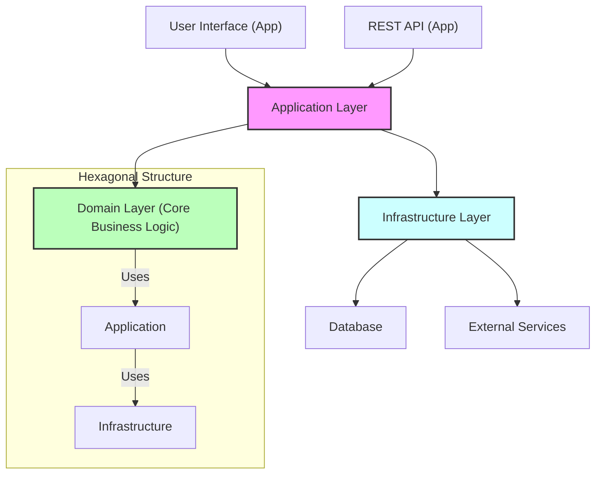
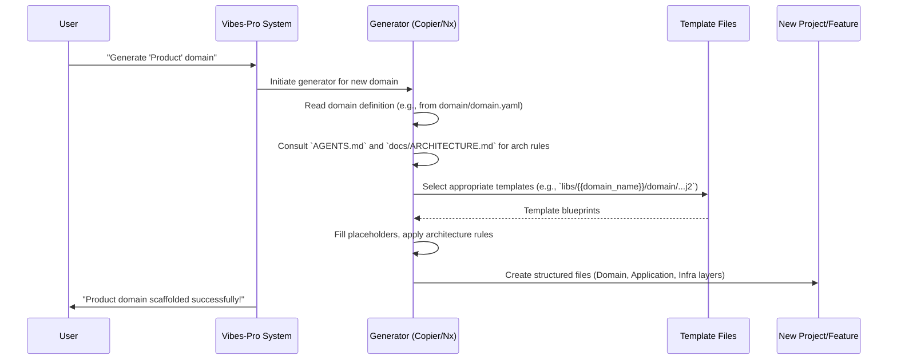

# Chapter 6: Hexagonal Architecture + DDD

In our last chapter, [Copier Templates & Generators](05_copier_templates___generators_.md), we learned how `Vibes-Pro` uses smart "cookie cutters" to quickly create new projects and features, ensuring consistency. But what kind of cookie _shape_ are we cutting? What is the underlying design philosophy that these generators enforce?

This chapter introduces the core architectural style of `Vibes-Pro` applications: **Hexagonal Architecture** combined with **Domain-Driven Design (DDD)**.

### 6.1 The Problem: Code Getting Messy & Hard to Change

Imagine you're building a simple app for an online store to manage "Products." At first, it's easy: you save products directly to a database and show them on a webpage.

But what happens when:

-   You want to use a _different_ database?
-   You want to show products on a _mobile app_ instead of just a webpage?
-   The business rules for a "Product" (e.g., how to calculate its discount, or check if it's in stock) get very complicated?
-   Your code for saving a product is tangled up with the code for displaying it, and also mixed with the discount calculation?

This tangle makes your code:

-   **Hard to test**: To test the discount logic, you also need a database running and a web server.
-   **Hard to change**: If you switch databases, you might break the webpage display or the discount logic.
-   **Hard to understand**: What's truly important business logic, and what's just technical detail?

This is a common problem in software, and it's what Hexagonal Architecture and DDD are designed to solve.

Our central use case for this chapter is: **How do we build a new feature (e.g., managing "Products" in our online store) so that its core business rules are always clean, testable, and completely independent of external things like the database, the user interface, or any specific technology?**

### 6.2 Hexagonal Architecture: The "Shape" of Your App

Think of Hexagonal Architecture (also known as "Ports and Adapters") like a versatile game console.

The **console itself** (the core business logic) doesn't care _which_ TV screen you connect it to, or _which_ controller you use. It just knows how to run games. It has specific **ports** (like HDMI for video, USB for controllers) where you can plug things in.

The **cables and controllers** are the **adapters**. They are designed to fit into the console's ports and translate between the console's internal signals and the outside world's signals (e.g., a TV's display, a button press from a controller).

In software:

-   The **center** of the hexagon (the "console") is your **Domain Layer** (pure business logic). This is the most important part, containing _what_ your application does for the business. It should have _no idea_ about databases, web frameworks, or UI.
-   **Ports** are like interfaces (contracts) that define _how_ the outside world can interact with your core logic, or _how_ your core logic needs to interact with external systems (like "save a product," "send an email").
-   **Adapters** are the specific implementations of these ports. One adapter might save a product to a PostgreSQL database, another to a cloud storage. One adapter might be a web API, another a mobile UI.

Here's how `Vibes-Pro` structures these layers:



This diagram, inspired by `Vibes-Pro`'s `docs/ARCHITECTURE.md`, shows the key layers:

1.  **Domain Layer (The Core)**: This is the innermost layer. It contains the most important code: your business rules, entities, and value objects. It's completely independent of any technology.
2.  **Application Layer**: This layer orchestrates the domain layer. It defines "use cases" (e.g., "create a product," "update user profile"). It uses "ports" to talk to the outside world.
3.  **Infrastructure Layer**: This layer contains the "adapters." It's where you implement details like saving data to a database, sending emails, or calling external APIs. These adapters implement the "ports" defined in the application layer.
4.  **Interface Layer (User/System Interfaces)**: This is the outermost layer. It contains your UI (web, mobile), REST APIs, or command-line interfaces. These are also "adapters" that drive the application layer.

**Why this is great for beginners:** You only focus on one thing at a time. When writing business logic, you don't worry about databases. When connecting to a database, you don't worry about the UI.

### 6.3 Domain-Driven Design (DDD): Speaking the Business Language

While Hexagonal Architecture defines _how_ your code is structured, Domain-Driven Design (DDD) defines _what_ that core business logic should be.

Imagine trying to talk about "money" with an accountant versus a child. The accountant uses terms like "ledger," "assets," "liabilities," "accrual." The child says "dolla-dolla bills." Both are talking about money, but their **domain language** is different. DDD is about making sure your software speaks the precise language of the business domain it's trying to solve.

Key concepts in DDD, often found in the **Domain Layer**:

-   **Bounded Contexts**: A logical boundary around a specific part of your business where a certain domain model applies. For our online store, "Products" might be one Bounded Context, "Orders" another, and "Users" a third. The word "Product" in the "Products" context might have different meanings or rules than a "Product" referenced in an "Order" context.
-   **Entities**: Objects that have a unique identity and can change over time. For example, a `Product` in our store is an entity because it has a unique ID (SKU) and its quantity or price can change. A `User` is an entity.
-   **Value Objects**: Objects that represent descriptive aspects of the domain and have no conceptual identity. They are defined by their attributes and are _immutable_ (cannot change once created). For example, `Money` (an amount and a currency) or an `Address` are value objects. If you change the street name, it's a _new_ Address, not the _old_ one modified.
-   **Domain Services**: Operations that involve multiple entities or value objects and don't naturally fit within a single entity. For example, "Transferring funds" might be a domain service involving two `Account` entities.

Let's look at a simple Python example of **Entities and Value Objects** from `Vibes-Pro`'s `libs/prompt_optimizer/domain/entities.py`:

```python
# libs/prompt_optimizer/domain/entities.py (simplified)

from dataclasses import dataclass, field
from datetime import UTC, datetime
from enum import StrEnum
from uuid import UUID, uuid4

@dataclass(frozen=True) # Frozen means immutable, good for Value Objects
class PromptId:
    """Value object representing a unique prompt identifier."""
    value: UUID = field(default_factory=uuid4)

    def __str__(self) -> str:
        return str(self.value)

@dataclass(frozen=True)
class TokenCount:
    """Value object representing token counting results."""
    total_tokens: int
    model: StrEnum # Simplified
    estimated_cost: float

    def __post_init__(self) -> None:
        if self.total_tokens < 0:
            raise ValueError("Token count cannot be negative")
        # ... more validation ...

@dataclass
class Prompt:
    """Domain entity representing a prompt for optimization."""
    id: PromptId # Uses the PromptId Value Object
    content: str
    created_at: datetime
    # ... other fields ...

    def __post_init__(self) -> None:
        if not self.content.strip():
            raise ValueError("Prompt content cannot be empty")

    def update_features(self, features) -> None:
        """Update the prompt's extracted features."""
        self.features = features
```

This snippet shows:

-   `PromptId` and `TokenCount` are **Value Objects**: They are `frozen=True` (immutable), defined by their values, and have clear validation. `PromptId` also wraps a primitive UUID to give it specific domain meaning.
-   `Prompt` is an **Entity**: It has a unique identity (`id: PromptId`), and its properties (like `features`) can be `update`d over time.

### 6.4 Hexagonal Architecture + DDD Together

When you combine these two, you get powerful benefits:

-   **Clean Business Logic**: DDD helps you identify and model the core business problems (Entities, Value Objects). Hexagonal Architecture ensures this core logic is isolated.
-   **Testability**: Because your domain logic is separate from infrastructure, you can test it thoroughly without needing a database, network, or UI.
-   **Flexibility**: You can swap out a database (adapter) or a UI (adapter) without changing your core business rules.
-   **Maintainability**: Changes in one layer (e.g., a new database technology) don't cascade and break other layers.

### 6.5 Solving Our Use Case with `Vibes-Pro`

Recall our use case: **How do we build a new "Product" feature with clean, testable, and independent business rules?**

`Vibes-Pro`'s "generator-first" approach ([Copier Templates & Generators](05_copier_templates___generators_.md)) is built precisely to enforce Hexagonal Architecture and DDD.

When you use a `Copier` template or an `Nx` generator to create a new "domain" or "service" (like our "Product" service), it automatically scaffolds the project with the correct layer structure: `domain/`, `application/`, `infrastructure/`.

For example, when you generate a new domain, `Vibes-Pro`'s templates create files like this:

```
libs/
└── product/                # This is your "Product" Bounded Context
    ├── domain/             # (1) Pure business logic
    │   ├── entities/       # Product Entity, Inventory Entity
    │   ├── value-objects/  # Price Value Object, SKU Value Object
    │   ├── services/       # Discount calculation Domain Service
    │   └── interfaces/     # Repository interfaces (e.g., IProductRepository)
    ├── application/        # (2) Use cases and ports
    │   ├── use-cases/      # CreateProductUseCase, UpdateProductStockUseCase
    │   └── ports/          # IProductRepository (port definition)
    └── infrastructure/     # (3) Adapters
        ├── adapters/       # PostgresProductRepository (adapter implementing IProductRepository)
        └── dtos/           # Data transfer objects for database
```

This structure is detailed in `Vibes-Pro`'s `AGENTS.md` and `docs/ARCHITECTURE.md` as a core principle.

You can even define your services and entities in a high-level YAML file, which `Vibes-Pro` can then use to generate the initial code. Look at `domain/domain.yaml`:

```yaml
# domain/domain.yaml (simplified for example)
services:
    - name: product
      description: Online store product management service
      entities:
          - name: Product
            fields:
                - name: id
                  type: uuid
                - name: name
                  type: string
                - name: price
                  type: decimal
          - name: Inventory
            fields:
                - name: product_id
                  type: uuid
                - name: quantity
                  type: integer
```

This YAML defines a `product` service with `Product` and `Inventory` entities. `Vibes-Pro`'s generators can read this and automatically create the basic files (like the `Product` entity in `libs/product/domain/entities/`) based on this definition.

Here's an example of a generated TypeScript **Entity** file for a `User` (which would be similar for a `Product`):

```typescript
// libs/{{domain_name}}/domain/src/lib/entities/User.ts.j2 (simplified)

// Generated User Entity for {{ domain_name | capitalize }} Domain

import { UserId } from '../value-objects/UserId'; // Imports a Value Object

export class User { // This is an Entity
  constructor(
    public readonly id: UserId,
    public readonly email: string,
    public readonly name: string,
    public readonly createdAt: Date,
    public readonly updatedAt: Date
  ) {
    this.validate(); // Self-validating
  }

  private validate(): void {
    if (!this.email || !User.isValidEmail(this.email)) {
      throw new Error('Invalid email format');
    }
    // ... more validation ...
  }

  updateName(newName: string): User { // Can change over time, creates new instance (immutable update pattern)
    return new User(this.id, this.email, newName, this.createdAt, new Date());
  }

  equals(other: User): boolean { // Defined by its ID
    return this.id.equals(other.id);
  }
}

```

This generated code directly implements DDD principles: `User` is an Entity, `UserId` is a Value Object, and it includes self-validation. It's perfectly placed within the `domain/` layer, ensuring it's free from infrastructure concerns.

### 6.6 Under the Hood: How `Vibes-Pro` Enforces Structure

`Vibes-Pro` uses its "generator-first" approach to ensure every new piece of your application naturally falls into the Hexagonal + DDD structure.

When you ask `Vibes-Pro` (or its AI assistants) to create a new feature or domain, here's a simplified sequence of what happens:



1.  **You initiate generation**: You use a command (e.g., `just generate domain product`) to create a new domain.
2.  **Generator takes action**: `Vibes-Pro` triggers the appropriate generator (either `Copier` for a whole app or an `Nx` generator for an internal library/service).
3.  **Architectural Guidance**: The generator doesn't just copy files randomly. It's pre-configured and, if AI is involved, it refers to detailed instructions in `AGENTS.md` and `docs/ARCHITECTURE.md` which explicitly lay out the Hexagonal Architecture and DDD layer structure (`Domain Layer`, `Application Layer`, `Infrastructure Layer`).
4.  **Templating and Structure**: The generator uses specific template files (like `libs/{{domain_name}}/domain/src/lib/entities/User.ts.j2`) that are already designed to create files in the correct `domain/`, `application/`, `infrastructure/` subdirectories, complete with placeholders for your new feature's name and entities.
5.  **New feature created**: The result is a new `product` domain with its `domain/`, `application/`, and `infrastructure/` folders already set up according to best practices, ready for you to fill in the specific business logic.

This process ensures that your `Vibes-Pro` applications are consistently well-structured, following robust architectural patterns from the very first line of generated code.

### 6.7 Conclusion

In this chapter, we explored **Hexagonal Architecture + DDD**, the foundational architectural style for `Vibes-Pro` applications. We learned how Hexagonal Architecture separates your core business logic (Domain Layer) from external concerns like databases and UIs, using "ports" and "adapters." We also saw how Domain-Driven Design helps you model your software using precise business concepts like "Bounded Contexts," "Entities," and "Value Objects." By combining these, `Vibes-Pro` ensures your applications are robust, testable, flexible, and truly reflect your business domain, right from the start, thanks to its generator-first approach.

Next, we'll dive into [Type Generation & Parity](07_type_generation___parity_.md), a crucial concept for keeping your code safe and consistent, especially when working with multiple programming languages.

---

<sub><sup>Generated by [AI Codebase Knowledge Builder](https://github.com/The-Pocket/Tutorial-Codebase-Knowledge).</sup></sub> <sub><sup>**References**: [[1]](https://github.com/SPRIME01/Vibes-Pro/blob/61b36a3f5ed748ceae18c92b1d0a340657d8e477/AGENTS.md), [[2]](https://github.com/SPRIME01/Vibes-Pro/blob/61b36a3f5ed748ceae18c92b1d0a340657d8e477/docs/ARCHITECTURE.md), [[3]](https://github.com/SPRIME01/Vibes-Pro/blob/61b36a3f5ed748ceae18c92b1d0a340657d8e477/domain/domain.yaml), [[4]](https://github.com/SPRIME01/Vibes-Pro/blob/61b36a3f5ed748ceae18c92b1d0a340657d8e477/libs/prompt-optimizer/domain/entities.py), [[5]](https://github.com/SPRIME01/Vibes-Pro/blob/61b36a3f5ed748ceae18c92b1d0a340657d8e477/libs/{{domain_name}}/domain/src/lib/entities/User.ts.j2)</sup></sub>
