# Chapter 7: Type Generation & Parity

In our last chapter, [Hexagonal Architecture + DDD](06_hexagonal_architecture___ddd_.md), we explored how to structure our applications to keep business logic clean and independent of technical details. This creates a clear separation of concerns. But what happens when you have different parts of your system, perhaps a backend in Python and a frontend in TypeScript, that need to talk to each other and handle the _same kind of data_?

This chapter introduces a crucial concept for keeping your entire `Vibes-Pro` project consistent and error-free: **Type Generation & Parity**.

### 7.1 The Broken Telephone Problem: Why Data Consistency Matters

Imagine you're playing a game of "broken telephone." One person whispers a message ("The product has a price of ten dollars") to the next, who whispers it to the next, and so on. By the time it reaches the last person, the message might have changed completely ("The project is priced at a tin dollar")!

In software, this "broken telephone" happens all the time:

- Your **database** defines a "Product" with a `name` (text) and `price` (number).
- Your **Python backend** expects the `price` to be a `float` (a number with decimals).
- Your **TypeScript frontend** accidentally expects the `price` to be a `string` (text).

When the frontend sends a `string` price to the backend, or the backend sends a `float` price that the frontend tries to treat as a `string`, you get **errors, crashes, and confusing bugs**. These bugs are annoying and time-consuming to find and fix.

Our central use case for this chapter is: **How can we guarantee that a data structure, like a `SpecificationRecord` (which we saw in previous chapters for defining our project's plans), is understood in the exact same way by our Python backend code and our TypeScript frontend code, ensuring no "broken telephone" errors occur?**

### 7.2 What is a "Type"? (A Quick Recap)

Before we dive deeper, let's quickly clarify what a "type" is in programming:

- **Simple Types**: These are basic categories for data, like `string` (for text), `number` (for numbers), `boolean` (for true/false).
- **Custom Types/Data Structures**: These are blueprints for more complex data, like an object. For example, a `Product` type might specify that it `has a name (string)`, `a price (number)`, and `an id (string)`.

When we talk about "Type Generation & Parity," we're talking about making sure these custom types (like `Product` or `SpecificationRecord`) are consistently defined and used across all parts of your system, even if those parts are written in different programming languages.

### 7.3 Type Generation: Your Automatic Translator

In `Vibes-Pro`, we use a core idea: define your data structures **once, in a central place**. This central place is usually your database schema (the blueprint of how data is stored) or, in some cases, a canonical definition in a language like Rust (`temporal_db/schema.rs` mentioned in the provided Python code).

Then, `Vibes-Pro` uses special tools (like the `type-generator`) to **automatically generate** the matching "types" or "classes" for other languages, such as TypeScript and Python.

Think of it like an automatic language translator for your data blueprints. You define the blueprint once in the "master" language, and the generator instantly creates consistent versions in all other languages your project uses.

#### Example: `SpecificationRecord` in Python

Let's look at a type definition for `SpecificationRecord` in Python, which is part of how `Vibes-Pro` tracks your project's specifications:

```python
# temporal_db/python/types.py (simplified)
from dataclasses import dataclass
from datetime import datetime
from enum import Enum
from typing import Any

class SpecificationType(Enum):
    """Type of specification document."""
    ADR = "ADR"
    PRD = "PRD"
    # ... other types ...

@dataclass
class SpecificationRecord:
    """A specification record stored in the temporal database."""
    id: str
    spec_type: SpecificationType
    identifier: str
    title: str
    content: str
    timestamp: datetime
    version: int
    author: str | None # This means string or None
    # ... more fields ...
```

This Python `dataclass` defines what a `SpecificationRecord` looks like. It has an `id` (string), a `spec_type` (from an `Enum`), a `title`, `content`, etc. The goal is to ensure that a TypeScript version of this record has the _exact same fields and types_.

`Vibes-Pro`'s `type-generator` tool can read a central schema (e.g., a database schema) and generate the corresponding TypeScript interfaces, like this empty placeholder for where generated types would go:

```typescript
// libs/shared/database-types/index.ts.j2 (simplified)
// This file is generated by the type-generator.
// Do not edit this file directly.

// Add generated TypeScript types here.
// When 'type-generator generate' runs, it would fill this file
// with interfaces like:
/*
export interface SpecificationRecord {
  id: string;
  specType: SpecificationType;
  identifier: string;
  title: string;
  content: string;
  timestamp: string; // Often ISO string for datetime
  version: number;
  author: string | null;
  // ... more fields ...
}
*/
```

Notice how `author: str | None` in Python would translate to `author: string | null;` in TypeScript. This automatic generation greatly reduces manual work and human error.

### 7.4 Type Parity: The Consistency Police

After types are generated (or even if some are manually written in parallel), how do we _know_ for sure that they are consistent? This is where **Type Parity** comes in.

Type Parity means that the structure and types of your data models are identical (or at least compatible) across different programming languages. `Vibes-Pro` includes tools to actively **verify** this parity.

The `type-generator` CLI tool (specifically its `verify` command) acts like a "consistency police" that checks:

1.  **Do all classes/interfaces exist in both languages?** (e.g., if `SpecificationRecord` exists in Python, does it also exist in TypeScript?)
2.  **Do all fields within those classes/interfaces match?** (e.g., if Python `SpecificationRecord` has an `id` field, does the TypeScript one also have an `id` field?)
3.  **Are the types of those fields compatible?** (e.g., if Python `id` is `str`, is TypeScript `id` a `string`? If Python `version` is `int`, is TypeScript `version` a `number`?)

If a mismatch is found, `Vibes-Pro` will report an error, and in some cases, it can even **automatically fix** simple naming differences (like converting `snake_case` in Python to `camelCase` in TypeScript, and then renaming the Python field to match). This is incredibly helpful for preventing runtime bugs.

### 7.5 How `Vibes-Pro` Uses Type Generation & Parity

Let's revisit our use case: **Ensuring `SpecificationRecord` is consistent across Python and TypeScript.**

`Vibes-Pro` uses its `type-generator` command-line tool (`tools/type-generator/cli.js`) to perform both generation and verification.

#### 7.5.1 Generating Types

To generate TypeScript types from a central schema (e.g., a database schema file), you would use the `generate` command:

```bash
# Example: Generating TypeScript types from a hypothetical database schema
# The 'schema.json' would contain the definitions of your data structures.
typegen generate path/to/your/schema.json -o libs/shared/database-types
```

This command tells `Vibes-Pro` to read the `schema.json` file and create corresponding TypeScript interfaces in the `libs/shared/database-types/` directory.

Here's how this command is set up in `tools/type-generator/cli.js`:

```javascript
// tools/type-generator/cli.js (simplified)
program
  .command("generate")
  .description("Generate TypeScript types from database schema")
  .argument("<schema-path>", "path to the database schema JSON file")
  .option("-o, --output-dir <dir>", "output directory for generated types")
  .action((schemaPath, options) => {
    try {
      // DbToTypeScript is the class that handles the actual generation logic
      const generator = new DbToTypeScript(WORKSPACE_ROOT);
      // It takes the schema path and output directory as inputs
      generator.generate(schemaPath, options.outputDir);
      console.log("✅ TypeScript types generated successfully");
    } catch (error) {
      console.error(`❌ ${error.message}`);
      process.exit(1);
    }
  });
```

This snippet shows that the `generate` command takes your schema file and an output directory. The `DbToTypeScript` class (which is part of the `type-generator` tool) does the heavy lifting of reading the schema and writing the TypeScript files.

#### 7.5.2 Verifying Type Parity

To check if your Python and TypeScript types match (for instance, checking the Python `SpecificationRecord` against its generated TypeScript counterpart), you use the `verify` command:

```bash
# Example: Verifying parity between Python and TypeScript types
# -f or --fix will attempt to automatically rename Python fields
typegen verify temporal_db/python libs/shared/database-types -f
```

This command checks all Python type definitions in `temporal_db/python/` against all TypeScript type definitions in `libs/shared/database-types/`. If there are naming mismatches (e.g., `snake_case` in Python vs. `camelCase` in TypeScript), the `-f` flag will try to automatically fix them in the Python files.

Here's a simplified look at the `verify` command in `tools/type-generator/cli.js`:

```javascript
// tools/type-generator/cli.js (simplified)
program
  .command("verify")
  .description("Verify structural parity between TypeScript and Python types")
  .argument("<ts-dir>", "directory containing TypeScript type files")
  .argument("<py-dir>", "directory containing Python type files")
  .option("-f, --fix", "auto-fix simple naming mismatches")
  .action((tsDir, pyDir, options) => {
    try {
      // 1. Parse TypeScript types from the TS directory
      const { tsTypes } = parseTypeScriptTypes(tsDir);
      // 2. Parse Python types from the Python directory
      const { pyTypes, classFileMap, fileContents } = parsePythonTypes(pyDir);

      let hasErrors = false;

      // Loop through all TS types and compare them with Python types
      for (const [className, tsClass] of Object.entries(tsTypes)) {
        const pyClass = pyTypes[className];
        if (!pyClass) {
          console.error(`❌ Missing Python class: ${className}`);
          hasErrors = true;
          continue;
        }

        for (const [fieldName, tsType] of Object.entries(tsClass)) {
          // Check if field exists in Python and if types are compatible
          // This includes handling snake_case vs camelCase
          // ... comparison logic ...
          if (!verifyTypeParity(tsType, pyType)) {
            console.error(
              `❌ Type mismatch in ${className}.${fieldName}: TS=${tsType}, Python=${pyType}`,
            );
            hasErrors = true;
          }
          // If --fix is enabled, attempt to rename Python fields
          if (options.fix && matchedName !== fieldName) {
            renamePythonField(
              className,
              matchedName,
              fieldName,
              pyFilePath,
              pyClass,
              fileContents,
            );
          }
        }
      }

      if (hasErrors) {
        console.error("❌ Type parity check failed");
        process.exit(1);
      }
      console.log("✅ All types are structurally compatible");
    } catch (error) {
      console.error(`❌ ${error.message}`);
      process.exit(1);
    }
  });
```

This detailed snippet shows how the `verify` command orchestrates parsing (reading) the TypeScript and Python files, then compares them. It uses helper functions like `parseTypeScriptTypes`, `parsePythonTypes`, `verifyTypeParity`, and `renamePythonField` to do its job.

### 7.6 Under the Hood: How `Vibes-Pro` Achieves Parity

Let's look at the full lifecycle of type consistency in `Vibes-Pro` with a simplified diagram:

```mermaid
sequenceDiagram
    participant User
    participant V as Vibes-Pro System
    participant C as Type Generator CLI
    participant S as Source Schema (DB or Rust)
    participant T as TypeScript Files
    participant P as Python Files

    User->>V: Wants consistent data types for 'SpecificationRecord'
    V->>C: `typegen generate schema.json -o libs/shared/database-types`
    C->>S: Reads schema definition (e.g., 'SpecificationRecord' structure from DB/Rust)
    S-->>C: Data structure blueprint
    C->>T: Writes generated TypeScript types for 'SpecificationRecord'
    Note over T: 'libs/shared/database-types/index.ts' now contains TS interface
    User->>V: `typegen verify temporal_db/python libs/shared/database-types -f`
    V->>C: Initiates type parity check
    C->>T: Reads 'SpecificationRecord' interface from TS files
    T-->>C: TS type structure
    C->>P: Reads 'SpecificationRecord' class from Python files
    P-->>C: Python type structure
    C->>C: Compares TS and Python definitions
    Note over C: Checks field names (e.g., 'spec_type' vs 'specType')<br/>and field types (e.g., 'str' vs 'string')
    C-->>V: Reports mismatches, or success, potentially with auto-fixes
    V->>User: Displays "✅ All types are structurally compatible" (or errors/fixes)
```



#### Diving Deeper into Verification

The `verify` command does a lot of work. Let's look at its core components:

1.  **Parsing Types (`parseTypeScriptTypes`, `parsePythonTypes`)**:
    These functions read your code files and extract the names of classes/interfaces and their fields.

    For Python:

    ```python
    # PY_PARSER_SOURCE (internal script used by cli.js, simplified)
    import ast
    import json
    # ...
    def parse_file(path: str) -> dict[str, dict[str, str]]:
        # Opens a Python file and reads its content
        tree = ast.parse(file.read(), filename=path)
        classes: dict[str, dict[str, str]] = {}
        for node in tree.body:
            if isinstance(node, ast.ClassDef): # Found a class definition
                fields: dict[str, str] = {}
                for stmt in node.body:
                    if isinstance(stmt, ast.AnnAssign): # Found a field with a type annotation
                        fields[stmt.target.id] = ast.unparse(stmt.annotation)
                classes[node.name] = fields
        return classes
    # ...
    ```

    This Python script is actually executed by the `type-generator` CLI. It uses Python's `ast` (Abstract Syntax Tree) module to literally _read your Python code_ and understand its structure, extracting class names and their fields. A similar process happens for TypeScript using the `typescript` compiler API.

2.  **Comparing Types (`verifyTypeParity`)**:
    Once the types are parsed from both languages, the `verifyTypeParity` function (from `tools/type-generator/src/generators/verify.ts`) steps in to compare them.

    ```typescript
    // tools/type-generator/src/generators/verify.ts (simplified)
    export function verifyTypeParity(tsType: string, pyType: string): boolean {
      const normalizedTsType = tsType.replace(/\s+/g, "").toLowerCase();
      const normalizedPyType = pyType.replace(/\s+/g, "").toLowerCase();

      // Helper functions split types like "string | null" into tokens
      const tsTokens = parseTypeScriptTokens(normalizedTsType);
      const pyTokens = parsePythonTokens(normalizedPyType);

      // Check for optional types (e.g., 'null' in TS, 'none' in Python)
      const tsHasOptional = tsTokens.some((token) =>
        TS_OPTIONAL_TOKENS.has(token),
      );
      const pyHasOptional = pyTokens.includes("none");

      if (tsHasOptional !== pyHasOptional) {
        return false; // Mismatch in optionality
      }

      // Compare the remaining core types
      const tsCoreTokens = tsTokens.filter(
        (token) => !TS_OPTIONAL_TOKENS.has(token),
      );
      const pyCoreTokens = pyTokens.filter((token) => token !== "none");

      return matchTokenSets(tsCoreTokens, pyCoreTokens); // Checks if token sets are equivalent
    }

    function matchSingleType(tsToken: string, pyToken: string): boolean {
      // Handles basic type matches (e.g., 'string' vs 'str')
      // Handles array/list types (e.g., 'string[]' vs 'list[str]')
      // Handles mapping types (e.g., 'object' vs 'dict')
      // ... complex type mapping logic ...
      return false; // Or true if matched
    }
    ```

    This function intelligently compares type strings (like `"string | null"` and `"str | None"`) by first normalizing them, then breaking them into "tokens" (e.g., `string`, `null`). It checks if optionality matches (`null`/`undefined` in TS vs `None` in Python) and then uses `matchSingleType` to see if individual type tokens are compatible (e.g., `string` in TypeScript maps to `str` or `uuid` or `datetime` in Python).

3.  **Auto-Fixing (`renamePythonField`)**:
    If the `--fix` option is used and a simple naming mismatch (like `camelCase` vs. `snake_case`) is found, `Vibes-Pro` can automatically rewrite the Python file to align its field names with the TypeScript version.

    ```javascript
    // tools/type-generator/cli.js (simplified)
    function renamePythonField(
      className,
      fromName,
      toName,
      pyFilePath,
      pyClassFields,
      fileContents,
    ) {
      const fieldType = pyClassFields[fromName];
      if (!fieldType) {
        return false;
      }
      const existingContent =
        fileContents[pyFilePath] ?? safeReadFileSync(pyFilePath);
      // Uses a Regular Expression to find and replace the field definition in the file content
      const fieldDefRegex = new RegExp(`(^|\\n)(\\s*)${fromName}:\\s*[^\\n]+`);
      const updatedContent = existingContent.replace(
        fieldDefRegex,
        (match, prefix, indent) => `${prefix}${indent}${toName}: ${fieldType}`,
      );
      safeWriteFileSync(pyFilePath, updatedContent); // Writes the changed content back
      console.log(
        `🛠  Auto-fixed field name in ${className}: ${fromName} -> ${toName}`,
      );
      return true;
    }
    ```

    This function is quite clever! It reads the Python file content, uses a pattern (`RegExp`) to find the old field name and its type, and then replaces it with the new (TypeScript-compatible) name, effectively editing your Python source code.

This sophisticated combination of automated generation and rigorous verification ensures that your data structures remain consistent across different languages, preventing frustrating bugs and making your `Vibes-Pro` applications more robust and reliable.

### 7.7 Conclusion

In this chapter, we tackled **Type Generation & Parity** in `Vibes-Pro`. We learned that maintaining consistent data structure definitions across different programming languages (like Python and TypeScript) is crucial to prevent common bugs. `Vibes-Pro` addresses this by using automatic **type generation** from a central schema and then enforcing **type parity** with tools that verify these types match, even offering automatic fixes. This "consistency police" helps ensure that the data flowing through your backend, frontend, and database always speaks the same language, making development smoother and more reliable.

Next, we'll shift gears to how `Vibes-Pro` automates common development tasks with [Justfile & Task Automation](08_justfile___task_automation_.md).

---

<sub><sup>Generated by [AI Codebase Knowledge Builder](https://github.com/The-Pocket/Tutorial-Codebase-Knowledge).</sup></sub> <sub><sup>**References**: [[1]](https://github.com/SPRIME01/Vibes-Pro/blob/61b36a3f5ed748ceae18c92b1d0a340657d8e477/libs/shared/database-types/index.ts.j2), [[2]](https://github.com/SPRIME01/Vibes-Pro/blob/61b36a3f5ed748ceae18c92b1d0a340657d8e477/templates/{{project_slug}}/generators/_utils/stack.ts), [[3]](https://github.com/SPRIME01/Vibes-Pro/blob/61b36a3f5ed748ceae18c92b1d0a340657d8e477/temporal_db/python/types.py), [[4]](https://github.com/SPRIME01/Vibes-Pro/blob/61b36a3f5ed748ceae18c92b1d0a340657d8e477/tools/type-generator/cli.js), [[5]](https://github.com/SPRIME01/Vibes-Pro/blob/61b36a3f5ed748ceae18c92b1d0a340657d8e477/tools/type-generator/src/generators/verify.ts)</sup></sub>
