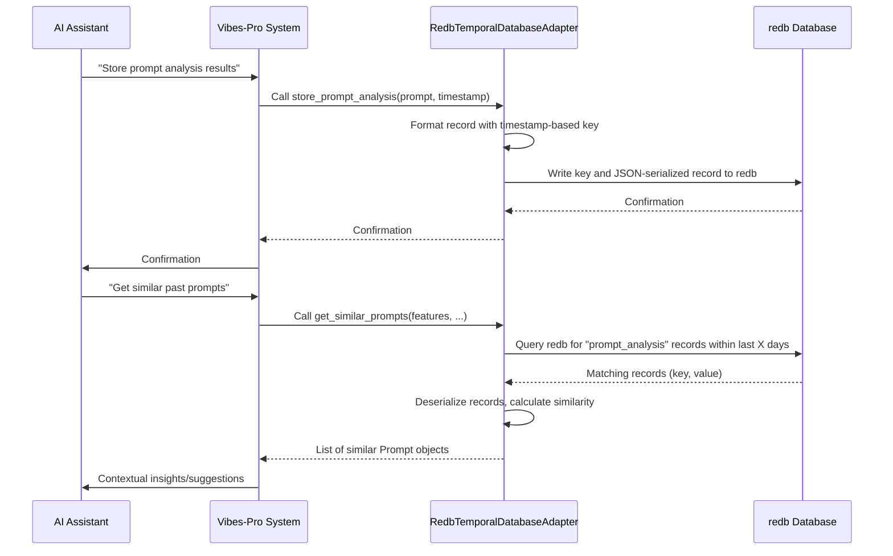

# Chapter 9: Temporal Database (redb)

In our last chapter, [Justfile & Task Automation](08_justfile___task_automation_.md), we learned how `Vibes-Pro` streamlines development tasks with simple commands. Now, imagine you're working on a big, complex project, and you want your AI assistant to not just follow instructions, but to actually _learn_ from everything that's happened before. You want it to remember past design choices, know what worked well, and avoid repeating old mistakes.

This is where the **Temporal Database**, powered by `redb`, comes in.

### 9.1 The Project's Memory Bank: What Problem Does it Solve?

Imagine your `Vibes-Pro` AI assistant is like a junior developer. When you ask it to build a new feature, it does its best. But if it doesn't remember past discussions, architectural decisions, or the outcomes of previous coding efforts, it might:

- **Suggest solutions that were already tried and failed.**
- **Ignore important architectural patterns your team decided on months ago.**
- **Require you to re-explain context every single time.**
- **Make repetitive mistakes.**

This is frustrating and inefficient. What you need is a **collective memory** for your project – a place where all important decisions, learnings, and historical data are stored, and critically, stored _over time_.

Our central use case for this chapter is: **How can `Vibes-Pro`'s AI remember past architectural decisions, successful development patterns, and the outcomes of previous tasks to offer smarter, context-aware, and more accurate suggestions for new development tasks?**

The **Temporal Database**, specifically using `redb`, is designed to be this memory bank. It's like the project's **diary**, recording important events and details _with timestamps_, so the AI can look back and learn from the project's history.

### 9.2 What is a Temporal Database? (The Project's Diary)

At its heart, a **Temporal Database** is a special kind of database that stores data not just as it is _now_, but as it was _over time_. Think of it like a meticulous diary keeper. Every entry in the diary isn't just about what happened, but _when_ it happened.

Key characteristics:

- **Time-aware**: It inherently understands and tracks changes to data over time. You can ask "What was the state of this architectural decision on May 1st?" or "Show me all prompt optimizations made last week."
- **Historical Context**: It preserves historical data, allowing you to trace the evolution of decisions, patterns, and outcomes.
- **Append-only (often)**: Instead of just overwriting old data, it often adds new versions of data with new timestamps, keeping the old versions for historical queries.

For `Vibes-Pro`, this means the database remembers:

- When a specific [Architectural Decision Record (ADR)](04_specification_driven_development__specs__.md) was made.
- How a particular [Prompt](01_prompts_.md) was optimized and what the results were.
- Which AI [Chat Modes & Personas](02_ai_chat_modes___personas_.md) were used for what kind of tasks.

This rich, time-stamped history is what allows the AI to become truly intelligent and context-aware.

### 9.3 Why `redb`? (The Efficient Diary Keeper)

`redb` (pronounced "red-bee") is the technology `Vibes-Pro` uses for its Temporal Database. `redb` is an **embedded, high-performance key-value store** written in Rust.

Think of it as a very efficient, local filing cabinet specifically designed for storing and retrieving information quickly on the computer where your `Vibes-Pro` project is running.

Here's why `redb` is a good choice for `Vibes-Pro`:

- **Embedded**: It runs directly within your application, no separate server needed. This makes it easy to set up and very fast for local use.
- **Fast**: Being written in Rust, `redb` is very performant, which is crucial for quickly querying historical data to feed to the AI.
- **Durable**: It safely stores data on disk, so information isn't lost when your computer or `Vibes-Pro` shuts down.
- **Actively Maintained**: Unlike some alternatives, `redb` is actively developed, ensuring stability and modern features (as noted in `docs/DATABASE-MIGRATION-SUMMARY.md`).

For those building `Vibes-Pro` projects, `redb` runs behind the scenes. You typically interact with it through `Vibes-Pro`'s Python adapters or Rust modules, not directly.

### 9.4 What Kind of Memory Does `Vibes-Pro` Store?

The Temporal Database stores various types of valuable "memories" for the AI:

1.  **Prompt Analyses**: Details about how different [Prompts](01_prompts_.md) performed, their token counts, effectiveness scores, and suggested optimizations.
2.  **Optimization Sessions**: Records of when and how `Vibes-Pro` attempted to optimize prompts or code, including the goals and models used.
3.  **Architectural Decisions**: Key decisions made over the project's lifespan, often linked to [ADRs](04_specification_driven_development__specs__.md).
4.  **Learned Patterns**: Successful code patterns, design approaches, or solutions that emerged over time.

This detailed, time-stamped information forms the bedrock of the AI's "learning" process.

### 9.5 How `Vibes-Pro` Uses the Temporal Database

Let's return to our central use case: **How can `Vibes-Pro`'s AI remember past decisions and patterns to offer smarter suggestions?**

`Vibes-Pro` uses a Python adapter, `RedbTemporalDatabaseAdapter` (found in `libs/prompt-optimizer/infrastructure/temporal_db.py`), to interact with the underlying `redb` database. This adapter handles storing and retrieving the project's memory.

#### 9.5.1 Storing Project Memories

When the AI performs a task, like analyzing a prompt or running an optimization session, `Vibes-Pro` can store the outcome in the temporal database.

Here's a simplified example of how `Vibes-Pro` stores a `Prompt` analysis:

```python
# From libs/prompt-optimizer/infrastructure/temporal_db.py (simplified)
import json
from datetime import datetime
from typing import Any

class RedbTemporalDatabaseAdapter:
    def __init__(self, db_path: str):
        self.db_path = db_path
        self._db: Any = None # Placeholder for redb or file system
        self._initialized = False

    async def _ensure_initialized(self) -> None:
        # Connects to redb or uses a file-based fallback if bindings aren't present.
        import os
        os.makedirs(self.db_path, exist_ok=True)
        self._db = self.db_path # Simulates an open database path
        self._initialized = True

    async def store_prompt_analysis(
        self,
        prompt: Any, # Simplified Prompt type
        timestamp: datetime
    ) -> None:
        await self._ensure_initialized()

        record: dict[str, Any] = {
            "id": str(prompt.id),
            "content": prompt.content,
            "timestamp": timestamp.isoformat(),
            # ... other prompt details like features, token_count, etc. ...
        }

        # Key includes timestamp for temporal ordering
        key = f"prompt_analysis:{timestamp.isoformat()}:{prompt.id}"
        await self._store_record(key, record)
        print(f"Stored prompt analysis for {prompt.id}")

    async def _store_record(self, key: str, record: dict[str, Any]) -> None:
        """Stores a record (e.g., in a file or redb)."""
        import os
        file_path = os.path.join(self._db, f"{key.replace(':', '_')}.json")
        with open(file_path, 'w', encoding='utf-8') as f:
            json.dump(record, f, indent=2, ensure_ascii=False)
```

**Explanation:** The `store_prompt_analysis` method takes a `Prompt` object and a `timestamp`. It converts the prompt's details into a dictionary (`record`) and then calls `_store_record`. The `key` for storage is important because it includes the `timestamp`, ensuring that records are ordered by time.

#### 9.5.2 Retrieving Past Learnings

The AI can then query this history to retrieve relevant information. For example, it can look for similar prompts or successful optimization patterns.

Here's a simplified example of how `Vibes-Pro` retrieves optimization patterns:

```python
# From libs/prompt-optimizer/infrastructure/temporal_db.py (simplified)
from datetime import datetime, timedelta, UTC

class RedbTemporalDatabaseAdapter:
    # ... __init__, _ensure_initialized, store_prompt_analysis, _store_record ...

    async def get_optimization_patterns(
        self,
        goal: Any, # Simplified OptimizationGoal type
        days_back: int = 90
    ) -> list[dict[str, Any]]:
        await self._ensure_initialized()

        patterns: list[dict[str, Any]] = []
        sessions = await self._get_recent_records("optimization_session", days=days_back)

        # Filter sessions by the desired optimization goal
        goal_sessions = [s for s in sessions if s.get("optimization_goal") == goal.value]

        if goal_sessions:
            # Simplified analysis: In a real AI, this would involve complex ML.
            # Here, we just count and summarize.
            patterns.append({
                "goal": goal.value,
                "session_count": len(goal_sessions),
                "common_improvements": ["Reduced token count", "Improved clarity"]
            })
        print(f"Retrieved {len(patterns)} optimization patterns for goal {goal.value}.")
        return patterns

    async def _get_recent_records(self, prefix: str, days: int) -> list[dict[str, Any]]:
        """Retrieves records by prefix and filters by date."""
        cutoff_date = datetime.now(UTC) - timedelta(days=days)
        records: list[dict[str, Any]] = []

        import glob, os, json
        pattern = os.path.join(self._db, f"{prefix}_*.json")
        files = glob.glob(pattern)

        for file_path in files:
            try:
                with open(file_path, encoding='utf-8') as f:
                    record = json.load(f)
                record_time = datetime.fromisoformat(
                    record.get("timestamp", record.get("started_at", datetime.min.isoformat()))
                )
                if record_time >= cutoff_date:
                    records.append(record)
            except Exception:
                continue
        records.sort(key=lambda r: datetime.fromisoformat(r.get("timestamp", r.get("started_at", ""))), reverse=True)
        return records
```

**Explanation:** The `get_optimization_patterns` method looks for recent optimization sessions based on a `goal` and `days_back`. It calls `_get_recent_records` to find relevant entries, then filters and analyzes them (in a simplified way for this example) to identify common patterns. This allows the AI to learn from past successful optimizations.

### 9.6 Under the Hood: The Flow of Project Memory

When `Vibes-Pro` needs to store or retrieve information from its Temporal Database, here's a simplified flow:



1.  **AI (or `Vibes-Pro` component) needs to store data**: When a significant event occurs (like a prompt analysis or an architectural decision), `Vibes-Pro` initiates a request to store this "memory."
2.  **`RedbTemporalDatabaseAdapter` is called**: The request goes to the `RedbTemporalDatabaseAdapter` (our Python code wrapper).
3.  **Data is prepared**: The adapter takes the data (e.g., a `Prompt` object) and converts it into a format suitable for storage, typically JSON. It constructs a unique key that often includes a timestamp to preserve the temporal nature of the data.
4.  **`redb` stores the data**: The adapter then writes this key-value pair to the underlying `redb` database. `redb` efficiently stores this data on disk.
5.  **AI (or `Vibes-Pro`) needs to retrieve data**: When the AI needs context for a new task, it asks `Vibes-Pro` to retrieve relevant historical data.
6.  **`RedbTemporalDatabaseAdapter` queries `redb`**: The adapter sends a query to `redb`, often specifying a type of record (e.g., "prompt_analysis") and a time range (e.g., "last 90 days").
7.  **`redb` returns data**: `redb` quickly retrieves the matching historical records.
8.  **Data is processed and returned**: The adapter deserializes these records, performs any necessary filtering or processing (like calculating similarity scores for prompts), and then returns the structured historical information to `Vibes-Pro`, which then provides it to the AI as context.

This continuous cycle of storing and retrieving historical context empowers the AI to learn and provide increasingly valuable assistance.

#### Diving Deeper: `redb` Tables and Keys

The `temporal_db/README.md` file in `Vibes-Pro` provides more detail on how `redb` tables are structured:

```rust
// From temporal_db/README.md (Rust example)
const SPECIFICATIONS_TABLE: TableDefinition<&str, &[u8]> = TableDefinition::new("specifications");
const PATTERNS_TABLE: TableDefinition<&str, &[u8]> = TableDefinition::new("patterns");
const CHANGES_TABLE: TableDefinition<&str, &[u8]> = TableDefinition::new("changes");
```

**Explanation:** `redb` organizes data into named "tables" (like `SPECIFICATIONS_TABLE`, `PATTERNS_TABLE`, `CHANGES_TABLE`). Each table stores key-value pairs. For temporal data, keys are designed to include timestamps, allowing for efficient time-based queries.

For example, a specification's key might look like: `spec:{identifier}:{timestamp_nanos}`. This means a key could be `spec:ADR-001:1708000000000000000`. By sorting keys, you can easily find the latest version of `ADR-001` or all versions of it over time.

This structured storage ensures that the AI can reliably access and learn from the project's entire history.

### 9.7 Benefits of the Temporal Database in `Vibes-Pro`

Using `redb` as a Temporal Database offers significant advantages for `Vibes-Pro`:

| Feature                   | Development WITHOUT Temporal Database                                   | Development WITH Temporal Database (redb)                                   |
| :------------------------ | :---------------------------------------------------------------------- | :-------------------------------------------------------------------------- |
| **AI Learning**           | AI starts fresh with each interaction, requires repetitive context.     | AI learns from project's history, past successes, and failures.             |
| **Context-Awareness**     | AI lacks project-specific historical context, gives generic advice.     | AI provides highly relevant, context-aware suggestions.                     |
| **Decision Traceability** | Hard to track _why_ a decision was made or how a pattern evolved.       | All decisions, patterns, and their evolution are recorded with timestamps.  |
| **Efficiency**            | Developers manually provide context or fix AI's uninformed suggestions. | AI proactively offers smart solutions, reducing repetitive tasks.           |
| **Accuracy**              | AI's output can be inconsistent or misaligned with project history.     | AI's output is more accurate and aligned with established project patterns. |
| **Performance**           | (Not applicable directly to this comparison)                            | Fast local storage and retrieval with `redb`.                               |

### 9.8 Conclusion

In this chapter, we explored the **Temporal Database**, powered by `redb`, in `Vibes-Pro`. We learned that this database acts as the project's collective memory, storing architectural decisions, learned development patterns, and historical context over time. By leveraging `redb` as an efficient, embedded data store, `Vibes-Pro` enables its AI assistant to learn from past successes and failures. This continuous learning process allows the AI to provide more intelligent, context-aware, and accurate suggestions, significantly improving development efficiency and reducing repetitive decision-making for future tasks.

Next, we'll look at [CI Workflows & Quality Gates](10_ci_workflows___quality_gates_.md), which are crucial for ensuring that all these smart decisions and generated code meet high quality standards automatically.

---

<sub><sup>Generated by [AI Codebase Knowledge Builder](https://github.com/The-Pocket/Tutorial-Codebase-Knowledge).</sup></sub> <sub><sup>**References**: [[1]](https://github.com/SPRIME01/Vibes-Pro/blob/61b36a3f5ed748ceae18c92b1d0a340657d8e477/docs/DATABASE-MIGRATION-SUMMARY.md), [[2]](https://github.com/SPRIME01/Vibes-Pro/blob/61b36a3f5ed748ceae18c92b1d0a340657d8e477/docs/aiassist/AI_SECURITY_HARDENING.md), [[3]](https://github.com/SPRIME01/Vibes-Pro/blob/61b36a3f5ed748ceae18c92b1d0a340657d8e477/docs/aiassist/AI_TDD_PLAN.md), [[4]](https://github.com/SPRIME01/Vibes-Pro/blob/61b36a3f5ed748ceae18c92b1d0a340657d8e477/libs/prompt-optimizer/infrastructure/temporal_db.py), [[5]](https://github.com/SPRIME01/Vibes-Pro/blob/61b36a3f5ed748ceae18c92b1d0a340657d8e477/libs/security/src/secure_db.rs), [[6]](https://github.com/SPRIME01/Vibes-Pro/blob/61b36a3f5ed748ceae18c92b1d0a340657d8e477/temporal_db/README.md)</sup></sub>
