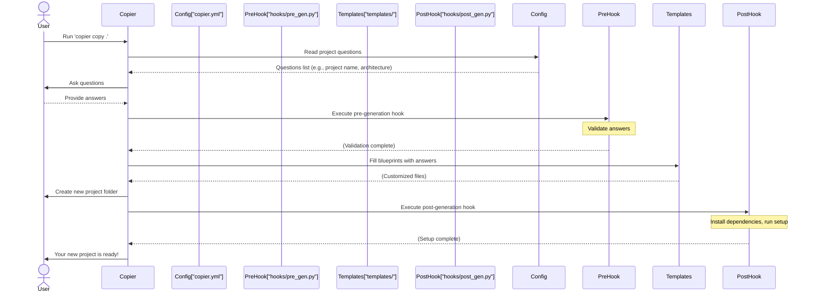

# Chapter 1: Copier Template System

Welcome to the world of Vibes-Pro! In this first chapter, we're going to explore the magic behind how new Vibes-Pro projects come to life. Imagine you want to start a new software project. What's the first thing you usually do? You create a new folder, add a `package.json` file, maybe a `README.md`, set up some basic configurations, and probably a few empty subfolders for your code. This initial, repetitive setup is often called "boilerplate."

## The Problem with Boilerplate

Starting every project from scratch can be a hassle:

- **Time-consuming**: You spend valuable time on setup instead of actual coding.
- **Inconsistent**: Each project might end up with slightly different structures, making it harder for teams to switch between them.
- **Error-prone**: You might forget a crucial file or setting, leading to problems later.
- **Hard to update**: If you decide to change how all your projects should be structured, manually updating every existing project is a nightmare.

## Our Solution: The Copier Template System

Vibes-Pro solves these problems using a powerful tool called **Copier**. Think of Copier as your personal project factory. Instead of building every part of your new project by hand, you simply tell the factory what you need, and it assembles a complete, ready-to-run application for you. This "factory" is what we call the **Copier Template System**.

The Copier Template System is the core engine that generates new Vibes-Pro projects. It uses:

- **Copier**: The main tool that takes a "template" and your "answers" to create a new project.
- **Jinja2 Templates**: Special files that act like blueprints, with placeholders for your custom information.

It’s like ordering a custom cake: you pick the flavor, frosting, and decorations (your "answers"), and the baker (Copier) uses a recipe (Jinja2 templates) to create your unique cake (your new project).

## How to Generate a New Vibes-Pro Project

Let's walk through the main use case: creating a brand new project.

### Step 1: Run the Copier Command

When you want to create a new Vibes-Pro project, you'll typically use a command similar to this in your terminal:

```bash
copier copy . /path/to/my-new-project
```

- `copier copy`: This tells the `copier` tool to start copying a template.
- `.`: This means "use the current directory as the template." (This is because Vibes-Pro _is_ the template itself!)
- `/path/to/my-new-project`: This is where your brand new project will be created. You'll replace `my-new-project` with whatever name you choose for your project.

### Step 2: Answer the Questions

After running the command, Copier will start asking you a series of questions right in your terminal. These questions help it understand what kind of project you want to build.

For example, it might ask:

- "What's your project called?"
- "Who is the author?"
- "Which architecture style do you prefer (e.g., Hexagonal, Layered, Microservices)?"

You provide your answers, and Copier records them.

### Step 3: Project Generated!

Once you've answered all the questions, Copier gets to work. It takes your answers, plugs them into the template files, and generates a complete project structure in the `my-new-project` directory. This new directory will contain all the necessary code, configuration files, documentation, and even a development setup, tailored exactly to your specifications!

## Under the Hood: The Blueprint and the Factory

So, how does Copier actually do all this? Let's look at the key components that make up the Copier Template System.

The process involves a few main players:



Let's break down these components:

### 1. The Configuration File (`copier.yml`)

This file is the heart of the template. It's where all the questions that Copier asks you are defined. It tells Copier:

- What variables (like `project_name` or `architecture_style`) exist.
- What `type` of input to expect (text, number, yes/no).
- What `help` message to show for each question.
- Any `default` values.
- Optional `choices` for a question.

Here's a simplified look at `copier.yml`:

```yaml
# copier.yml
project_name:
  type: str
  help: "What's the full name of your project?"
  default: "My Awesome VibesPro App"

author_name:
  type: str
  help: "Your full name as the author"
  default: "Developer"

architecture_style:
  type: str
  help: "Choose the primary architecture pattern for your project:"
  choices:
    - hexagonal
    - layered
    - microservices
  default: hexagonal

include_ai_workflows:
  type: bool
  help: "Do you want to include AI-enhanced development workflows?"
  default: true
```

- **`project_name`**: A simple text input with a default value.
- **`architecture_style`**: A question where you choose from a list of options.
- **`include_ai_workflows`**: A yes/no (boolean) question.

These definitions guide Copier to interact with you and collect the necessary information.

### 2. The Blueprint Files (`templates/`)

Inside the Vibes-Pro project, there's a folder named `templates/`. This folder holds all the actual blueprint files that will be used to construct your new project. These files often have a `.j2` extension, which tells us they use **Jinja2** templating.

Jinja2 allows us to put special placeholders and logic into files. When Copier generates your project, it replaces these placeholders with the answers you provided.

Consider a `README.md` file:

```jinja2
# templates/{{project_slug}}/README.md.j2
# {{ project_name }}


This project follows hexagonal architecture principles.

This project follows a traditional layered architecture.

This project follows microservices architecture principles.


Created by: {{ author_name }}
```

- `{{ project_name }}` and `{{ author_name }}`: These are placeholders. When the project is generated, Copier will replace them with your actual project name and author name.
- ``: This is a Jinja2 "if" statement. It checks your answer for `architecture_style` and includes different text in the `README.md` based on your choice. This is how the template adapts to your specific needs!

Another example, a `package.json` file:

```json
// templates/{{project_slug}}/package.json.j2
{
  "name": "{{ project_slug }}",
  "version": "0.1.0",
  "description": "{{ project_name }}",
  "packageManager": "pnpm@9.0.0",
  "scripts": {
    "build": "nx run-many --target=build --all"
    // ... other scripts ...
  },
  "devDependencies": {
    // ... development dependencies ...
  }
}
```

Here, `{{ project_slug }}` (a kebab-case version of your project name) and `{{ project_name }}` are used to dynamically set the package's name and description.

### 3. The Helper Scripts (`hooks/`)

Sometimes, just filling in text isn't enough. We might need to run some code _before_ or _after_ the project files are generated. That's where "hooks" come in. Vibes-Pro uses Python scripts in the `hooks/` directory for this purpose:

- **`pre_gen.py` (Pre-generation hook)**: This script runs _before_ Copier starts creating any files. It's often used for validating your answers or making last-minute adjustments.

  Here's a simplified `pre_gen.py` snippet:

  ```python
  #!/usr/bin/env python3
  # hooks/pre_gen.py
  import sys

  def validate_project_config(context: dict) -> None:
      """Validate the Copier context before generation begins."""
      project_slug = context.get("project_slug", "")
      if not project_slug:
          print("❌ Project slug is missing!")
          sys.exit(1) # Stop if validation fails
      # Add more validation rules here...
      print("✅ Project configuration looks good!")

  def main() -> None:
      # In a real scenario, Copier provides the full context.
      # For this example, let's use a simple mock:
      mock_context = {"project_slug": "my-cool-project"}
      validate_project_config(mock_context)

  if __name__ == "__main__":
      main()
  ```

  This script acts like a gatekeeper, ensuring your answers meet certain requirements before the project is built.

- **`post_gen.py` (Post-generation hook)**: This script runs _after_ all the project files have been created. It's perfect for performing initial setup tasks, like installing software dependencies or running a build command, so your new project is immediately ready to use.

  Here's a simplified `post_gen.py` snippet:

  ```python
  #!/usr/bin/env python3
  # hooks/post_gen.py
  import subprocess
  from pathlib import Path

  def run_setup_commands(target_path: Path) -> None:
      """Run initial setup commands inside the generated project."""
      print("🔧 Running initial project setup...")
      # Install JavaScript/TypeScript dependencies using pnpm
      subprocess.run(["pnpm", "install"], check=True, cwd=target_path)
      # Install Python dependencies using uv (if applicable)
      subprocess.run(["uv", "sync", "--dev"], check=True, cwd=target_path)
      # Run the project's default build command, defined in its Justfile
      subprocess.run(["just", "build"], check=True, cwd=target_path)
      print("✅ Project setup complete!")

  def main() -> None:
      # 'Path.cwd()' refers to the newly generated project directory
      new_project_path = Path.cwd()
      run_setup_commands(new_project_path)
      print("🎉 Your new Vibes-Pro project is ready!")

  if __name__ == "__main__":
      main()
  ```

  This `post_gen.py` script ensures that after the files are copied, your project automatically gets its dependencies installed and built. You'll learn more about `just` commands in [Justfile Automation](03_justfile_automation_.md).

## Conclusion

The Copier Template System is a foundational part of Vibes-Pro. It empowers you to:

- **Rapidly create new projects** without manual setup.
- **Ensure consistency** across all your applications.
- **Easily adapt** projects to specific needs using simple questions.
- **Keep projects up-to-date** with evolving best practices.

It's your personal project assembly line, ensuring that every Vibes-Pro project starts strong and consistently.

Now that you understand how a Vibes-Pro project is generated, let's dive into _how these projects are structured_ for clarity and maintainability.

[Next Chapter: Hexagonal Architecture & DDD](02_hexagonal_architecture___ddd_.md)

---

<sub><sup>Generated by [AI Codebase Knowledge Builder](https://github.com/The-Pocket/Tutorial-Codebase-Knowledge).</sup></sub> <sub><sup>**References**: [[1]](https://github.com/SPRIME01/Vibes-Pro/blob/61b36a3f5ed748ceae18c92b1d0a340657d8e477/copier.yml), [[2]](https://github.com/SPRIME01/Vibes-Pro/blob/61b36a3f5ed748ceae18c92b1d0a340657d8e477/hooks/post_gen.py), [[3]](https://github.com/SPRIME01/Vibes-Pro/blob/61b36a3f5ed748ceae18c92b1d0a340657d8e477/hooks/pre_gen.py), [[4]](https://github.com/SPRIME01/Vibes-Pro/blob/61b36a3f5ed748ceae18c92b1d0a340657d8e477/templates/{{project_slug}}/Dockerfile.j2), [[5]](https://github.com/SPRIME01/Vibes-Pro/blob/61b36a3f5ed748ceae18c92b1d0a340657d8e477/templates/{{project_slug}}/README.md.j2), [[6]](https://github.com/SPRIME01/Vibes-Pro/blob/61b36a3f5ed748ceae18c92b1d0a340657d8e477/templates/{{project_slug}}/hooks/post_gen.py.j2), [[7]](https://github.com/SPRIME01/Vibes-Pro/blob/61b36a3f5ed748ceae18c92b1d0a340657d8e477/templates/{{project_slug}}/package.json.j2), [[8]](https://github.com/SPRIME01/Vibes-Pro/blob/61b36a3f5ed748ceae18c92b1d0a340657d8e477/tests/integration/project-structure.test.ts), [[9]](https://github.com/SPRIME01/Vibes-Pro/blob/61b36a3f5ed748ceae18c92b1d0a340657d8e477/tests/utils/copier-workspace.ts)</sup></sub>
