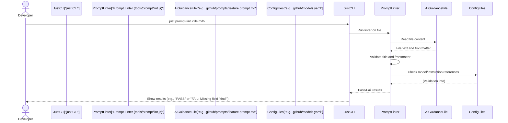

# Chapter 5: Prompt Engineering (AI Guidance)

Welcome back, future AI-powered developer! In [Chapter 4: AI Context Management](04_ai_context_management_.md), we learned how Vibes-Pro smartly collects the _right information_ – the most relevant code and documentation – for your AI assistant. This is like giving a brilliant chef all the perfect ingredients for a meal.

But giving the chef ingredients isn't enough; you also need to tell them _how_ to cook, _what style_ of cuisine to use, and _what specific dish_ you want. This chapter is all about doing exactly that for your AI: telling it _how to use that information_ and _how to behave_ to match your project's unique needs. This is called **Prompt Engineering**.

## The Problem: AI Needs Specific Directions

Imagine you have an incredibly smart AI assistant, like a super-talented but brand-new intern. If you simply tell it, "Help me build this feature," it might:

-   **Write code in a generic style**: Not matching your project's specific coding guidelines.
-   **Ignore important rules**: Like security best practices or requiring tests first.
-   **Provide inconsistent advice**: Behaving differently for similar tasks.
-   **Not understand your project's architecture**: Suggesting solutions that don't fit your [Hexagonal Architecture & DDD](02_hexagonal_architecture___ddd_.md) principles.

The core problem is that AI, despite its intelligence, needs clear, structured instructions to perform tasks _exactly_ as you need them, aligning with your project's unique conventions, architecture, and quality standards.

## Our Solution: Prompt Engineering with Vibes-Pro

Vibes-Pro solves this by giving you a powerful set of tools to "program" your AI's behavior. We use specialized Markdown files that act like blueprints for AI guidance. These files are stored in your project's `.github` directory and come in three main flavors:

1.  **Instructions**: General rules and principles (like a company handbook).
2.  **Prompts**: Reusable templates for specific tasks (like a project brief).
3.  **Chat Modes**: Define the AI's persona or role (like giving the AI a job title).

Together, these files guide the AI to provide consistent, project-aligned, and intelligent assistance.

### Central Use Case: Guiding the AI to Implement a New Feature

Let's say you need to add a new "payment method" feature to your Vibes-Pro project. You don't just want _any_ code; you want the AI to:

-   Follow [Test-Driven Development (TDD)](.github/instructions/ai-workflows.constitution.instructions.md) (write tests first).
-   Adhere to your project's [Hexagonal Architecture & DDD](02_hexagonal_architecture___ddd_.md).
-   Act like a "Senior Backend Engineer."
-   Prioritize security.

This is where Prompt Engineering shines!

## Key Concepts of AI Guidance

Let's break down the different ways you guide your AI.

### 1. Instructions: The Project's Constitution

**What it is**: Instructions are Markdown files that define general, high-level rules, principles, and best practices for your AI to follow. Think of them as the "constitution" or "company handbook" for AI-assisted development in your project. They establish non-negotiable guidelines like security policies, coding style, or mandatory workflows.

**Location**: You'll find these files in `.github/instructions/`.

**How it works**: When the AI is active, it will always refer to these instructions. Some chat modes or prompts might explicitly include certain instruction files to ensure those rules are applied.

**Example**:
Vibes-Pro includes a foundational instruction set, such as `ai-workflows.constitution.instructions.md`, which defines core principles for AI workflows.

```markdown
## <!-- .github/instructions/ai-workflows.constitution.instructions.md (simplified) -->

description: "AI workflows constitution and governance"
kind: instructions
domain: ai-workflows
precedence: 10

---

# AI Workflows Constitution & Governance

This constitution establishes the foundational principles and governance framework for AI-assisted development within this project.

## Core Principles

### 1. Spec-Driven Development

-   All changes MUST originate from a formal specification
-   Follow the strict PRD → SDS → TS → Task workflow
-   Every commit MUST reference spec IDs in the commit message body

### 2. TDD is Mandatory

-   Follow strict Red-Green-Refactor cycles for all functional changes
-   Write failing tests BEFORE implementing functionality
-   Never bypass the TDD cycle or take shortcuts
```

-   **Explanation**: This snippet shows general rules. The AI will know that `TDD is Mandatory` and it _must_ `Write failing tests BEFORE implementing functionality`. The `precedence: 10` field indicates that these instructions are very important and should be prioritized over others.

### 2. Prompts: Reusable Task Templates

**What it is**: Prompts are Markdown files that serve as reusable templates for specific tasks. They contain structured guidance and often include placeholders (`{{...}}`) where you can inject specific details for a particular task. They define the _goal_ and _method_ for the AI's current job.

**Location**: You'll find these files in `.github/prompts/`.

**How it works**: You select a prompt for a task (e.g., "implement a feature"). The AI then receives this structured prompt, filled with your specific details, along with any relevant instructions or chat modes.

**Example**:
Vibes-Pro provides prompts for common workflows, like `vibecoder-tdd.prompt.md` for Test-Driven Development.

```markdown
## <!-- .github/prompts/vibecoder-tdd.prompt.md (simplified) -->

kind: prompt
domain: vibecoder
task: tdd
thread: vibecoder-tdd
budget: M
model: GPT-5 mini
tools: ["codebase", "search", "runTests"]
description: "Vibecoder TDD workflow guidance and test-driven development patterns."

---

# Vibecoder TDD

## Overview

This prompt provides Test-Driven Development guidance specifically for Vibecoder workflows.

## Inputs

-   Feature description: {{ '{{FEATURE}}' }}
-   Test requirements: {{ '{{TESTS}}' }}
-   Code context: {{ '{{CONTEXT}}' }}

## TDD Workflow

1. **Red Phase**: Write failing tests that define the expected behavior
2. **Green Phase**: Write minimal code to make tests pass
3. **Refactor Phase**: Improve code quality while keeping tests green
```

-   **Explanation**: This prompt guides the AI through the TDD process. Notice the `kind: prompt`, `task: tdd`, and `model: GPT-5 mini` in the frontmatter, which tell the system what this file is for and which AI model to prefer. The `{{FEATURE}}`, `{{TESTS}}`, and `{{CONTEXT}}` are placeholders. When you use this prompt, you would replace these with your actual feature description, test requirements, and relevant code. This ensures the AI gets all the specific details it needs for _this_ task.

### 3. Chat Modes: The AI's Persona

**What it is**: Chat modes are Markdown files that define the AI's "persona," expertise, and specific behavior for a given conversation. They dictate _how_ the AI should respond, its tone, and which specific instruction files to prioritize. Think of it as telling the AI to "act as a Senior Backend Engineer" or "act as a Security Auditor."

**Location**: You'll find these files in `.github/chatmodes/`.

**How it works**: When you activate a chat mode (e.g., through your AI tool or a `just` command), the AI adopts that persona. Chat modes are powerful because they can _include_ other instruction files, layering specific rules onto the AI's behavior.

**Example**:
Vibes-Pro uses chat modes like `spec.wide.chatmode.md` to provide full specification context.

```markdown
## <!-- .github/chatmodes/spec.wide.chatmode.md (simplified) -->

kind: chatmode
domain: spec
task: mode
phase: wide
budget: M
model: ${ default_model }
name: "Spec Wide"

---

# Mode Guidance

-   Enter Wide mode only after Lean mode signals an escalation trigger.
-   Work spec-first (product + dev). If conflicts exist, add Spec Gaps and propose options.
-   Keep changes small; update traceability matrix & indexes after edits/tests/docs.

## Included Instructions

-   `.github/copilot-instructions.md`
-   `.github/instructions/docs.instructions.md`
-   `.github/instructions/security.instructions.md`
```

-   **Explanation**: This chat mode defines a "Spec Wide" persona (`name: "Spec Wide"`) that prioritizes specification-driven work. Crucially, it lists `Included Instructions`. This means when you activate this chat mode, the AI will automatically load and follow the rules from `copilot-instructions.md`, `docs.instructions.md`, and `security.instructions.md` in addition to its own `Mode Guidance`. This is how you layer specific behaviors and rules!

## Putting It All Together: Guiding the AI

To solve our use case ("Add a new payment method following TDD, acting as a senior backend engineer, and prioritizing security"), here's how these components work together:

1.  **Activate a Chat Mode**: You might select a chat mode like "Senior Backend Engineer" (or `spec.wide.chatmode.md` as an example). This sets the AI's overall persona and automatically pulls in general guidelines like `security.instructions.md`.
2.  **Provide a Specific Prompt**: You then use a prompt like `vibecoder-tdd.prompt.md` and fill its placeholders with "implement new payment method" for `{{FEATURE}}` and "ensure full test coverage for payment flows" for `{{TESTS}}`.
3.  **Context Management**: Behind the scenes, [Chapter 4: AI Context Management](04_ai_context_management_.md) kicks in, gathering the most relevant code (e.g., existing payment interfaces, user entities, architectural patterns).
4.  **Layered Guidance**: The AI now has:
    -   The persona and rules from the activated `chat mode` (e.g., act like a senior engineer, prioritize security).
    -   The general rules from all `included instructions` (e.g., TDD is mandatory).
    -   The specific task details from the `prompt` (e.g., implement "payment method" using TDD).
    -   The project's relevant code and documentation (e.g., `libs/core/domain/payment.ts`, `docs/ADRs/005-payment-gateway.md`).

This layered approach ensures that the AI's response is highly accurate, aligned with your project's standards, and specific to your task.

## Under the Hood: Validating AI Guidance Files

Vibes-Pro doesn't just provide these files; it also helps you _maintain_ them. To ensure your `instructions`, `prompts`, and `chat modes` are correctly formatted and contain all necessary information, Vibes-Pro includes a **prompt linter**.

### The `just prompt-lint` Command

You can easily check any of these guidance files using a `just` command (from [Chapter 3: Justfile Automation](03_justfile_automation_.md)):

```bash
just prompt-lint .github/prompts/my-new-feature.prompt.md
```

-   **What happens**: The `just` command executes a linter script that checks the specified file for common errors, such as missing required fields in its frontmatter (the `---` block at the top), or an incorrect AI model name.

Here's a simplified look at the process:



### Inside the Linter (`tools/prompt/lint.js`)

The `PromptLinter` script (located at `tools/prompt/lint.js` in the Vibes-Pro template) performs various checks to ensure your guidance files are well-formed.

For example, it checks if the frontmatter contains specific required fields based on whether the file is a `prompt`, `chatmode`, or `instructions`.

```javascript
// tools/prompt/lint.js (simplified)
const REQUIRED_FIELDS = {
    PROMPT: ["kind", "domain", "task", "matrix_ids"],
    CHATMODE: ["kind", "domain", "task", "matrix_ids"],
    INSTRUCTIONS: ["kind", "domain", "matrix_ids"],
};

function validateRequiredFields(fields, kind, findings) {
    const required = REQUIRED_FIELDS[kind.toUpperCase()];
    if (required) {
        for (const field of required) {
            if (!fields[field]) {
                findings.push(`Missing frontmatter field: ${field}`);
            }
        }
    }
}

// ... other validation functions like validateModelField, validateTitle ...
```

-   **Explanation**: This code snippet shows how `lint.js` defines which fields are `REQUIRED_FIELDS` for each `kind` of AI guidance file (`PROMPT`, `CHATMODE`, `INSTRUCTIONS`). If a field like `kind` is missing from a prompt's frontmatter, the linter will report it as an error. This helps you catch mistakes early and ensures consistency.

The linter also checks that any `model` specified in your files (like `GPT-5 mini` in the prompt example) is actually defined in your project's `models.yaml` file, and that any `instruction` files referenced by a chat mode truly exist.

## Benefits of Prompt Engineering

Prompt Engineering, as implemented in Vibes-Pro, brings significant advantages to your AI-assisted development:

| Benefit                    | Description                                                                                            | Analogy                                                                                    |
| :------------------------- | :----------------------------------------------------------------------------------------------------- | :----------------------------------------------------------------------------------------- |
| **Consistency**            | AI always follows the same project standards, coding style, and rules.                                 | Every meal from the chef consistently meets the restaurant's quality standards.            |
| **Predictability**         | You can anticipate how the AI will behave and what kind of output it will generate.                    | The chef reliably cooks the dish you requested, knowing your preferences.                  |
| **Alignment**              | AI suggestions and code align perfectly with your project's architecture, security, and quality gates. | The chef always adheres to your dietary restrictions and culinary style.                   |
| **Efficiency**             | Less time spent correcting AI output; more time focused on actual development.                         | Less wasted ingredients and cooking time because the chef knows exactly what to do.        |
| **Reduced Hallucinations** | Detailed guidance keeps the AI grounded in reality and less likely to "make up" information.           | The chef has a clear, detailed recipe, minimizing improvisation that might lead to errors. |
| **Onboarding**             | New team members quickly learn project standards by observing AI behavior.                             | New kitchen staff quickly learn the restaurant's style by observing the head chef.         |

## Conclusion

Prompt Engineering is your way of "programming" the AI to be an indispensable, project-aligned team member. By using structured **Instructions** (general rules), **Prompts** (task templates), and **Chat Modes** (AI personas), all organized in your `.github` directory and validated by handy tools, Vibes-Pro empowers you to guide your AI assistant with precision and confidence. This ensures that the AI's output is not just smart, but also perfectly tailored to your project's unique DNA.

Now that you know how to give your AI clear directions and context, let's dive into how Vibes-Pro handles data over time, introducing the concept of a **Temporal Database**.

[Next Chapter: Temporal Database (redb)](06_temporal_database__redb__.md)

---

<sub><sup>Generated by [AI Codebase Knowledge Builder](https://github.com/The-Pocket/Tutorial-Codebase-Knowledge).</sup></sub> <sub><sup>**References**: [[1]](https://github.com/SPRIME01/Vibes-Pro/blob/61b36a3f5ed748ceae18c92b1d0a340657d8e477/.github/chatmodes/spec.wide.chatmode.md), [[2]](https://github.com/SPRIME01/Vibes-Pro/blob/61b36a3f5ed748ceae18c92b1d0a340657d8e477/.github/copilot-instructions.md), [[3]](https://github.com/SPRIME01/Vibes-Pro/blob/61b36a3f5ed748ceae18c92b1d0a340657d8e477/.github/instructions/ai-workflows.constitution.instructions.md), [[4]](https://github.com/SPRIME01/Vibes-Pro/blob/61b36a3f5ed748ceae18c92b1d0a340657d8e477/.github/models.yaml), [[5]](https://github.com/SPRIME01/Vibes-Pro/blob/61b36a3f5ed748ceae18c92b1d0a340657d8e477/.github/prompts/vibecoder-tdd.prompt.md), [[6]](https://github.com/SPRIME01/Vibes-Pro/blob/61b36a3f5ed748ceae18c92b1d0a340657d8e477/tools/docs/prompt_analysis_log.md), [[7]](https://github.com/SPRIME01/Vibes-Pro/blob/61b36a3f5ed748ceae18c92b1d0a340657d8e477/tools/prompt/lint.js)</sup></sub>
