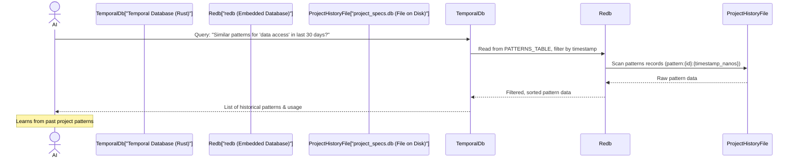

# Chapter 6: Temporal Database (redb)

Welcome back, future AI-powered developer! In [Chapter 5: Prompt Engineering (AI Guidance)](05_prompt_engineering__ai_guidance__.md), we learned how to give your AI assistant precise instructions and personas to get tailored responses. This is like teaching a brilliant intern _how_ to do a task, given all the relevant current information.

But what if your AI intern could also remember _everything_ that has ever happened in your project? What if it knew about past architectural decisions, why certain code changes were made, and how previous AI interactions turned out? This is where the **Temporal Database (redb)** comes into play.

## The Problem: AI Needs Long-Term Memory

AI assistants are amazing at understanding your current problem, especially with the help of [AI Context Management](04_ai_context_management_.md). However, without a way to remember historical information, they operate with a very short-term memory.

Imagine if you had a new doctor for every appointment. You'd have to explain your entire medical history every time! Similarly, if your AI doesn't remember your project's history:

-   **Repetitive Explanations**: You might find yourself explaining the same design choices or project patterns repeatedly.
-   **Missed Patterns**: The AI can't recognize recurring issues or successful approaches if it forgets past events.
-   **Generic Advice**: Its suggestions might be too general because it doesn't "know" your project's unique evolution and lessons learned.
-   **Limited Learning**: The AI can't truly "learn" from your project over time if all past interactions and decisions are lost.

## Our Solution: The Temporal Database (redb)

Vibes-Pro solves this by giving your project a **Temporal Database**, specifically built with `redb` (a fast, Rust-based embedded database). Think of this as your project's **long-term memory or a detailed diary**. It stores a continuous, time-stamped record of everything important that happens:

-   **Architectural Decisions (ADRs)**: Why a particular technology was chosen.
-   **Code Changes**: Significant modifications and their context.
-   **Past AI Interactions**: What suggestions were given, what was implemented, and the outcome.
-   **Architectural Patterns**: How specific design patterns were applied and their success.

This historical data allows the AI to "learn" from your project's evolution, recognize patterns, and provide increasingly intelligent and tailored suggestions, making the AI assistance smarter and more valuable with every decision recorded.

### Why "Temporal"?

The word "temporal" simply means "relating to time." A temporal database stores data not just as it _is_ now, but as it _was_ at different points in time. It's like having multiple versions of a document, each stamped with when it was created or changed. This is crucial for understanding _evolution_ and _history_.

### Why `redb`?

Vibes-Pro uses `redb` because it's:

-   **Fast and Efficient**: Written in Rust, it's designed for high performance.
-   **Embedded**: It runs directly within your application, making it easy to use without setting up a separate database server.
-   **Reliable**: Provides strong guarantees about data safety and consistency (ACID properties).
-   **Actively Maintained**: Ensures it remains robust and secure over time.

## Key Concepts of the Temporal Database

Let's break down what kind of "memories" the temporal database stores and how it organizes them.

1.  **Specifications**: These are formal documents that define parts of your project.

    -   **ADR (Architectural Decision Record)**: Explains a significant architectural decision, its alternatives, and rationale.
    -   **PRD (Product Requirements Document)**: Details what a feature should do from a user's perspective.
    -   **SDS (Software Design Specification)**: Describes the technical design of a feature.
    -   **TS (Technical Specification)**: Covers specific technical details.
    -   **Temporal Aspect**: Each specification can have multiple versions stored over time, allowing the AI to see how an idea evolved.

2.  **Architectural Patterns**: These are proven solutions to common problems in software design.

    -   The database stores definitions, examples, and metadata about patterns (e.g., "Hexagonal Architecture," "Repository Pattern").
    -   **Temporal Aspect**: It tracks _when_ a pattern was used, _how frequently_, and even its perceived _success rate_.

3.  **Decision Points**: These are specific choices made during development.

    -   When you decide on a database type, a caching strategy, or a library, this decision is recorded along with its context, author, and confidence.
    -   **Temporal Aspect**: This creates a timeline of critical choices, which the AI can analyze to understand decision-making trends.

4.  **Changes**: A low-level log of significant modifications to specifications, patterns, or other recorded entities.
    -   **Temporal Aspect**: This forms a time-series ledger, providing a detailed audit trail of how information in the database has evolved.

## Use Case: AI Learning from Project History

Imagine you're trying to implement a new feature. Your AI assistant has the current [AI Context](04_ai_context_management_.md) and your [Prompt Engineering](05_prompt_engineering__ai_guidance__.md) instructions. Now, you want it to suggest the _best architectural pattern_ for a new data access layer, specifically one that has worked well in _your project's past_.

### Step 1: Record Historical Data (Happens Automatically)

As you develop your Vibes-Pro project, the system (and sometimes you, through specific commands) will automatically record important events into the temporal database.

For example, when an Architectural Decision Record (ADR) is finalized, it's stored:

```rust
// Simplified example of storing a specification
use temporal_db::{SpecificationRecord, SpecificationType, TemporalRepository};

async fn record_new_adr(repo: &TemporalRepository) -> anyhow::Result<()> {
    let spec = SpecificationRecord::new(
        SpecificationType::ADR,
        "ADR-001".to_string(),
        "Use Event Sourcing".to_string(),
        "We will use event sourcing for core domains...".to_string(),
        Some("architect@example.com".to_string()),
    );
    repo.store_specification(&spec).await?; // Stores the ADR with a timestamp
    Ok(())
}
```

-   **Explanation**: This `record_new_adr` function creates a `SpecificationRecord` for an ADR. The `store_specification` method saves this record to the `redb` database, automatically adding a timestamp. If this ADR is updated later, a new version is stored, preserving the history.

Similarly, when you apply an architectural pattern, its usage is recorded:

```rust
// Simplified example of storing and using an architectural pattern
use temporal_db::{ArchitecturalPattern, PatternType, TemporalRepository};

async fn record_pattern_usage(repo: &TemporalRepository) -> anyhow::Result<()> {
    let mut pattern = ArchitecturalPattern::new(
        "Repository Pattern".to_string(),
        PatternType::DOMAIN,
        // ... pattern definition (simplified) ...
        serde_json::Value::Object(serde_json::Map::new()),
    );
    pattern.use_pattern(); // Mark it as used
    repo.store_architectural_pattern(&pattern).await?; // Store with updated usage/timestamp
    Ok(())
}
```

-   **Explanation**: Here, an `ArchitecturalPattern` (like the "Repository Pattern" discussed in [Hexagonal Architecture & DDD](02_hexagonal_architecture___ddd__.md)) is created and its `use_pattern()` method is called. This updates its `usage_frequency` and `last_used` timestamp, which are then stored in `redb`.

### Step 2: AI Queries for Historical Insight

When the AI needs to make a suggestion, it can query the temporal database. For our use case, the AI might ask: "What architectural patterns have been successfully used for data access layers recently?"

```python
# Simplified Python adapter interaction for AI to query
from libs.prompt_optimizer.infrastructure.temporal_db import RedbTemporalDatabaseAdapter
from libs.prompt_optimizer.domain.entities import OptimizationGoal

async def get_pattern_insights():
    db = RedbTemporalDatabaseAdapter("./temporal_db_path")
    await db._ensure_initialized() # Connect to the database

    # AI asks for patterns related to "data access" within the last 30 days
    similar_patterns = await db.get_similar_patterns("data access", 0.7, 30)

    for pattern in similar_patterns:
        print(f"Pattern: {pattern.pattern_name}, Used: {pattern.usage_frequency} times")
        # AI can then analyze these patterns to make informed suggestions
```

-   **Explanation**: The `RedbTemporalDatabaseAdapter` (which connects our Python-based AI tools to the Rust `redb` database) is used. The `get_similar_patterns` method queries the database for patterns matching "data access," with a certain similarity threshold, and looking back 30 days. The AI receives a list of historical patterns, including their usage frequency, helping it suggest well-vetted solutions.

## Under the Hood: How `redb` Manages Time

Let's peek behind the scenes to see how the `redb` database stores and retrieves this temporal information.

When you (or the AI) interact with the Temporal Database, the core idea is that every piece of information is stored with a timestamp, either directly in the data or as part of its unique key.



1.  **AI Request**: The AI asks for similar architectural patterns.
2.  **Temporal Database (Rust layer)**: This layer translates the AI's request into specific database queries. It knows which `redb` tables to look into and how to handle time-based filtering.
3.  **`redb` (The Database Engine)**: `redb` is instructed to read from its `PATTERNS_TABLE`. Critically, the keys in this table include timestamps (e.g., `pattern:{id}:{timestamp_nanos}`). This allows `redb` to efficiently find records created or used within the last 30 days.
4.  **Project History File**: `redb` reads the actual data from a file (typically `project_specs.db`) on your disk.
5.  **Data Filtering & Return**: `redb` returns the matching records, which the Temporal Database layer then processes (e.g., deserializes, sorts by recency) before sending them back to the AI.

### Inside `temporal_db/schema.rs`: What Data Looks Like

The `temporal_db/schema.rs` file defines the blueprints for the data stored in `redb`. These are Rust `struct`s that are then converted to JSON and stored as bytes.

```rust
// temporal_db/schema.rs (Simplified)
use serde::{Deserialize, Serialize};
use chrono::{DateTime, Utc};
// ... other imports ...

#[derive(Serialize, Deserialize, Clone, Debug)]
pub struct SpecificationRecord {
    // ... id, spec_type, identifier, title ...
    pub content: String,
    pub timestamp: DateTime<Utc>, // Crucial for temporal queries
    pub version: u32,             // To track versions
    // ... author, metadata ...
}

#[derive(Serialize, Deserialize, Clone, Debug)]
pub struct ArchitecturalPattern {
    // ... id, pattern_name, pattern_type ...
    pub usage_frequency: u32,         // How many times it was used
    pub last_used: Option<DateTime<Utc>>, // When it was last used
    pub pattern_definition: serde_json::Value,
    // ... examples, metadata ...
}

#[derive(Serialize, Deserialize, Clone, Debug)]
pub enum SpecificationType {
    ADR, PRD, SDS, TS,
}
// ... other schemas like DecisionPoint, SpecificationChange ...
```

-   **Explanation**: `SpecificationRecord` includes a `timestamp` and `version` to track changes over time. `ArchitecturalPattern` records `usage_frequency` and `last_used` dates, allowing the AI to prioritize frequently or recently used patterns. These Rust `struct`s are what gets stored as JSON in the database.

### Inside `temporal_db/repository.rs`: Storing and Retrieving

The `temporal_db/repository.rs` file contains the core Rust logic that interacts directly with `redb` to store and retrieve data. It defines the tables and how data is inserted and read.

```rust
// temporal_db/repository.rs (Simplified)
use redb::{Database, TableDefinition};
use chrono::Utc;
use anyhow::{Result, Context};
// ... other imports ...

// Define table schemas for redb
const SPECIFICATIONS_TABLE: TableDefinition<&str, &[u8]> = TableDefinition::new("specifications");
const PATTERNS_TABLE: TableDefinition<&str, &[u8]> = TableDefinition::new("patterns");
// ... other tables ...

pub struct TemporalRepository {
    // ... db_path, db connection ...
}

impl TemporalRepository {
    // ... initialize method ...

    pub async fn store_specification(
        &self,
        spec: &SpecificationRecord,
    ) -> Result<()> {
        let db = self.db.as_ref().context("Database not initialized")?;
        let write_txn = db.begin_write()?; // Start a transaction
        {
            let spec_key = format!("spec:{}:{}", spec.identifier, spec.timestamp.timestamp_nanos_opt().unwrap_or(0));
            let spec_value = serde_json::to_vec(spec)?;
            let mut spec_table = write_txn.open_table(SPECIFICATIONS_TABLE)?;
            spec_table.insert(spec_key.as_str(), spec_value.as_slice())?;
        }
        write_txn.commit()?; // Commit the transaction
        Ok(())
    }

    pub async fn get_latest_specification(
        &self,
        _spec_type: &str, // (Simplified, not directly used in key for brevity)
        identifier: &str,
    ) -> Result<Option<SpecificationRecord>> {
        let db = self.db.as_ref().context("Database not initialized")?;
        let read_txn = db.begin_read()?;
        let spec_table = read_txn.open_table(SPECIFICATIONS_TABLE)?;

        // Find the latest version using the timestamp in the key
        let spec_prefix = format!("spec:{}", identifier);
        let mut latest_spec: Option<SpecificationRecord> = None;
        let mut latest_timestamp = 0i64;

        let range = spec_table.range::<&str>(..)?; // Scan all records
        for result in range {
            let (key, value) = result?;
            let key_str = key.value();

            if key_str.starts_with(&spec_prefix) {
                if let Some(timestamp_str) = key_str.split(':').last() {
                    if let Ok(timestamp) = timestamp_str.parse::<i64>() {
                        if timestamp > latest_timestamp { // Find the most recent timestamp
                            latest_spec = Some(serde_json::from_slice(value.value())?);
                            latest_timestamp = timestamp;
                        }
                    }
                }
            }
        }
        Ok(latest_spec)
    }

    // ... store_architectural_pattern, get_similar_patterns, analyze_decision_patterns ...
    // These methods work similarly, using timestamps in keys or filtering by time.
}
```

-   **Explanation**:
    -   `SPECIFICATIONS_TABLE` and `PATTERNS_TABLE` are defined as specific places (tables) within the `redb` file to store data.
    -   `store_specification`: This function takes a `SpecificationRecord`, serializes it to JSON bytes, and then inserts it into `SPECIFICATIONS_TABLE`. Notice the `spec_key` format: `spec:{identifier}:{timestamp_nanos}`. This ensures that different versions of the same `identifier` are stored uniquely, ordered by their timestamp.
    -   `get_latest_specification`: To get the _latest_ version, it scans all records with the given `identifier` prefix and then picks the one with the highest (most recent) `timestamp` from its key.

### Inside `libs/prompt_optimizer/infrastructure/temporal_db.py`: The Python Adapter

AI tools in Vibes-Pro are often written in Python. The `RedbTemporalDatabaseAdapter` acts as a bridge, allowing Python code to interact with the `redb` database (which is primarily a Rust library). While `redb` doesn't have direct Python bindings, the adapter provides a conceptual interface, potentially connecting through FFI (Foreign Function Interface) or a file-based fallback in a simpler environment.

```python
# libs/prompt_optimizer/infrastructure/temporal_db.py (Simplified)
import json
from datetime import datetime, UTC, timedelta
from typing import Any

from ..application.ports import TemporalDatabasePort
from ..domain.entities import Prompt # ... other entities ...

class RedbTemporalDatabaseAdapter(TemporalDatabasePort):
    def __init__(self, db_path: str):
        self.db_path = db_path
        self._db: Any = None # Placeholder for redb connection or fallback
        self._initialized = False

    async def _ensure_initialized(self) -> None:
        """Connect to the redb database (or setup fallback)."""
        if self._initialized: return
        # In a real setup, this would connect to the Rust redb core
        # For simplicity, here it just ensures a directory exists for file-based fallback
        import os; os.makedirs(self.db_path, exist_ok=True)
        self._db = self.db_path # This would be the actual Rust DB object
        self._initialized = True

    async def get_similar_prompts(
        self,
        features: dict[str, Any],
        similarity_threshold: float = 0.7,
        days_back: int = 90 # Temporal filtering!
    ) -> list[Prompt]:
        await self._ensure_initialized()
        similar_prompts: list[Prompt] = []
        cutoff_date = datetime.now(UTC) - timedelta(days=days_back)

        # In a real implementation, this would call the Rust 'get_similar_patterns'
        # or equivalent and pass the 'days_back' parameter for temporal filtering.
        # For this example, we simulate getting recent records from a file-based fallback
        recent_records = await self._get_recent_records("prompt_analysis", days=days_back)

        for record in recent_records:
            record_time = datetime.fromisoformat(record.get("timestamp", ""))
            if record_time >= cutoff_date: # Filter by time
                # ... similarity calculation (simplified) ...
                prompt = self._deserialize_prompt_from_record(record)
                if prompt: similar_prompts.append(prompt)
        return similar_prompts[:10]

    async def _get_recent_records(self, prefix: str, days: int) -> list[dict[str, Any]]:
        # This method is simplified for Python example.
        # It conceptually fetches records and filters by timestamp.
        # In a real Rust-backed redb, the Rust layer would do the filtering efficiently.
        pass # Actual implementation is omitted for brevity and focus on concept
```

-   **Explanation**: The `RedbTemporalDatabaseAdapter` has an `_ensure_initialized` method to set up the connection. The `get_similar_prompts` method takes `days_back` as a parameter, indicating how far back in time the AI should look for relevant prompts. This `days_back` parameter is passed to the underlying `redb` operations, ensuring that only historically relevant data is considered, allowing the AI to learn from recent trends and decisions, not just all past data.

## Benefits of the Temporal Database

Integrating a temporal database like `redb` brings significant long-term advantages to your Vibes-Pro projects:

| Benefit                     | Description                                                                                             | Analogy                                                                        |
| :-------------------------- | :------------------------------------------------------------------------------------------------------ | :----------------------------------------------------------------------------- |
| **Contextual Learning**     | AI understands the _evolution_ of your project, not just its current state.                             | A doctor who knows your full medical history provides better treatment.        |
| **Pattern Recognition**     | AI can identify recurring architectural patterns, decision trends, and successful strategies over time. | Spotting if a certain type of exercise always leads to better results for you. |
| **Intelligent Suggestions** | Advice is tailored to your project's unique history, avoiding generic or previously failed approaches.  | A financial advisor who knows your past investment successes and failures.     |
| **Auditability**            | A clear, time-stamped record of all significant architectural and development decisions.                | A company's complete ledger of all financial transactions.                     |
| **Reduced Risk**            | AI can warn against repeating past mistakes or suggest proven solutions, reducing development risk.     | Learning from a past project's pitfalls to avoid them in a new one.            |
| **Faster Onboarding**       | New team members (and AI) can quickly grasp the project's history and rationale for current designs.    | A detailed project handover document for new employees.                        |

## Conclusion

The Temporal Database, powered by `redb`, is the long-term memory of your Vibes-Pro project. By meticulously recording the evolution of your architectural decisions, code changes, and AI interactions over time, it transforms your AI assistant from a short-term problem-solver into a knowledgeable, continuously learning partner. This rich historical context enables the AI to provide truly intelligent, project-aware, and increasingly valuable suggestions, making your development process smarter and more efficient.

Now that we've explored how Vibes-Pro stores and remembers the past, let's look at how it helps you keep your code types consistent across different parts of your project.

[Next Chapter: Type Generation System](07_type_generation_system_.md)

---

<sub><sup>Generated by [AI Codebase Knowledge Builder](https://github.com/The-Pocket/Tutorial-Codebase-Knowledge).</sup></sub> <sub><sup>**References**: [[1]](https://github.com/SPRIME01/Vibes-Pro/blob/61b36a3f5ed748ceae18c92b1d0a340657d8e477/docs/DATABASE-MIGRATION-SUMMARY.md), [[2]](https://github.com/SPRIME01/Vibes-Pro/blob/61b36a3f5ed748ceae18c92b1d0a340657d8e477/docs/TEMPORAL-DB-MIGRATION-SUMMARY.md), [[3]](https://github.com/SPRIME01/Vibes-Pro/blob/61b36a3f5ed748ceae18c92b1d0a340657d8e477/libs/prompt-optimizer/infrastructure/temporal_db.py), [[4]](https://github.com/SPRIME01/Vibes-Pro/blob/61b36a3f5ed748ceae18c92b1d0a340657d8e477/temporal_db/README.md), [[5]](https://github.com/SPRIME01/Vibes-Pro/blob/61b36a3f5ed748ceae18c92b1d0a340657d8e477/temporal_db/repository.rs), [[6]](https://github.com/SPRIME01/Vibes-Pro/blob/61b36a3f5ed748ceae18c92b1d0a340657d8e477/temporal_db/schema.rs), [[7]](https://github.com/SPRIME01/Vibes-Pro/blob/61b36a3f5ed748ceae18c92b1d0a340657d8e477/tests/temporal/test_database.py), [[8]](https://github.com/SPRIME01/Vibes-Pro/blob/61b36a3f5ed748ceae18c92b1d0a340657d8e477/tests/temporal/test_repository.py)</sup></sub>
