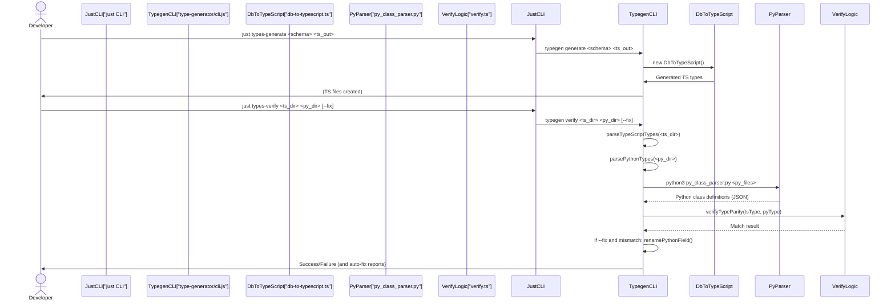

# Chapter 7: Type Generation System

Welcome back, Vibes-Pro explorer! In [Chapter 6: Temporal Database (redb)](06_temporal_database__redb__.md), we learned how your project gains a powerful long-term memory, enabling AI to learn from past decisions and architectural patterns. Now, let's turn our attention to how Vibes-Pro ensures that all parts of your application, regardless of the programming language, speak the same "data language."

## The Problem: Conflicting Data Definitions

Imagine you're building a feature that involves a `User` in your application. Your backend team uses Python, and they define a `User` with `id` (string), `name` (string), and `age` (integer). Your frontend team uses TypeScript, and they also define a `User`, but accidentally make `id` a `number` and `age` a `string`.

This small difference can lead to huge problems:

-   **Errors**: The frontend sends a `string` age, but the backend expects an `integer`, causing crashes.
-   **Confusion**: Developers spend time debugging why data isn't working as expected.
-   **Maintenance Nightmare**: If you change how a `User` is defined in one place, you have to manually update it everywhere else, increasing the chance of mistakes.
-   **Lack of Trust**: You can't be sure that different parts of your system are working with the same understanding of your data.

This is like trying to build a house where the architects, plumbers, and electricians all have slightly different blueprints for the same building!

## Our Solution: The Type Generation System

Vibes-Pro solves this with its **Type Generation System**. Think of this system as a universal translator and an agreement enforcer for your data. Its job is to:

1.  **Define Once**: You define your data structures (like a `User` or `Product`) in _one central place_, typically your database schema.
2.  **Translate Automatically**: The system reads this central definition and automatically generates the corresponding type definitions for all your programming languages (e.g., TypeScript interfaces for your frontend, Python classes for your backend).
3.  **Verify Consistency**: It can then check if the generated types (and any manually written types) are structurally identical across different languages, catching mismatches before they cause bugs.

This ensures that whether your code is written in TypeScript, Python, or any other language, everyone uses the exact same understanding of your data, preventing errors and improving reliability.

## Central Use Case: Generating and Verifying Types for a `User`

Let's walk through how you'd use this system for a simple `User` entity. We want to:

1.  Define a `User` in a database schema.
2.  Automatically generate a TypeScript interface for this `User`.
3.  Ensure that a Python `User` class (whether generated or manually created) matches the TypeScript interface.

### Step 1: Define Your Data in a Schema

The first step is to define your data in a single, authoritative source. In Vibes-Pro, this often starts with a database schema. Imagine you have a `user` table defined like this (simplified JSON representation):

```json
// path/to/db-schema.json
{
    "tables": {
        "user": {
            "columns": {
                "id": {
                    "type": "uuid",
                    "nullable": false
                },
                "name": {
                    "type": "varchar",
                    "nullable": false
                },
                "email": {
                    "type": "text",
                    "nullable": false
                },
                "is_active": {
                    "type": "boolean",
                    "nullable": true
                },
                "created_at": {
                    "type": "timestamptz",
                    "nullable": false
                }
            }
        }
    }
}
```

-   **Explanation**: This JSON file acts as our "single source of truth." It describes a `user` table with five columns, their PostgreSQL data types, and whether they can be empty (`nullable`).

### Step 2: Generate TypeScript Types

Now, let's use the Type Generation System to create a TypeScript interface from this schema. You'll use a `just` command (from [Chapter 3: Justfile Automation](03_justfile_automation_.md)):

```bash
just types-generate path/to/db-schema.json libs/shared/database-types
```

-   **`types-generate`**: This is the `just` recipe to start the type generation.
-   **`path/to/db-schema.json`**: This is the input file, our database schema definition.
-   **`libs/shared/database-types`**: This is the output directory where the TypeScript files will be saved.

**What happens**: The system reads your `db-schema.json`, translates each database column into a TypeScript type, and creates a `.ts` file.

You'll find a new file like `libs/shared/database-types/user.ts`:

```typescript
// libs/shared/database-types/user.ts
// Auto-generated TypeScript types for User
export interface User {
    id: string;
    name: string;
    email: string;
    isActive: boolean | null; // Note: is_active became isActive and is nullable
    createdAt: string;
}
```

-   **Explanation**: The system automatically:
    -   Converted the table name `user` to a PascalCase interface name `User`.
    -   Mapped PostgreSQL types (`uuid`, `varchar`, `boolean`, `timestamptz`) to appropriate TypeScript types (`string`, `boolean`).
    -   Handled `nullable: true` by adding `| null` to the TypeScript type.
    -   Converted `snake_case` column names (`is_active`, `created_at`) to `camelCase` (`isActive`, `createdAt`) for TypeScript.

### Step 3: (Optional) Prepare Python Types

The Type Generation System helps _verify_ Python types against generated TypeScript types. This means your Python types need to exist first. You might create them manually, or use another (potentially custom) generation step. For this example, let's assume you've created a Python class that you _expect_ to match:

```python
# libs/backend/domain/user/user.py
from typing import Optional, Dict, Any # We will use actual Python types, not a simplified example

class User:
    id: str
    name: str
    email: str
    is_active: Optional[bool] # Notice snake_case here
    created_at: str
```

-   **Explanation**: This is a simple Python class. Notice `is_active` uses `snake_case`, which is common in Python, while our generated TypeScript used `camelCase`. The Type Generation System will handle this naming difference during verification.

### Step 4: Verify Type Parity

Now, the crucial step: ensuring that your generated TypeScript types and your Python types are consistent.

```bash
just types-verify libs/shared/database-types libs/backend/domain/user --fix
```

-   **`types-verify`**: This `just` recipe initiates the type comparison.
-   **`libs/shared/database-types`**: The directory containing your TypeScript types.
-   **`libs/backend/domain/user`**: The directory containing your Python types.
-   **`--fix`**: This powerful option tells the system to _automatically rename_ Python fields to match TypeScript's `camelCase` if it detects a `snake_case` equivalent.

**What happens**: The system will:

1.  Read all TypeScript interfaces from the first directory.
2.  Read all Python classes from the second directory.
3.  Compare them structurally (do they have the same classes/interfaces? Do they have the same fields? Do the types of those fields match?).
4.  If `--fix` is used, it will automatically adjust Python field names (e.g., `is_active` to `isActive`) to match their TypeScript counterparts.

If successful, you'll see:

```
🛠  Auto-fixed field name in User: is_active -> isActive
✅ All types are structurally compatible
```

And your `libs/backend/domain/user/user.py` file will be updated:

```python
# libs/backend/domain/user/user.py (after --fix)
from typing import Optional, Dict, Any

class User:
    id: str
    name: str
    email: str
    isActive: Optional[bool] # Renamed by --fix!
    createdAt: str
```

-   **Explanation**: The `types-verify` command automatically detected that `User.is_active` in Python was the `snake_case` equivalent of `User.isActive` in TypeScript. With `--fix`, it automatically renamed the field in the Python file to match, ensuring perfect naming consistency across languages!

## Under the Hood: The Type Generation Workflow

Let's peek behind the scenes to see how `just types-generate` and `just types-verify` work.



### 1. The `db-to-typescript.ts` Generator (Postgres to TypeScript)

The core logic for converting your database schema into TypeScript types lives in `tools/type-generator/src/generators/types/db-to-typescript.ts`.

It reads your JSON schema and uses a mapping function to convert PostgreSQL types to TypeScript equivalents.

```typescript
// tools/type-generator/src/generators/types/db-to-typescript.ts (Simplified)
// ... (imports and boilerplate omitted) ...

export class DbToTypeScript {
    // ... (constructor and path resolution methods omitted) ...

    // Core generation logic
    private _generateTypes(schema: any): Record<string, Record<string, string>> {
        const types: Record<string, Record<string, string>> = {};

        function toPascalCase(name: string): string {
            // Converts 'user_profile' to 'UserProfile'
            return name
                .replace(/[_-]+/g, " ")
                .split(" ")
                .map((word) => word.charAt(0).toUpperCase() + word.slice(1))
                .join("");
        }

        if (!schema.tables || typeof schema.tables !== "object") return types;

        for (const [tableName, tableDefRaw] of Object.entries(schema.tables)) {
            const className = toPascalCase(tableName);
            const fields: Record<string, string> = {};

            const tableDef = (tableDefRaw as any) || {};
            const columns = tableDef.columns ?? {};

            for (const [colName, colDefRaw] of Object.entries(columns)) {
                const columnDef = colDefRaw as any;
                // This is where Postgres type is mapped to TypeScript
                const tsType = this.mapPostgresToTypeScript(columnDef.type, columnDef.nullable || false, columnDef.is_array || false);
                fields[colName] = tsType; // Store the mapped type
            }
            types[className] = fields;
        }
        return types;
    }

    // Helper function to map individual types
    mapPostgresToTypeScript(postgresType: string, nullable: boolean = false, isArray: boolean = false): string {
        const typeMap: Record<string, string> = {
            uuid: "string",
            bigint: "string",
            timestamptz: "string",
            integer: "number",
            boolean: "boolean",
            text: "string",
            // ... more mappings ...
        };

        let baseType = typeMap[postgresType.toLowerCase()] || "unknown";

        if (isArray) {
            baseType = `${baseType}[]`;
        }
        if (nullable) {
            baseType = `${baseType} | null`;
        }
        return baseType;
    }
}
```

-   **Explanation**:
    -   The `_generateTypes` method loops through each table in your `db-schema.json`.
    -   It converts the table name (e.g., `user`) to a PascalCase `className` (e.g., `User`).
    -   For each column, it calls `mapPostgresToTypeScript` to translate the PostgreSQL type (e.g., `uuid`, `boolean`) into a TypeScript type (`string`, `boolean`). It also adds `[]` for arrays and `| null` for nullable fields.
    -   Finally, it assembles these into a structure that can be written to a TypeScript file.

### 2. The `cli.js` Tool (The Orchestrator)

The main command-line interface `tools/type-generator/cli.js` uses `commander.js` to define the `generate` and `verify` commands.

#### The `generate` Command

```javascript
// tools/type-generator/cli.js (Simplified)
// ... (imports and boilerplate omitted) ...

program
    .command("generate")
    .description("Generate TypeScript types from database schema")
    .argument("<schema-path>", "path to the database schema JSON file")
    .option("-o, --output-dir <dir>", "output directory for generated types")
    .action((schemaPath, options) => {
        try {
            const generator = new DbToTypeScript(WORKSPACE_ROOT); // Create the generator
            // ... (path resolution and safety checks omitted) ...
            generator.generate(resolvedSchema, resolvedOutputDir); // Call the generator
            console.log("✅ TypeScript types generated successfully");
        } catch (error) {
            console.error(`❌ ${error.message}`);
            process.exit(1);
        }
    });

// ... (other commands and parsing logic omitted) ...
```

-   **Explanation**: When you run `typegen generate`, this code block creates an instance of `DbToTypeScript` and calls its `generate` method, passing your schema path and output directory.

#### The `verify` Command

This command is more complex as it needs to parse both TypeScript and Python files and then compare them.

```javascript
// tools/type-generator/cli.js (Simplified)
// ... (imports and boilerplate omitted) ...

// Helper to parse TypeScript files
function parseTypeScriptTypes(tsDir) {
    /* ... uses ts.createSourceFile to read interfaces ... */
}

// Helper to parse Python files
// This embeds a small Python script, saves it to a temp file, and executes it.
const PY_PARSER_SOURCE = `
import ast
import json
import os
import sys

def parse_file(path: str) -> dict[str, dict[str, str]]:
    # ... logic to read Python file and extract class fields and types ...
    # e.g., for 'class User: id: str', it finds 'User' and 'id: str'
    return classes

def main() -> None:
    result: dict[str, dict[str, dict[str, str]]] = {}
    for file_path in sys.argv[1:]: # Process all provided Python files
        abs_path = os.path.abspath(file_path)
        result[abs_path] = parse_file(abs_path)
    print(json.dumps(result)) # Output as JSON
`;
function parsePythonTypes(pyDir) {
    // ... (creates temporary PY_PARSER_PATH and writes PY_PARSER_SOURCE to it) ...
    const result = spawnSync("python3", [parserPath, ...pythonFiles]); // Runs the Python script
    // ... (parses JSON output from Python script) ...
    return {
        pyTypes,
        classFileMap,
        fileContents,
        processedFiles: pythonFiles.length,
    };
}

program
    .command("verify")
    .description("Verify structural parity between TypeScript and Python types")
    .argument("<ts-dir>", "directory containing TypeScript type files")
    .argument("<py-dir>", "directory containing Python type files")
    .option("-f, --fix", "auto-fix simple naming mismatches by renaming Python fields to match TypeScript")
    .action((tsDir, pyDir, options) => {
        try {
            const { tsTypes } = parseTypeScriptTypes(tsDir); // Get TS types
            const { pyTypes, classFileMap, fileContents } = parsePythonTypes(pyDir); // Get Python types

            let hasErrors = false;

            for (const [className, tsClass] of Object.entries(tsTypes)) {
                const pyClass = pyTypes[className];
                if (!pyClass) {
                    /* ... error: Python class missing ... */
                }

                for (const [fieldName, tsType] of Object.entries(tsClass)) {
                    // Check for camelCase vs snake_case
                    const pythonCandidateNames = [camelToSnake(fieldName), fieldName];
                    const matchedName = pythonCandidateNames.find((name) => Object.prototype.hasOwnProperty.call(pyClass, name));

                    if (!matchedName) {
                        /* ... error: field missing ... */
                    }

                    const pyType = pyClass[matchedName];
                    if (!verifyTypeParity(tsType, pyType)) {
                        // *** Crucial type comparison! ***
                        console.error(`❌ Type mismatch in ${className}.${fieldName}: TS=${tsType}, Python=${pyType}`);
                        hasErrors = true;
                    }

                    if (options.fix && matchedName !== fieldName) {
                        // If --fix, and names are different (e.g., is_active vs isActive)
                        // Rename the Python field in its file
                        renamePythonField(className, matchedName, fieldName, classFileMap[className], pyClass, fileContents);
                    }
                }
                // ... (check for extra fields in Python) ...
            }
            // ... (check for missing Python classes) ...

            if (hasErrors) {
                process.exit(1);
            }
            console.log("✅ All types are structurally compatible");
        } catch (error) {
            console.error(`❌ ${error.message}`);
            process.exit(1);
        }
    });
```

-   **Explanation**:
    -   `parseTypeScriptTypes` uses the `typescript` library to read TypeScript files and extract interface definitions.
    -   `parsePythonTypes` dynamically creates a small Python script (`PY_PARSER_SOURCE`), saves it to a temporary location, and then executes it using `python3`. This Python script parses Python files using its own `ast` (Abstract Syntax Tree) module to find class definitions and their type annotations. The results are output as JSON and read back by `cli.js`.
    -   The `verify` action then iterates through all found TypeScript classes and their fields.
    -   It intelligently checks for matching Python classes, considering both `camelCase` and `snake_case` field names.
    -   The crucial step is calling `verifyTypeParity(tsType, pyType)`, which does the actual deep comparison of the types themselves.
    -   If `--fix` is enabled and a `snake_case` Python field matches a `camelCase` TypeScript field, it automatically rewrites the Python file to use the `camelCase` name.

### 3. The `verify.ts` Type Parity Logic (The Translator)

The core logic for comparing TypeScript and Python types is in `tools/type-generator/src/generators/verify.ts`. It's responsible for understanding type equivalences across languages, handling unions, and arrays.

```typescript
// tools/type-generator/src/generators/verify.ts (Simplified)
// ... (imports and boilerplate omitted) ...

// Main function to verify if two types are equivalent
export function verifyTypeParity(tsType: string, pyType: string): boolean {
    // Normalize types (remove spaces, convert to lowercase)
    const normalizedTsType = tsType.replace(/\s+/g, "").toLowerCase();
    const normalizedPyType = pyType.replace(/\s+/g, "").toLowerCase();

    // Parse types into a list of individual "tokens" (e.g., "string | number" becomes ["string", "number"])
    const tsTokens = parseTypeScriptTokens(normalizedTsType); // Handles 'string | null'
    const pyTokens = parsePythonTokens(normalizedPyType); // Handles 'Union[str, int]' or 'Optional[str]'

    // Check if one is optional and the other isn't (e.g., 'string | null' vs 'str')
    const tsHasOptional = tsTokens.some((token) => TS_OPTIONAL_TOKENS.has(token));
    const pyHasOptional = pyTokens.includes("none"); // Python's Optional adds 'None'

    if (tsHasOptional !== pyHasOptional) {
        return false; // Mismatch in optionality
    }

    // Filter out 'null' / 'none' for core type comparison
    const tsCoreTokens = tsTokens.filter((token) => !TS_OPTIONAL_TOKENS.has(token));
    const pyCoreTokens = pyTokens.filter((token) => token !== "none");

    // Match the remaining core type tokens
    return matchTokenSets(tsCoreTokens, pyCoreTokens);
}

// Compares two sets of type tokens (e.g., ["string", "number"] vs ["str", "int"])
function matchTokenSets(tsTokens: string[], pyTokens: string[]): boolean {
    if (tsTokens.length !== pyTokens.length) {
        return false;
    } // Different number of types in a union

    const remaining = [...pyTokens]; // Make a copy to track matched Python types

    for (const tsToken of tsTokens) {
        let matched = false;
        for (let index = 0; index < remaining.length; index += 1) {
            const candidate = remaining[index];
            if (matchSingleType(tsToken, candidate)) {
                // Match individual types
                remaining.splice(index, 1); // Remove matched Python type
                matched = true;
                break;
            }
        }
        if (!matched) {
            return false;
        } // No match found for a TS token
    }
    return remaining.length === 0; // Ensure all Python tokens were matched
}

// Matches a single TypeScript type string to a single Python type string
function matchSingleType(tsToken: string, pyToken: string): boolean {
    // Direct match (e.g., 'string' === 'string' if Python had that)
    if (tsToken === pyToken) {
        return true;
    }

    // Handle arrays/lists (e.g., 'string[]' vs 'list[str]')
    const tsArray = tsToken.endsWith("[]");
    const pyList = pyToken.startsWith("list[") && pyToken.endsWith("]");
    if (tsArray && pyList) {
        const tsBase = tsToken.slice(0, -2);
        const pyBase = pyToken.slice("list[".length, -1);
        return verifyTypeParity(tsBase, pyBase); // Recursively check base types
    }

    // Define how common TS types map to common Python types
    const typeMapping: Record<string, string[]> = {
        string: ["str", "uuid", "datetime", "date"], // TS 'string' can be many Python types
        number: ["int", "float"],
        boolean: ["bool"],
        unknown: ["dict", "any", "object"],
        object: ["dict"],
    };

    for (const [tsKey, pyValues] of Object.entries(typeMapping)) {
        if (tsToken === tsKey && pyValues.includes(pyToken)) {
            return true;
        }
    }

    // Handle special cases like 'Record<string, any>' vs 'dict[str, any]'
    if (tsToken === "record<string,any>" && pyToken.startsWith("dict[")) {
        return true;
    }
    if (pyToken === "any" && (tsToken === "unknown" || tsToken === "any")) {
        return true;
    }

    return false; // No match found
}
```

-   **Explanation**:
    -   `verifyTypeParity`: This is the entry point. It first `parseTypeScriptTokens` and `parsePythonTokens` to break down union types (like `string | number` or `Union[str, int]`) into individual tokens. It then checks for `null`/`None` differences.
    -   `matchTokenSets`: This function compares the two lists of "core" type tokens (after handling `null`/`None`). It ensures that for every TypeScript token, there's a matching Python token, and vice-versa.
    -   `matchSingleType`: This is where the actual cross-language type mapping happens. It knows that TypeScript `string` maps to Python `str`, `uuid`, `datetime`, etc. It also handles recursive checks for array/list types (e.g., `string[]` vs `list[str]`). This deep understanding of type equivalences is key to verifying consistency.

## Benefits of the Type Generation System

This powerful system brings significant advantages to your Vibes-Pro projects:

| Benefit                   | Description                                                                                            | Analogy                                                                     |
| :------------------------ | :----------------------------------------------------------------------------------------------------- | :-------------------------------------------------------------------------- |
| **Consistency**           | All parts of your application (frontend, backend, database) use the exact same data definitions.       | Everyone on a building project uses the same, verified blueprints.          |
| **Error Prevention**      | Catches type mismatches and missing fields early, before they cause runtime bugs.                      | Finding blueprint errors on paper, not after construction begins.           |
| **Faster Development**    | Eliminates manual, repetitive type definition, allowing developers to focus on features.               | An automatic translator handles the complex language conversions instantly. |
| **Easier Maintenance**    | Changing a data structure in one place (the schema) automatically propagates updates across languages. | Updating one master blueprint automatically updates all specialized plans.  |
| **Reliability**           | Builds trust in your codebase knowing that data flows correctly and consistently.                      | Confidence that all parts of the building will fit together perfectly.      |
| **Automated Refactoring** | The `--fix` option can even rename fields in Python code to match TypeScript conventions.              | A smart tool that cleans up and aligns your documents for you.              |

## Conclusion

The Type Generation System is a cornerstone of reliability and efficiency in Vibes-Pro. By establishing a single source of truth for your data definitions and automating their translation and verification across multiple programming languages, it eliminates a major source of bugs and development friction. This ensures that your entire application operates with a unified understanding of its data, making your development process smoother, faster, and more robust.

---

<sub><sup>Generated by [AI Codebase Knowledge Builder](https://github.com/The-Pocket/Tutorial-Codebase-Knowledge).</sup></sub> <sub><sup>**References**: [[1]](https://github.com/SPRIME01/Vibes-Pro/blob/61b36a3f5ed748ceae18c92b1d0a340657d8e477/libs/backend/type_utils/__init__.py.j2), [[2]](https://github.com/SPRIME01/Vibes-Pro/blob/61b36a3f5ed748ceae18c92b1d0a340657d8e477/libs/shared/database-types/index.ts.j2), [[3]](https://github.com/SPRIME01/Vibes-Pro/blob/61b36a3f5ed748ceae18c92b1d0a340657d8e477/tests/type-generator/verify.test.ts), [[4]](https://github.com/SPRIME01/Vibes-Pro/blob/61b36a3f5ed748ceae18c92b1d0a340657d8e477/tools/type-generator/cli.js), [[5]](https://github.com/SPRIME01/Vibes-Pro/blob/61b36a3f5ed748ceae18c92b1d0a340657d8e477/tools/type-generator/src/generators/types/db-to-typescript.ts), [[6]](https://github.com/SPRIME01/Vibes-Pro/blob/61b36a3f5ed748ceae18c92b1d0a340657d8e477/tools/type-generator/src/generators/types/generator.ts), [[7]](https://github.com/SPRIME01/Vibes-Pro/blob/61b36a3f5ed748ceae18c92b1d0a340657d8e477/tools/type-generator/src/generators/verify.ts)</sup></sub>
