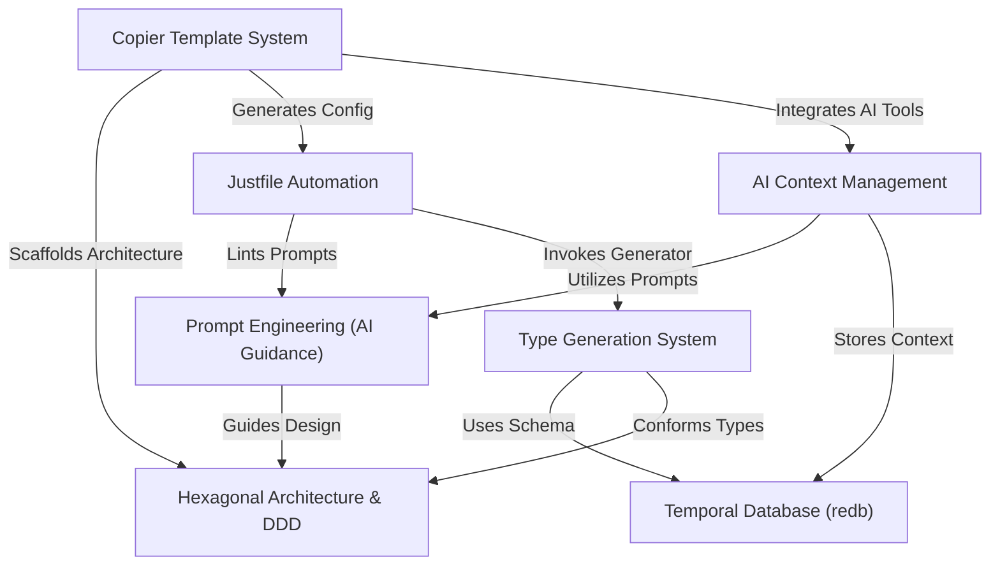

# Tutorial: Vibes-Pro

Vibes-Pro is a powerful system for quickly creating new software projects. It uses smart templates to build applications following **well-organized architectures** like Hexagonal Design, and deeply integrates AI to help developers. The AI gets _relevant project information_ from a smart context manager, uses **carefully crafted prompts** for guidance, and learns from a database that remembers past decisions. All project tasks are streamlined with easy-to-use automation, and types are automatically generated to keep code consistent across different languages.

## Visual Overview

## Chapters

1. [Copier Template System
   ](01_copier_template_system_.md)
2. [Hexagonal Architecture & DDD
   ](02_hexagonal_architecture___ddd_.md)
3. [Justfile Automation
   ](03_justfile_automation_.md)
4. [AI Context Management
   ](04_ai_context_management_.md)
5. [Prompt Engineering (AI Guidance)
   ](05_prompt_engineering__ai_guidance__.md)
6. [Temporal Database (redb)
   ](06_temporal_database__redb__.md)
7. [Type Generation System
   ](07_type_generation_system_.md)

---

Generated by [AI Codebase Knowledge Builder](https://github.com/The-Pocket/Tutorial-Codebase-Knowledge).
