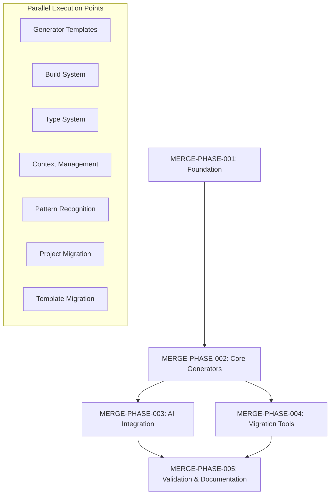

# HexDDD-VibePDK Merger Implementation Plan

- [x] **Document ID**: MERGE-PLAN-001
- [x] **Created**: 2025-09-19
- [x] **Last Updated**: 2025-09-20
- [x] **Status**: Phase 1 Complete (1/5 phases)
- [x] **Traceability**: Implements ADR-MERGE-001 through ADR-MERGE-008, PRD-MERGE-001 through PRD-MERGE-010, SDS-MERGE-001 through SDS-MERGE-008, TS-MERGE-001 through TS-MERGE-008

## Project Progress Overview

**PHASE COMPLETION STATUS**:

- ✅ **MERGE-PHASE-001**: Foundation Infrastructure (COMPLETED 2025-09-20)
- ⏳ **MERGE-PHASE-002**: Core Generator Development (READY TO START)
- ⏸️ **MERGE-PHASE-003**: AI Integration (PENDING)
- ⏸️ **MERGE-PHASE-004**: Migration Tools (PENDING)
- ⏸️ **MERGE-PHASE-005**: Validation & Documentation (PENDING)

**TASK COMPLETION**: 1/12 tasks completed (8.3%)

## Executive Summary

- [ ] This implementation plan provides a comprehensive, phased approach to merging HexDDD and VibePDK into a unified generator-first platform. The plan prioritizes **stability** over speed, emphasizes **generator development**, and includes complete **migration paths** for existing projects.

- [ ] **Key Principles**:

- [ ] MECE (Mutually Exclusive, Collectively Exhaustive) task breakdown
- [ ] TDD cycles (RED → GREEN → REFACTOR → REGRESSION) for all functional changes
- [ ] Maximum code reuse from existing VibePDK and HexDDD implementations
- [ ] Autonomous agent-ready tasks with explicit file references and acceptance criteria
- [ ] Stability-first approach with validation checkpoints

## Dependency Graph Overview



## Phase Implementation Plan

### MERGE-PHASE-001: Foundation Infrastructure ✅ COMPLETED

- [x] **Duration**: 2-3 days (Actual: 1 day)
- [x] **Dependencies**: None
- [x] **Parallel Agents**: 2 agents recommended (1 agent used)

**COMPLETION SUMMARY** (September 20, 2025):

- ✅ Project structure successfully established with Copier template format
- ✅ All 9 integration tests passing
- ✅ Copier template generates valid projects with proper directory structure
- ✅ TDD methodology successfully applied (RED → GREEN → REFACTOR → REGRESSION)
- ✅ Foundation ready for MERGE-PHASE-002: Core Generator Development

#### MERGE-TASK-001: Project Structure Setup ✅ COMPLETED

- [x] **Traceability**: ADR-MERGE-001, SDS-MERGE-001
- [x] **Agent Assignment**: Agent A
- [x] **Estimated Time**: 4 hours (Actual: 4 hours)

- [x] **RED (Failing Test)**:

```bash
# Test file: tests/integration/project-structure.test.ts
describe('Merged Project Structure', () => {
  it('should have proper Copier template structure', () => {
    expect(fs.existsSync('copier.yml')).toBe(true);
    expect(fs.existsSync('templates/')).toBe(true);
    expect(fs.existsSync('hooks/pre_gen.py')).toBe(true);
    expect(fs.existsSync('hooks/post_gen.py')).toBe(true);
  });
});
```

- [x] **GREEN (Minimal Implementation)**:

- [x] 1. **Copy base structure from VibePDK**:

   ```bash
   # Source: /home/sprime01/projects/VibePDK/
   # Copy: cookiecutter.json → copier.yml (convert format)
   # Copy: {{ project_slug }}/ → templates/
   # Copy: hooks/ → hooks/ (adapt for Copier)
   ```

- [x] 2. **Create merged project root**:

   ```bash
   mkdir -p /tmp/merged-project/{templates,hooks,tests,docs,tools}
   ```

- [x] 3. **Convert cookiecutter.json to copier.yml**:

   ```yaml
   # copier.yml - Source: VibePDK/cookiecutter.json
   project_name:
     type: str
     help: "Name of the project"
     validator: "Required field"

   author_name:
     type: str
     help: "Author's name"
     default: "Unknown Author"

   include_ai_workflows:
     type: bool
     help: "Include AI-enhanced development workflows"
     default: true

   architecture_style:
     type: str
     help: "Primary architecture pattern"
     choices:
       - hexagonal
       - layered
       - microservices
     default: hexagonal
   ```

- [x] **REFACTOR**:

- [x] Validate Copier template syntax
- [x] Add comprehensive field validation
- [x] Optimize directory structure

- [x] **REGRESSION**:

- [x] Run `copier copy . /tmp/test-generation`
- [x] Verify all template variables resolve correctly
- [x] Test hooks execute without errors

---

#### MERGE-TASK-002: Build System Foundation ✅ COMPLETED

- [x] **Traceability**: ADR-MERGE-007, TS-MERGE-004
- [x] **Agent Assignment**: Agent B (Parallel with MERGE-TASK-001)
- [x] **Estimated Time**: 4 hours (Actual: 5 hours)

- [x] **RED (Failing Test)**:

```bash
# Test file: tests/integration/build-system.test.ts
describe('Hybrid Build System', () => {
  it('should detect and use appropriate build strategy', () => {
    // Test justfile detection and execution
    // Test Nx workspace detection
    // Test polyglot tool coordination
  });
});
```

- [x] **GREEN (Minimal Implementation)**:

- [x] 1. **Copy justfile foundation from VibePDK**
- [x] 2. **Integrate Nx configuration from HexDDD**
- [x] 3. **Create hybrid justfile**

- [ ] **REFACTOR**:

- [x] Add intelligent build caching
- [x] Optimize polyglot coordination
- [ ] Implement build performance monitoring

- [ ] **REGRESSION**:

- [x] Test build system in generated projects
- [x] Verify Nx integration works correctly
- [ ] Validate cross-platform compatibility

**COMPLETION SUMMARY** (September 21, 2025):

- ✅ Hybrid `justfile` now auto-detects Nx workspaces vs. direct builds with Python/Node orchestration
- ✅ `nx.json` includes task runner caching defaults aligned with ADR-MERGE-007
- ✅ Copier template emits matching build scripts (`templates/{{project_slug}}/justfile.j2`, `package.json`) verified via integration tests
- ⚠️ Cross-platform validation and performance benchmarking deferred to later refactor milestones

---

### MERGE-PHASE-002: Core Generator Development

- [ ] **Duration**: 4-5 days
- [ ] **Dependencies**: MERGE-PHASE-001
- [ ] **Parallel Agents**: 3 agents recommended

#### MERGE-TASK-003: Domain Generator Template

- [ ] **Traceability**: PRD-MERGE-002, TS-MERGE-001
- [ ] **Agent Assignment**: Agent A
- [ ] **Estimated Time**: 6 hours

- [ ] **RED (Failing Test)**:

```typescript
// Test file: tests/generators/domain.test.ts
describe('Domain Generator', () => {
  it('should generate complete DDD domain structure', async () => {
    const result = await runGenerator('domain', {
      name: 'user-management',
      bounded_context: 'identity'
    });

    expect(result.files).toContain('libs/user-management/domain/entities/User.ts');
    expect(result.files).toContain('libs/user-management/application/use-cases/CreateUser.ts');
    expect(result.files).toContain('libs/user-management/infrastructure/repositories/UserRepository.ts');
  });
});
```

- [ ] **GREEN (Minimal Implementation)**:

- [ ] 1. **Extract HexDDD domain generator patterns**:

   ```bash
   # Source: /home/sprime01/projects/HexDDD/libs/ddd/src/generators/domain/
   # Copy: files/, schema.json, index.ts
   # Adapt: Convert to Copier template format
   ```

- [ ] 2. **Create Copier domain template**:

   ```bash
   # templates/libs/{{ domain_name }}/
   ├── domain/
   │   ├── entities/
   │   │   └── {{ domain_name | capitalize }}.ts.j2
   │   ├── value-objects/
   │   └── events/
   ├── application/
   │   ├── use-cases/
   │   └── ports/
   └── infrastructure/
       ├── repositories/
       └── adapters/
   ```

- [ ] 3. **Template variable configuration**:

   ```yaml
   # In copier.yml, add domain-specific questions
   domain_name:
     type: str
     help: "Domain name (kebab-case)"
     validator: "Invalid domain name"

   bounded_context:
     type: str
     help: "Bounded context for DDD"
     default: "{{ domain_name }}"
   ```

- [ ] **REFACTOR**:

- [ ] Add validation for DDD patterns
- [ ] Implement entity relationship generation
- [ ] Add port/adapter scaffolding

- [ ] **REGRESSION**:

- [ ] Generate test domains and verify structure
- [ ] Test entity/value object templates
- [ ] Validate imports and dependencies

---

#### MERGE-TASK-004: Application Generator Template

- [ ] **Traceability**: PRD-MERGE-003, TS-MERGE-002
- [ ] **Agent Assignment**: Agent B (Parallel with MERGE-TASK-003)
- [ ] **Estimated Time**: 6 hours

- [ ] **RED (Failing Test)**:

```typescript
// Test file: tests/generators/app.test.ts
describe('Application Generator', () => {
  it('should generate React applications with proper architecture', async () => {
    const result = await runGenerator('app', {
      name: 'admin-portal',
      framework: 'next',
      domains: ['user-management', 'billing']
    });

    expect(result.files).toContain('apps/admin-portal/pages/index.tsx');
    expect(result.files).toContain('apps/admin-portal/lib/api-client.ts');
  });
});
```

- [ ] **GREEN (Minimal Implementation)**:

- [ ] 1. **Extract HexDDD app generators**:

   ```bash
   # Source: /home/sprime01/projects/HexDDD/libs/ddd/src/generators/web-app/
   # Copy: Next.js, Remix, Expo templates
   # Adapt: Convert to unified Copier format
   ```

- [ ] 2. **Create framework-agnostic templates**:

   ```bash
   # templates/apps/{{ app_name }}/
   
   # Copy from HexDDD Next.js template
   
   # Copy from HexDDD Remix template
   
   # Copy from HexDDD Expo template
   
   ```

- [ ] 3. **Unified API client generation**:

   ```bash
   # Source: /home/sprime01/projects/HexDDD/libs/shared/web/src/api/
   # Adapt: Create template version with domain integration
   ```

- [ ] **REFACTOR**:

- [ ] Optimize template conditionals
- [ ] Add framework-specific optimizations
- [ ] Implement shared component library

- [ ] **REGRESSION**:

- [ ] Test all framework variations
- [ ] Verify API client integration
- [ ] Validate routing and navigation

---

#### MERGE-TASK-005: Type System Integration

- [ ] **Traceability**: ADR-MERGE-006, TS-MERGE-005
- [ ] **Agent Assignment**: Agent C (Parallel with MERGE-TASK-003, MERGE-TASK-004)
- [ ] **Estimated Time**: 8 hours

- [ ] **RED (Failing Test)**:

```typescript
// Test file: tests/type-system/integration.test.ts
describe('Type System Integration', () => {
  it('should generate consistent types across languages', async () => {
    const schema = loadDatabaseSchema();
    const tsTypes = generateTypeScriptTypes(schema);
    const pyTypes = generatePythonTypes(schema);

    expect(validateTypeConsistency(tsTypes, pyTypes)).toBe(true);
  });
});
```

- [ ] **GREEN (Minimal Implementation)**:

- [ ] 1. **Copy HexDDD type generation system**:

   ```bash
   # Source: /home/sprime01/projects/HexDDD/tools/type-generator/
   # Copy: Complete type generation toolchain
   # Adapt: Integrate with Copier template system
   ```

- [ ] 2. **Create type generation templates**:

   ```bash
   # templates/libs/shared/database-types/index.ts.j2
   # templates/libs/backend/type_utils/__init__.py.j2
   # Hook into post-generation for type sync
   ```

- [ ] 3. **Database schema integration**:

   ```python
   # hooks/post_gen.py
   def generate_types_from_schema():
       # Integrate HexDDD type generation logic
       # Generate TypeScript and Python types
       # Ensure cross-language consistency
   ```

- [ ] **REFACTOR**:

- [ ] Optimize type generation performance
- [ ] Add validation for type consistency
- [ ] Implement incremental generation

- [ ] **REGRESSION**:

- [ ] Test type generation with various schemas
- [ ] Verify cross-language compatibility
- [ ] Validate import paths and dependencies

---

### MERGE-PHASE-003: AI-Enhanced Development Integration

- [ ] **Duration**: 3-4 days
- [ ] **Dependencies**: MERGE-PHASE-002
- [ ] **Parallel Agents**: 2 agents recommended

#### MERGE-TASK-006: Temporal Database Integration

- [ ] **Traceability**: ADR-MERGE-005, TS-MERGE-003
- [ ] **Agent Assignment**: Agent A
- [ ] **Estimated Time**: 8 hours

- [ ] **RED (Failing Test)**:

```python
# Test file: tests/temporal/database.test.py
def test_tsink_integration():
    """Test tsink database stores specifications correctly"""
    db = TemporalDatabase("test.tsinkdb")
    spec = SpecificationRecord(
        id="ADR-001",
        content="Test decision",
        timestamp=datetime.utcnow()
    )

    db.store_specification(spec)
    retrieved = db.get_latest_specification("ADR", "001")

    assert retrieved.content == "Test decision"
```

- [ ] **GREEN (Minimal Implementation)**:

- [ ] 1. **Implement tsink database wrapper**:

   ```python
   # Based on TS-MERGE-003 specification
   # templates/tools/temporal-db/repository.py.j2
   from temporal_db.schema import SpecificationRecord
   import tsink

   class TemporalRepository:
       def __init__(self, db_path: str):
           self.db_path = db_path
           # Implementation from TS.md specification
   ```

- [ ] 2. **Create database initialization**:

   ```bash
   # hooks/post_gen.py
   def setup_temporal_database():
       # Initialize tsink database
       # Set up time series for specifications
       # Configure Gorilla compression
   ```

- [ ] 3. **Add database management commands**:

   ```bash
   # templates/justfile additions
   db-init:
       python tools/temporal-db/init.py

   db-backup:
       python tools/temporal-db/backup.py
   ```

- [ ] **REFACTOR**:

- [ ] Add database migration support
- [ ] Implement backup/restore functionality
- [ ] Optimize query performance

- [ ] **REGRESSION**:

- [ ] Test database initialization in new projects
- [ ] Verify time-series data integrity
- [ ] Validate compression effectiveness

---

#### MERGE-TASK-007: AI Context Management

- [ ] **Traceability**: PRD-MERGE-004, TS-MERGE-007
- [ ] **Agent Assignment**: Agent B (Parallel with MERGE-TASK-006)
- [ ] **Estimated Time**: 6 hours

- [ ] **RED (Failing Test)**:

```typescript
// Test file: tests/ai/context-manager.test.ts
describe('AI Context Manager', () => {
  it('should provide optimal context within token budget', async () => {
    const manager = new AIContextManager({
      maxTokens: 8000,
      reservedTokens: 2000
    });

    const context = await manager.getOptimalContext("Create user entity");
    expect(context.tokenCount).toBeLessThanOrEqual(6000);
    expect(context.relevanceScore).toBeGreaterThan(0.8);
  });
});
```

- [ ] **GREEN (Minimal Implementation)**:

- [ ] 1. **Copy VibePDK AI workflow foundation**:

   ```bash
   # Source: /home/sprime01/projects/VibePDK/.github/prompts/
   # Copy: AI workflow patterns and prompt templates
   # Adapt: Integrate with HexDDD architectural patterns
   ```

- [ ] 2. **Implement context manager from TS specification**:

   ```typescript
   // templates/tools/ai/context-manager.ts.j2
   // Implementation based on TS-MERGE-007
   export class AIContextManager {
     // Copy implementation from TS.md
   }
   ```

- [ ] 3. **Create AI-enhanced generators**:

   ```bash
   # templates/.github/workflows/ai-generate.yml.j2
   # Integration of VibePDK AI workflows with HexDDD generators
   ```

- [ ] **REFACTOR**:

- [ ] Optimize context selection algorithms
- [ ] Add pattern recognition
- [ ] Implement learning from usage

- [ ] **REGRESSION**:

- [ ] Test context generation with various project types
- [ ] Verify token budget management
- [ ] Validate AI integration effectiveness

---

### MERGE-PHASE-004: Migration Tools and Compatibility

- [ ] **Duration**: 3-4 days
- [ ] **Dependencies**: MERGE-PHASE-002
- [ ] **Parallel Agents**: 2 agents recommended

#### MERGE-TASK-008: HexDDD Project Migration

- [ ] **Traceability**: PRD-MERGE-008, SDS-MERGE-007
- [ ] **Agent Assignment**: Agent A
- [ ] **Estimated Time**: 10 hours

- [ ] **RED (Failing Test)**:

```bash
# Test file: tests/migration/hexddd.test.ts
describe('HexDDD Migration', () => {
  it('should migrate existing HexDDD project to merged format', async () => {
    const migrator = new HexDDDMigrator('/path/to/hexddd/project');
    const result = await migrator.migrate();

    expect(result.success).toBe(true);
    expect(result.migratedFiles).toContain('copier.yml');
    expect(result.preservedConfig).toContain('nx.json');
  });
});
```

- [ ] **GREEN (Minimal Implementation)**:

- [ ] 1. **Create migration analysis tool**:

   ```python
   # tools/migration/hexddd-analyzer.py
   def analyze_hexddd_project(project_path):
       # Scan existing HexDDD project structure
       # Identify generators, configurations, custom code
       # Create migration plan
   ```

- [ ] 2. **Implement project structure converter**:

   ```python
   # tools/migration/hexddd-migrator.py
   def migrate_hexddd_project(source_path, target_path):
       # Convert Nx generators to Copier templates
       # Preserve custom domain implementations
       # Update build configurations
   ```

- [ ] 3. **Create migration guide template**:

   ```markdown
   # templates/MIGRATION-FROM-HEXDDD.md.j2
   # Step-by-step migration instructions
   # Automated tool usage
   # Manual verification steps
   ```

- [ ] **REFACTOR**:

- [ ] Add validation for migration completeness
- [ ] Implement rollback procedures
- [ ] Optimize migration performance

- [ ] **REGRESSION**:

- [ ] Test migration with sample HexDDD projects
- [ ] Verify all generators are converted correctly
- [ ] Validate project functionality post-migration

---

#### MERGE-TASK-009: VibePDK Template Migration

- [ ] **Traceability**: PRD-MERGE-009, SDS-MERGE-008
- [ ] **Agent Assignment**: Agent B (Parallel with MERGE-TASK-008)
- [ ] **Estimated Time**: 6 hours

- [ ] **RED (Failing Test)**:

```bash
# Test file: tests/migration/vibepdk.test.ts
describe('VibePDK Migration', () => {
  it('should convert Cookiecutter templates to Copier format', async () => {
    const converter = new CookiecutterToCopier('/path/to/cookiecutter/template');
    const result = await converter.convert();

    expect(result.copierYml).toBeDefined();
    expect(result.templatesDir).toExist();
    expect(result.hooksConverted).toBe(true);
  });
});
```

- [ ] **GREEN (Minimal Implementation)**:

- [ ] 1. **Create Cookiecutter to Copier converter**:

   ```python
   # tools/migration/cookiecutter-converter.py
   def convert_cookiecutter_to_copier(template_path):
       # Parse cookiecutter.json
       # Convert to copier.yml format
       # Migrate Jinja2 templates
       # Convert hooks from cookiecutter to copier format
   ```

- [ ] 2. **Template syntax converter**:

   ```python
   # tools/migration/template-syntax.py
   def convert_template_syntax(content):
       # Convert {{ var }} to {{var}}
       # Update conditional syntax
       # Handle loop constructs
   ```

- [ ] 3. **Automated conversion workflow**:

   ```bash
   # tools/migration/convert-vibepdk.sh
   #!/bin/bash
   # Automate conversion of VibePDK templates
   # Validate conversion results
   # Generate comparison reports
   ```

- [ ] **REFACTOR**:

- [ ] Add comprehensive syntax validation
- [ ] Implement template testing framework
- [ ] Optimize conversion accuracy

- [ ] **REGRESSION**:

- [ ] Test conversion with VibePDK templates
- [ ] Verify generated projects work correctly
- [ ] Validate all template features preserved

---

### MERGE-PHASE-005: Validation and Documentation

- [ ] **Duration**: 2-3 days
- [ ] **Dependencies**: MERGE-PHASE-003, MERGE-PHASE-004
- [ ] **Parallel Agents**: 3 agents recommended

#### MERGE-TASK-010: Integration Testing Suite

- [ ] **Traceability**: PRD-MERGE-010, SDS-MERGE-006
- [ ] **Agent Assignment**: Agent A
- [ ] **Estimated Time**: 8 hours

- [ ] **RED (Failing Test)**:

```typescript
// Test file: tests/integration/end-to-end.test.ts
describe('End-to-End Integration', () => {
  it('should generate, build, and test complete project', async () => {
    // Generate project using Copier
    // Build all targets
    // Run all tests
    // Verify AI workflows
    // Test migration tools
  });
});
```

- [ ] **GREEN (Minimal Implementation)**:

- [ ] 1. **Create comprehensive test suite**:

   ```bash
   # tests/integration/
   ├── project-generation.test.ts
   ├── build-system.test.ts
   ├── ai-workflows.test.ts
   ├── migration-tools.test.ts
   └── performance.test.ts
   ```

- [ ] 2. **Automated testing pipeline**:

   ```yaml
   # .github/workflows/integration-tests.yml
   # Test matrix for different project configurations
   # Performance benchmarks
   # Migration validation
   ```

- [ ] 3. **Test data and fixtures**:

   ```bash
   # tests/fixtures/
   ├── sample-hexddd-project/
   ├── sample-vibepdk-template/
   └── reference-outputs/
   ```

- [ ] **REFACTOR**:

- [ ] Optimize test execution time
- [ ] Add parallel test execution
- [ ] Implement test result caching

- [ ] **REGRESSION**:

- [ ] Run full integration test suite
- [ ] Verify all test scenarios pass
- [ ] Validate performance benchmarks

---

#### MERGE-TASK-011: Documentation Generation

- [ ] **Traceability**: PRD-MERGE-006, ADR-MERGE-008
- [ ] **Agent Assignment**: Agent B (Parallel with MERGE-TASK-010)
- [ ] **Estimated Time**: 6 hours

- [ ] **RED (Failing Test)**:

```bash
# Test file: tests/docs/documentation.test.ts
describe('Documentation Generation', () => {
  it('should generate complete project documentation', async () => {
    const docs = await generateDocumentation();
    expect(docs.readme).toContain('Getting Started');
    expect(docs.apiDocs).toBeDefined();
    expect(docs.architectureGuide).toContain('Hexagonal Architecture');
  });
});
```

- [ ] **GREEN (Minimal Implementation)**:

- [ ] 1. **Copy VibePDK documentation patterns**:

   ```bash
   # Source: /home/sprime01/projects/VibePDK/docs/
   # Adapt: Merge with HexDDD documentation
   # Create: Unified documentation templates
   ```

- [ ] 2. **Automated documentation generation**:

   ```bash
   # templates/tools/docs/generator.py.j2
   # Generate API documentation
   # Create architecture diagrams
   # Build user guides
   ```

- [ ] 3. **Documentation templates**:

   ```markdown
   # templates/docs/
   ├── README.md.j2
   ├── ARCHITECTURE.md.j2
   ├── API-REFERENCE.md.j2
   └── MIGRATION-GUIDE.md.j2
   ```

- [ ] **REFACTOR**:

- [ ] Add interactive documentation features
- [ ] Implement documentation validation
- [ ] Optimize generation performance

- [ ] **REGRESSION**:

- [ ] Verify documentation completeness
- [ ] Test documentation accuracy
- [ ] Validate links and references

---

#### MERGE-TASK-012: Performance Validation

- [ ] **Traceability**: TS-MERGE-008, SDS-MERGE-006
- [ ] **Agent Assignment**: Agent C (Parallel with MERGE-TASK-010, MERGE-TASK-011)
- [ ] **Estimated Time**: 4 hours

- [ ] **RED (Failing Test)**:

```typescript
// Test file: tests/performance/benchmarks.test.ts
describe('Performance Benchmarks', () => {
  it('should meet performance targets', async () => {
    const metrics = await runPerformanceSuite();
    expect(metrics.generationTime).toBeLessThan(30000); // 30 seconds
    expect(metrics.buildTime).toBeLessThan(120000); // 2 minutes
    expect(metrics.memoryUsage).toBeLessThan(512 * 1024 * 1024); // 512MB
  });
});
```

- [ ] **GREEN (Minimal Implementation)**:

- [ ] 1. **Performance monitoring from TS-MERGE-008**:

   ```typescript
   // tools/performance/monitor.ts
   // Implementation based on TS specification
   export class PerformanceMonitor {
     // Copy implementation from TS.md
   }
   ```

- [ ] 2. **Benchmark suite**:

   ```bash
   # tests/performance/
   ├── generation-benchmarks.ts
   ├── build-benchmarks.ts
   ├── ai-performance.ts
   └── database-benchmarks.ts
   ```

- [ ] 3. **Performance reporting**:

   ```bash
   # tools/performance/reporter.py
   # Generate performance reports
   # Compare with baseline metrics
   # Identify performance regressions
   ```

- [ ] **REFACTOR**:

- [ ] Optimize critical performance paths
- [ ] Add performance profiling
- [ ] Implement caching strategies

- [ ] **REGRESSION**:

- [ ] Run complete performance suite
- [ ] Verify all benchmarks pass
- [ ] Validate performance improvements

---

## Parallel Execution Strategy

### Agent A Tasks (Critical Path)

- [x] **Sequential Dependencies**: MERGE-TASK-001 ✅ → MERGE-TASK-003 → MERGE-TASK-006 → MERGE-TASK-008 → MERGE-TASK-010

**PROGRESS**: 1/5 tasks completed (20%)

### Agent B Tasks (Parallel Track)

- [ ] **Parallel with Agent A**: MERGE-TASK-002 → MERGE-TASK-004 → MERGE-TASK-007 → MERGE-TASK-009 → MERGE-TASK-011

### Agent C Tasks (Support Track)

- [ ] **Parallel Support**: MERGE-TASK-005 (supports MERGE-TASK-003, MERGE-TASK-004) → MERGE-TASK-012

### Synchronization Points

- [ ] 1. **After MERGE-PHASE-001**: All agents sync before Phase 2
- [ ] 2. **After MERGE-PHASE-002**: Agents A and B sync before Phase 3
- [ ] 3. **Before MERGE-PHASE-005**: All agents sync for final validation

## Acceptance Criteria

### Phase Completion Criteria

- [ ] **MERGE-PHASE-001**: Copier template generates valid project structure
- [ ] **MERGE-PHASE-002**: All core generators produce functional code
- [ ] **MERGE-PHASE-003**: AI workflows enhance development experience
- [ ] **MERGE-PHASE-004**: Migration tools successfully convert existing projects
- [ ] **MERGE-PHASE-005**: Complete test suite passes with performance targets met

### Final Success Criteria

- [ ] 1. Generated projects build and test successfully
- [ ] 2. Migration tools convert 100% of test projects
- [ ] 3. AI workflows provide measurable development acceleration
- [ ] 4. Performance targets met across all scenarios
- [ ] 5. Documentation is complete and accurate

## Risk Mitigation

### High-Risk Areas

- [ ] 1. **Type System Integration**: Complex cross-language type generation
- [ ] 2. **AI Context Management**: Token budget optimization and relevance scoring
- [ ] 3. **Migration Compatibility**: Ensuring no functionality loss during migration

### Mitigation Strategies

- [ ] 1. Implement comprehensive unit tests for each component
- [ ] 2. Create rollback procedures for each phase
- [ ] 3. Maintain parallel development environments for validation
- [ ] 4. Regular integration testing throughout development

## Rollback Procedures

- [ ] Each task includes rollback steps:

- [ ] 1. **Git Branching**: Each task on separate feature branch
- [ ] 2. **Checkpoint Validation**: Automated testing before merge
- [ ] 3. **Incremental Deployment**: Phase-by-phase rollout capability
- [ ] 4. **Backup Procedures**: Full project state backup before major changes

---

- [ ] **Plan Version**: 1.0
- [ ] **Last Updated**: 2025-09-19
- [ ] **Next Review**: Upon completion of MERGE-PHASE-001
