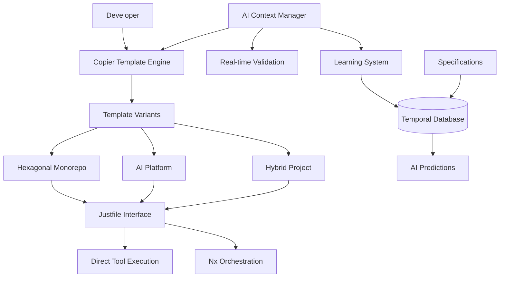
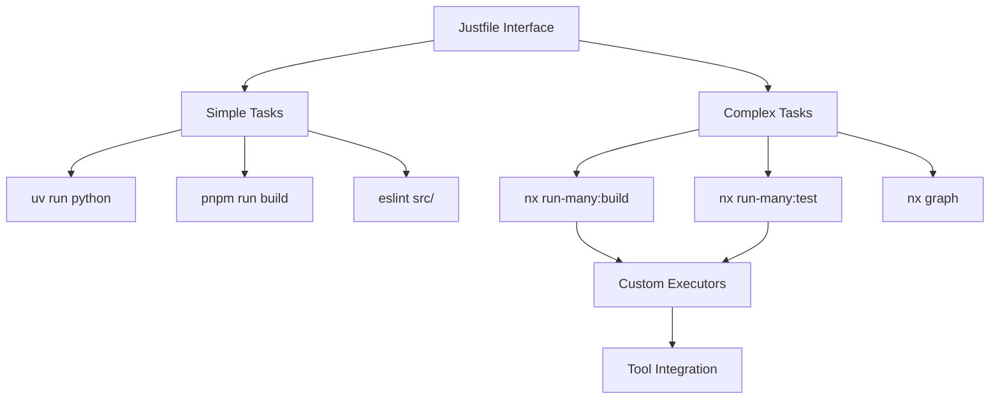
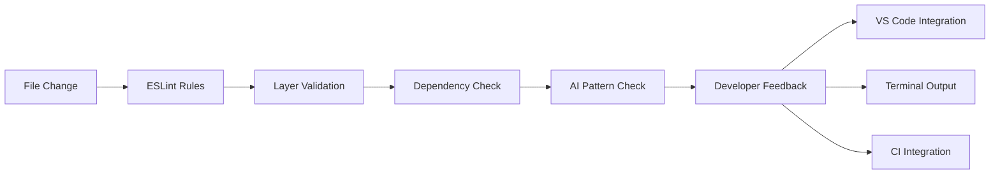
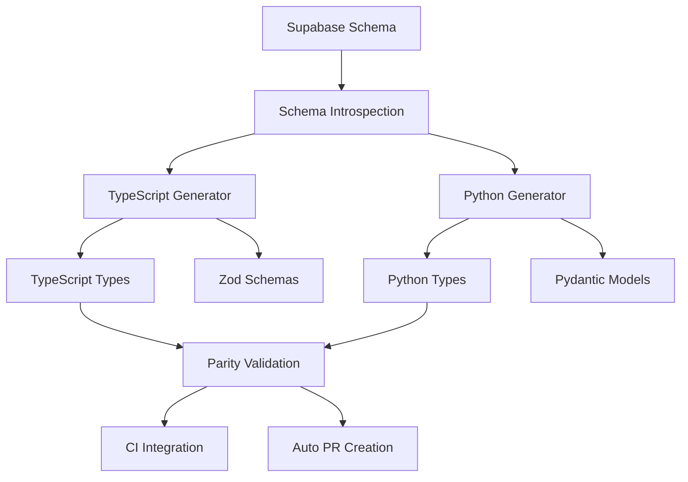

# System Design Specification: HexDDD-VibePDK Generator-First Integration

**Status**: Proposed
**Date**: 2025-09-19
**System ID**: SDS-MERGE-001
**Matrix IDs**: [SDS-MERGE-001, SDS-MERGE-002, SDS-MERGE-003, SDS-MERGE-004, SDS-MERGE-005, SDS-MERGE-006, SDS-MERGE-007, SDS-MERGE-008]

## System Architecture Overview



## SDS-MERGE-001: Copier Template Architecture

**Design**: Multi-template Copier system with conditional generation and update capabilities.

**Components**:

```yaml
# Template structure
templates/
├── hexagonal-monorepo/     # HexDDD-style projects
│   ├── copier.yml         # Template configuration
│   ├── project/           # Base project structure
│   ├── domains/           # Domain templates
│   └── apps/              # Application templates
├── ai-platform/           # VibePDK-style projects
│   ├── copier.yml
│   ├── .github/           # AI workflows
│   ├── specs/             # Specification templates
│   └── tools/             # Development tools
└── hybrid/                # Combined approach
    ├── copier.yml
    └── merged/            # Unified structure
```

**Template Configuration**:

```yaml
# copier.yml example
_templates_suffix: .jinja
_envops:
    block_start_string: ""

project_type:
    type: str
    choices:
        - hexagonal-monorepo
        - ai-platform
        - hybrid

framework_choices:
    type: str
    choices:
        - next
        - remix
        - expo
    when: "{{ project_type in ['hexagonal-monorepo', 'hybrid'] }}"

ai_features:
    type: bool
    default: true
    help: Enable AI-assisted development features
```

**Update Mechanism**:

-   Conditional updates based on project type
-   Conflict resolution for modified files
-   Backup creation before updates
-   Rollback capabilities

## SDS-MERGE-002: AI Context Management System

**Design**: Sophisticated context management with token optimization and learning integration.

**Architecture**:

```typescript
interface AIContextManager {
    // Context source management
    sources: {
        specifications: SpecificationLoader;
        codebase: CodebaseAnalyzer;
        patterns: PatternRecognizer;
        history: DecisionHistory;
        learning: LearnedPatterns;
    };

    // Token budget management
    tokenBudget: {
        allocator: TokenAllocator;
        optimizer: ContextOptimizer;
        monitor: UsageMonitor;
    };

    // Context selection
    selector: {
        prioritizer: ContextPrioritizer;
        compressor: ContextCompressor;
        cache: IntelligentCache;
    };
}
```

**Token Allocation Strategy**:

```typescript
interface TokenAllocation {
    currentTask: number; // 40% - immediate context
    architecturalContext: number; // 25% - structural patterns
    historicalPatterns: number; // 20% - learned behaviors
    codeContext: number; // 15% - relevant code snippets
}
```

**Context Prioritization**:

1. **Immediate Task Context**: Current file, related components
2. **Architectural Patterns**: Relevant hexagonal architecture patterns
3. **Historical Decisions**: Similar past decisions and outcomes
4. **Domain Knowledge**: Domain-specific patterns and rules

## SDS-MERGE-003: Temporal Specification Management

**Design**: Non-destructive specification evolution with embedded time-series storage.

**Database Schema**:

```rust
// tsink time-series database schema using Rust structs
use serde::{Deserialize, Serialize};
use chrono::{DateTime, Utc};
use uuid::Uuid;

#[derive(Serialize, Deserialize, Clone, Debug)]
pub struct SpecificationRecord {
    pub id: Uuid,
    pub spec_type: SpecificationType, // ADR, PRD, SDS, TS
    pub title: String,
    pub content: String,
    pub timestamp: DateTime<Utc>,
    pub version: u32,
    pub author: Option<String>,
    pub matrix_ids: Vec<String>,
    pub metadata: serde_json::Value,
}

#[derive(Serialize, Deserialize, Clone, Debug)]
pub enum SpecificationType {
    ADR,
    PRD,
    SDS,
    TS,
}

CREATE TABLE decisions (
    id UUID PRIMARY KEY,
    specification_id UUID REFERENCES specifications(id),
    decision_point VARCHAR(255) NOT NULL,
    chosen_option VARCHAR(255) NOT NULL,
    alternatives VARCHAR[] NOT NULL,
    rationale TEXT,
    timestamp TIMESTAMP NOT NULL,
    context JSON
);

CREATE TABLE patterns (
    id UUID PRIMARY KEY,
    pattern_type VARCHAR(50) NOT NULL,
    frequency INTEGER NOT NULL,
    context_similarity FLOAT NOT NULL,
    success_rate FLOAT,
    last_seen TIMESTAMP NOT NULL,
    metadata JSON
);
```

**Learning System Architecture**:

```python
import asyncio
import tsink
from datetime import datetime
from typing import List, Optional

class TemporalLearningSystem:
    def __init__(self, db_path: str):
        self.db_path = db_path
        self.db: Optional[tsink.Database] = None
        self.decisions_series: Optional[tsink.Series] = None
        self.patterns_series: Optional[tsink.Series] = None
        self.pattern_recognizer = PatternRecognizer()
        self.predictor = DecisionPredictor()

    async def initialize(self):
        """Initialize tsink database and time series"""
        self.db = await tsink.Database.open(self.db_path)
        self.decisions_series = await self.db.series("decisions",
                                                   compression=tsink.Compression.Gorilla)
        self.patterns_series = await self.db.series("patterns",
                                                  compression=tsink.Compression.Gorilla)

    async def record_decision(self, decision: Decision) -> None:
        """Record architectural decision as time-series point"""
        point = tsink.Point(timestamp=datetime.utcnow(), value=decision)
        await self.decisions_series.write(point)

    async def learn_patterns(self) -> List[Pattern]:
        """Analyze historical decisions using time-series queries"""
        now = datetime.utcnow()
        query = tsink.Query.builder()\
            .time_range(tsink.TimeRange.recent(days=90))\
            .build()
        results = await self.decisions_series.query(query)
        return self.pattern_recognizer.analyze(results)

    async def predict_next_decision(self, context: Context) -> Prediction:
        """Predict likely next architectural decisions using temporal data"""

    async def get_similar_contexts(self, current: Context) -> List[Context]:
        """Find similar past contexts using time-series similarity search"""
```

## SDS-MERGE-004: Hybrid Build System

**Design**: Layered build system supporting both simple and complex workflows.

**Architecture Layers**:



**Justfile Recipe Architecture**:

```bash
# Simple tasks - direct tool execution
build-simple:
    uv run python -m build
    pnpm run build

test-simple:
    uv run pytest
    pnpm test

# Complex tasks - Nx orchestration
build-complex:
    nx run-many --target=build --all

test-complex:
    nx run-many --target=test --all --parallel=3

# AI-enhanced tasks
ai-validate:
    just _ai-context-injection
    nx run-many --target=ai-validate --all

# Internal helpers
_ai-context-injection:
    @echo "Injecting AI context..."
    node tools/ai/context-injector.js
```

**Decision Matrix Implementation**:

```typescript
interface BuildDecision {
    isMonorepo: boolean;
    hasInterdependencies: boolean;
    taskComplexity: "simple" | "medium" | "complex";
    aiIntegration: boolean;
}

function selectBuildStrategy(decision: BuildDecision): BuildStrategy {
    if (!decision.isMonorepo && decision.taskComplexity === "simple") {
        return "direct-tools";
    }

    if (decision.hasInterdependencies || decision.taskComplexity === "complex") {
        return "nx-orchestration";
    }

    if (decision.aiIntegration) {
        return "ai-enhanced";
    }

    return "direct-tools";
}
```

## SDS-MERGE-005: Real-time Architectural Validation

**Design**: Continuous validation system with IDE integration and immediate feedback.

**Validation Pipeline**:



**ESLint Integration**:

```typescript
// Custom ESLint rules for hexagonal architecture
export const hexagonalArchitectureRules = {
    "hex/no-infrastructure-in-domain": {
        create(context) {
            return {
                ImportDeclaration(node) {
                    if (isDomainFile(context.getFilename()) && isInfrastructureImport(node.source.value)) {
                        context.report({
                            node,
                            message: "Domain layer cannot import from infrastructure layer",
                        });
                    }
                },
            };
        },
    },

    "hex/port-adapter-compliance": {
        create(context) {
            // Validate port/adapter pattern compliance
        },
    },
};
```

**AI-Enhanced Validation**:

```python
class AIArchitecturalValidator:
    def __init__(self, context_manager: AIContextManager):
        self.context_manager = context_manager
        self.pattern_db = load_architectural_patterns()

    async def validate_change(self, file_change: FileChange) -> ValidationResult:
        """AI-enhanced validation of architectural changes"""
        context = await self.context_manager.get_relevant_context(file_change)

        # Check against known patterns
        pattern_violations = self.check_pattern_compliance(file_change, context)

        # AI-based analysis
        ai_suggestions = await self.analyze_with_ai(file_change, context)

        return ValidationResult(
            violations=pattern_violations,
            suggestions=ai_suggestions,
            confidence=self.calculate_confidence(pattern_violations, ai_suggestions)
        )
```

## SDS-MERGE-006: Type Generation and Synchronization

**Design**: Unified type generation from database schema with multi-language support.

**Type Generation Pipeline**:



**Generation Implementation**:

```typescript
interface TypeGenerator {
    generateTypeScript(schema: DatabaseSchema): {
        types: string;
        zodSchemas: string;
        apiTypes: string;
    };

    generatePython(schema: DatabaseSchema): {
        types: string;
        pydanticModels: string;
        typeUtils: string;
    };

    validateParity(tsTypes: TypeScriptTypes, pyTypes: PythonTypes): ValidationResult;
}

class UnifiedTypeGenerator implements TypeGenerator {
    async generateFromSupabase(connectionString: string): Promise<GenerationResult> {
        const schema = await this.introspectSchema(connectionString);

        const tsResult = this.generateTypeScript(schema);
        const pyResult = this.generatePython(schema);

        const validation = this.validateParity(tsResult.types, pyResult.types);

        if (!validation.isValid) {
            throw new Error(`Type parity validation failed: ${validation.errors}`);
        }

        return {
            typescript: tsResult,
            python: pyResult,
            validation,
        };
    }
}
```

## SDS-MERGE-007: AI-Enhanced Code Generation

**Design**: AI-assisted generation of hexagonal architecture components with pattern compliance.

**Generation Architecture**:

```typescript
interface AICodeGenerator {
    generateDomain(requirements: DomainRequirements): DomainCode;
    generateApplication(ports: PortDefinitions): ApplicationCode;
    generateInfrastructure(adapters: AdapterSpecs): InfrastructureCode;
    generateInterface(controllers: ControllerSpecs): InterfaceCode;
}

class HexagonalAIGenerator implements AICodeGenerator {
    constructor(
        private aiContext: AIContextManager,
        private patterns: ArchitecturalPatterns,
        private templates: CodeTemplates,
    ) {}

    async generateDomain(requirements: DomainRequirements): Promise<DomainCode> {
        const context = await this.aiContext.getDomainContext(requirements);
        const patterns = this.patterns.getDomainPatterns();

        // AI-assisted generation with pattern compliance
        const entities = await this.generateEntities(requirements, context, patterns);
        const valueObjects = await this.generateValueObjects(requirements, context);
        const domainServices = await this.generateDomainServices(requirements, context);

        return {
            entities,
            valueObjects,
            domainServices,
            aggregates: this.combineIntoAggregates(entities, valueObjects),
        };
    }
}
```

## SDS-MERGE-008: Performance and Scalability

**Design**: System performance optimization and scalability considerations.

**Performance Targets**:

-   Template generation: < 2 minutes for complex monorepos
-   AI context loading: < 500ms for standard contexts
-   Type generation: < 30 seconds for large schemas
-   Validation feedback: < 100ms for real-time checks

**Caching Strategy**:

```typescript
interface CacheManager {
    templateCache: LRUCache<string, Template>;
    contextCache: LRUCache<string, AIContext>;
    typeCache: LRUCache<string, GeneratedTypes>;
    validationCache: LRUCache<string, ValidationResult>;
}

class PerformanceOptimizer {
    constructor(private cache: CacheManager) {}

    async optimizeTemplateGeneration(template: Template): Promise<Template> {
        // Parallel generation of independent components
        // Incremental updates for changed files only
        // Smart dependency resolution
    }

    async optimizeAIContext(context: AIContext): Promise<AIContext> {
        // Token-aware context pruning
        // Relevance-based prioritization
        // Intelligent compression
    }
}
```

**Scalability Considerations**:

-   Embedded databases for local performance
-   Incremental type generation
-   Parallel template processing
-   Smart caching at all levels
-   Resource usage monitoring and optimization

## Implementation Priority

### Phase 1: Core Infrastructure

-   SDS-MERGE-001: Copier template system
-   SDS-MERGE-004: Hybrid build system
-   Basic validation pipeline

### Phase 2: AI Integration

-   SDS-MERGE-002: AI context management
-   SDS-MERGE-003: Temporal learning system
-   SDS-MERGE-005: Enhanced validation

### Phase 3: Advanced Features

-   SDS-MERGE-006: Type generation
-   SDS-MERGE-007: AI code generation
-   SDS-MERGE-008: Performance optimization

## Quality Assurance

**Testing Strategy**:

-   Unit tests for all core components
-   Integration tests for template generation
-   Performance benchmarks for AI systems
-   End-to-end validation of generated projects

**Monitoring**:

-   AI context performance metrics
-   Template generation success rates
-   User adoption and satisfaction metrics
-   System resource usage tracking
