# Chapter 8: Justfile & Task Automation

In our last chapter, [Type Generation & Parity](07_type_generation___parity_.md), we learned how `Vibes-Pro` keeps data structures consistent across different programming languages, preventing common errors. Now, imagine you have a beautifully structured project with consistent types, but every time you want to set up your environment, build your code, run tests, or check for linting errors, you have to type out a long, complex series of commands: `pnpm install`, then `uv sync --dev`, then `nx build my-app`, then `uv run pytest`, and so on.

This is tedious, easy to forget a step, and can lead to inconsistent results across different developers. What if there was a simpler way to manage all these common tasks, like having a single "Start Project" button?

This is where **Justfile & Task Automation** comes in.

### 8.1 The Project's Command Center: What Problem Does it Solve?

Imagine you're in a professional kitchen. There are many complex tasks: preparing ingredients, cooking different dishes, cleaning up. If every chef had to remember every single step and the exact tools for every task, it would be chaotic.

Instead, a well-run kitchen has a clear **recipe book** and a **workflow chart**. "To make soup, follow recipe #5. To clean up, follow procedure C." This makes sure tasks are done consistently, efficiently, and everyone knows what to do.

In software development, `Vibes-Pro` faces similar challenges:
*   **Complexity**: Modern projects often use multiple tools (`pnpm` for Node.js, `uv` for Python, `Nx` for monorepo management, `cargo` for Rust). Each has its own commands.
*   **Inconsistency**: Developers might use slightly different commands, leading to "works on my machine" issues.
*   **Memorization**: No one wants to remember long command strings for common tasks.
*   **Onboarding**: New team members struggle to learn the project's specific build, test, and setup commands.

`Vibes-Pro` solves this by using a **`Justfile`** as its central command center. It provides simple, memorable "recipes" (commands) for common tasks. This `Justfile` acts as a wrapper around more complex underlying tools, ensuring a consistent and cross-platform developer experience.

Our central use case for this chapter is: **How can we easily and consistently run all the common setup, build, test, and linting commands for our `Vibes-Pro` project without memorizing complex commands?**

### 8.2 What is `just`? (Your Project's Personal Assistant)

`just` is a simple, modern command runner. Think of it like a helpful assistant that knows all your project's common procedures. Instead of you typing `pnpm install` and `uv sync` separately, you just tell your assistant, "Hey, `just setup`," and it handles all the details for you.

*   **Simple**: It uses a clear, easy-to-read syntax.
*   **Consistent**: Everyone on the team runs the exact same commands.
*   **Cross-Platform**: Works great on Windows, macOS, and Linux.

### 8.3 The `Justfile`: Your Project's Recipe Book

The **`Justfile`** is the file (named exactly `justfile`, without an extension) at the root of your `Vibes-Pro` project. It contains all the "recipes" (commands) that `just` can run.

Each recipe has a name (like `setup`, `build`, `test`) and then the actual commands to execute.

Here’s a sneak peek at a small part of the `Vibes-Pro` `justfile`:

```justfile
# --- Environment Setup ---
setup: setup-node setup-python setup-tools
	@echo "✅ Development environment ready"

setup-node:
	@echo "🛠️ Setting up Node.js environment..."
	corepack enable
	pnpm install
```
In this example:
*   `setup:` is a recipe. It doesn't do anything itself, but calls other recipes: `setup-node`, `setup-python`, `setup-tools`.
*   `setup-node:` is another recipe. It prints a message and then runs two shell commands: `corepack enable` and `pnpm install`.
*   The `@` symbol before `echo` means "don't print the command itself, just print its output." This keeps the console clean.

This makes complex multi-step processes simple to run with a single command: `just setup`.

### 8.4 How `Vibes-Pro` Uses `Justfile` for Task Automation

Let's see how `Vibes-Pro` leverages `Justfile` to solve our use case of running common tasks easily and consistently.

#### 8.4.1 Setting Up Your Environment (`just setup`)

Instead of remembering multiple installation commands, you just run one:

```bash
just setup
```

This single command triggers a sequence of recipes defined in the `justfile` to set up both Node.js and Python environments, and install necessary tools like `copier` (which we learned about in [Copier Templates & Generators](05_copier_templates___generators_.md)).

Here's the simplified `justfile` snippet for setup:

```justfile
# From justfile
setup: setup-node setup-python setup-tools
	@echo "✅ Development environment ready"

setup-node:
	@echo "🛠️ Setting up Node.js environment..."
	corepack enable
	pnpm install

setup-python:
	@echo "🔧 Setting up Python environment..."
	uv sync --dev

setup-tools:
	@echo "🔧 Setting up development tools..."
	@if command -v copier >/dev/null 2>&1; then \
		echo "✅ Copier already installed"; \
	else \
		echo "📦 Installing Copier..."; \
		uv tool install copier; \
	fi
```
**Explanation:** `just setup` first calls `setup-node` (which uses `pnpm`), then `setup-python` (which uses `uv`), and finally `setup-tools` (which conditionally installs `copier` using `uv tool install`). Each underlying tool is handled without you needing to know its specific commands.

#### 8.4.2 Building Your Project (`just build`)

`Vibes-Pro` projects can be complex, often using `Nx` for monorepo builds. `just build` handles this intelligently.

```bash
just build
```

The `justfile` uses a special internal recipe (`_detect_build_strategy`) to figure out if your project uses `Nx` or a simpler direct build, and then executes the correct commands.

```justfile
# From justfile (simplified)
build TARGET="": (_detect_build_strategy TARGET)

_detect_build_strategy TARGET:
	#!/usr/bin/env bash
	if [ -z "{{TARGET}}" ]; then
		if [ -f "nx.json" ]; then
			echo "🏗️  Building with Nx..."
			just build-nx
		else
			echo "🏗️  Building directly..."
			just build-direct
		fi
	else
		just build-target "{{TARGET}}"
	fi

build-nx:
	nx run-many --target=build --all --parallel=3

build-target TARGET:
	nx run {{TARGET}}:build
```
**Explanation:** `just build` can detect your project's structure. If it's an `Nx` monorepo, it calls `just build-nx` (which then uses `nx run-many`). You can also specify a `TARGET` to build a specific part of your project (e.g., `just build TARGET=my-app`).

#### 8.4.3 Running Tests (`just test`)

Similar to building, `just test` provides a unified way to run tests across Python, Node.js, and even integration tests.

```bash
just test
```

This command runs all configured tests. If you just want to test Python: `just test-python`.

```justfile
# From justfile (simplified)
test TARGET="": (_detect_test_strategy TARGET)

test-direct:
	just test-python
	just test-node
	just test-integration

test-python:
	@echo "🧪 Running Python tests..."
	uv run pytest
```
**Explanation:** `just test` acts as an entry point. It calls `test-direct` (or `test-nx` if configured), which then calls specific recipes like `test-python`. The `test-python` recipe simply runs `uv run pytest`, abstracting away the `uv` command from the user.

#### 8.4.4 Checking Code Quality (`just lint`)

Maintaining code quality is essential. `just lint` runs various linters and type checkers.

```bash
just lint
```

```justfile
# From justfile (simplified)
lint:
	just lint-python
	just lint-node
	just lint-templates

lint-python:
	@echo "🔍 Linting Python code..."
	uv run ruff check .
	uv run mypy .
```
**Explanation:** `just lint` orchestrates `lint-python` (which uses `uv run ruff check .` and `uv run mypy .`), `lint-node` (using `pnpm lint`), and `lint-templates`. This ensures all code adheres to project standards.

#### 8.4.5 AI Workflow Recipes

The `justfile` also contains recipes specifically designed to support `Vibes-Pro`'s AI workflows, connecting to concepts from [AI Chat Modes & Personas](02_ai_chat_modes___personas_.md) and [Prompts](01_prompts_.md).

*   **`just ai-context-bundle`**: Gathers relevant documentation and specifications (from [Specification-Driven Development (Specs)](04_specification_driven_development__specs__.md)) into a single directory for AI models to reference.

    ```justfile
    # From justfile
    ai-context-bundle:
    	@echo "📦 Bundling AI context..."
    	@bash scripts/bundle-context.sh docs/ai_context_bundle
    	@echo "✅ Context bundle ready at docs/ai_context_bundle"
    ```
    **Explanation:** This recipe simply calls a shell script (`scripts/bundle-context.sh`) which collects important files. This ensures the AI always has the latest and most relevant project information.

*   **`just tdd-red`**: Guides you to start a Test-Driven Development (TDD) cycle by prompting you to open the `tdd.red` chat mode.

    ```justfile
    # From justfile
    tdd-red:
    	@echo "🔴 Red Phase: Write failing tests from specs."
    	@echo ""
    	@echo "Next steps:"
    	@echo "  1. Open chat mode: tdd.red"
    	# ... more guidance ...
    ```
    **Explanation:** This recipe doesn't run code, but provides instructions. It's a reminder to interact with your AI assistant using a specific [AI Chat Mode & Personas](02_ai_chat_modes___personas_.md) to follow the TDD workflow.

### 8.5 Under the Hood: How `just` Executes Recipes

When you type a `just` command, a clear sequence of events takes place to translate your simple request into complex actions.

```mermaid
sequenceDiagram
    participant You as User
    participant J as Just CLI
    participant F as Justfile
    participant S as Shell/OS
    participant U as Underlying Tools (pnpm, uv, Nx, scripts)

    You->>J: Type 'just setup'
    J->>F: Look up 'setup' recipe
    F-->>J: Recipe definition: calls 'setup-node', 'setup-python', 'setup-tools'
    J->>J: Call 'setup-node'
    J->>F: Look up 'setup-node' recipe
    F-->>J: Recipe definition: 'corepack enable', 'pnpm install'
    J->>S: Execute 'corepack enable'
    S->>U: Runs corepack
    U-->>S: corepack output
    S-->>J: Command complete
    J->>S: Execute 'pnpm install'
    S->>U: Runs pnpm
    U-->>S: pnpm output
    S-->>J: Command complete
    J->>J: 'setup-node' complete. Now call 'setup-python'.
    Note over J: This process repeats for all sub-recipes and commands.
    J-->>You: Displays final output and "✅ Development environment ready"
```



1.  **You initiate a task**: You type `just <recipe-name>` (e.g., `just setup`) in your terminal.
2.  **`just` finds the `Justfile`**: The `just` command-line interface (CLI) searches for the `justfile` in your current directory or parent directories.
3.  **`just` looks up the recipe**: It finds the definition for `setup` (or whatever recipe you requested) in the `Justfile`.
4.  **`just` executes sub-recipes or commands**:
    *   If a recipe calls other recipes (like `setup` calls `setup-node`), `just` recursively looks up and executes those.
    *   For each actual command (like `pnpm install` or `uv sync`), `just` passes that command to your system's shell (like Bash or Zsh).
5.  **Shell runs underlying tools**: The shell executes the command, which in turn invokes the actual tool (e.g., `pnpm`, `uv`, `Nx`, or a custom shell script like `scripts/bundle-context.sh`).
6.  **Results are returned**: The output from the underlying tool is displayed in your terminal, and `just` continues to the next command or recipe until the entire task is complete.

This systematic process ensures that even the most complex workflows are executed flawlessly and consistently every time.

#### Example: Running a Custom Script from `just`

Sometimes, a `just` recipe needs to do something more complex than a single `pnpm` or `uv` command. It can run a custom shell script. For instance, `security-size-check` runs `scripts/track-binary-size.sh`:

```justfile
# From justfile
security-size-check:
	@echo "📊 Checking binary size overhead..."
	@bash scripts/track-binary-size.sh
```
**Explanation:** When you run `just security-size-check`, `just` simply executes the `scripts/track-binary-size.sh` script using `bash`. The script itself (which we won't show in full, as it's longer than 10 lines) contains the detailed logic for building different versions of binaries and comparing their sizes. This is a powerful way to wrap custom, more involved processes.

#### Example: Conditional Logic in `just`

The `justfile` can also contain conditional logic, allowing recipes to adapt based on circumstances. We saw this in `_detect_build_strategy`. Here’s another simplified example from `setup-tools`:

```justfile
# From justfile (simplified)
setup-tools:
	@echo "🔧 Setting up development tools..."
	@if command -v copier >/dev/null 2>&1; then \
		echo "✅ Copier already installed"; \
	else \
		echo "📦 Installing Copier..."; \
		uv tool install copier; \
	fi
```
**Explanation:** This recipe checks if `copier` is already installed (`command -v copier`). If it is, it just prints a confirmation. If not, it proceeds to install `copier` using `uv tool install copier`. This prevents unnecessary re-installations.

### 8.6 Benefits of Using `Justfile` in `Vibes-Pro`

Using `Justfile` for task automation provides significant advantages:

| Feature           | Development WITHOUT `Justfile`                                        | Development WITH `Justfile` (in `Vibes-Pro`)                               |
| :---------------- | :-------------------------------------------------------------------- | :------------------------------------------------------------------------- |
| **Command Execution** | Manual, complex, tool-specific commands (e.g., `pnpm install`, `uv sync`, `nx build my-app`). | Simple, memorable recipes (e.g., `just setup`, `just build`).             |
| **Consistency**   | Commands vary between developers and environments.                      | Everyone runs the exact same, pre-defined recipes.                       |
| **Onboarding**    | New developers need to learn many underlying tools and commands.        | New developers just learn `just <recipe-name>` and explore the `Justfile`. |
| **Cross-Platform** | Requires platform-specific scripts (`.bat` for Windows, `.sh` for Linux/macOS). | `just` is cross-platform; recipes generally use common shell commands.   |
| **Maintainability** | Updates to underlying tool commands require updating many scripts/docs. | Update the recipe in `Justfile` once, and everyone benefits.               |
| **Discoverability** | Hard to know all available tasks; requires reading documentation.       | `just --list` shows all available recipes and descriptions.                 |

### 8.7 Conclusion

In this chapter, we explored **Justfile & Task Automation** in `Vibes-Pro`. We learned that the `Justfile` acts as the project's central command center, providing simple, memorable "recipes" (commands) for common tasks like setting up the environment, building, testing, or linting. It effectively abstracts away the complexity of underlying tools like `pnpm`, `uv`, and `Nx`, ensuring a consistent and cross-platform developer experience. By using `just`, you can easily manage and execute all your project's workflows with confidence and efficiency.

Next, we'll dive into [Temporal Database (redb)](09_temporal_database__redb__.md), a powerful component for storing and querying historical data within `Vibes-Pro`.

---

<sub><sup>Generated by [AI Codebase Knowledge Builder](https://github.com/The-Pocket/Tutorial-Codebase-Knowledge).</sup></sub> <sub><sup>**References**: [[1]](https://github.com/SPRIME01/Vibes-Pro/blob/61b36a3f5ed748ceae18c92b1d0a340657d8e477/docs/reference/01_just_commands.md), [[2]](https://github.com/SPRIME01/Vibes-Pro/blob/61b36a3f5ed748ceae18c92b1d0a340657d8e477/docs/vibecoding/reference/just-recipes.md), [[3]](https://github.com/SPRIME01/Vibes-Pro/blob/61b36a3f5ed748ceae18c92b1d0a340657d8e477/justfile), [[4]](https://github.com/SPRIME01/Vibes-Pro/blob/61b36a3f5ed748ceae18c92b1d0a340657d8e477/scripts/bundle-context.sh), [[5]](https://github.com/SPRIME01/Vibes-Pro/blob/61b36a3f5ed748ceae18c92b1d0a340657d8e477/scripts/track-binary-size.sh)</sup></sub>
