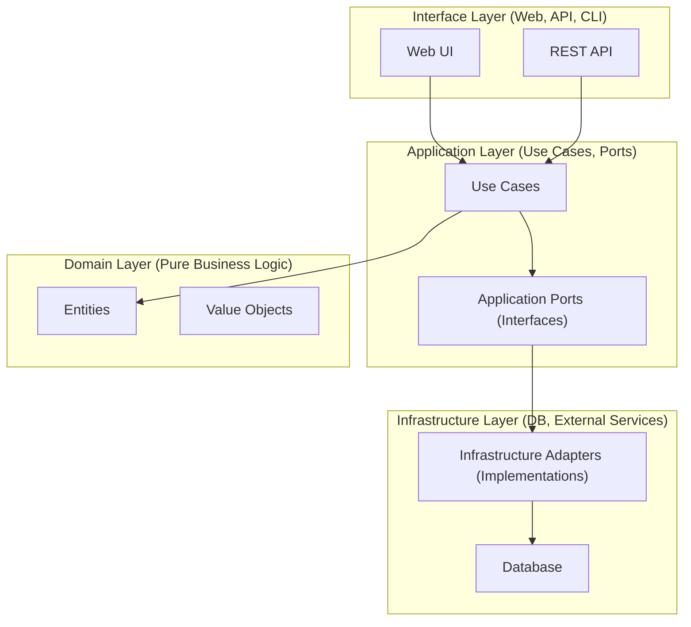
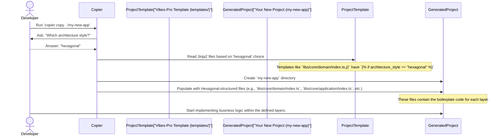

# Chapter 2: Hexagonal Architecture & DDD

Welcome back to Vibes-Pro! In [Chapter 1: Copier Template System](01_copier_template_system_.md), we learned how Vibes-Pro magically generates new projects for us, handling all the initial setup. It's like having a project factory that gives you a ready-to-use foundation.

Now that we have our project factory, let's talk about *how* those projects are designed and organized. Imagine you're building a house. The Copier system gave you the blueprints and all the materials. This chapter is about the architectural style of that house – how the rooms are laid out, where the plumbing goes, and how to keep things tidy and easy to maintain.

## The Problem: Messy and Hard-to-Change Software

Without a good architectural plan, software projects can quickly become a messy "spaghetti code" nightmare. Imagine a house where:
*   The kitchen sink is directly connected to the bedroom light switch.
*   The living room furniture is welded to the house's foundation.
*   If you want to change the color of a wall, you might accidentally break the plumbing!

Similarly, in software, if your core business logic (like "how to calculate a customer's discount") is tightly mixed with how you save data to a database, how your website looks, or how you interact with an external service, you face big problems:
*   **Hard to understand**: It's difficult to see where the actual business rules live.
*   **Hard to test**: To test your discount logic, you might have to set up an entire database and website.
*   **Hard to change**: If you decide to switch from one database (e.g., PostgreSQL) to another (e.g., MongoDB), you might have to rewrite a huge part of your application, even your core business rules. This is expensive and risky!

## Our Solution: Hexagonal Architecture & Domain-Driven Design (DDD)

Vibes-Pro tackles these challenges using a powerful combination of two architectural ideas: **Hexagonal Architecture** and **Domain-Driven Design (DDD)**. Together, they provide a meticulously organized structure for your applications.

Think of it as designing a house with clear rooms and connections: the kitchen is for cooking, the bedroom for sleeping, and they connect through well-defined hallways and utilities, not haphazardly.

Our main goal with this approach is to keep the **core business logic** (the most important part of your application) clean, independent of technology choices, and easy to test.

## Part 1: Hexagonal Architecture (The "Shape" of Your Application)

Hexagonal Architecture is also known as "Ports and Adapters." It's a fancy name for a simple, yet powerful idea:

**The Core Idea**: Your application's brain (the important business rules) is at the center, like a hexagon. Everything outside this core (like databases, websites, or external tools) plugs into it through clear, defined connections.

**Analogy**: Think of a modern game console. The console itself (the "hexagon") runs the game logic. It doesn't care if you plug in a specific brand of controller, a keyboard, or a fancy VR headset. It just needs them to "speak the same language" through standard USB ports. These controllers and devices are the "adapters" that plug into the "ports" of the console.

### Key Concepts: Ports and Adapters

1.  **Ports**: These are like the USB ports on our game console. In software, a "Port" is an **interface** (a contract or blueprint) that defines *what* the core business logic needs to do or *what* it expects from the outside world. It says "I need to save data" but doesn't say "save it to a PostgreSQL database."
2.  **Adapters**: These are like the actual game controllers or USB sticks. In software, an "Adapter" is a concrete implementation that connects a "Port" to a real external technology. It says "I will save data to a PostgreSQL database" or "I will get input from a web request."

This setup ensures that your core business logic never directly "knows" about the outside world. It only knows about its own needs (the "ports"). This makes it super flexible!

### The Layers in Vibes-Pro

Vibes-Pro organizes your project into distinct "layers" that follow the Hexagonal Architecture. These layers ensure a clear separation of concerns:

1.  **Domain Layer (The Core Business Brain)**:
    *   **Purpose**: This is the very heart of your application. It contains only pure business rules and concepts. No database code, no web code, nothing technical. It defines *what* your business does.
    *   **Examples**: "A `Product` has a `price` and `name`," "A `User` can be `active` or `inactive`," "Calculate total `Order` value."
    *   **Files in Vibes-Pro**: You'll find this code in `libs/{your-domain}/domain/`.

2.  **Application Layer (Orchestrating Business Operations)**:
    *   **Purpose**: This layer sits just outside the Domain Layer. It orchestrates *how* your business rules are used to fulfill specific actions (called "use cases"). It also defines the "ports" (interfaces) for any external services it needs.
    *   **Examples**: "Create a new `User`," "Add `Product` to `Shopping Cart`," "Process `Payment`." It defines interfaces like `UserRepository` (a "port" for saving users).
    *   **Files in Vibes-Pro**: You'll find this code in `libs/{your-domain}/application/`.

3.  **Infrastructure Layer (Connecting to the Outside World)**:
    *   **Purpose**: This layer contains the "adapters" that connect your application to real external technologies. It *implements* the "ports" (interfaces) defined by the Application Layer.
    *   **Examples**: A `PostgreSQLUserRepository` (an "adapter" that saves users to a PostgreSQL database), a `StripePaymentGateway` (an "adapter" that connects to the Stripe payment service).
    *   **Files in Vibes-Pro**: You'll find this code in `libs/{your-domain}/infrastructure/`.

4.  **Interface Layer (User & System Entry Points)**:
    *   **Purpose**: This is the outermost layer. It's how users or other systems interact with your application. These components are also "adapters" that translate external requests into commands the Application Layer understands.
    *   **Examples**: A `UserController` (handles web requests for users), a `CLICommand` (handles commands typed into a terminal), `EventHandlers` (respond to messages from other systems).
    *   **Files in Vibes-Pro**: You'll often find this code in `apps/{your-application-name}/` or `libs/{your-domain}/interface/`.

### Architecture Diagram

Here's a simplified visual of how these layers interact in Vibes-Pro:



Notice how the arrows (dependencies) point inwards. The outermost layers depend on the inner layers, but the Domain Layer (your core business logic) doesn't depend on anything outside itself!

## Part 2: Domain-Driven Design (DDD) (The "Language" of Your Application)

While Hexagonal Architecture gives us the structure, Domain-Driven Design (DDD) helps us fill that structure with meaningful code that directly solves business problems.

**The Core Idea**: DDD focuses on deeply understanding the *business problem* (the "domain") and then shaping your software design around that understanding, using the business's own language.

**Analogy**: If you're building a fitness app, you'd talk about "Workouts," "Exercises," "Repetitions," "Sets," and "Progress." You wouldn't talk about "Row 1," "Column B," or "Data Entity 7." DDD encourages us to use the specific language of the business *everywhere* – in code, in conversations, and in documentation.

### Key Concepts in DDD for Beginners:

1.  **Ubiquitous Language**: This is the shared, consistent language used by both technical and business people to describe the domain. In Vibes-Pro projects, you'll see this reflected in the names of your classes, methods, and files. For example, if the business talks about "Orders," your code will have `Order` entities, `CreateOrderUseCase` methods, etc.

2.  **Bounded Contexts**: For larger applications, DDD helps us break them down into smaller, distinct "areas" where specific terms have specific meanings. For example, a "Customer" in a "Sales" context might have a different set of information and behaviors than a "Customer" in a "Support" context. Vibes-Pro reflects this with its `libs/{domain}/` folder structure, where `domain` often refers to a bounded context (e.g., `libs/user/`, `libs/billing/`).

3.  **Entities**: These are objects that have a unique identity and a lifecycle. They often change over time and are central to your business.
    *   **Analogy**: A specific person (you!) is an entity. You have a unique ID, a name, an age, and these things can change over time.
    *   **Example in Code**: A `SampleEntity` with an `id`, `name`, and `createdAt` date.

4.  **Value Objects**: These are objects that describe a characteristic or attribute but don't have a unique identity. They are defined by their attributes and are typically immutable (once created, they don't change).
    *   **Analogy**: A street address, a color, or a money amount. Two "red" colors are considered the same if they have the same RGB values, regardless of where they are used.
    *   **Example in Code**: A `SampleValue` which just holds a string `value`.

## How Vibes-Pro Uses Hexagonal Architecture & DDD

When you generated your Vibes-Pro project in Chapter 1 and chose `hexagonal` for the `architecture_style` question, Copier set up your project specifically to follow these principles.

Let's walk through a simple use case: **Creating a "Sample" item** in your new Vibes-Pro project.

Vibes-Pro creates a `libs/core` library that serves as a minimal example of Hexagonal Architecture and DDD in action. This `core` library is structured into the layers we just discussed:

### 1. The Domain Layer: What is a "Sample"?

Look at `templates/{{project_slug}}/libs/core/domain/index.ts.j2` (after generation, this becomes `libs/core/domain/index.ts` in your project).

```typescript
// libs/core/domain/index.ts
/**
 * Domain Layer for {{ project_name }}
 * Pure business logic with no external dependencies.
 */

export class SampleEntity {
  constructor(
    public readonly id: string,
    public readonly name: string,
    public readonly createdAt: Date = new Date()
  ) {}

  validate(): boolean {
    // Business rule: name and id must not be empty
    return this.name.length > 0 && this.id.length > 0;
  }

  isNew(): boolean {
    // Business rule: Is this entity very recently created?
    const oneMinuteAgo = new Date(Date.now() - 60 * 1000);
    return this.createdAt > oneMinuteAgo;
  }
}

// Example of a Value Object
export class SampleValue {
  constructor(public readonly value: string) {
    if (!value || value.trim().length === 0) {
      throw new Error('Value cannot be empty'); // Validation for value object
    }
  }

  equals(other: SampleValue): boolean {
    return this.value === other.value;
  }
}
```

*   **Explanation**: Here, `SampleEntity` is a core business concept. It has an `id`, `name`, and `createdAt`. It also contains pure business rules like `validate()` and `isNew()`. Notice there's no mention of databases or web requests here – it's all about the "Sample" itself. `SampleValue` is a simple value object.

### 2. The Application Layer: How do we "Use" a "Sample"?

Next, look at `templates/{{project_slug}}/libs/core/application/index.ts.j2`.

```typescript
// libs/core/application/index.ts
/**
 * Application Layer for {{ project_name }}
 * Use cases and orchestration logic. Defines ports (interfaces).
 */
import { SampleEntity } from '../domain';

// --- This is a "Port" (Interface)! ---
export interface SampleRepository {
  save(entity: SampleEntity): Promise<void>;
  findById(id: string): Promise<SampleEntity | null>;
  findAll(): Promise<SampleEntity[]>;
}

// --- This is a "Use Case"! ---
export class SampleUseCase {
  constructor(private readonly repository: SampleRepository) {} // Uses the Port!

  async createSample(name: string): Promise<SampleEntity> {
    const entity = new SampleEntity(this.generateId(), name);

    if (!entity.validate()) {
      throw new Error('Invalid entity data');
    }

    await this.repository.save(entity); // Calls the Port's method
    return entity;
  }

  async getSample(id: string): Promise<SampleEntity | null> {
    return await this.repository.findById(id); // Calls the Port's method
  }

  private generateId(): string {
    return `sample-${Date.now()}-${Math.random().toString(36).substr(2, 9)}`;
  }
}
```

*   **Explanation**:
    *   `SampleRepository` is a **Port** (an interface). It defines *what* operations are needed to store and retrieve `SampleEntity` objects, but *not how* they are stored (e.g., in memory, a database, a file).
    *   `SampleUseCase` is where the application logic lives. It takes a `name`, creates a `SampleEntity`, validates it (using the Domain Layer's `validate()` method), and then uses the `SampleRepository` **Port** to save it. It doesn't care *which* repository implementation it gets, just that it fulfills the `SampleRepository` contract.

### 3. The Infrastructure Layer: How do we "Store" a "Sample"?

Now, let's see how the `SampleRepository` port is actually implemented in `templates/{{project_slug}}/libs/core/infrastructure/index.ts.j2`.

```typescript
// libs/core/infrastructure/index.ts
/**
 * Infrastructure Layer for {{ project_name }}
 * Adapters for external dependencies. Implements ports.
 */
import { SampleEntity } from '../domain';
import { SampleRepository } from '../application'; // Imports the Port!

// --- This is an "Adapter"! ---
export class InMemorySampleRepository implements SampleRepository {
  private entities: Map<string, SampleEntity> = new Map();

  async save(entity: SampleEntity): Promise<void> {
    // Simulates saving to a database by storing in memory
    this.entities.set(entity.id, entity);
  }

  async findById(id: string): Promise<SampleEntity | null> {
    return this.entities.get(id) || null;
  }

  // ... other methods like findAll ...
}

// Another "Adapter" example for a real database (simplified)
export class DatabaseSampleRepository implements SampleRepository {
  constructor(private connectionString: string) {}

  async save(entity: SampleEntity): Promise<void> {
    // Database specific code goes here (e.g., SQL INSERT)
    console.log(`Saving entity ${entity.id} to actual database at ${this.connectionString}`);
  }

  // ... findById, findAll with database queries ...
}
```

*   **Explanation**: `InMemorySampleRepository` and `DatabaseSampleRepository` are **Adapters**. They *implement* the `SampleRepository` **Port** from the Application Layer. This is where the technical details live. The `InMemorySampleRepository` is great for testing or simple examples, while the `DatabaseSampleRepository` would connect to a real database. The `SampleUseCase` in the Application Layer doesn't know (or care) which of these it receives, as long as it adheres to the `SampleRepository` interface.

### 4. The Interface Layer: How do "Users" Interact?

Finally, let's look at `templates/{{project_slug}}/libs/core/interface/index.ts.j2`.

```typescript
// libs/core/interface/index.ts
/**
 * Interface Layer for {{ project_name }}
 * Controllers and user interface components. Handles external requests.
 */
import { SampleUseCase } from '../application'; // Imports the Use Case
import { InMemorySampleRepository } from '../infrastructure'; // Imports an Adapter

// --- This is an "Adapter" for a web API or UI ---
export class SampleController {
  private useCase: SampleUseCase;

  constructor() {
    // Here we "inject" which repository implementation to use.
    // In a real app, a Dependency Injection system would do this.
    const repository = new InMemorySampleRepository();
    this.useCase = new SampleUseCase(repository); // Wires up the use case with an adapter
  }

  async createSample(request: { name: string }): Promise<any> {
    try {
      const entity = await this.useCase.createSample(request.name);
      return { id: entity.id, name: entity.name, createdAt: entity.createdAt.toISOString() };
    } catch (error) {
      throw new Error(`Failed to create sample: ${error.message}`);
    }
  }

  // ... async getSample method ...
}
```

*   **Explanation**: `SampleController` is an **Adapter** for an external interface (like a web API or a desktop UI). It takes a simple request (e.g., from a web form), calls the `createSample` **Use Case** (from the Application Layer), and then formats the result to send back to the user. Notice how it creates an `InMemorySampleRepository` and passes it to the `SampleUseCase`. This is called "dependency injection" – giving the use case the specific repository it needs.

## Under the Hood: Generating Hexagonal Projects with Copier

When you run the `copier` command and answer "hexagonal" for the `architecture_style` question (as discussed in [Chapter 1: Copier Template System](01_copier_template_system_.md)), here's a simplified view of what happens:



The key is that the `.j2` template files inside `templates/` (from Chapter 1) contain `` statements. These tell Copier to include the hexagonal structure and example code only when you choose that option.

For example, the `docs/ARCHITECTURE.md.j2` file in the template automatically generates a detailed `ARCHITECTURE.md` file in your new project, explaining the Hexagonal Architecture and DDD concepts, tailored to your project.

## Why This Approach is So Good (Benefits)

Hexagonal Architecture and DDD bring significant advantages to your Vibes-Pro projects:

| Benefit            | Description                                                                                             | Analogy                                                                        |
| :----------------- | :------------------------------------------------------------------------------------------------------ | :----------------------------------------------------------------------------- |
| **Clean Code**     | Your core business logic is free from technical clutter, making it easy to read and understand.         | A chef's kitchen is organized for cooking, not storing plumbing supplies.      |
| **Easy to Test**   | You can test your business rules without needing a database or a web server, making tests fast and reliable. | You can test a game console's internal logic without needing a specific game controller. |
| **Flexible**       | You can swap out databases, UI frameworks, or external services without touching your core business rules. | You can easily change from one brand of game controller to another.             |
| **Maintainable**   | Changes in one technical area (e.g., a new database) are less likely to break your core logic.          | If you update your house's plumbing, it doesn't affect your paint colors.      |
| **Collaboration**  | A shared "Ubiquitous Language" helps developers and business stakeholders communicate clearly.          | Everyone involved in building the house uses the same terms for rooms and functions. |

## Conclusion

Hexagonal Architecture and Domain-Driven Design are fundamental to how Vibes-Pro projects are built. They provide a clear, flexible, and robust structure that protects your vital business logic from the ever-changing world of technology. By keeping things neatly organized into layers and focusing on the business's own language, Vibes-Pro helps you build applications that are easier to understand, test, and evolve.

Now that your project is generated and you understand its smart organization, let's explore how Vibes-Pro automates common development tasks using a tool called `just`.

[Next Chapter: Justfile Automation](03_justfile_automation_.md)

---

<sub><sup>Generated by [AI Codebase Knowledge Builder](https://github.com/The-Pocket/Tutorial-Codebase-Knowledge).</sup></sub> <sub><sup>**References**: [[1]](https://github.com/SPRIME01/Vibes-Pro/blob/61b36a3f5ed748ceae18c92b1d0a340657d8e477/docs/ARCHITECTURE.md), [[2]](https://github.com/SPRIME01/Vibes-Pro/blob/61b36a3f5ed748ceae18c92b1d0a340657d8e477/docs/mergekit/ADR.md), [[3]](https://github.com/SPRIME01/Vibes-Pro/blob/61b36a3f5ed748ceae18c92b1d0a340657d8e477/templates/docs/ARCHITECTURE.md.j2), [[4]](https://github.com/SPRIME01/Vibes-Pro/blob/61b36a3f5ed748ceae18c92b1d0a340657d8e477/templates/{{project_slug}}/libs/core/application/index.ts.j2), [[5]](https://github.com/SPRIME01/Vibes-Pro/blob/61b36a3f5ed748ceae18c92b1d0a340657d8e477/templates/{{project_slug}}/libs/core/domain/index.ts.j2), [[6]](https://github.com/SPRIME01/Vibes-Pro/blob/61b36a3f5ed748ceae18c92b1d0a340657d8e477/templates/{{project_slug}}/libs/core/infrastructure/index.ts.j2), [[7]](https://github.com/SPRIME01/Vibes-Pro/blob/61b36a3f5ed748ceae18c92b1d0a340657d8e477/templates/{{project_slug}}/libs/core/interface/index.ts.j2), [[8]](https://github.com/SPRIME01/Vibes-Pro/blob/61b36a3f5ed748ceae18c92b1d0a340657d8e477/tools/reference/hexddd-generators/hex-domain/generator.ts)</sup></sub>
