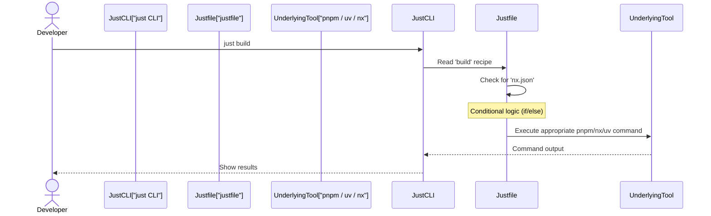

# Chapter 3: Justfile Automation

Welcome back, Vibes-Pro explorer! In [Chapter 1: Copier Template System](01_copier_template_system_.md), we learned how your project magically appears with all its initial files. Then, in [Chapter 2: Hexagonal Architecture & DDD](02_hexagonal_architecture___ddd_.md), we discovered the smart way these generated projects are organized to keep everything clean and flexible.

Now that your project is built and structured, how do you actually *work* with it? How do you tell it to build your code, run tests, or start a development server? This chapter introduces the `justfile`, your project's smart command center, making all these tasks super easy.

## The Problem: Too Many Commands, Too Much Brainpower

Imagine you want to build your project. In a typical JavaScript project, you might type `pnpm run build`. But if it's an Nx monorepo (a common setup for larger Vibes-Pro projects), you might need `pnpm nx run-many --target=build --all`. If you need to run Python tests, it might be `uv run pytest`.

This can get complicated:
*   **Long commands**: Hard to remember and type correctly.
*   **Inconsistent commands**: Different projects or different setups (like Nx vs. simple) might require different commands for the *same action* (e.g., "build").
*   **Error-prone**: A typo in a long command can waste your time.
*   **New developer overhead**: Every new team member needs to learn all these specific commands.

## Our Solution: Justfile Automation with `just`

Vibes-Pro solves this with a clever tool called `just` and a file named `justfile`.

Think of `just` as a universal remote control for your project. Instead of remembering complicated button sequences for your TV, sound system, and streaming device, you just press "Play Movie." The remote (or `just`) knows exactly what underlying commands to send to make it happen.

The `justfile` is where all these "smart buttons" (which we call **recipes**) are defined. It streamlines complex tasks into simple, memorable commands like `just build`, `just test`, or `just setup`.

The magic of `just` is that it **intelligently detects your project's setup** (e.g., if it's an Nx monorepo or a simple project) and executes the *correct* underlying tools (like `pnpm`, `nx`, or `uv`).

## Key Concepts of `justfile`

Let's break down the main ideas behind `justfile` automation:

1.  **Recipes**: These are the "buttons" on your remote. A recipe is a short name (like `build` or `test`) that you can run with `just`. Each recipe contains the actual commands that `just` will execute.
2.  **Smart Detection**: `justfile` can include logic to check your project's environment. For example, it can check if an `nx.json` file exists to decide whether to use Nx-specific commands or standard `pnpm` commands.
3.  **Command Center**: The `justfile` gathers all your common development workflows in one easy-to-find place. This includes building, testing, linting, running a development server, and even special AI tasks.

## Your First `just` Commands

Let's jump straight into using `just` in your new Vibes-Pro project. Open your terminal, navigate to your project's root directory (where you'll find the `justfile`), and try these:

### 1. Listing Available Commands

To see all the "buttons" your `just` remote has, simply type:

```bash
just --list
```

**What happens**: `just` reads your `justfile` and prints a list of all the recipes you can run. This is super helpful for discovering what your project can do!

### 2. Building Your Project

Instead of remembering `pnpm nx run-many --target=build --all` or `pnpm build`, you just say:

```bash
just build
```

**What happens**: `just` looks at your `justfile`, figures out if you have an Nx monorepo or a simpler project, and then runs the *correct* build command using `pnpm` or `nx`. You see a message like "Building My Awesome VibesPro App..."

### 3. Running Your Tests

Similarly, for testing:

```bash
just test
```

**What happens**: `just` again detects your project setup and executes the appropriate test command, combining both JavaScript/TypeScript tests (using `pnpm test`) and Python tests (using `uv run pytest`).

### 4. Setting Up Your Development Environment

For initial setup, including installing all dependencies:

```bash
just setup
```

**What happens**: This command orchestrates the installation of Node.js dependencies (with `pnpm install`), Python dependencies (with `uv sync --dev`), and any other necessary tools like `copier`.

## Under the Hood: How `just` Works Its Magic

So, how does `just` intelligently pick the right commands? Let's peek behind the curtain.

When you type `just <recipe-name>`, here's a simplified sequence of events:



1.  **You call `just`**: You type `just build` in your terminal.
2.  **`just` finds the `justfile`**: The `just` command-line tool looks for a file named `justfile` (or `Justfile`, `just.sh`, etc.) in your current directory or parent directories.
3.  **`just` reads the recipe**: It finds the `build` recipe within the `justfile`.
4.  **Conditional logic**: The `build` recipe contains a little script that checks your project's configuration (e.g., `if [ -f "nx.json" ]`). This allows it to adapt.
5.  **Executes the correct command**: Based on the check, `just` then runs the specific command (e.g., `pnpm nx run-many --target=build --all` for Nx, or `pnpm build` for a simpler project).
6.  **Outputs results**: The output from the underlying command is shown in your terminal.

### Inside the `justfile` (Simplified)

Let's look at how these conditional checks are written in your project's `justfile` (which was generated by [Chapter 1: Copier Template System](01_copier_template_system_.md) based on your choices).

Here’s a simplified version of the `build` recipe from `justfile`:

```just
# A recipe to build your project
build TARGET="": (_detect_build_strategy TARGET) # Calls a helper recipe

_detect_build_strategy TARGET:
    #!/usr/bin/env bash
    if [ -z "{{TARGET}}" ]; then # If no specific target is given
        if [ -f "nx.json" ]; then # Check if nx.json exists
            echo "🏗️  Building with Nx..."
            just build-nx # Run the Nx-specific build recipe
        else
            echo "🏗️  Building directly..."
            just build-direct # Run the simple build recipe
        fi
    else
        just build-target "{{TARGET}}" # If a target is given, build that specific target
    fi

build-direct:
    uv run python -m build # Build Python parts
    pnpm run build # Build Node.js parts

build-nx:
    nx run-many --target=build --all --parallel=3 # Nx command to build everything
```

*   **Explanation**:
    *   The `build` recipe actually calls another internal recipe `_detect_build_strategy` to handle the detection.
    *   `_detect_build_strategy` uses a standard `bash` script.
    *   `if [ -f "nx.json" ]` is the key line. It checks if the `nx.json` file (which indicates an Nx monorepo) exists.
    *   If `nx.json` is found, it calls `just build-nx`. Otherwise, it calls `just build-direct`.
    *   `build-direct` and `build-nx` then run the actual underlying commands (`pnpm`, `uv`, `nx`).

This smart logic ensures that no matter how your Vibes-Pro project is configured, `just build` will *always* work correctly.

### More Examples of `just` Recipes

Your `justfile` contains many more useful recipes, some of which are specific to AI-assisted workflows (which you'll learn about in later chapters):

| `just` Command         | Description                                                                 |
| :--------------------- | :-------------------------------------------------------------------------- |
| `just setup`           | Installs all Node.js and Python dependencies and tools.                     |
| `just build`           | Builds all parts of your project (Node.js, Python, etc.).                   |
| `just test`            | Runs all tests (Node.js, Python, integration).                              |
| `just lint`            | Checks your code for quality issues (linting).                              |
| `just format`          | Automatically formats your code to style guidelines.                        |
| `just dev`             | Starts development servers for all applications.                            |
| `just clean`           | Removes temporary files and build artifacts.                                |
| `just ai-context-bundle` | Gathers project information for AI tools (Chapter 4).                       |
| `just tdd-red`         | Guides you through the "Red" phase of Test-Driven Development (Chapter 5). |
| `just types-generate`  | Generates type definitions for your project (Chapter 7).                    |

You can see a full list with `just --list` and explore the `justfile` itself in your project's root directory for more details on each recipe.

For instance, the `setup` recipe might look something like this (simplified):

```just
# From the project's justfile
setup: setup-node setup-python setup-tools # This recipe runs other recipes
 @echo "✅ Development environment ready"

setup-node:
 @echo "🛠️ Setting up Node.js environment..."
 corepack enable # Ensure Corepack is enabled
 pnpm install # Install Node.js dependencies

setup-python:
 @echo "🔧 Setting up Python environment..."
 uv sync --dev # Install Python dependencies
```
*   **Explanation**: The `setup` recipe is a meta-command that calls other, more specific `setup-node` and `setup-python` recipes. This keeps the `justfile` modular and easy to read.

Here's an example of an AI-specific recipe, which will be covered in [Chapter 4: AI Context Management](04_ai_context_management_.md):

```just
# From the project's justfile
ai-context-bundle:
 @echo "📦 Bundling AI context..."
 @bash scripts/bundle-context.sh docs/ai_context_bundle # Executes a shell script
 @echo "✅ Context bundle ready at docs/ai_context_bundle"
```

*   **Explanation**: This recipe simply executes a shell script that collects relevant information about your project, preparing it for AI tools. The `justfile` acts as the single entry point for this and many other advanced workflows.

## Benefits of Justfile Automation

Using `just` and `justfile` brings several advantages to your Vibes-Pro projects:

| Benefit            | Description                                                                                             | Analogy                                                                                |
| :----------------- | :------------------------------------------------------------------------------------------------------ | :------------------------------------------------------------------------------------- |
| **Simplicity**     | Short, easy-to-remember commands replace long, complex ones.                                            | Pressing "Play" on a remote instead of manually powering on devices and selecting inputs. |
| **Consistency**    | The same `just` command (e.g., `just build`) works across different project setups.                    | The "Volume Up" button always increases volume, regardless of which show you're watching. |
| **Adaptability**   | `justfile` recipes can include conditional logic to adjust to your project's specific configuration.    | The universal remote knows if it's controlling a TV or a soundbar.                     |
| **Discoverability** | `just --list` lets anyone quickly see and understand all available project commands.                   | An on-screen menu showing all functions of your media center.                         |
| **Collaboration**  | New team members can onboard faster by just learning a few `just` commands.                             | Everyone uses the same remote with clearly labeled buttons.                            |

## Conclusion

The `justfile` is a powerful, yet simple, tool that serves as the central command center for your Vibes-Pro projects. It takes away the pain of remembering complex commands, ensures consistency, and intelligently adapts to your project's specific needs. By using `just build`, `just test`, or `just setup`, you're leveraging a streamlined workflow designed for maximum efficiency and ease of use.

Now that you know how to command your project, let's look at how Vibes-Pro integrates AI into your development process by managing information for these intelligent tools.

[Next Chapter: AI Context Management](04_ai_context_management_.md)

---

<sub><sup>Generated by [AI Codebase Knowledge Builder](https://github.com/The-Pocket/Tutorial-Codebase-Knowledge).</sup></sub> <sub><sup>**References**: [[1]](https://github.com/SPRIME01/Vibes-Pro/blob/61b36a3f5ed748ceae18c92b1d0a340657d8e477/docs/reference/01_just_commands.md), [[2]](https://github.com/SPRIME01/Vibes-Pro/blob/61b36a3f5ed748ceae18c92b1d0a340657d8e477/justfile), [[3]](https://github.com/SPRIME01/Vibes-Pro/blob/61b36a3f5ed748ceae18c92b1d0a340657d8e477/justfile.j2), [[4]](https://github.com/SPRIME01/Vibes-Pro/blob/61b36a3f5ed748ceae18c92b1d0a340657d8e477/templates/{{project_slug}}/justfile.j2), [[5]](https://github.com/SPRIME01/Vibes-Pro/blob/61b36a3f5ed748ceae18c92b1d0a340657d8e477/tests/unit/just-recipes.test.ts), [[6]](https://github.com/SPRIME01/Vibes-Pro/blob/61b36a3f5ed748ceae18c92b1d0a340657d8e477/tests/unit/justfile.test.js)</sup></sub>
