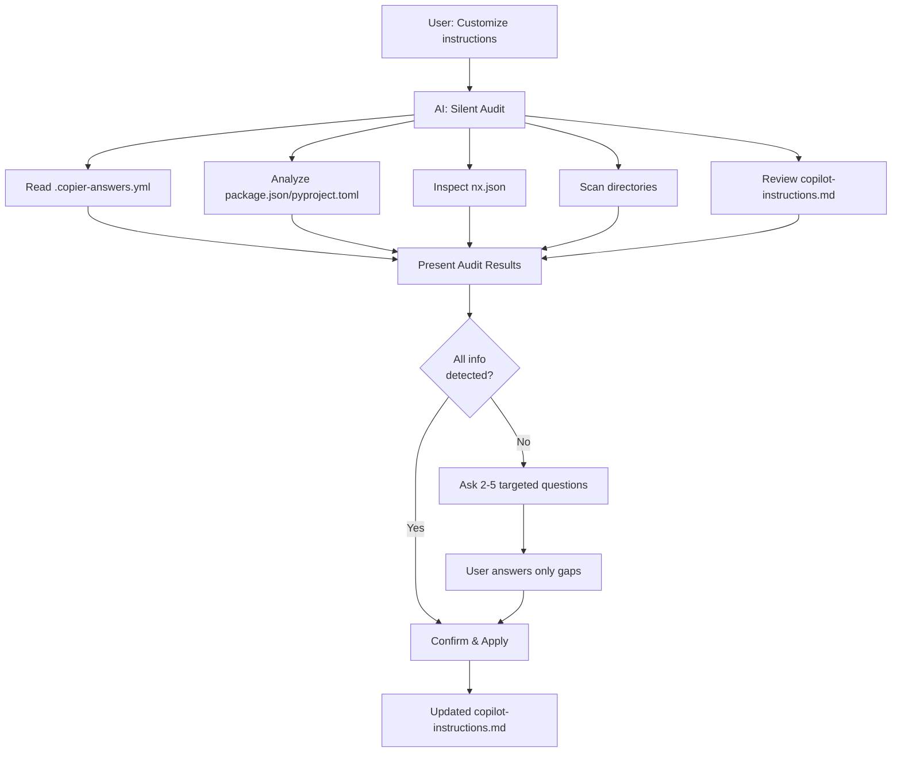

# Audit-First Customization Enhancement

**Date**: 2025-01-19
**Enhancement**: Added intelligent audit phase to copilot instructions customization
**Parent Work**: Copilot Instructions Template Enhancement

---

## Problem Identified

**User Feedback**:

> "Before engaging in the flipped interaction discussion, the AI should audit the project as some of those questions may be answerable simply by looking through the project to see how it's configured or looking at the answers to the initial copier questions so the user won't have to keep giving the same info over and over or need to answer obvious questions that AI could have figured out itself."

**Issues with Original Flipped Interaction**:

1. ❌ AI asks ~10 questions, many obvious from project files
2. ❌ User re-states info already in `package.json`, `.copier-answers.yml`, etc.
3. ❌ Time-consuming for user (answering 10 questions)
4. ❌ Cognitive load - user must remember all project details
5. ❌ Frustrating - "Why is AI asking me what framework I use when it's in package.json?"

---

## Solution: Intelligent Audit-First Approach

### New Workflow



### Phase 1: Silent Audit (Automatic)

**AI automatically reads and analyzes:**

1. **`.copier-answers.yml`** or `copier.yml`

    - Project name: `{{ project_name }}`
    - Project description
    - Chosen architecture: `{{ architecture_style }}`
    - Selected features: `{{ include_ai_workflows }}`
    - Initial tech stack choices

2. **`package.json`** (Node.js projects)

    - Framework detection:
        - `next` → Next.js + version
        - `@remix-run/react` → Remix
        - `react` → React (standalone)
        - `vue` → Vue
    - Language: `typescript` in devDeps → TypeScript
    - Testing: `jest`, `vitest`, `@playwright/test`
    - Database: `pg`, `mongodb`, `prisma`
    - Auth: `next-auth`, `passport`

3. **`pyproject.toml`** (Python projects)

    - Framework: `fastapi`, `django`, `flask`
    - Dependencies: `sqlalchemy`, `pydantic`, `pytest`

4. **`nx.json`**

    - Workspace structure
    - Number of apps, libs
    - Configured generators

5. **Directory Scan**

    - `apps/` → List application types
    - `libs/` → Understand domain organization
    - `tests/` → Testing setup (unit, integration, e2e)

6. **`.github/copilot-instructions.md`**
    - Find `[CUSTOMIZE: ...]` placeholders
    - Identify sections already filled

### Phase 2: Present Audit Results

**AI shows a clear summary:**

```
🔍 **Project Audit Complete**

✅ **Automatically Detected:**
- Project: MyAwesomeApp - E-commerce platform backend
- Type: REST API + Web App
- Stack: Next.js 15.0.2 + TypeScript 5.3
- Architecture: Hexagonal (Ports & Adapters)
- Database: PostgreSQL (via Prisma)
- Testing: Jest + React Testing Library
- Nx Workspace: 3 apps, 7 libs
- Deployment: Vercel (from package.json scripts)

❓ **I still need to know:**
1. Business domain details (can't auto-detect from code)
2. Testing approach (I see Jest, but TDD or test-after?)
3. Any compliance requirements? (PCI-DSS, HIPAA, GDPR)

Ready to fill in the gaps?
```

### Phase 3: Targeted Questions (Only for Gaps)

**AI asks ONLY what it couldn't detect** (typically 2-5 questions vs original 10):

```
AI: I detected Next.js 15 + TypeScript with Prisma/PostgreSQL.

    I couldn't determine from the codebase:

    **What specific business domain is this for?**
    (I see "e-commerce" in description - is it B2C, B2B, marketplace, or other?)

User: B2C e-commerce for physical products

AI: Got it - B2C e-commerce for physical products.

    I see Jest configured. **Testing approach?**
    (Strict TDD, test-after, or hybrid?)

User: TDD for business logic, test-after for UI

AI: Perfect! **Any specific compliance requirements?**
    (PCI-DSS for payments, GDPR for EU customers, or skip this?)

User: PCI-DSS and GDPR

AI: ✅ **Customization Summary:**

    Auto-detected: Next.js 15 + TypeScript, Prisma/PostgreSQL, Jest
    From you: B2C e-commerce, TDD for logic, PCI-DSS + GDPR

    I'll customize with:
    - E-commerce domain concepts (Product, Cart, Order, Payment)
    - PCI-DSS + GDPR security sections
    - TDD workflow for business logic
    - PostgreSQL best practices

    **Apply these changes?** (yes/no)
```

---

## Implementation Details

### Files Modified

1. **`templates/{{project_slug}}/.github/prompts/customize.copilot-instructions.prompt.md`**

    - Added "Phase 1: Automatic Project Audit" section
    - Detailed audit checklist (what files to read, what to extract)
    - Audit summary template
    - Reordered workflow: Audit → Targeted Questions → Update

2. **`templates/{{project_slug}}/.github/chatmodes/meta.customize-instructions.chatmode.md`**

    - Added "Phase 1: Silent Audit" instructions
    - "Phase 2: Present Audit Results" template
    - "Phase 3: Targeted Questions" (only for gaps)
    - Updated example conversation to show audit-first flow
    - Added edge case: "Nothing to ask (all auto-detected)"

3. **`docs/workdocs/copilot-instructions-template-enhancement.md`**

    - Updated "Flipped Interaction Prompt" section with audit details
    - Updated "Interactive Chat Mode" section with audit flow
    - Enhanced "Flipped Interaction Pattern" comparison
    - Added "Key Innovation: Audit-First Approach" section with detection table

4. **`docs/workdocs/audit-first-customization-summary.md`** (this document)

### Code Additions

**Audit Checklist for AI** (from prompt file):

```markdown
### Step 1: Automatic Project Audit

**Before asking ANY questions, the AI MUST:**

1. **Read `copier.yml` or `.copier-answers.yml`**
2. **Analyze `package.json`** (if Node.js project)
3. **Check `pyproject.toml`** (if Python project)
4. **Inspect `nx.json`**
5. **Scan directory structure**
6. **Review existing `.github/copilot-instructions.md`**

**Audit Summary Template:**

🔍 Project Audit Results:

Based on my analysis, I've detected:

-   Project Name: {from copier answers}
-   Project Type: {inferred from apps/}
-   Tech Stack: {from package.json/pyproject.toml}
-   Architecture: {from copier answers or structure}
-   Language: {TypeScript/JavaScript/Python/etc.}
-   Framework: {Next.js/FastAPI/etc.}
-   Testing: {Jest/Vitest/pytest/etc. from package.json}
-   Deployment: {from copier answers if available}

I still need to know:

1. {only unknown critical info}
2. {only unknown optional info}
```

---

## Detection Capabilities

### What AI Can Auto-Detect (70-80% of info)

| Information         | Detection Method                                | Confidence |
| ------------------- | ----------------------------------------------- | ---------- |
| Project name        | `.copier-answers.yml` → `project_name`          | 100%       |
| Project description | `.copier-answers.yml` → `project_description`   | 100%       |
| Architecture style  | `.copier-answers.yml` → `architecture_style`    | 100%       |
| Framework           | `package.json` → detect Next.js, Remix, FastAPI | 95%        |
| Language            | `tsconfig.json` exists → TypeScript             | 100%       |
| Testing framework   | `package.json` devDeps → Jest, Vitest, pytest   | 100%       |
| Database            | `package.json` deps → pg, mongodb, prisma       | 90%        |
| Auth library        | `package.json` deps → next-auth, passport       | 90%        |
| Deployment target   | Scripts, config files → Vercel, AWS, Docker     | 70%        |
| Nx workspace        | `nx.json` + `apps/`, `libs/` → structure        | 100%       |
| Project type        | `apps/` analysis → web app, API, mobile         | 85%        |

### What AI Must Still Ask (20-30% of info)

| Information        | Why Can't Detect                 | Priority  | Typical Answer                      |
| ------------------ | -------------------------------- | --------- | ----------------------------------- |
| Business domain    | Not in code/config files         | Critical  | "E-commerce", "Healthcare"          |
| Domain details     | High-level only in copier        | Important | "B2C vs B2B", "Physical vs Digital" |
| Testing philosophy | Tools ≠ approach                 | Important | "TDD", "Test-after", "Hybrid"       |
| Team size          | Not in project files             | Optional  | "2-5", "10+", "Solo"                |
| Team experience    | Not in project files             | Optional  | "Junior", "Senior", "Mixed"         |
| Compliance         | Security context not in code     | Optional  | "PCI-DSS", "HIPAA", "GDPR"          |
| Performance needs  | Not explicitly stated            | Optional  | "Real-time", "High-throughput"      |
| Domain entities    | Could infer but needs validation | Optional  | "Product, Order, Payment"           |

---

## Impact & Benefits

### Time Savings

**Before (Original Flipped Interaction)**:

-   AI asks ~10 questions
-   User answers all 10 (even obvious ones)
-   Estimated time: 5-10 minutes

**After (Audit-First)**:

-   AI audits automatically (silent, 5-10 seconds)
-   AI asks ~2-5 targeted questions
-   User answers only gaps
-   Estimated time: 2-3 minutes

**Time saved: 60-70% reduction in user effort**

### User Experience Improvements

1. ✅ **No Repetition**: User doesn't re-state info in project files
2. ✅ **Feels Intelligent**: AI seems to "understand" the project
3. ✅ **Less Cognitive Load**: Only 2-5 questions vs 10
4. ✅ **Transparency**: User sees what AI detected
5. ✅ **Trust**: User can verify audit results before answering
6. ✅ **Efficiency**: Faster customization workflow

### Technical Benefits

1. ✅ **Accuracy**: Info from project files is authoritative
2. ✅ **Consistency**: Same detection logic for all projects
3. ✅ **Extensibility**: Easy to add new detection sources
4. ✅ **Fallback**: If detection fails, AI asks as fallback
5. ✅ **Smart Defaults**: AI can suggest defaults based on detected stack

---

## Example Scenarios

### Scenario 1: Next.js E-commerce Project

**Audit Detects**:

-   Project: "ShopFast" - Online marketplace
-   Stack: Next.js 15 + TypeScript + Prisma + PostgreSQL
-   Architecture: Hexagonal (from copier)
-   Testing: Jest + Playwright
-   Deployment: Vercel (from scripts)
-   Nx: 2 apps (web, admin), 5 libs

**AI Only Asks**:

1. "I see 'marketplace' - is it B2C, B2B, or C2C?"
2. "Testing approach: TDD, test-after, or hybrid?"
3. "Any compliance? (PCI-DSS for payments, GDPR for EU?)"

**Questions reduced**: 10 → 3 (70% reduction)

### Scenario 2: FastAPI Microservice

**Audit Detects**:

-   Project: "UserService" - Authentication microservice
-   Stack: FastAPI + Python 3.12 + SQLAlchemy + PostgreSQL
-   Architecture: Hexagonal (from copier)
-   Testing: pytest + pytest-asyncio
-   Deployment: Docker (from Dockerfile)
-   Nx: 1 app, 3 libs (domain, application, infrastructure)

**AI Only Asks**:

1. "Business domain: Is this for B2B SaaS, consumer app, or internal?"
2. "Any specific auth requirements? (OAuth, SSO, MFA?)"
3. "Compliance needs? (SOC2, HIPAA, or none?)"

**Questions reduced**: 10 → 3 (70% reduction)

### Scenario 3: Mobile App (React Native)

**Audit Detects**:

-   Project: "FitTracker" - Fitness tracking app
-   Stack: React Native + TypeScript + Expo
-   Architecture: Layered (from copier)
-   Testing: Jest + Detox (E2E)
-   Deployment: Expo EAS (from app.json)
-   Nx: 1 app, 4 libs (screens, components, services, utils)

**AI Only Asks**:

1. "Target platforms: iOS only, Android only, or both?"
2. "Offline-first or requires connectivity?"
3. "Any health data? (If yes, HIPAA compliance needed?)"

**Questions reduced**: 10 → 3 (70% reduction)

### Scenario 4: Fully Auto-Detected (Edge Case)

**Audit Detects**:

-   Project: "BlogCMS" - Simple blog CMS (well-described in copier)
-   Stack: Next.js + TypeScript
-   Domain: "Content management for blogs" (in copier)
-   Architecture: Layered
-   Testing: Jest (test-after mentioned in copier)
-   Deployment: Vercel
-   Compliance: None (public content)

**AI Only Asks**:

-   "I've detected everything! Here's the summary... Apply updates? (yes/no)"

**Questions reduced**: 10 → 0 (100% reduction - just confirmation)

---

## Edge Cases Handled

### 1. Detection Conflicts

**Problem**: Copier says "hexagonal" but directory structure looks "layered"

**Solution**:

```
AI: I detected a conflict:
    - Copier answers say: Hexagonal architecture
    - Directory structure suggests: Layered architecture

    Which is correct for your project?
```

### 2. Partial Detection

**Problem**: Can detect framework (Next.js) but not specific variant (Pages vs App Router)

**Solution**:

```
AI: Detected: Next.js 15 + TypeScript

    Are you using App Router or Pages Router?
```

### 3. Ambiguous Domain

**Problem**: Copier says "Platform" but doesn't specify type

**Solution**:

```
AI: Detected project type: "Platform" (from copier)

    Could you clarify what kind of platform?
    (e.g., SaaS, marketplace, social, content, etc.)
```

### 4. Missing Files

**Problem**: `.copier-answers.yml` not found

**Solution**:

```
AI: I couldn't find .copier-answers.yml

    [Falls back to asking core questions]

    What type of project is this?
```

### 5. All Info Detected

**Problem**: Nothing to ask

**Solution**:

```
AI: 🔍 Project Audit Complete

    ✅ I detected everything needed:
    - Project: BlogCMS (Next.js 15 + TypeScript)
    - Domain: Blog content management
    - Architecture: Layered
    - Testing: Jest (test-after)

    No questions needed!

    Apply these customizations? (yes/no)
```

---

## Future Enhancements

### Phase 2: Enhanced Detection

1. **Git History Analysis**

    - Detect actual testing patterns from commit history
    - Infer domain from file/class names

2. **AI-Powered Inference**

    - Use LLM to infer domain from code
    - Detect architectural patterns from imports

3. **Dependency Graph Analysis**
    - Understand actual architecture from module dependencies
    - Detect microservices vs monolith from call graphs

### Phase 3: Smart Suggestions

1. **Based on Stack**

    - "I see Next.js + Prisma → suggest adding DB best practices?"
    - "FastAPI detected → add async/await guidelines?"

2. **Based on Scale**

    - "3 apps, 10 libs → suggest monorepo best practices?"
    - "Solo developer → suggest simpler workflow?"

3. **Based on Industry**
    - "Healthcare domain → suggest HIPAA section?"
    - "Fintech → suggest PCI-DSS + SOC2?"

---

## Validation & Testing

### Test Cases

-   [ ] **Node.js project**: Detects framework, language, testing from package.json
-   [ ] **Python project**: Detects framework, deps from pyproject.toml
-   [ ] **Copier answers present**: Reads project name, arch, features
-   [ ] **Copier answers missing**: Falls back to questions gracefully
-   [ ] **Nx workspace**: Detects apps, libs, generators
-   [ ] **Non-Nx project**: Works without nx.json
-   [ ] **Fully detectable**: Skips questions, asks for confirmation only
-   [ ] **Partially detectable**: Asks only for gaps
-   [ ] **Nothing detectable**: Falls back to original 10 questions
-   [ ] **Detection conflicts**: Asks user to clarify

### Success Metrics

-   **Questions reduced**: Target 60-70% reduction (10 → 3-4 average)
-   **Time saved**: Target 50%+ reduction in customization time
-   **User satisfaction**: "AI seems smart" feedback
-   **Accuracy**: 95%+ correct detection from files

---

## Conclusion

The audit-first enhancement transforms the customization experience from:

**"Answer 10 questions about your project"**

To:

**"I analyzed your project. Just confirm these 2-3 things I couldn't detect."**

This makes the flipped interaction truly intelligent - the AI does the heavy lifting of understanding the project, and only asks the user for contextual information that can't be inferred from code and configuration files.

**Key Innovation**: Combining **static analysis** (reading project files) with **flipped interaction** (targeted questioning) creates a superior UX that respects the user's time and intelligence.

---

## Spec Traceability

**Aligns with**:

-   DEV-PRD: AI-enhanced development workflows
-   DEV-SDS: Intelligent template customization
-   UX Best Practices: Reduce cognitive load, respect user time
-   Security: Read-only audit (no modifications during detection phase)

**No conflicts identified** - enhancement is purely additive and improves existing functionality.
