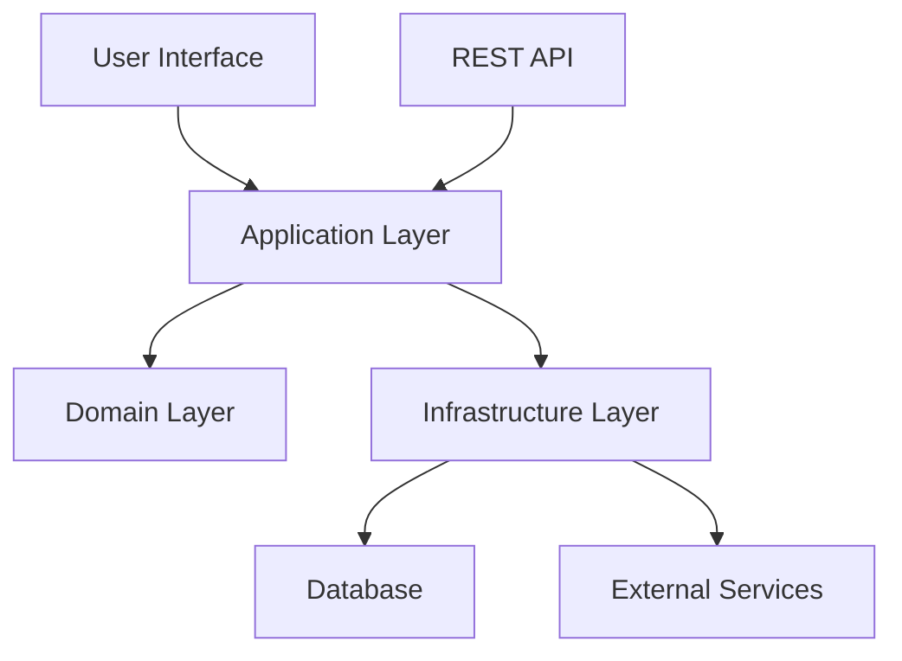

# Architecture Guide

This document describes the architectural patterns for local-test.

## Hexagonal Architecture

This project follows **Hexagonal Architecture** (Ports and Adapters pattern):

- **Separation of Concerns**: Clear boundaries between business logic and external concerns
- **Testability**: Easy to unit test business logic in isolation
- **Flexibility**: Easy to swap out external dependencies
- **Maintainability**: Changes to external systems don't affect business rules

### Architecture Diagram

## Domain-Driven Design

### Bounded Contexts

#### Core Domain

- **Entities**: Core business objects with identity
- **Value Objects**: Immutable data structures
- **Domain Services**: Complex business operations
- **Repository Interfaces**: Data access abstractions

## Layer Structure

1. **Domain Layer** (`libs/{domain}/domain/`): Pure business logic
2. **Application Layer** (`libs/{domain}/application/`): Use cases and ports
3. **Infrastructure Layer** (`libs/{domain}/infrastructure/`): External adapters
4. **Interface Layer** (`apps/{app-name}/`): User/system interfaces

## Testing Strategy

- **Unit Tests**: Test domain logic in isolation
- **Integration Tests**: Test with real databases and external services
- **Architecture Tests**: Verify layer dependencies are correct
